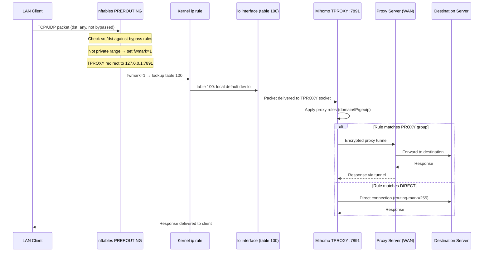
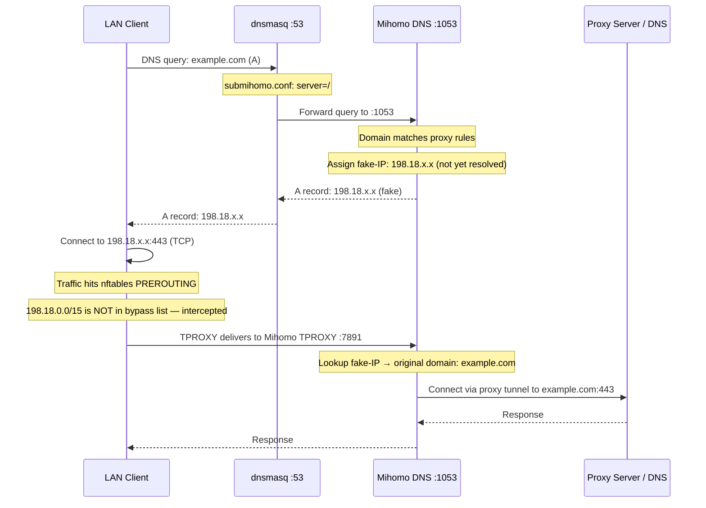
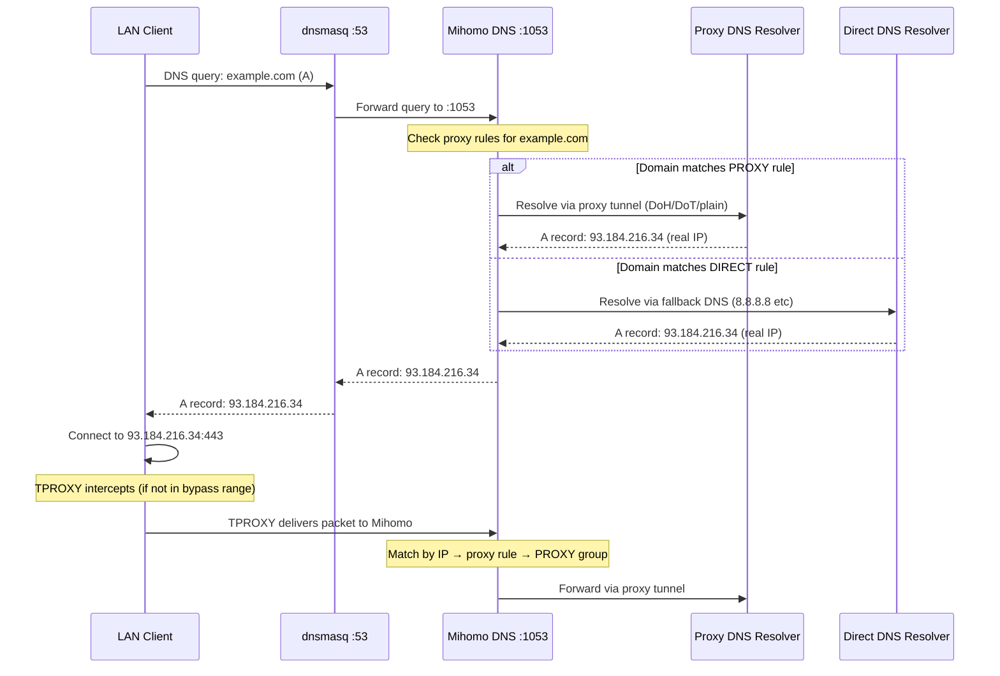
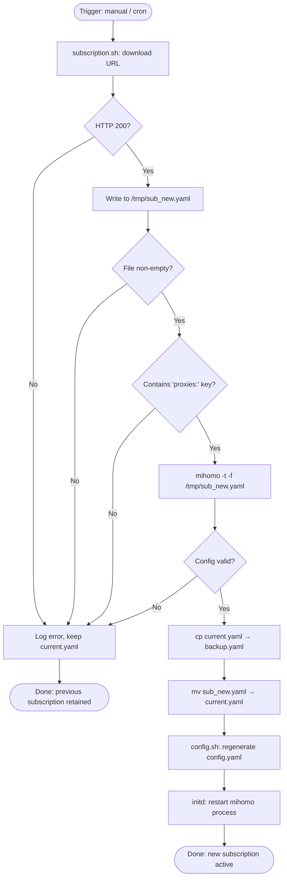

# SubMiHomo — Architecture Document

> **Audience**: Contributors, maintainers, and engineers evaluating the project.
> **Scope**: System design, component relationships, data flows, and architectural decisions.
> **Version**: 1.0 — targets OpenWrt 25+, Mihomo proxy core.

---

## Table of Contents

1. [Project Overview](#1-project-overview)
2. [Design Philosophy](#2-design-philosophy)
3. [High-Level System Architecture](#3-high-level-system-architecture)
4. [Component Overview](#4-component-overview)
5. [Data Flow Diagrams](#5-data-flow-diagrams)
   - 5.1 [Packet Flow — LAN Client to Internet](#51-packet-flow--lan-client-to-internet)
   - 5.2 [DNS Flow — Fake-IP Mode](#52-dns-flow--fake-ip-mode)
   - 5.3 [DNS Flow — Real-IP Mode](#53-dns-flow--real-ip-mode)
   - 5.4 [Subscription Update Flow](#54-subscription-update-flow)
6. [Technology Choices and Justifications](#6-technology-choices-and-justifications)
7. [Package Architecture](#7-package-architecture)
8. [Routing and Firewall Architecture](#8-routing-and-firewall-architecture)
9. [DNS Architecture](#9-dns-architecture)
10. [Configuration Lifecycle](#10-configuration-lifecycle)
11. [Security Architecture](#11-security-architecture)
12. [Key Architectural Constraints](#12-key-architectural-constraints)
13. [Intentional Omissions](#13-intentional-omissions)

---

## 1. Project Overview

SubMiHomo is an OpenWrt 25+ service package that wraps the Mihomo proxy engine to deliver transparent, system-wide proxy routing with minimal user friction. The project's central promise is expressed in a single sentence:

> **Paste a subscription URL, click Apply, and every device on the LAN is transparently proxied.**

The user never edits YAML, never configures routing tables, never writes nftables rules, and never touches dnsmasq configuration files. All of this complexity is encapsulated inside the service's shell modules, init script, and LuCI frontend. The user interacts only with a small set of high-level UCI options.

### 1.1 Scope

SubMiHomo sits between the OpenWrt network stack and the Mihomo proxy process. It owns:

- The lifecycle of the Mihomo process (start, stop, restart, crash recovery).
- The runtime configuration file generated from UCI settings plus a downloaded subscription.
- The nftables rules that intercept LAN and router-originated traffic and redirect it to Mihomo's TPROXY port.
- The ip routing rules and table entries that complete the TPROXY redirect loop.
- The dnsmasq forwarding rule that causes all DNS queries to flow through Mihomo's DNS engine.
- The subscription management lifecycle (download, validate, backup, apply, schedule).
- The Zashboard dashboard download and hosting lifecycle.
- The LuCI web interface that exposes all of the above to the router administrator.

SubMiHomo does **not** provide the Mihomo binary itself. The `mihomo` binary is an upstream APK package maintained independently. SubMiHomo depends on it but does not vendor or compile it.

### 1.2 Target Platform

| Attribute | Value |
|---|---|
| OS | OpenWrt 25+ |
| Package manager | APK |
| Firewall | fw4 + nftables |
| CPU architecture | mipsel_24kc (primary) |
| Frontend | LuCI JS framework |
| IPv6 | Not supported |

---

## 2. Design Philosophy

### 2.1 Embedded-First Thinking

OpenWrt routers are resource-constrained devices. A typical MIPS router has 128–256 MB of RAM and 16–128 MB of flash. Every kilobyte of code and every megabyte of runtime memory is significant. SubMiHomo is designed with this in mind at every layer:

- **Shell over Lua/Python**: The service logic is written in POSIX shell. Shell scripts have zero startup overhead, require no interpreter installation beyond what OpenWrt ships, and consume negligible memory. Lua is used only for the rpcd plugin because rpcd mandates Lua.
- **No runtime daemons beyond Mihomo**: There is no background watcher, no update daemon, and no secondary proxy process. The init script spawns exactly one process (Mihomo) and relies on procd for supervision.
- **tmpfs for runtime state**: All runtime-generated files live in `/var/run/submihomo/` on tmpfs. They consume no flash writes and disappear cleanly on reboot, forcing a fresh configuration rebuild on every start.
- **dnsmasq forwarding rather than replacement**: Instead of replacing dnsmasq (which handles DHCP for the entire LAN), SubMiHomo drops a single forwarding directive into `/etc/dnsmasq.d/`. This is the smallest possible intervention in the DNS path.

### 2.2 Minimal Abstraction

SubMiHomo avoids abstraction layers that do not pay for themselves. There is no configuration management framework, no state machine library, no template engine. The configuration is built by straightforward shell string operations against a minimal YAML template. Routing and firewall setup is performed by direct `ip rule`, `ip route`, and `nft` invocations. The rationale is that any abstraction on an embedded target adds flash usage, RAM footprint, and cognitive complexity for the engineers who must maintain it with limited resources.

### 2.3 Fail-Safe by Default

The service is designed to fail safe rather than fail open:

- If Mihomo crashes, procd restarts it (up to 5 times in 60 seconds). If it cannot be restarted, the nftables rules that redirect traffic remain in place but Mihomo is not listening — traffic is dropped rather than sent unproxied. This is the intended security posture for a proxy service.
- If a subscription update fails, the previous subscription is preserved. The service continues running unchanged.
- If the service is stopped cleanly, the firewall teardown path removes all nftables rules, all ip rules, and the dnsmasq forwarding config. The router returns to unproxied operation.

### 2.4 Layered Start/Stop

The service follows a strict dependency-ordered startup sequence and the reverse teardown sequence:

```
START:  config → routing → dns → firewall → mihomo
STOP:   mihomo → firewall → dns → routing
```

Each layer depends only on the layer below it. This ordering ensures that Mihomo is running before traffic is redirected to it, and that traffic redirection is removed before DNS forwarding is removed.

### 2.5 UCI as the Single Source of Truth

All user-facing configuration lives in a single UCI file: `/etc/config/submihomo`. No configuration is scattered across multiple config files visible to the user. The shell modules read UCI at runtime to generate the Mihomo config. This means the system state can always be reconstructed from UCI alone.

---

## 3. High-Level System Architecture

The diagram below shows all major system components and their relationships on a running SubMiHomo router.

```mermaid
flowchart TD
    subgraph LAN["LAN (192.168.x.x)"]
        C1[Client Device]
        C2[Client Device]
    end

    subgraph Router["OpenWrt Router"]
        subgraph Kernel["Linux Kernel"]
            NF[nftables — inet submihomo]
            IPR[ip rule: fwmark 1 → table 100]
            RT[ip route table 100\nlocal default dev lo]
        end

        subgraph Services["System Services"]
            DNSM[dnsmasq :53]
            PROCD[procd supervisor]
        end

        subgraph SubMiHomo["SubMiHomo Service"]
            INIT[/etc/init.d/submihomo]
            CORE[core.sh]
            CFG[config.sh]
            ROUTING[routing.sh]
            DNS[dns.sh]
            FW[firewall.sh]
            SUB[subscription.sh]
            DASH[dashboard.sh]
        end

        subgraph Mihomo["Mihomo Process"]
            TPROXY[TPROXY Listener :7891]
            MIXED[Mixed Proxy :7890]
            MDNS[DNS Listener :1053]
            CTRL[External Controller :9090]
            UI[Zashboard /ui]
        end

        subgraph LuCI["LuCI Web Interface"]
            RPCD[rpcd plugin]
            OV[overview.js]
            SS[subscription.js]
            SET[settings.js]
            PX[proxies.js]
            LOG[logs.js]
        end

        UCI[/etc/config/submihomo]
        SUBFILE[/etc/submihomo/subscriptions/current.yaml]
        CFGYAML[/var/run/submihomo/config.yaml]
    end

    subgraph Internet["Internet / WAN"]
        PROXY[Proxy Servers]
        DIRECT[Direct Destinations]
        GITHUB[GitHub Releases API]
    end

    C1 -->|DNS query| DNSM
    C2 -->|TCP/UDP traffic| NF
    DNSM -->|forward all upstream| MDNS
    MDNS -->|fake-IP or real resolution| PROXY

    NF -->|redirect mark=1| IPR
    IPR -->|table 100 loop| RT
    RT -->|deliver to lo| TPROXY

    TPROXY -->|proxy rules| PROXY
    TPROXY -->|direct rules| DIRECT

    PROCD -->|supervise| Mihomo
    INIT -->|orchestrate| CORE
    INIT -->|orchestrate| CFG
    INIT -->|orchestrate| ROUTING
    INIT -->|orchestrate| DNS
    INIT -->|orchestrate| FW

    UCI -->|read| CORE
    SUBFILE -->|merge| CFG
    CFG -->|write| CFGYAML
    CFGYAML -->|loaded by| Mihomo

    RPCD -->|UCI read/write| UCI
    RPCD -->|Mihomo HTTP API| CTRL
    OV & SS & SET & PX & LOG -->|JSON-RPC| RPCD

    SUB -->|download| GITHUB
    DASH -->|download dist.zip| GITHUB
```

---

## 4. Component Overview

### 4.1 `mihomo` APK Package (upstream)

Mihomo is the proxy engine. It is an external package, not authored or maintained by SubMiHomo. SubMiHomo declares it as an APK dependency. Mihomo is responsible for:

- Accepting transparent proxy connections on its TPROXY port (7891).
- Accepting optional explicit proxy connections on its mixed-port (7890).
- Running a DNS server on port 1053 (loopback only) that implements fake-IP or real-IP resolution.
- Applying user-defined proxy rules to decide whether each connection goes through a proxy server or directly to the internet.
- Exposing an HTTP management API on port 9090.
- Serving the Zashboard dashboard UI from a configured directory.

Mihomo is configured entirely by its YAML config file. SubMiHomo generates this file from UCI settings and the subscription data.

### 4.2 `submihomo` APK Package (this project)

The core service package. Contains everything required to manage Mihomo on OpenWrt:

| File | Purpose |
|---|---|
| `/etc/init.d/submihomo` | procd init script; orchestrates startup/shutdown sequence |
| `/usr/lib/submihomo/core.sh` | Shared library: UCI helpers, logging, constants |
| `/usr/lib/submihomo/config.sh` | Generates `/var/run/submihomo/config.yaml` |
| `/usr/lib/submihomo/routing.sh` | Manages ip rules and routing table 100 |
| `/usr/lib/submihomo/dns.sh` | Manages `/etc/dnsmasq.d/submihomo.conf` |
| `/usr/lib/submihomo/firewall.sh` | Manages nftables table `inet submihomo` |
| `/usr/lib/submihomo/subscription.sh` | Download, validate, backup, apply subscriptions |
| `/usr/lib/submihomo/dashboard.sh` | Download and update Zashboard from GitHub |
| `/usr/lib/rpcd/submihomo` | Lua rpcd plugin exposing RPC methods to LuCI |
| `/usr/bin/submihomo-ctl` | CLI management tool for operator use |
| `/etc/config/submihomo` | Default UCI configuration (shipped, user-editable) |
| `/etc/submihomo/templates/base.yaml.tmpl` | Mihomo YAML config template |

### 4.3 `luci-app-submihomo` APK Package (this project)

The LuCI frontend package. Provides the web interface for router administrators:

| File | Purpose |
|---|---|
| `/htdocs/luci-static/resources/view/submihomo/overview.js` | Dashboard: service status, enable/disable toggle |
| `/htdocs/luci-static/resources/view/submihomo/subscription.js` | Subscription URL input, manual update, status |
| `/htdocs/luci-static/resources/view/submihomo/settings.js` | DNS mode, log level, controller settings |
| `/htdocs/luci-static/resources/view/submihomo/proxies.js` | Proxy group selector via Mihomo API |
| `/htdocs/luci-static/resources/view/submihomo/logs.js` | Live log tail viewer |
| `/usr/share/luci/menu.d/luci-app-submihomo.json` | Registers SubMiHomo in the LuCI navigation menu |
| `/usr/share/rpcd/acl.d/luci-app-submihomo.json` | Defines rpcd permission grants per role |

### 4.4 Shell Module Responsibilities

Each shell module is a sourced library, not a standalone script. The init script sources `core.sh` first, then calls functions from the other modules. This design keeps each concern isolated while sharing the common utilities from `core.sh`.

**`core.sh`**: Defines constants (port numbers, paths, marks), wraps `uci get` calls into named functions (e.g., `submihomo_get_dns_mode`), and provides a logging wrapper (`log_info`, `log_warn`, `log_err`) that calls `logger -t submihomo`. Also defines the lock file path and provides a mutex-style lock function to prevent concurrent operations.

**`config.sh`**: Reads all relevant UCI values, downloads or reads the active subscription from `/etc/submihomo/subscriptions/current.yaml`, extracts the `proxies:`, `proxy-groups:`, and `rules:` YAML blocks using shell text processing, and assembles the final `config.yaml` in `/var/run/submihomo/`. The config is assembled in a defined section order: general → dns → external-controller → external-ui → proxies → proxy-groups → rules.

**`routing.sh`**: Adds and removes the two kernel-level constructs required for TPROXY to function: a route in table 100 (`ip route add local default dev lo table 100`) and an ip rule (`ip rule add fwmark 1 lookup 100`). On teardown it removes both. These constructs do not survive reboot and are therefore always recreated on service start.

**`dns.sh`**: Writes a single-line file `/etc/dnsmasq.d/submihomo.conf` containing the directive `server=/#/127.0.0.1#1053`, which instructs dnsmasq to forward all DNS queries to Mihomo's DNS listener. After writing, it triggers `dnsmasq` to reload its configuration (via `kill -HUP` or `service dnsmasq reload`). On teardown it removes the file and reloads dnsmasq again.

**`firewall.sh`**: Creates the nftables table `inet submihomo` containing the PREROUTING and OUTPUT chains. PREROUTING operates at mangle priority −1 (before conntrack) and marks qualifying forwarded packets with fwmark 1, then redirects them to the TPROXY socket. OUTPUT marks router-originated traffic similarly. Both chains have bypass rules for the hardcoded private address ranges and any user-configured bypass addresses from UCI. On teardown, the entire table is deleted with `nft delete table inet submihomo`.

**`subscription.sh`**: Downloads a subscription URL using `wget` with a configurable user-agent string. Validates the downloaded content by checking that it is non-empty and contains a `proxies:` key, then runs `mihomo -t -f <file>` to perform a full config syntax check. If validation passes, the existing `current.yaml` is moved to `backup.yaml` and the new file is written as `current.yaml`. On failure the backup is restored. Cron scheduling (adding/removing a crontab line) is also managed here.

**`dashboard.sh`**: Queries the GitHub Releases API for the latest release of `Zephyruso/zashboard`, downloads the `dist.zip` asset, extracts it to `/usr/share/submihomo/dashboard/`, and records the version. This script is callable from CLI and from LuCI via RPC. If the dashboard directory is empty when the service first starts, the init script calls this script automatically.

### 4.5 Init Script

The init script at `/etc/init.d/submihomo` is a standard OpenWrt procd init script. Its START priority of 95 ensures it starts after all network interfaces (20), firewall (19), and dnsmasq (60) have initialized. Its STOP priority of 5 ensures it stops before dnsmasq and networking are torn down.

The `start_service()` function calls each shell module in dependency order, then calls `procd_set_param` to register Mihomo as a procd-supervised process. Procd is responsible for launching the Mihomo binary and restarting it if it exits unexpectedly.

The `stop_service()` function is called by procd after it has terminated the Mihomo process. It calls the teardown functions of each module in reverse order.

### 4.6 rpcd Plugin

The Lua rpcd plugin at `/usr/lib/rpcd/submihomo` exposes a structured JSON-RPC interface that LuCI JS pages consume. It acts as an authenticated bridge between the browser and the system. The plugin uses `io.popen` to call shell commands for operations that require system access, and makes HTTP requests to the Mihomo external controller API for proxy-state queries.

The ACL file `/usr/share/rpcd/acl.d/luci-app-submihomo.json` grants read-only methods (status, get_config, get_logs, get_proxies, run_diagnostics) to `luci-user` role and write methods (start, stop, restart, update_subscription, set_config, download_dashboard) to `luci-admin` role.

---

## 5. Data Flow Diagrams

### 5.1 Packet Flow — LAN Client to Internet

This diagram describes the path of a TCP or UDP packet originating from a LAN client device.



**Key detail — routing-mark 255**: When Mihomo makes outbound connections (both proxied and direct), it marks those packets with routing-mark 255 (0xff). The PREROUTING chain has a rule that skips packets with fwmark 0xff, preventing Mihomo's own traffic from being re-intercepted in an infinite loop. Similarly, the OUTPUT chain skips fwmark 0xff for router-originated traffic.

**Key detail — DIRECT traffic**: When Mihomo sends traffic DIRECT (not through a proxy), it still sets routing-mark 255. The normal routing table (table main) handles these packets and routes them out via the WAN interface. The ip rule `fwmark 1 lookup 100` is only consulted for fwmark 1 packets, not fwmark 255.

### 5.2 DNS Flow — Fake-IP Mode

Fake-IP is the recommended DNS mode. It eliminates DNS-over-direct latency for proxied destinations by responding with a synthetic IP address immediately, deferring real resolution to Mihomo.



**Why fake-IP is important**: In real-IP mode, Mihomo must resolve the domain to a real IP before establishing the proxy connection. This means a DNS round-trip to the proxy server's DNS resolver occurs in the critical path of every new connection. Fake-IP eliminates this by assigning synthetic IPs immediately. The real resolution happens inside the proxy tunnel, out of the client's critical path.

**Why 198.18.0.0/15 must NOT be bypassed**: The fake-IP range is in the IANA "Benchmarking" space. It is not a private range and must be intercepted by TPROXY so that Mihomo can perform the fake-IP reverse lookup. If this range were added to the nftables bypass list, the client's TCP connection to the fake IP would be sent to the WAN interface and fail (since 198.18.0.0/15 is not routable on the internet).

### 5.3 DNS Flow — Real-IP Mode

Real-IP mode causes Mihomo to perform actual DNS resolution and return the real IP address to the client. This is simpler conceptually but adds latency to every new connection.



**Real-IP limitation**: Because the client receives the actual destination IP, Mihomo must match the connection in TPROXY by IP address rather than by domain name. This means GeoIP-based rules work, but domain-based rules require Mihomo to have already seen the DNS query for the same domain. If the client's DNS cache serves a response that Mihomo did not see, domain rules may fail to match.

### 5.4 Subscription Update Flow



The update flow is designed to be atomic from the service perspective. The most dangerous window is between step J (backup written) and step M (service restarted). If the router loses power in this window, the service will restart cleanly using `current.yaml` on boot. The only scenario where `backup.yaml` would need to be manually restored is if the file was written but the service crashed during the config regeneration step — a scenario handled by the init script's boot-time validation.

---

## 6. Technology Choices and Justifications

### 6.1 Why Mihomo?

| Criterion | Rationale |
|---|---|
| Active maintenance | Mihomo is the actively maintained fork of Clash, with regular releases and security fixes |
| Subscription compatibility | Clash/Mihomo subscription format is the most widely deployed format among commercial VPN/proxy providers |
| TPROXY support | Mihomo natively supports TPROXY mode for TCP and UDP without external helpers |
| Fake-IP DNS | Built-in fake-IP DNS engine eliminates the need for a separate DNS proxy like `dnscrypt-proxy` |
| External controller | HTTP management API enables LuCI integration without IPC plumbing |
| Dashboard | Ships with a bundled dashboard UI (Zashboard) that requires no additional web server |
| Rule ecosystem | Extensive community-maintained rule sets (geoip, geosite) directly compatible |
| Single binary | One self-contained binary; no shared libraries beyond libc |

Alternatives considered and rejected:

- **Xray**: Does not support Clash/Mihomo subscription format natively. Would require a subscription converter, adding complexity.
- **sing-box**: Different subscription format; fewer pre-built MIPS packages; the ecosystem is less mature.
- **Clash (original)**: Abandoned; Mihomo is the maintained fork.

### 6.2 Why TPROXY?

TPROXY (transparent proxy) allows the kernel to redirect traffic to a local proxy process without modifying the packets. The destination IP and port are preserved in the socket metadata, allowing Mihomo to see the original destination.

Alternatives considered:

- **REDIRECT (DNAT)**: Does not preserve the original destination in UDP. TPROXY is required for transparent UDP proxying.
- **TUN device**: Would require Mihomo to create a virtual network interface and inject routes. More complex, harder to tear down cleanly, and incompatible with some MIPS kernel builds.
- **NAT (MASQUERADE)**: Completely hides the original destination. Cannot be used for transparent proxying.

TPROXY requires IP_TRANSPARENT socket option support in the kernel, which is present in all OpenWrt 25+ kernels on supported architectures.

### 6.3 Why dnsmasq Forwarding Rather Than Replacement?

dnsmasq on OpenWrt handles both DHCP and DNS for the LAN. Replacing it with Mihomo's DNS listener directly on port 53 would break DHCP-integrated hostname resolution and require managing DHCP separately. Instead, SubMiHomo adds a single forwarding directive that causes dnsmasq to upstream all queries to Mihomo's DNS listener on port 1053. This approach:

- Preserves all dnsmasq DHCP integration (LAN hostnames, lease-based DNS).
- Requires only a single config file drop and a `kill -HUP`.
- Is fully reversible: removing the config file and reloading dnsmasq restores normal operation.
- Does not require dnsmasq to be restarted (only reloaded), preventing DHCP service interruption.

### 6.4 Why procd?

procd is the standard OpenWrt process supervisor. Using it instead of a custom supervisor provides:

- Integration with OpenWrt's service management (`service submihomo start/stop/restart/status`).
- Automatic process respawn with configurable limits (5 attempts, 60s timeout).
- Proper PID file management.
- Logging of process stdout/stderr to syslog.
- Hot-reload triggers (`reload_config`) that can reconfigure the service without a full restart.
- Compatibility with the `/etc/init.d/` convention expected by package managers and system scripts.

### 6.5 Why LuCI JS Framework?

LuCI's modern JavaScript frontend (luci-js) was chosen over the older Lua-based LuCI because:

- OpenWrt 25+ ships luci-js as the primary frontend; Lua LuCI views are considered legacy.
- JS views compile to smaller assets that are served as static files from the router's flash.
- The LuCI JS API provides built-in form rendering, RPC call helpers, and table widgets.
- JS views communicate with rpcd over the existing authenticated JSON-RPC mechanism that LuCI already uses for all system operations, requiring no new IPC infrastructure.

### 6.6 Why nftables Over iptables?

OpenWrt 25+ uses fw4, which is an nftables-based firewall framework. iptables is a compatibility shim over nftables in this environment. Using nftables directly provides:

- A single atomic table add/delete operation for the entire SubMiHomo ruleset.
- Named sets for the bypass address list, avoiding per-entry rule insertions.
- Cleaner rule syntax and better performance on the packet path.
- No dependency on legacy iptables userspace tools that may not be installed.

### 6.7 Why fwmark 1 and fwmark 255?

Two fwmark values are used:

- **fwmark 1**: Set by the nftables PREROUTING chain on packets that should be intercepted. The ip rule `fwmark 1 lookup 100` routes these packets to `local default dev lo`, causing the kernel to deliver them to the local TPROXY socket.
- **fwmark 255 (0xff)**: Set by Mihomo via `routing-mark: 255` on all outbound connections it makes. The nftables chains skip packets with fwmark 0xff in both PREROUTING and OUTPUT, preventing Mihomo's own traffic from being re-intercepted.

The value 1 was chosen for visibility (clearly non-default). The value 255 was chosen because it is commonly used in this role, Mihomo's documentation references it, and it is visually distinct from fwmark 1.

---

## 7. Package Architecture

```mermaid
flowchart TB
    subgraph APK["APK Packages"]
        MH[mihomo\nexternal upstream package]
        SM[submihomo\ncore service]
        LA[luci-app-submihomo\nLuCI frontend]
    end

    subgraph SM_CONTENTS["submihomo contents"]
        INIT_S[/etc/init.d/submihomo]
        MODS[/usr/lib/submihomo/*.sh]
        RPCD_P[/usr/lib/rpcd/submihomo]
        CTL[/usr/bin/submihomo-ctl]
        UCI_D[/etc/config/submihomo]
        TMPL[/etc/submihomo/templates/base.yaml.tmpl]
    end

    subgraph LA_CONTENTS["luci-app-submihomo contents"]
        JS[/htdocs/luci-static/resources/view/submihomo/*.js]
        MENU[/usr/share/luci/menu.d/*.json]
        ACL[/usr/share/rpcd/acl.d/*.json]
    end

    subgraph MH_CONTENTS["mihomo contents (upstream)"]
        BIN[/usr/bin/mihomo]
    end

    SM --> MH
    LA --> SM

    SM --- SM_CONTENTS
    LA --- LA_CONTENTS
    MH --- MH_CONTENTS
```

**Dependency chain**: `luci-app-submihomo` depends on `submihomo`, which depends on `mihomo`. Installing `luci-app-submihomo` pulls in the complete stack automatically.

The three-package split serves distinct purposes:

1. **`mihomo`** (upstream): Allows the Mihomo binary to be updated independently of SubMiHomo's service logic. If a critical Mihomo security fix is released, it can be applied with `apk upgrade mihomo` without touching SubMiHomo.
2. **`submihomo`** (core): Can be installed on headless routers without LuCI. Full functionality is available via CLI (`submihomo-ctl`) and UCI.
3. **`luci-app-submihomo`** (frontend): Can be omitted on routers where flash space is at a premium or where the web interface is not desired.

---

## 8. Routing and Firewall Architecture

### 8.1 nftables Table Structure

The `inet submihomo` table contains two chains:

**PREROUTING chain** (priority: mangle − 1, type: filter, hook: prerouting):

This chain processes packets entering the router from the LAN bridge interface. It runs before conntrack and before any fw4 rules. Its rules, in evaluation order, are:

1. Skip packets with fwmark 0xff (Mihomo outbound — already proxied or DIRECT).
2. Skip packets with dst in bypass set (private ranges + user bypass list).
3. Skip ICMP protocol (not proxiable via TPROXY).
4. For remaining TCP and UDP: set fwmark 1 and apply TPROXY to 127.0.0.1:7891.

**OUTPUT chain** (priority: mangle − 1, type: route, hook: output):

This chain processes packets originating from the router itself (e.g., when the router makes direct web requests, or when the init script runs `curl` to test connectivity). Its rules:

1. Skip packets from the `submihomo` user (if Mihomo runs as a dedicated user — future enhancement).
2. Skip packets with fwmark 0xff (Mihomo outbound).
3. Skip packets with dst in bypass set.
4. Skip ICMP.
5. For remaining TCP and UDP: set fwmark 1 (the ip rule then routes to TPROXY via lo).

### 8.2 Bypass Set

The bypass address set contains the following CIDR ranges as hardcoded members, plus any addresses from the UCI `config bypass` section:

| CIDR | Reason |
|---|---|
| 10.0.0.0/8 | RFC 1918 private |
| 172.16.0.0/12 | RFC 1918 private |
| 192.168.0.0/16 | RFC 1918 private |
| 127.0.0.0/8 | Loopback |
| 169.254.0.0/16 | Link-local (APIPA) |
| 224.0.0.0/4 | Multicast |
| 240.0.0.0/4 | Reserved |
| 100.64.0.0/10 | RFC 6598 shared address (CGNAT) |

**Notable absence**: `198.18.0.0/15` is NOT in this set. This is the Mihomo fake-IP range. These packets must be intercepted so Mihomo can perform the fake-IP reverse lookup.

### 8.3 Routing Table 100

Table 100 contains exactly one route:

```
local default dev lo table 100
```

This causes the kernel, when it consults table 100 for a packet with fwmark 1, to deliver the packet to the local loopback interface. The TPROXY socket listens on loopback and receives the packet. The original destination IP and port are preserved in the socket metadata via `IP_RECVORIGDSTADDR` / `SO_ORIGINAL_DST`.

---

## 9. DNS Architecture

### 9.1 Port Assignment

| Port | Listener | Purpose |
|---|---|---|
| 53 | dnsmasq | Standard DNS for LAN clients (DHCP-integrated) |
| 1053 (loopback only) | Mihomo | Upstream DNS for dnsmasq forwarding |

Port 1053 is bound exclusively to `127.0.0.1`, preventing direct access from LAN clients. LAN clients never communicate with Mihomo's DNS directly; all DNS flows through dnsmasq.

### 9.2 dnsmasq Configuration Injection

The file `/etc/dnsmasq.d/submihomo.conf` contains a single directive:

```
server=/#/127.0.0.1#1053
```

The `/#/` pattern is dnsmasq's notation for "all domains". This causes dnsmasq to forward every upstream DNS query (i.e., every query that dnsmasq cannot answer from its local cache or DHCP leases) to Mihomo at `127.0.0.1:1053`.

dnsmasq's local-only responses (LAN hostnames from DHCP leases, `/etc/hosts`, the router's own hostname) are answered before the upstream forwarding rule is consulted. These do not reach Mihomo.

### 9.3 Fake-IP Pool

The fake-IP address pool is `198.18.0.0/15`. This provides 131,070 addresses — sufficient for all practically concurrent unique domain lookups on a home or small office router. Mihomo maintains an in-memory mapping from fake-IP addresses back to the original domain names. This mapping is the key that allows TPROXY-intercepted connections destined for fake-IP addresses to be matched against domain-based proxy rules.

---

## 10. Configuration Lifecycle

### 10.1 UCI to Mihomo Config Generation

```mermaid
flowchart LR
    UCI[/etc/config/submihomo] --> CS[config.sh]
    TMPL[base.yaml.tmpl] --> CS
    SUB[current.yaml\nsubscription] --> CS
    CS --> CFG[/var/run/submihomo/config.yaml]
    CFG --> MI[Mihomo process]
```

The generated `config.yaml` is assembled in sections:

1. **General settings**: `port`, `mixed-port`, `tproxy-port`, `allow-lan`, `log-level`, `routing-mark: 255` — sourced from UCI.
2. **DNS section**: `dns.enable`, `dns.listen`, `dns.enhanced-mode` (fake-ip or redir-host), `dns.fake-ip-range`, `dns.nameserver`, `dns.fallback` — generated from UCI `dns_mode`.
3. **External controller**: `external-controller`, `secret` — sourced from UCI port and secret values.
4. **External UI**: `external-ui: /usr/share/submihomo/dashboard` — hardcoded path.
5. **Proxies section**: Extracted verbatim from subscription `current.yaml`.
6. **Proxy-groups**: Our `SELECTOR` group named `PROXY` prepended, followed by subscription's proxy-groups.
7. **Rules**: Our bypass rules (DIRECT for private ranges) prepended, then subscription rules, then `MATCH,PROXY` appended as the final catch-all.

### 10.2 Subscription Merging Strategy

The subscription provides three YAML blocks: `proxies`, `proxy-groups`, and `rules`. SubMiHomo's strategy is to surgically extract these three blocks and inject them into the template-derived base config. This approach:

- Avoids parsing complex YAML in shell (uses grep/awk/sed for block extraction).
- Allows the subscription to define any proxy types or group structures without SubMiHomo needing to understand them.
- Maintains SubMiHomo's control over the general settings, DNS config, and rule ordering.
- Ensures bypass rules always take precedence over subscription rules by prepending them.

---

## 11. Security Architecture

### 11.1 File Permissions

Sensitive files are protected by restrictive permissions:

| Path | Mode | Rationale |
|---|---|---|
| `/etc/config/submihomo` | 0600 | Contains subscription URL (may contain auth tokens) and controller secret |
| `/etc/submihomo/subscriptions/` | 0700 | Contains subscription YAML which may include server credentials |
| `/etc/submihomo/subscriptions/current.yaml` | 0600 | Subscription data |
| `/etc/submihomo/subscriptions/backup.yaml` | 0600 | Subscription data |

### 11.2 External Controller Exposure

The Mihomo external controller is bound to `0.0.0.0:9090`, making it accessible from the LAN. This is necessary for the Zashboard UI to function from LAN browsers. It is protected by the `secret` value from UCI, which Mihomo requires as a Bearer token in the `Authorization` header for all API requests. It is strongly recommended (and documented) to configure a non-empty secret. Dashboard access without a secret is a configuration risk.

### 11.3 rpcd ACL Model

The rpcd ACL separates read and write operations:

| Role | Permitted methods |
|---|---|
| `luci-user` | `status`, `get_config`, `get_logs`, `get_proxies`, `run_diagnostics`, `test_connection` |
| `luci-admin` | All methods, including `start`, `stop`, `restart`, `update_subscription`, `set_config`, `download_dashboard` |

This ensures that a read-only LuCI user can monitor the service but cannot modify its configuration or trigger potentially destructive operations.

### 11.4 Subscription Download Security

Subscriptions are downloaded over HTTPS (the subscription URL must use `https://`). The downloaded content is validated (non-empty, contains `proxies:`, passes `mihomo -t`) before being written to the active path. This prevents a compromised or malformed subscription from rendering the service non-functional.

---

## 12. Key Architectural Constraints

### 12.1 RAM

MIPS routers typically have 128–256 MB of RAM. Mihomo itself consumes 20–60 MB depending on the size of the rule sets and the number of active connections. The remaining RAM must accommodate:

- OpenWrt kernel and system processes: ~30–50 MB.
- dnsmasq: ~2–4 MB.
- LuCI and uhttpd (when in use): ~5–10 MB.
- SubMiHomo shell modules (when executing): ~1–2 MB (transient).
- Subscription YAML processing: ~2–5 MB (transient, during config generation).

Total overhead excluding Mihomo is approximately 40–70 MB, leaving 60–180 MB for Mihomo depending on hardware. Large GeoIP and rule set databases can increase Mihomo's footprint significantly; users should use appropriately sized rule sets.

### 12.2 Flash

Flash storage on target devices is 16–128 MB. SubMiHomo's installed footprint:

- `submihomo` package: ~50–80 KB (shell scripts, init script, Lua plugin).
- `luci-app-submihomo` package: ~30–60 KB (JS views, menu, ACL).
- `mihomo` binary: ~8–15 MB (MIPS build, the dominant cost).
- Zashboard dashboard: ~2–5 MB (downloaded at runtime to flash if not on tmpfs).

The Zashboard files are stored in `/usr/share/submihomo/dashboard/`, which is on the router's overlay filesystem (flash). This is a deliberate trade-off: placing them on flash avoids re-downloading on every reboot (which would add latency and GitHub API calls), but consumes approximately 3–5 MB of flash permanently.

### 12.3 CPU

The MIPS 24Kc CPU is a single-core, in-order processor with no hardware AES acceleration on most variants. This has implications:

- Encryption-heavy proxy protocols (e.g., AES-256-GCM) may limit throughput.
- ChaCha20-based protocols are generally faster on MIPS due to software implementation efficiency.
- Shell script execution is fast but CPU-intensive YAML processing (e.g., large subscription files) should be kept brief. The init script should complete in under 5 seconds on typical hardware.
- nftables rule evaluation is kernel-space and efficient; there is no user-space overhead per packet.

### 12.4 No Hardware Offloading

MIPS routers with TPROXY cannot use hardware flow offloading (HW NAT). The TPROXY mechanism requires every packet to pass through the Linux network stack. Enabling hardware offloading while TPROXY is active will cause traffic to bypass the nftables rules, breaking the transparent proxy. SubMiHomo's install documentation must note this incompatibility.

---

## 13. Intentional Omissions

The following capabilities are explicitly out of scope. They are documented here to communicate the project's design boundaries and to prevent scope creep.

| Feature | Why Not Included |
|---|---|
| IPv6 support | Doubles the nftables/routing complexity. MIPS home routers rarely have meaningful IPv6 deployments. Future work. |
| Multiple subscription sources | Mihomo supports only one active config. Merging multiple subscriptions requires deduplication logic that adds significant complexity with limited practical benefit. |
| Multi-WAN / load balancing | Requires understanding of OpenWrt's mwan3 integration. Out of scope for a single-WAN proxy wrapper. |
| Per-device bypass (MAC/IP) | Adds stateful per-client tracking. Achievable via Mihomo rules but not exposed in UI. Advanced users can edit UCI directly. |
| Proxy protocol conversion | SubMiHomo uses the subscription as-is. It does not convert between Xray, V2Ray, and Mihomo formats. |
| Traffic statistics | Mihomo exposes connection stats via its API. A dedicated stats UI page is a reasonable future addition but not in scope for v1. |
| Scheduled subscription updates beyond cron | Cron is sufficient for the target use case. An inotify-based watcher would add daemon complexity. |
| Non-Mihomo proxy cores | The project is explicitly named and scoped to Mihomo. Adding Xray or sing-box support would require a different architecture. |
| OpenWrt versions below 25 | OpenWrt 25+ is required for APK, fw4, and nftables support. Older versions use opkg and iptables and would require a separate codebase. |
| Automated testing on target hardware | Cross-compilation and QEMU-based MIPS testing is desirable but not yet part of the CI pipeline in v1. |
| Centralized management | SubMiHomo manages a single router. Multi-router management is out of scope. |

---

*End of ARCHITECTURE.md*
