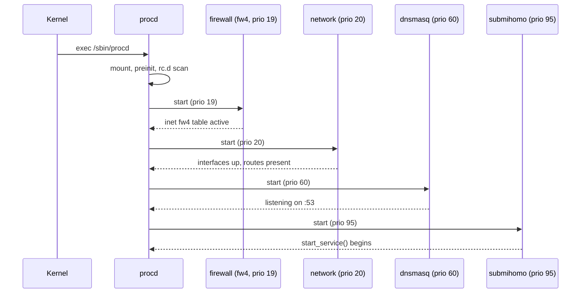
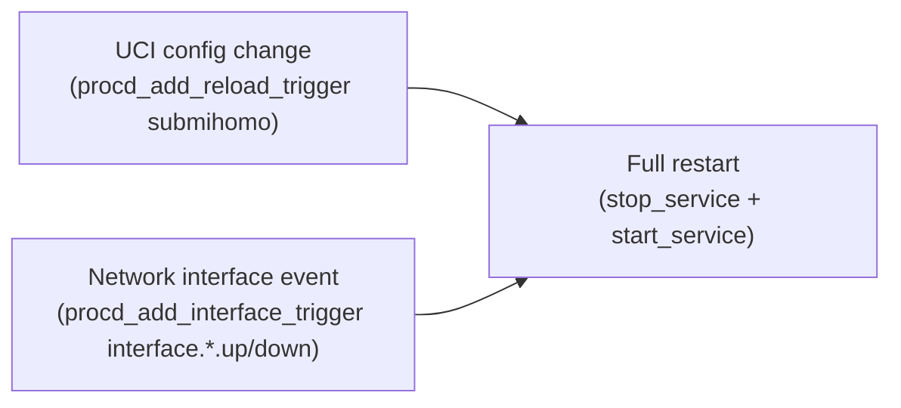
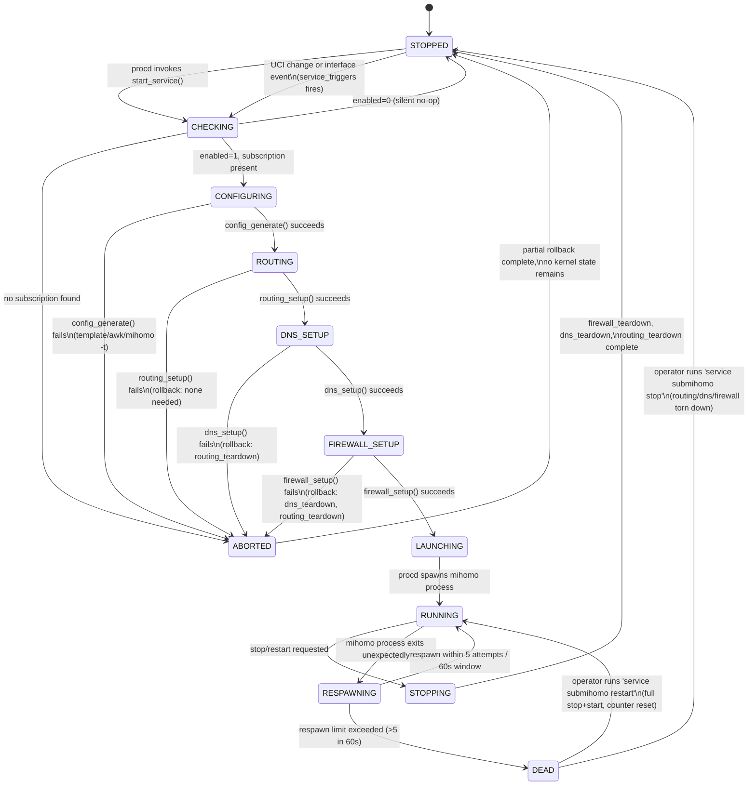
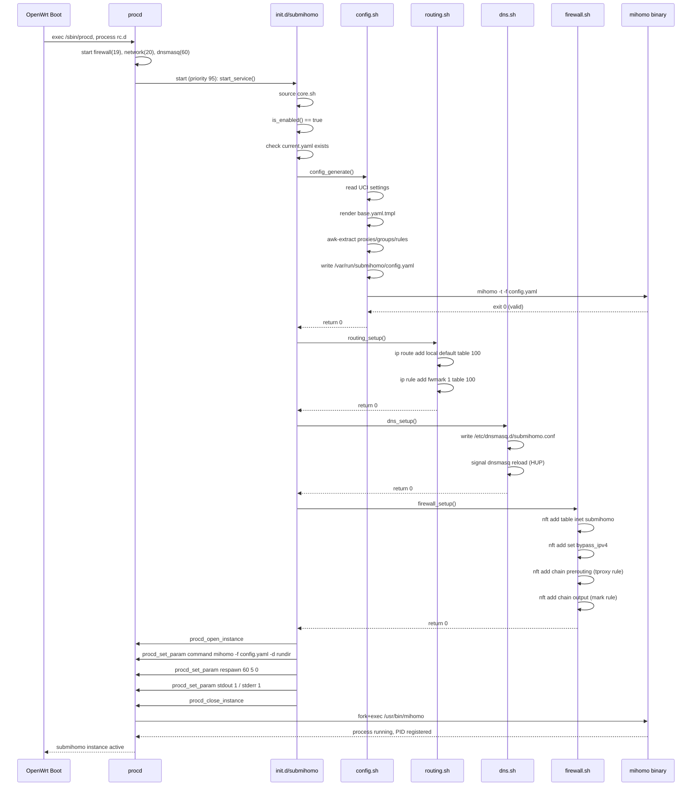

# SubMiHomo — Boot, Lifecycle, and Failure-Mode Specification

> **Audience**: Contributors, maintainers, and operators diagnosing startup, shutdown, restart, or crash behavior.
> **Scope**: The complete runtime lifecycle of the SubMiHomo service, from OpenWrt boot through steady-state operation to shutdown, including every documented failure mode and recovery path.
> **Companion document**: See `docs/COMPONENTS.md` for the per-component interface reference referenced throughout this document.
> **Version**: 1.0 — targets OpenWrt 25+, procd, fw4/nftables, no IPv6.

---

## Table of Contents

1. [Introduction](#1-introduction)
2. [System Startup Sequence](#2-system-startup-sequence)
3. [Detailed start_service() Execution Flow](#3-detailed-start_service-execution-flow)
4. [Failure Mode: Missing Subscription](#4-failure-mode-missing-subscription)
5. [Failure Mode: Config Generation Failure](#5-failure-mode-config-generation-failure)
6. [Failure Mode: Routing Setup Failure](#6-failure-mode-routing-setup-failure)
7. [Failure Mode: DNS Setup Failure](#7-failure-mode-dns-setup-failure)
8. [Failure Mode: Firewall Setup Failure](#8-failure-mode-firewall-setup-failure)
9. [Normal Shutdown Sequence](#9-normal-shutdown-sequence)
10. [Restart Behavior](#10-restart-behavior)
11. [Crash Recovery](#11-crash-recovery)
12. [service_triggers(): Reload Conditions](#12-service_triggers-reload-conditions)
13. [Dependencies on Other OpenWrt Services](#13-dependencies-on-other-openwrt-services)
14. [Race Conditions and Mitigations](#14-race-conditions-and-mitigations)
15. [Startup Validation Steps](#15-startup-validation-steps)
16. [Diagnosing a Failed Start](#16-diagnosing-a-failed-start)
17. [Full State Diagram](#17-full-state-diagram)
18. [Sequence Diagram: Normal Start](#18-sequence-diagram-normal-start)
19. [Cleanup on Stop](#19-cleanup-on-stop)
20. [Interaction With OpenWrt Hotplug](#20-interaction-with-openwrt-hotplug)
21. [Summary Checklist](#21-summary-checklist)

---

## 1. Introduction

SubMiHomo's runtime behavior is governed entirely by `/etc/init.d/submihomo`, a procd-based init script, in cooperation with six shell modules (`core.sh`, `config.sh`, `routing.sh`, `dns.sh`, `firewall.sh`, `subscription.sh`) documented individually in `docs/COMPONENTS.md`. This document does not repeat those component-level interface details; instead it describes the **temporal** dimension of the system: what happens, in what order, under what conditions, and what happens when something goes wrong.

The guiding design principle for the entire lifecycle is: **fail closed, fail loud, and never leave partial state behind.** SubMiHomo refuses to start into an ambiguous or half-configured condition. If any setup step fails, all previously-completed steps in that startup attempt are unwound before the script returns control to procd. There is no "degraded pass-through mode" — either the full proxy pipeline (routing + DNS + firewall + Mihomo) is active, or none of it is.

---

## 2. System Startup Sequence

### 2.1 OpenWrt Boot to procd

OpenWrt's boot sequence is driven by procd from very early userspace (`/sbin/procd` is effectively PID 1's delegate for service management). At a high level:

1. Kernel boots, mounts root filesystem, execs `/sbin/init` → `/sbin/procd`.
2. procd runs `/etc/preinit`, then the standard init chain, then processes `/etc/rc.d/` (symlinks into `/etc/init.d/` ordered by their `START` priority number).
3. Each init script is invoked with `start`, in ascending `START` priority order (lower numbers start first).

### 2.2 Priority Ordering Relative to SubMiHomo's Dependencies

| Priority | Service | Role Relative to SubMiHomo |
|----------|---------|------------------------------|
| 19 | `firewall` (fw4) | Must be up first — SubMiHomo adds its own nftables table alongside fw4's, and depends on the base ruleset (`inet fw4`) already existing so that packet flow through the interfaces is otherwise correctly established |
| 20 | `network` | Must be up first — routing table 100 and the loopback route depend on the network stack being initialized; LAN interfaces must exist for TPROXY to make sense |
| 60 | `dnsmasq` | Must be up first — `dns.sh` writes a drop-in file and signals *reload*, not *start*; if dnsmasq is not yet running, the signal is a no-op and DNS forwarding will not take effect until dnsmasq itself starts and reads all of `/etc/dnsmasq.d/` |
| **95** | **`submihomo`** | Starts last, after all of the above, by design |
| 5 (STOP) | `submihomo` | Stops **first** on shutdown, before dnsmasq, firewall, or network are torn down |

SubMiHomo declares:

```
START=95
STOP=5
```

This ordering guarantees that every kernel and daemon dependency SubMiHomo's modules assume to exist (network interfaces, the `inet fw4` table, a running dnsmasq process) is already present by the time `start_service()` begins. Symmetrically, on shutdown SubMiHomo tears itself down before any of its dependencies disappear out from under it, preventing errors like "nft: no such table" mid-teardown or "dnsmasq: connection refused" during the reload signal.

### 2.3 procd Invocation of submihomo



If any dependency service (`network`, `firewall`, `dnsmasq`) is delayed or fails to start — for example, a WAN interface still negotiating DHCP — `submihomo` still begins its `start_service()` at priority 95 as scheduled by procd's synchronous sequential boot process. procd does not block later-priority services on the *success* of earlier ones, only on their *invocation order*. This has direct implications discussed in Section 14 (Race Conditions).

---

## 3. Detailed start_service() Execution Flow

`start_service()` is a strictly sequential, abort-on-first-failure state machine. Each step either succeeds and proceeds to the next, or fails and triggers an unwind of everything already completed in this attempt.

### 3.1 Step-by-Step Table

| # | Step | Module | Decision Point | On Success | On Failure |
|---|------|--------|-----------------|-------------|------------|
| 1 | Source `core.sh` | core.sh | Does the file exist and parse? | Continue | Effectively fatal — indicates a broken package install; procd logs a shell error and the instance never starts |
| 2 | `is_enabled` | core.sh | Is `uci get submihomo.config.enabled` == `1`? | Continue to step 3 | **Silent return 0** — service considered intentionally stopped, no error logged (this is expected, not a failure) |
| 3 | Subscription existence check | (inline in init script) | Does `$SUB_DIR/current.yaml` exist and is it non-empty? | Continue to step 4 | `log_error`, **abort**, service does not start — see Section 4 |
| 4 | `config_generate()` | config.sh | Template + subscription merge + `mihomo -t` validation all succeed? | Continue to step 5 | `log_error`, **abort**, no kernel state touched yet — see Section 5 |
| 5 | `routing_setup()` | routing.sh | `ip route`/`ip rule` additions succeed (or already present)? | Continue to step 6 | `log_error`, call `routing_teardown()` to undo any partial state, **abort** — see Section 6 |
| 6 | `dns_setup()` | dns.sh | Drop-in file written, dnsmasq reload signal sent (or gracefully skipped)? | Continue to step 7 | `log_error`, call `dns_teardown()` + `routing_teardown()`, **abort** — see Section 7 |
| 7 | `firewall_setup()` | firewall.sh | `nft` table/set/chains applied successfully? | Continue to step 8 | `log_error`, call `firewall_teardown()` + `dns_teardown()` + `routing_teardown()`, **abort** — see Section 8 |
| 8 | `procd_open_instance` | procd API | — | Continue | (procd internal — not a SubMiHomo failure mode) |
| 9 | `procd_set_param command /usr/bin/mihomo -f $RUN_DIR/config.yaml -d $RUN_DIR` | procd API | — | Continue | — |
| 10 | `procd_set_param respawn 60 5 0` | procd API | — | Continue | — |
| 11 | `procd_set_param stdout 1` | procd API | — | Continue | — |
| 12 | `procd_set_param stderr 1` | procd API | — | Continue | — |
| 13 | `procd_close_instance` | procd API | — | procd forks and execs Mihomo | — |

### 3.2 Decision Point Detail

**Step 2 — `is_enabled`**: This is the only step that is expected to legitimately halt the sequence without being a failure. An operator who has not yet enabled SubMiHomo (fresh install default: `enabled=0`) will see `start_service()` return immediately and silently. `submihomo-ctl status` will report "stopped (disabled)" rather than any error state.

**Step 3 — subscription existence check**: This check exists specifically so that `config_generate()` is never invoked against a nonexistent or empty subscription file. It is a fast, cheap, and specific pre-check that produces a much clearer log message than a generic template-rendering failure would (see Section 4).

**Step 4 — `config_generate()`**: Internally performs its own multi-stage validation (template presence, `awk` extraction, `mihomo -t` syntax check). Any internal failure surfaces as a single boolean failure at this step from the init script's point of view — see `docs/COMPONENTS.md` §3.2.7 for `config.sh`'s internal error table.

**Steps 5–7 — kernel state setup**: These three steps are the ones that touch live kernel state (routing tables, dnsmasq config, nftables). They are ordered specifically so that if any one fails, only a well-known, small set of prior steps needs to be undone — never more than routing → DNS → firewall, always in that fixed order, always reversed on teardown.

**Step 8–13 — procd instance registration**: These procd API calls do not themselves "fail" in the sense of returning an error to the script; they queue parameters into an instance descriptor that procd applies atomically when `procd_close_instance` is called. The actual process spawn happens asynchronously from procd's perspective — `start_service()` returns to procd before Mihomo is confirmed to be running. Mihomo's actual liveness is only knowable after the fact (via `get_mihomo_pid()` or the REST API), not during `start_service()`'s own execution.

---

## 4. Failure Mode: Missing Subscription

**This is a deliberate design decision, not an oversight: SubMiHomo refuses to start without a subscription. It does NOT fall back to a pass-through/direct-only mode.**

### 4.1 Rationale

A "start anyway, just proxy nothing" mode was considered and rejected. The reasons:

1. **Silent failure is worse than loud failure.** If SubMiHomo silently started with an empty rule set defaulting to `MATCH,DIRECT`, an operator who believes they are protected/proxied would have no signal that nothing is actually happening — until they investigate why their traffic isn't going through the expected exit node.
2. **Firewall and routing state without a working DNS/proxy pipeline is actively harmful.** If routing/DNS/firewall rules were applied but Mihomo itself had nothing useful to proxy, all traffic could still be captured by TPROXY, routed to Mihomo, and Mihomo would apply `MATCH,DIRECT` to everything — functionally fine for connectivity, but pointlessly adds latency and an extra failure point for zero benefit, since there's no proxy config to justify running at all.
3. **A hard failure produces a clear, actionable log message**, whereas a soft pass-through produces a confusing "why is my proxy not working" support burden.

### 4.2 Exact Behavior

| Condition | Behavior |
|-----------|----------|
| `$SUB_DIR/current.yaml` does not exist | `log_error "SubMiHomo cannot start: no subscription found. Run 'submihomo-ctl update' or configure a subscription URL in LuCI, then restart the service."` — `start_service()` returns non-zero, Mihomo is never spawned, no kernel state is touched |
| `$SUB_DIR/current.yaml` exists but is zero-length | Same as above — treated identically to "missing" |
| `$SUB_DIR/current.yaml` exists and is non-empty but has no `proxies:` key | This passes the *init script's* coarse check (existence + non-empty) but is later caught inside `config_generate()`'s awk extraction / `mihomo -t` validation at step 4 — see Section 5 |

### 4.3 Operator Recovery Path

1. Configure `subscription_url` via LuCI Settings or `uci set submihomo.config.subscription_url=...`.
2. Run `submihomo-ctl update` (or trigger `subscription.update` via the LuCI Subscription page) to populate `current.yaml`.
3. Run `service submihomo start` (or `submihomo-ctl start`).

Because this check happens *before* `config_generate()`, no partial config file, routing state, DNS drop-in, or firewall table is ever created as a byproduct of a failed start due to a missing subscription — the system is left byte-for-byte as it was before the start attempt.

---

## 5. Failure Mode: Config Generation Failure

### 5.1 Trigger Conditions

`config_generate()` (step 4) can fail for any of the reasons enumerated in `docs/COMPONENTS.md` §3.2.7:

- Template file `/etc/submihomo/templates/base.yaml.tmpl` missing.
- Subscription file present but structurally invalid (no `proxies:` key found by `awk`, or malformed YAML that fails `mihomo -t -f`).
- `$RUN_DIR` cannot be created (e.g., `/var/run` read-only or out of tmpfs space).
- Token substitution failure (extremely rare — indicates a corrupted template or a `sed` environment issue).

### 5.2 Exact Behavior

| Step | Action |
|------|--------|
| 1 | `config.sh` logs the specific internal cause (`ERROR: template not found`, `ERROR: config validation failed: <mihomo -t output>`, etc.) |
| 2 | `config_generate()` returns 1 |
| 3 | `init.d/submihomo:start_service()` receives the non-zero return and immediately aborts — **no** `routing_setup()`, `dns_setup()`, or `firewall_setup()` is ever called |
| 4 | No kernel state has been touched (this is the earliest possible abort point after the subscription check) |
| 5 | Mihomo is never spawned |
| 6 | `service submihomo start` returns non-zero to the shell/ubus caller |

### 5.3 Why This Is the Safest Failure Point

Because `config_generate()` runs before any of the kernel-state-mutating steps, a config-generation failure is the cheapest possible failure to recover from: there is nothing to unwind. This is a direct consequence of the fixed step ordering in Section 3 — config generation is placed first among the "real" setup steps specifically so that its failures (the most common category, since it depends on external, less-trusted input — the subscription content) short-circuit before anything riskier happens.

### 5.4 Operator Recovery Path

1. Run `submihomo-ctl test` to reproduce the exact validation failure without side effects.
2. Inspect `logread -e submihomo` for the specific `mihomo -t` error output (line/column of the YAML error, or the specific missing key).
3. If the subscription itself is corrupt, run `submihomo-ctl update` to re-download, or `subscription_restore()` (via a future CLI/RPC hook) to roll back to `backup.yaml`.
4. Retry `service submihomo start`.

---

## 6. Failure Mode: Routing Setup Failure

### 6.1 Trigger Conditions

`routing_setup()` (step 5) can fail if:

- The `ip` binary is missing (indicates a broken/minimal `iproute2` install — should never happen on a stock OpenWrt image but is defensively checked).
- `ip route add local default dev lo table 100` fails for a reason other than "already exists" (e.g., kernel policy routing support compiled out — extremely unlikely on standard OpenWrt kernels, but theoretically possible on a custom build).
- `ip rule add fwmark 1 table 100 priority 1000` fails similarly.

### 6.2 Exact Behavior

| Step | Action |
|------|--------|
| 1 | `routing.sh` logs the specific `ip` command that failed and its error output |
| 2 | `routing_setup()` returns 1 |
| 3 | `init.d/submihomo:start_service()` immediately calls `routing_teardown()` — this is safe and idempotent even if only one of the two constructs (route or rule) was successfully created before the failure, since `routing_teardown()` tolerates absence of either |
| 4 | `start_service()` aborts; `dns_setup()` and `firewall_setup()` are never reached |
| 5 | Mihomo is never spawned |
| 6 | The generated `/var/run/submihomo/config.yaml` from step 4 remains on disk (tmpfs) — it is not deleted, since it is harmless, inert state that will simply be regenerated (and overwritten) on the next start attempt |

### 6.3 Operator Recovery Path

1. Check `logread -e submihomo` for the exact `ip` command and kernel error.
2. Verify kernel policy routing support: `ip rule show` and `ip route show table 100` manually to see current state.
3. If routing table 100 is in an unexpected state due to a conflict with another service also using table 100 (misconfiguration), resolve the conflict (SubMiHomo assumes table 100 is exclusively its own).
4. Retry `service submihomo start`.

---

## 7. Failure Mode: DNS Setup Failure

### 7.1 Trigger Conditions

`dns_setup()` (step 6) can fail if:

- `/etc/dnsmasq.d/` does not exist (would indicate dnsmasq itself is not installed — a hard OpenWrt base-system dependency violation).
- The drop-in file cannot be written (permissions, read-only overlay, disk full).

Note that **dnsmasq not currently running is explicitly NOT a failure** — see `docs/COMPONENTS.md` §3.4.7. In that case `dns_setup()` still returns 0; the drop-in file is written and will take effect whenever dnsmasq next starts or is reloaded, and a `log_warn` is emitted rather than an error.

### 7.2 Exact Behavior (True Failure Case)

| Step | Action |
|------|--------|
| 1 | `dns.sh` logs the specific filesystem error |
| 2 | `dns_setup()` returns 1 |
| 3 | `init.d/submihomo:start_service()` calls `dns_teardown()` (safe no-op if the file was never written) followed by `routing_teardown()` |
| 4 | `start_service()` aborts; `firewall_setup()` is never reached |
| 5 | Mihomo is never spawned |

### 7.3 Operator Recovery Path

1. Verify `/etc/dnsmasq.d/` exists and is writable: `ls -ld /etc/dnsmasq.d/`.
2. Check available space on the overlay filesystem: `df -h /etc`.
3. Confirm dnsmasq package is installed and not removed/replaced: `opkg list-installed | grep dnsmasq` (or `apk info` on APK-based images).
4. Retry `service submihomo start`.

---

## 8. Failure Mode: Firewall Setup Failure

### 8.1 Trigger Conditions

`firewall_setup()` (step 7) — the last and most complex setup step — can fail if:

- The `nft` binary is missing.
- The generated ruleset is rejected by the kernel (e.g., a syntax error in a dynamically-built bypass address from UCI, or an nftables kernel module not loaded).
- A conflicting `inet submihomo` table exists in an unexpected state that cannot be cleanly deleted and recreated (rare, but possible under concurrent invocation — see Section 14).

### 8.2 Exact Behavior

| Step | Action |
|------|--------|
| 1 | `firewall.sh` logs the full `nft` stderr output describing exactly which line/statement was rejected |
| 2 | `firewall_setup()` returns 1 |
| 3 | `init.d/submihomo:start_service()` calls, in order: `firewall_teardown()` (safe no-op if the table was never fully created), `dns_teardown()`, `routing_teardown()` |
| 4 | `start_service()` aborts |
| 5 | Mihomo is never spawned — **this is critical**: Mihomo must never be started with routing/DNS interception rules absent or partially applied, because that would mean LAN traffic is not actually being redirected while Mihomo believes it owns the network, or worse, DNS is redirected but firewall interception is not, causing DNS resolution through Mihomo's fake-IP range without the corresponding TPROXY rule to route connections to those fake IPs anywhere — a connectivity dead end for clients |

### 8.3 Why Firewall Is Last

Firewall setup is deliberately the final and most "irreversible-feeling" step because nftables rule failures are the highest-blast-radius failure among the three (a bad routing rule silently does nothing extra; a bad DNS drop-in silently does nothing extra; a bad or partial firewall rule can actively break LAN connectivity for all clients if TPROXY interception is applied without a corresponding working backend). By running it last, SubMiHomo guarantees that by the time firewall rules are live, routing and DNS are already known-good, and by immediately spawning Mihomo right after (step 8+), the window during which firewall rules exist but Mihomo is not yet listening is minimized to milliseconds.

### 8.4 Operator Recovery Path

1. Inspect `logread -e submihomo` for the exact `nft` rejection message.
2. Manually inspect the current state: `nft list table inet submihomo` (may show a partial or absent table).
3. Check for a bad entry in UCI `bypass_addresses` (malformed CIDR syntax is the most common real-world cause).
4. If a stale/partial table exists from a previous failed attempt, it can be manually removed with `nft delete table inet submihomo` before retrying — though `firewall_setup()`'s replace-in-full strategy (see `docs/COMPONENTS.md` §3.5.4) should already handle this automatically on the next attempt.
5. Retry `service submihomo start`.

---

## 9. Normal Shutdown Sequence

### 9.1 Triggering Shutdown

Shutdown is triggered by any of:

- `service submihomo stop`
- `/etc/init.d/submihomo stop`
- `submihomo-ctl stop`
- `ubus call service delete '{"name":"submihomo"}'` or equivalent
- System reboot/shutdown (procd stops all services in ascending `STOP` priority order — submihomo's `STOP=5` means it is among the very first services stopped)
- UCI-disable (`is_enabled` becomes false and a trigger fires a restart cycle — see Section 12 — which internally performs a full stop then a no-op start)

### 9.2 Step-by-Step Shutdown

| # | Actor | Action |
|---|-------|--------|
| 1 | procd | Sends `SIGTERM` to the Mihomo process (the procd-managed instance), then waits for it to exit (with an internal procd timeout before escalating to `SIGKILL` if the process does not exit gracefully) |
| 2 | procd | Once the instance is confirmed stopped (or force-killed), invokes `stop_service()` in the init script |
| 3 | `stop_service()` | Sources `firewall.sh`, calls `firewall_teardown()` → `nft delete table inet submihomo` |
| 4 | `stop_service()` | Sources `dns.sh`, calls `dns_teardown()` → removes `/etc/dnsmasq.d/submihomo.conf`, signals dnsmasq reload |
| 5 | `stop_service()` | Sources `routing.sh`, calls `routing_teardown()` → removes the fwmark `ip rule` and the table-100 local route |
| 6 | procd | Marks the `submihomo` service instance as stopped |

### 9.3 Ordering Rationale — Exact Reverse of Startup

Teardown order is the **precise mirror** of setup order:

| Startup Order | Shutdown Order |
|-----------------|-------------------|
| 1. config_generate | *(not torn down — config.yaml is simply left in place / overwritten on next start)* |
| 2. routing_setup | 3. routing_teardown (last) |
| 3. dns_setup | 2. dns_teardown (middle) |
| 4. firewall_setup | 1. firewall_teardown (first) |
| 5. Mihomo spawned | *(Mihomo stopped first, before any teardown, by procd)* |

This "last set up, first torn down" (stack/LIFO) discipline ensures that at every intermediate point during shutdown, the currently-active kernel state is always internally consistent: firewall rules are removed while routing and DNS are still in place (so any in-flight connections still resolve/route sanely during the brief transition), then DNS forwarding is removed, and finally the routing rule/table — which by that point is orphaned since nothing at the firewall level is directing traffic to it anymore — is removed last.

### 9.4 What Is Deliberately NOT Cleaned Up

`/var/run/submihomo/config.yaml` and the `$RUN_DIR` directory itself are **not** deleted on stop. Rationale:

- `$RUN_DIR` is tmpfs and is wiped naturally on reboot — no persistent garbage accumulates.
- Leaving the last-generated config in place is useful for post-mortem debugging (`submihomo-ctl test` or manual inspection of the last config that was in effect).
- It will be unconditionally regenerated and overwritten by `config_generate()` on the next `start_service()` anyway, so there is no correctness cost to leaving it.

See Section 19 for the complete, authoritative cleanup checklist.

---

## 10. Restart Behavior

### 10.1 Graceful Restart (`service submihomo restart` / `submihomo-ctl restart`)

A restart is implemented by procd as a full `stop_service()` followed by a full `start_service()` — there is no separate "reload" code path that skips teardown. This means:

1. Full shutdown sequence (Section 9) runs completely: Mihomo is stopped, firewall/DNS/routing are torn down.
2. Full startup sequence (Section 3) runs completely: subscription check, config regeneration, routing/DNS/firewall setup, Mihomo respawned.

This is intentionally the *only* restart mechanism — there is no incremental "just reload the config without touching firewall/routing" fast path, because the config (proxies/rules) is coupled to the firewall bypass set (which can also change based on UCI `bypass_addresses`), and treating them as separately reloadable would risk exactly the kind of partial-state drift this architecture is designed to avoid.

### 10.2 Forced Restart (Crash-Triggered)

See Section 11 (Crash Recovery) — this is procd's own `respawn` mechanism acting on the Mihomo *process* specifically, not a restart of the whole `submihomo` service (routing/DNS/firewall state is **not** torn down and reapplied on a simple Mihomo process respawn; only the Mihomo binary itself is relaunched with the same already-generated config file).

### 10.3 UCI-Change-Triggered Restart

See Section 12 — a full `stop_service()` + `start_service()` cycle, identical in mechanics to Section 10.1, but triggered automatically by procd's `service_triggers()` mechanism rather than an explicit operator command.

### 10.4 Restart Timing Considerations

Because a graceful restart tears down and rebuilds nftables rules and routing state, there is a brief window (typically well under one second on the target mipsel_24kc hardware) during which LAN traffic is **not** being intercepted by TPROXY and instead flows according to the router's normal (non-proxied) routing table. This is a deliberate tradeoff: a brief fail-open window during an explicit, operator-initiated restart is considered acceptable, versus the complexity and risk of attempting a "hot-swap" of firewall rules while traffic is flowing.

---

## 11. Crash Recovery

### 11.1 procd `respawn` Parameter

`init.d/submihomo` registers Mihomo with:

```
procd_set_param respawn 60 5 0
```

| Field | Value | Meaning |
|-------|-------|---------|
| threshold (seconds) | `60` | The rolling time window procd uses to count crashes |
| max retries | `5` | Maximum number of respawns allowed within the threshold window before procd gives up |
| retry delay (seconds) | `0` | Delay procd waits before each respawn attempt (immediate respawn) |

**Interpretation**: If Mihomo exits (crash or non-zero exit) more than 5 times within any rolling 60-second window, procd stops attempting to respawn it and marks the service instance as failed.

### 11.2 What a Crash-Triggered Respawn Does and Does Not Do

| Action | Performed on Respawn? |
|--------|--------------------------|
| Relaunch `/usr/bin/mihomo -f $RUN_DIR/config.yaml -d $RUN_DIR` | **Yes** — procd re-executes the exact same registered command |
| Re-run `config_generate()` | **No** — the existing `config.yaml` on tmpfs is reused as-is |
| Re-run `routing_setup()` | **No** — routing state is assumed to still be correctly in place from the last full `start_service()` |
| Re-run `dns_setup()` | **No** |
| Re-run `firewall_setup()` | **No** |
| Invoke `stop_service()` / `start_service()` in the init script | **No** — this is purely procd's internal process-supervision mechanism, entirely below the level of the init script's `start_service`/`stop_service` functions |

A crash-respawn is therefore extremely lightweight and fast: procd simply re-execs the same binary against the same already-valid config file. The routing/DNS/firewall state was already correct before the crash (Mihomo crashing does not, by itself, corrupt kernel-level nftables or routing state — those are independent of the Mihomo process's lifetime) and remains correct across the respawn.

### 11.3 Exceeding the Respawn Limit

If Mihomo crashes 6 or more times within a 60-second window:

1. procd stops attempting further respawns.
2. The `submihomo` service instance is marked as failed in procd's internal state (visible via `ubus call service list`, which will show the instance with no running PID and an error/exit indication).
3. **Routing, DNS, and firewall state remain applied** — they are not automatically torn down when procd gives up on respawning. This is a deliberate but double-edged consequence: LAN traffic continues to be intercepted by TPROXY and redirected toward a Mihomo listener that is no longer running, meaning **all proxied traffic will fail to connect** until the operator intervenes (see Section 11.4). This is the fail-closed philosophy applied consistently: SubMiHomo does not silently fall back to direct/unproxied traffic just because Mihomo died — it fails loudly and leaves clear operational evidence (broken connectivity plus syslog crash records) rather than silently degrading security/routing posture.
4. `submihomo-ctl status` will report the discrepancy: firewall/routing state present but no Mihomo PID found via `get_mihomo_pid()`.

### 11.4 Operator Recovery From a Respawn-Limit Failure

1. `submihomo-ctl logs 200` (or `logread -e submihomo.mihomo`) to find the repeated crash's root cause (most commonly: a subscription proxy server that Mihomo's core rejects at runtime despite passing static `-t` validation, a resource exhaustion condition, or a genuine Mihomo bug).
2. `submihomo-ctl test` to re-validate the current config without restarting anything.
3. Once the root cause is addressed (e.g., `submihomo-ctl update` to fetch a corrected subscription), run `service submihomo restart` — this performs the **full** stop/start cycle (Section 10.1), which resets procd's internal respawn counter as a side effect of registering a fresh instance.
4. If the underlying issue cannot be fixed immediately, `service submihomo stop` will cleanly tear down routing/DNS/firewall state, restoring normal (unproxied) connectivity while the issue is investigated.

### 11.5 Why Reset-on-Restart Instead of Automatic Backoff-and-Retry-Forever

An alternative design would have procd (or a wrapper) retry indefinitely with exponential backoff. This was rejected because:

- Indefinite retries against a fundamentally broken config (e.g., a malformed subscription that passed static validation but fails at runtime) would produce an endless, noisy crash loop with no clear terminal state for monitoring/alerting to key off of.
- A hard stop after 5 attempts in 60 seconds produces an unambiguous, alertable state (`service list` shows a dead instance) that external monitoring (or an operator glancing at LuCI's Overview page, which surfaces `service.status`) can immediately detect and act on.

---

## 12. service_triggers(): Reload Conditions

### 12.1 Declared Triggers

`init.d/submihomo` calls `service_triggers()` at registration time to declare two categories of automatic reload conditions:



| Trigger Type | Mechanism | Fires When |
|--------------|-----------|-------------|
| UCI config change | `procd_add_reload_trigger "submihomo"` | Any `uci commit submihomo` — e.g., changing `subscription_url`, `dns_mode`, `bypass_addresses`, port numbers, or toggling `enabled` |
| Network interface event | `procd_add_interface_trigger "interface.*.up" "interface.*.down" <interface>` | Any monitored LAN/WAN interface transitions up or down (interface added, DHCP renewal completing, link up/down, `ifup`/`ifdown`) |

### 12.2 Effect of a Trigger Firing

Both trigger types cause procd to invoke the **exact same full restart cycle** described in Section 10.1 (`stop_service()` then `start_service()`) — there is no differentiated "light reload" path. This means every UCI change to any SubMiHomo option, however small, causes a brief full teardown/rebuild of routing, DNS, and firewall state, and a fresh subscription/config validation pass.

### 12.3 Rationale for Coarse-Grained Triggers

- **UCI changes**: Since `bypass_addresses`, port numbers, and `dns_mode` all influence multiple modules simultaneously (e.g., changing `tproxy_port` affects both the generated Mihomo config *and* the firewall TPROXY rule), there is no safe way to reload only "part" of the state without risking a mismatch between, say, the port Mihomo is listening on and the port the firewall redirects to. A full restart guarantees consistency at the cost of a brief interception gap (Section 10.4).
- **Interface events**: A new interface coming up (e.g., a new VLAN, a reconnected WAN, a DHCP lease renewal changing the LAN's effective routing) can change what "local" vs. "must be proxied" means from the router's perspective. Re-running the full startup sequence ensures routing table 100 and the bypass set reflect current network topology, rather than stale assumptions from the previous boot.

### 12.4 What Does NOT Trigger a Restart

| Event | Restart Triggered? |
|-------|----------------------|
| Subscription file updated via `subscription_update()` (cron or manual) | **No** — `subscription.sh` deliberately does not signal or restart the service (see `docs/COMPONENTS.md` §3.6.9); an operator or a future automation must explicitly call `service submihomo restart` for the new subscription to take effect |
| Dashboard updated via `dashboard_download()` | **No** — dashboard files are static assets served by the already-running Mihomo process; no config or kernel state changes are implied |
| Mihomo process crash (within respawn limits) | **No** — handled purely by procd's `respawn` mechanism (Section 11), not by `service_triggers()` |

This is an intentional and important asymmetry: **updating the subscription content alone does not restart the service.** Operators (or LuCI's Subscription page, or a future cron enhancement) must explicitly trigger a restart if they want a freshly-downloaded subscription's proxies/rules to become active immediately. This decouples "fetching new data" from "applying new data," giving the operator (or an automated policy) explicit control over exactly when a live-traffic-affecting restart happens.

---

## 13. Dependencies on Other OpenWrt Services

| Service | Dependency Type | What Would Break Without It |
|---------|-------------------|--------------------------------|
| `network` | Hard, implicit (via boot ordering, `START=95` after `network`'s `20`) | No interfaces to route traffic from/to; `ip route add ... dev lo` itself does not strictly require other interfaces, but the entire purpose of the TPROXY setup (intercepting LAN traffic) is meaningless without configured LAN/WAN interfaces |
| `firewall` (fw4) | Soft, coexistence-based | SubMiHomo's `inet submihomo` table is independent of `inet fw4`, but fw4 must have already established base connectivity (masquerading, LAN/WAN zone rules) for the router to have working internet access at all — SubMiHomo intercepts and redirects traffic that fw4's base rules would otherwise forward normally |
| `dnsmasq` | Soft, reload-based | If dnsmasq is not running when `dns_setup()` executes, the drop-in file is still written but has no immediate effect; DNS forwarding to Mihomo only becomes active once dnsmasq itself starts (or is later reloaded) and reads `/etc/dnsmasq.d/submihomo.conf` |
| `cron` | Soft, feature-only | Without `cron` running, `/etc/cron.d/submihomo` has no effect — subscription updates simply never happen automatically; manual `submihomo-ctl update` remains unaffected |
| `rpcd` | Soft, UI-only | Without `rpcd`, the LuCI frontend cannot function at all (all views depend on the `rpcd/submihomo` plugin), but the core proxy service (Mihomo + routing/DNS/firewall) is entirely unaffected — SubMiHomo's data plane has zero runtime dependency on rpcd |
| `mihomo` (package) | Hard | Without the `mihomo` binary installed, `config_generate()`'s `mihomo -t` validation step fails immediately, and `procd_set_param command /usr/bin/mihomo ...` would reference a nonexistent binary — the service cannot start at all |

---

## 14. Race Conditions and Mitigations

### 14.1 Network Not Yet Fully Ready at Priority 95

**Race**: Although `network` (priority 20) starts before `submihomo` (priority 95), procd's boot sequence does not guarantee that all interfaces have *finished* initializing (e.g., a WAN interface still negotiating DHCP, or a slow-to-associate Wi-Fi uplink) merely because the `network` init script itself has been invoked and returned.

**Mitigation**: `routing_setup()`'s only kernel dependency is the loopback interface (`dev lo`) and the presence of policy-routing kernel support, both of which are available from very early boot, independent of any specific interface's negotiation state. The TPROXY rule in `firewall.sh` similarly does not reference specific interface names — it operates on the `prerouting`/`output` hooks generically. As a result, SubMiHomo's setup steps do not actually have a hard runtime dependency on any single interface being fully up; they depend only on the network *stack* (routing subsystem, netfilter subsystem) being initialized, which is guaranteed well before priority 95. If a specific WAN interface later comes up after SubMiHomo has already started, the `service_triggers()` interface trigger (Section 12) will cause a restart, at which point any interface-topology-dependent assumptions are refreshed.

### 14.2 Concurrent `start_service()` Invocations

**Race**: Two near-simultaneous triggers (e.g., a UCI commit and a manual `submihomo-ctl restart` issued within the same second) could theoretically cause procd to invoke `start_service()` twice in overlapping fashion.

**Mitigation**: procd itself serializes instance lifecycle operations for a given named service — it will not run two `start_service()` invocations for `submihomo` concurrently; a second trigger arriving while a restart is in progress is queued/coalesced by procd's own service-instance state machine. Additionally, `firewall_setup()`'s replace-in-full strategy (delete-then-recreate the `inet submihomo` table) and `routing_setup()`/`dns_setup()`'s pre-existence checks make each individual module idempotent even in the rare case an overlapping invocation does occur, preventing duplicate rule accumulation.

### 14.3 dnsmasq Restarting Independently After SubMiHomo Has Started

**Race**: An operator (or an unrelated UCI change to `/etc/config/dhcp`) could restart dnsmasq after SubMiHomo has already applied its DNS drop-in. A dnsmasq restart re-reads all of `/etc/dnsmasq.d/`, so the SubMiHomo drop-in is naturally picked back up — but there is a brief window during dnsmasq's own restart where DNS resolution is unavailable entirely (a dnsmasq-internal concern, not specific to SubMiHomo).

**Mitigation**: None required from SubMiHomo's side — dnsmasq's restart behavior naturally re-reads the drop-in directory, so SubMiHomo's configuration survives an independent dnsmasq restart without any action needed. SubMiHomo does not need to detect or react to this event.

### 14.4 Subscription Update Racing With an In-Progress Start

**Race**: `submihomo-ctl update` (or a cron-triggered update) could run at the exact moment `start_service()` is mid-way through `config_generate()`, which reads `current.yaml`.

**Mitigation**: `subscription_apply()` uses an atomic `mv` (rename) rather than an in-place write, so any concurrent reader of `current.yaml` either sees the complete old file or the complete new file — never a partially-written, corrupt intermediate state. Because a subscription update does not itself trigger a restart (Section 12.4), the two operations are logically independent; a `config_generate()` in progress will simply use whichever complete version of `current.yaml` happened to exist at the moment of its `awk` extraction.

### 14.5 firewall.sh Conflicting With fw4 Reload

**Race**: OpenWrt's `firewall` service (fw4) can be reloaded independently (e.g., via LuCI's own Firewall page, or `/etc/init.d/firewall reload`), which regenerates the entire nftables ruleset from fw4's own templates.

**Mitigation**: fw4's reload only manages tables it owns (principally `inet fw4`); it does not touch or delete SubMiHomo's independently-created `inet submihomo` table, since nftables tables are namespaced by family+name and fw4 has no awareness of SubMiHomo's table. However, if fw4 fully flushes and reloads the entire nftables ruleset at a lower level (a full `nft flush ruleset` rather than a scoped table replacement), that would also remove `inet submihomo`. In that scenario, SubMiHomo has no automatic detection mechanism — the interception silently stops working until the next SubMiHomo restart. This is a known, accepted limitation: SubMiHomo does not currently subscribe to fw4's reload events. Operators who modify firewall configuration should follow with `service submihomo restart` as a precaution.

---

## 15. Startup Validation Steps

Before Mihomo is ever launched, the following validations occur, listed in the exact order they are checked (mirroring Section 3):

| Order | Validation | Performed By | Failure Consequence |
|-------|------------|----------------|------------------------|
| 1 | Service is enabled (`enabled=1` in UCI) | `is_enabled()` in `core.sh` | Silent no-op start |
| 2 | Subscription file exists and is non-empty | inline check in `init.d/submihomo` | Hard abort, clear log message (Section 4) |
| 3 | Template file exists and is readable | `config.sh` | Hard abort |
| 4 | Subscription YAML contains a `proxies:` section (via `awk`) | `config.sh` | Warning only if empty; hard abort if extraction itself errors |
| 5 | Assembled config is syntactically and semantically valid Mihomo config | `mihomo -t -f $RUN_DIR/config.yaml` | Hard abort (Section 5) |
| 6 | `$RUN_DIR` is writable | `config.sh` | Hard abort |
| 7 | Routing table 100 and fwmark rule can be created (or already exist) | `routing.sh` via `ip` | Hard abort with rollback (Section 6) |
| 8 | `/etc/dnsmasq.d/` is writable | `dns.sh` | Hard abort with rollback (Section 7) |
| 9 | nftables accepts the generated ruleset | `firewall.sh` via `nft` | Hard abort with full rollback (Section 8) |

Only after all nine validations succeed does `procd_open_instance`/`procd_set_param`/`procd_close_instance` register Mihomo with procd, which then spawns the actual `/usr/bin/mihomo` process.

**Note**: There is no runtime validation, at this stage, that Mihomo actually starts successfully and binds its listening ports (that would require polling the REST API or checking listening sockets after the fact, which the init script's synchronous `start_service()` does not perform). Confirming actual Mihomo liveness is a separate, later concern handled by `submihomo-ctl status` / `get_mihomo_pid()` / `service.status` (rpcd), which an operator or the LuCI Overview page can check after the fact.

---

## 16. Diagnosing a Failed Start

### 16.1 First Command to Run

```
submihomo-ctl status
```

This reports whether the service is enabled, whether a Mihomo PID is present, and (if rpcd/mihomo API is reachable) basic uptime info. It immediately distinguishes between "disabled," "enabled but never started successfully," and "enabled and running."

### 16.2 Log Inspection

| Command | What It Shows |
|---------|-----------------|
| `logread -e submihomo` | All shell-module log lines (INFO/WARN/ERROR/DEBUG) from `core.sh`'s logging functions across every module invocation |
| `logread -e submihomo.mihomo` | Mihomo's own stdout/stderr, captured by procd — this is where Mihomo-internal errors (e.g., "listen tcp 127.0.0.1:7891: bind: address already in use") will appear |
| `submihomo-ctl logs 200` | Convenience wrapper around `logread -e submihomo`, tailing the last 200 lines |

### 16.3 Manual Step-by-Step Reproduction

If the automated log output is insufficient, an operator (or a support engineer) can manually reproduce each `start_service()` step to isolate exactly which one fails:

| Step | Manual Command |
|------|-------------------|
| Check enabled | `uci get submihomo.config.enabled` |
| Check subscription | `ls -la /etc/submihomo/subscriptions/current.yaml` |
| Dry-run config generation | `submihomo-ctl test` (safe, no side effects) |
| Manually validate the generated config | `mihomo -t -f /var/run/submihomo/config.yaml` |
| Inspect current routing state | `ip rule show` / `ip route show table 100` |
| Inspect current DNS drop-in | `cat /etc/dnsmasq.d/submihomo.conf` |
| Inspect current firewall state | `nft list table inet submihomo` |
| Check procd's view of the service | `ubus call service list '{"name":"submihomo"}'` |

### 16.4 Common Root Causes and Their Signatures

| Symptom | Likely Root Cause | Where to Look |
|---------|----------------------|------------------|
| `submihomo-ctl status` reports "stopped (disabled)" | `enabled=0` in UCI — not a bug | `uci get submihomo.config.enabled` |
| "no subscription found" in logs | No `current.yaml`, or subscription never downloaded | `ls /etc/submihomo/subscriptions/` |
| "config validation failed" in logs | Malformed subscription proxies/rules, or a template token failed to substitute | `submihomo-ctl test` output, `mihomo -t` error text |
| Service appears to start but Mihomo has no PID shortly after | Mihomo crashed immediately after launch (bad listen address, port conflict) | `logread -e submihomo.mihomo` |
| Service was running, then silently stopped intercepting traffic | Respawn limit exceeded (Section 11.3), or fw4 flushed the ruleset (Section 14.5) | `ubus call service list`, `nft list table inet submihomo` |
| `nft` errors mentioning a bypass address | Malformed CIDR in UCI `bypass_addresses` | `uci show submihomo` |
| DNS queries not being intercepted despite service "running" | dnsmasq was not running at the time `dns_setup()` executed, and has not restarted since | `logread -e submihomo` for the `log_warn` about dnsmasq, `ps | grep dnsmasq` |

---

## 17. Full State Diagram



### 17.1 State Descriptions

| State | Meaning | Kernel State Present? | Mihomo Process Present? |
|-------|---------|--------------------------|-----------------------------|
| `STOPPED` | Service is not running, either intentionally disabled or cleanly stopped | No | No |
| `CHECKING` | Transient — evaluating `enabled` and subscription presence | No | No |
| `ABORTED` | Transient — a setup step failed and rollback is in progress | Being unwound | No |
| `CONFIGURING` | Transient — generating and validating `config.yaml` | No | No |
| `ROUTING` | Transient — applying routing table/rule | Partial (routing only, briefly) | No |
| `DNS_SETUP` | Transient — writing dnsmasq drop-in | Routing + DNS | No |
| `FIREWALL_SETUP` | Transient — applying nftables rules | Routing + DNS + Firewall | No |
| `LAUNCHING` | Transient — procd is registering and spawning the instance | Full | Spawning |
| `RUNNING` | Steady state — fully operational | Full | Yes |
| `STOPPING` | Transient — tearing down in reverse order | Being unwound | No (already terminated) |
| `RESPAWNING` | Transient — procd relaunching Mihomo after a crash | Full (unchanged) | Restarting |
| `DEAD` | Terminal failure — respawn limit exceeded | Full (**left in place**, see §11.3) | No |

---

## 18. Sequence Diagram: Normal Start



---

## 19. Cleanup on Stop

The following is the complete, authoritative list of everything torn down when `stop_service()` runs, and, equally important, everything that is deliberately **not** touched.

### 19.1 Torn Down

| Item | Removed By | Mechanism |
|------|-------------|-----------|
| Mihomo process | procd (before `stop_service()` runs) | `SIGTERM`, escalating to `SIGKILL` if unresponsive |
| nftables table `inet submihomo` (set + both chains) | `firewall_teardown()` | `nft delete table inet submihomo` |
| `/etc/dnsmasq.d/submihomo.conf` | `dns_teardown()` | `rm` |
| dnsmasq's in-memory forwarding state referencing port 1053 | `dns_teardown()` | HUP signal / reload after file removal |
| `ip rule` for fwmark 1 → table 100 | `routing_teardown()` | `ip rule del` |
| Local default route in table 100 | `routing_teardown()` | `ip route del` |

### 19.2 Deliberately NOT Torn Down

| Item | Why It Is Left in Place |
|------|----------------------------|
| `/var/run/submihomo/config.yaml` | Harmless tmpfs artifact; useful for post-mortem debugging; unconditionally regenerated on next start |
| `/var/run/submihomo/` directory itself | Same as above; tmpfs, wiped on reboot anyway |
| `/etc/submihomo/subscriptions/current.yaml` and `backup.yaml` | Persistent user data — subscriptions are never deleted by a service stop |
| `/etc/submihomo/templates/base.yaml.tmpl` | Static package-provided file, never touched by lifecycle operations |
| `/etc/config/submihomo` (UCI) | User configuration is never modified as a side effect of starting or stopping the service |
| `/etc/cron.d/submihomo` | The update schedule is a standing user preference, independent of whether the proxy service itself is currently running; it is only removed when the service is disabled or `update_interval=0` (see `docs/COMPONENTS.md` §3.12.3), not on every stop |
| `/usr/share/submihomo/dashboard/` (Zashboard files) | Static assets unrelated to the Mihomo process lifecycle |

### 19.3 Summary Principle

Only **runtime kernel state** (routing rules, nftables rules, the dnsmasq drop-in file that affects live DNS resolution) and the **supervised process itself** are ever torn down. All **persistent configuration and data** (UCI, subscriptions, templates, dashboard, cron schedule) survives every stop/start cycle untouched, and is only ever modified by the specific component that owns it (per the state-ownership tables in `docs/COMPONENTS.md`).

---

## 20. Interaction With OpenWrt Hotplug

### 20.1 Hotplug vs. procd service_triggers

OpenWrt's hotplug system (`/etc/hotplug.d/iface/`) and procd's `service_triggers()`/`procd_add_interface_trigger` mechanism are related but distinct subsystems that both react to interface events. SubMiHomo uses the **procd trigger mechanism** exclusively (declared inside `service_triggers()`, see Section 12), not a standalone hotplug script under `/etc/hotplug.d/iface/`.

### 20.2 Why procd Triggers Instead of a Hotplug Script

| Approach | Behavior |
|----------|-----------|
| procd `procd_add_interface_trigger` (used by SubMiHomo) | Declaratively ties specific interface up/down events to a full service restart, managed entirely by procd's own event bus; no separate script to maintain, and automatically benefits from procd's built-in de-duplication/coalescing of rapid repeated events |
| A standalone `/etc/hotplug.d/iface/` script (not used) | Would require manually calling `/etc/init.d/submihomo restart` from the hotplug script, duplicating logic procd already provides natively, and would not benefit from procd's event coalescing — a flapping interface could trigger many rapid, redundant restarts |

SubMiHomo's choice to rely solely on procd's native trigger mechanism keeps all lifecycle logic centralized inside `/etc/init.d/submihomo`, consistent with the rest of this document's emphasis on a single orchestrator with no parallel/duplicate control paths.

### 20.3 Practical Effect

When any interface matched by the trigger declaration (typically the LAN interface(s), and optionally WAN if the operator's UCI bypass rules depend on WAN's address) transitions `up` or `down` — for example, a WAN reconnect after an outage, a LAN VLAN being reconfigured, or a DHCP lease renewal that procd treats as an "up" event — procd automatically performs the full restart cycle described in Section 10.1 for the `submihomo` service.

This means: **operators do not need to manually restart SubMiHomo after network topology changes.** The service self-heals its routing table 100 entries and firewall bypass assumptions any time the underlying network changes, at the cost of the brief fail-open window described in Section 10.4.

### 20.4 Interaction With subscription.sh's Cron-Triggered Updates

Hotplug/interface events and cron-triggered subscription updates are entirely independent subsystems. A subscription update happening via cron does not interact with, wait for, or get triggered by any hotplug/interface event — the two automation paths (network-driven restarts vs. schedule-driven subscription refreshes) operate on completely separate triggers and were designed to be independently reasoned about (Section 12.4 makes this asymmetry explicit).

---

## 21. Summary Checklist

A condensed, single-page operational reference distilled from the preceding sections:

| Question | Answer |
|----------|--------|
| What starts SubMiHomo? | procd, at `START=95`, after network/firewall/dnsmasq |
| What stops SubMiHomo first on shutdown? | SubMiHomo itself, at `STOP=5`, before network/firewall/dnsmasq |
| Does SubMiHomo start without a subscription? | **No** — hard abort, clear log message, zero side effects |
| Does a config validation failure touch kernel state? | **No** — it is the earliest possible abort point |
| What is undone if routing setup fails? | Nothing extra — routing is the first kernel-state step |
| What is undone if DNS setup fails? | routing_teardown() |
| What is undone if firewall setup fails? | dns_teardown() + routing_teardown() |
| Does a Mihomo crash restart the whole service? | **No** — only procd's lightweight process respawn (same config, no module re-run) |
| What happens after 5 crashes in 60 seconds? | procd gives up; kernel state (routing/DNS/firewall) is **left in place**; operator must intervene |
| Does updating a subscription auto-restart the service? | **No** — must be explicitly restarted to take effect |
| Does a UCI change auto-restart the service? | **Yes** — full stop/start cycle via `service_triggers()` |
| Does an interface up/down event auto-restart the service? | **Yes** — same mechanism as UCI changes |
| Is there a partial/incremental reload path? | **No** — every restart is a full teardown + full rebuild |
| Is any persistent data deleted on stop? | **No** — only runtime kernel state and the Mihomo process are torn down |
