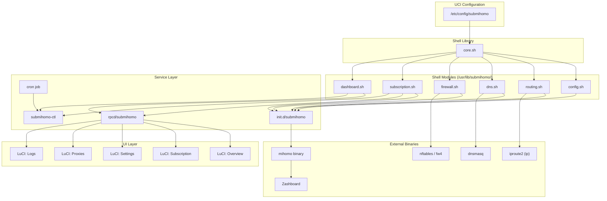

# SubMiHomo — Component Reference

> **Audience**: Contributors, maintainers, and engineers who need to modify, extend, or debug a specific component.
> **Scope**: Definitive per-component specification — responsibility, interface, dependencies, consumers, lifecycle, error handling, owned state, and explicit boundaries.
> **Companion document**: See `docs/BOOT.md` for the end-to-end system lifecycle and startup/shutdown sequencing that ties these components together.
> **Version**: 1.0 — targets OpenWrt 25+, Mihomo proxy core, fw4/nftables, no IPv6.

---

## Table of Contents

1. [Introduction](#1-introduction)
2. [Architecture Overview](#2-architecture-overview)
   - 2.1 [Layering](#21-layering)
   - 2.2 [Component Dependency Graph](#22-component-dependency-graph)
3. [Component Specifications](#3-component-specifications)
   - 3.1 [core.sh](#31-coresh)
   - 3.2 [config.sh](#32-configsh)
   - 3.3 [routing.sh](#33-routingsh)
   - 3.4 [dns.sh](#34-dnssh)
   - 3.5 [firewall.sh](#35-firewallsh)
   - 3.6 [subscription.sh](#36-subscriptionsh)
   - 3.7 [dashboard.sh](#37-dashboardsh)
   - 3.8 [init.d/submihomo](#38-initdsubmihomo)
   - 3.9 [submihomo-ctl](#39-submihomo-ctl)
   - 3.10 [rpcd/submihomo](#310-rpcdsubmihomo-lua-rpcd-plugin)
   - 3.11 [LuCI Views](#311-luci-views)
   - 3.12 [Cron Job](#312-cron-job)
   - 3.13 [Mihomo Binary (External)](#313-mihomo-binary-external)
   - 3.14 [Zashboard (External)](#314-zashboard-external)
4. [Cross-Cutting Concerns](#4-cross-cutting-concerns)
   - 4.1 [Logging Architecture](#41-logging-architecture)
   - 4.2 [UCI Configuration Schema](#42-uci-configuration-schema)
   - 4.3 [File System Layout](#43-file-system-layout)
5. [Component Interaction Matrix](#5-component-interaction-matrix)
6. [Extension Guidelines](#6-extension-guidelines)

---

## 1. Introduction

This document is the definitive architectural reference for every component in the SubMiHomo system. Each component is documented with eight mandatory facets:

1. **Component name and location** — the exact file path and owning package.
2. **Single responsibility** — precisely what the component does, and by omission, what it does not do.
3. **Complete public interface** — every function, command, or RPC method with its signature and return contract.
4. **Dependencies** — every external tool, binary, file, or module the component relies upon.
5. **Consumers** — every component that calls into it.
6. **Lifecycle** — when it is invoked, and in what order relative to other components.
7. **Error handling behavior** — the exact failure contract: what is logged, what is returned, what is left in place.
8. **State ownership** — a strict separation between state a component *owns* (creates/mutates/deletes) versus state it merely *reads*.
9. **Boundaries** — an explicit "must NOT do" list to prevent responsibility creep and layering violations.

SubMiHomo is decomposed into four layers, described in Section 2.

---

## 2. Architecture Overview

### 2.1 Layering

| Layer | Components | Role |
|-------|------------|------|
| Shell Library | `core.sh` | Shared constants, UCI access, logging — zero side effects |
| Shell Modules | `config.sh`, `routing.sh`, `dns.sh`, `firewall.sh`, `subscription.sh`, `dashboard.sh` | Single-purpose, idempotent setup/teardown units |
| Service Layer | `init.d/submihomo`, `submihomo-ctl`, `rpcd/submihomo`, cron job | Orchestration, operator interfaces, scheduling |
| UI Layer | LuCI views (overview, subscription, settings, proxies, logs) | Browser-facing presentation, talks only to rpcd |
| External | `mihomo` binary, Zashboard | Upstream binaries SubMiHomo wraps but does not own |

The strict rule governing this layering is: **a component may only call downward or sideways within its own layer, never upward.** Shell modules never call the init script; the init script never calls LuCI; LuCI never touches the filesystem or shell modules directly — it always goes through rpcd.

### 2.2 Component Dependency Graph



---

## 3. Component Specifications

---

### 3.1 core.sh

**Location**: `/usr/lib/submihomo/core.sh`
**Package**: `submihomo`

#### 3.1.1 Single Responsibility

`core.sh` is a sourced shell library providing shared constants, UCI access helpers, structured logging, PID inspection, and the Mihomo HTTP API wrapper. It performs **no side effects** when sourced and never modifies system state on its own.

#### 3.1.2 Public Interface

| Symbol | Type | Signature | Value / Returns | Description |
|--------|------|-----------|------------------|--------------|
| `TPROXY_PORT` | constant | — | `7891` | TPROXY listener port |
| `MIXED_PORT` | constant | — | `7890` | Mixed (HTTP+SOCKS5) port |
| `DNS_PORT` | constant | — | `1053` | Mihomo DNS listener port |
| `CTRL_PORT` | constant | — | `9090` | Mihomo REST controller port |
| `FWMARK` | constant | — | `1` | Netfilter mark applied to proxied traffic |
| `BYPASS_MARK` | constant | — | `255` | Netfilter mark for Mihomo's own outbound traffic |
| `RT_TABLE` | constant | — | `100` | Policy routing table number |
| `CONFIG_DIR` | constant | — | `/etc/submihomo` | Persistent configuration directory |
| `RUN_DIR` | constant | — | `/var/run/submihomo` | Runtime state directory (tmpfs) |
| `SUB_DIR` | constant | — | `/etc/submihomo/subscriptions` | Subscription YAML storage directory |
| `DASHBOARD_DIR` | constant | — | `/usr/share/submihomo/dashboard` | Zashboard static file directory |
| `uci_get()` | function | `uci_get <option> [default]` | string | Reads `submihomo.config.<option>` from UCI; returns `<default>` (or empty) if unset |
| `log_info()` | function | `log_info <message>` | void | `logger -t submihomo "INFO: <message>"` |
| `log_warn()` | function | `log_warn <message>` | void | `logger -t submihomo "WARN: <message>"` |
| `log_error()` | function | `log_error <message>` | void | `logger -t submihomo "ERROR: <message>"` |
| `log_debug()` | function | `log_debug <message>` | void | `logger -t submihomo "DEBUG: <message>"`; suppressed unless `log_level=debug` |
| `is_enabled()` | function | `is_enabled` | `0` / `1` | Returns 0 (true) if `uci_get enabled` == `1` |
| `get_mihomo_pid()` | function | `get_mihomo_pid` | PID or empty string | Reads PID from procd instance / pidfile |
| `mihomo_api()` | function | `mihomo_api <method> <path> [body]` | JSON string or empty | Wraps `curl`/`wget` call to `http://127.0.0.1:9090/<path>` |

#### 3.1.3 Dependencies

| Dependency | Type | Reason |
|------------|------|--------|
| `uci` | OpenWrt utility | Read `/etc/config/submihomo` |
| `logger` | BusyBox applet | Write to syslog |
| `curl` or `wget` | BusyBox/opkg | Backing implementation of `mihomo_api()` |
| POSIX shell | Built-in | Function definitions, no bash-isms |

#### 3.1.4 Consumers

Every other shell-based component sources `core.sh` as its first statement:

- `config.sh`, `routing.sh`, `dns.sh`, `firewall.sh`, `subscription.sh`, `dashboard.sh`
- `init.d/submihomo` (sources directly for constants/logging before sourcing individual modules)
- `submihomo-ctl` (sources for constants and logging)
- `rpcd/submihomo` reimplements equivalent constants/logic in Lua — it does **not** source `core.sh`, since rpcd plugins run inside the `ubusd`/`rpcd` process model and cannot source POSIX shell files. See Section 3.10.

#### 3.1.5 Lifecycle

`core.sh` is **sourced**, never executed directly (it has no shebang execution path that does anything meaningful). It defines symbols into the calling shell's environment. There is no init function and no cleanup function. Sourcing it multiple times is safe and idempotent because all definitions (constants, functions) are pure re-declarations.

#### 3.1.6 Error Handling

| Condition | Behavior |
|-----------|----------|
| UCI key absent, no default given | Returns empty string, no error raised |
| `mihomo_api()` — connection refused / timeout | Logs `ERROR: mihomo API unreachable`, returns empty string, non-zero exit |
| `mihomo_api()` — non-2xx HTTP status | Logs `ERROR: mihomo API returned <code>`, returns response body, non-zero exit |
| `logger` binary absent | Silently discarded, no crash |

`core.sh` **never calls `exit`** — doing so would terminate the sourcing script. Callers are always responsible for interpreting return codes.

#### 3.1.7 State Ownership

| State | Ownership |
|-------|-----------|
| None | `core.sh` owns no persistent state |
| `/etc/config/submihomo` | Read-only access via `uci_get()` |

#### 3.1.8 Boundaries — core.sh Must NOT

- Must not call `exit` or otherwise terminate the calling process.
- Must not write to the filesystem, network stack, or firewall.
- Must not start, stop, or signal any process (other than the read-only `mihomo_api()` HTTP calls).
- Must not source or call any other SubMiHomo module (no upward or lateral dependencies).
- Must not perform network I/O except the explicit, caller-invoked `mihomo_api()`.

---

### 3.2 config.sh

**Location**: `/usr/lib/submihomo/config.sh`
**Package**: `submihomo`

#### 3.2.1 Single Responsibility

`config.sh` generates the complete Mihomo runtime configuration at `/var/run/submihomo/config.yaml` by merging the static template with UCI settings and the active subscription's `proxies`, `proxy-groups`, and `rules` sections.

#### 3.2.2 Public Interface

| Function | Signature | Returns | Description |
|----------|-----------|---------|--------------|
| `config_generate()` | `config_generate` | `0` success / `1` failure | End-to-end template render, subscription merge, write, validate |

Internal helpers (`_tmpl_render`, `_sub_extract_proxies`, `_sub_extract_proxy_groups`, `_sub_extract_rules`, `_ensure_run_dir`) are private to `config.sh` and are not part of the public contract — they must never be called from `init.d/submihomo`, `submihomo-ctl`, or any other component.

#### 3.2.3 Processing Steps (inside `config_generate`)

| Step | Action |
|------|--------|
| 1 | Source `core.sh` (idempotent no-op if already sourced) |
| 2 | Read UCI values: `mixed_port`, `tproxy_port`, `dns_port`, `log_level`, `ctrl_port`, `ctrl_secret`, `allow_lan`, `fake_ip_enabled`, `dns_mode` |
| 3 | Read template `$CONFIG_DIR/templates/base.yaml.tmpl` |
| 4 | Token-substitute with `sed`: `{{TPROXY_PORT}}`, `{{MIXED_PORT}}`, `{{DNS_PORT}}`, `{{LOG_LEVEL}}`, `{{EXTERNAL_CONTROLLER_PORT}}`, `{{EXTERNAL_CONTROLLER_SECRET}}`, `{{ALLOW_LAN}}`, `{{FAKE_IP_ENABLED}}`, `{{DNS_MODE}}` |
| 5 | `awk` — extract `proxies:` block from `$SUB_DIR/current.yaml` |
| 6 | `awk` — extract `proxy-groups:` block from `$SUB_DIR/current.yaml` |
| 7 | `awk` — extract `rules:` block from `$SUB_DIR/current.yaml` |
| 8 | Replace `proxies: []`, `proxy-groups: []`, and the trailing `rules:` stanza in the rendered template with the extracted content |
| 9 | `mkdir -p $RUN_DIR` |
| 10 | Write assembled YAML to `$RUN_DIR/config.yaml` |
| 11 | Validate: `mihomo -t -f $RUN_DIR/config.yaml`; non-zero exit → `log_error`, return 1 |
| 12 | Return 0 |

#### 3.2.4 Dependencies

| Dependency | Type |
|------------|------|
| `core.sh` | Shell library |
| `uci` | Read config values |
| `awk` | Extract subscription YAML sections |
| `sed` | Token substitution |
| `mihomo` binary | Config validation (`-t` flag) |
| `/etc/submihomo/templates/base.yaml.tmpl` | Template source |
| `/etc/submihomo/subscriptions/current.yaml` | Subscription data source |

#### 3.2.5 Consumers

| Consumer | Call Site |
|----------|-----------|
| `init.d/submihomo:start_service()` | Sources `config.sh`, calls `config_generate()` before any kernel-level setup |

#### 3.2.6 Lifecycle

Called exactly once per service start attempt, and again on every restart triggered by `service_triggers()` (UCI change or interface event — see `docs/BOOT.md` §10). It is never called during `stop_service()`.

#### 3.2.7 Error Handling

| Failure | Behavior |
|---------|----------|
| Template file missing | `log_error "template not found"`, return 1 |
| Subscription file missing | `log_error "no subscription"`, return 1 (though `init.d` already checks this earlier — defense in depth) |
| `awk` extraction yields empty `proxies:` | `log_warn "subscription has no proxies"`, continue (Mihomo may still start with `MATCH,DIRECT` only) |
| Token substitution fails (e.g., `sed` error) | `log_error`, return 1 |
| `$RUN_DIR` cannot be created (disk/tmpfs issue) | `log_error`, return 1 |
| `mihomo -t` fails | `log_error "config validation failed: <mihomo output>"`, return 1 |

A return of `1` from `config_generate()` causes `init.d/submihomo:start_service()` to abort immediately — no routing, DNS, or firewall changes are made, and Mihomo is never launched.

#### 3.2.8 State Ownership

| State | Ownership |
|-------|-----------|
| `/var/run/submihomo/config.yaml` | **Owned** (created, overwritten every start) |
| `/var/run/submihomo/` directory | **Owned** (created if absent) |
| `/etc/config/submihomo` | Read-only |
| `/etc/submihomo/templates/base.yaml.tmpl` | Read-only |
| `/etc/submihomo/subscriptions/current.yaml` | Read-only |

#### 3.2.9 Boundaries — config.sh Must NOT

- Must not modify UCI settings.
- Must not modify subscription files (read-only consumer of `current.yaml`).
- Must not start, stop, or signal any process.
- Must not configure routing, firewall, or DNS.
- Must not write anywhere outside `$RUN_DIR`.

---

### 3.3 routing.sh

**Location**: `/usr/lib/submihomo/routing.sh`
**Package**: `submihomo`

#### 3.3.1 Single Responsibility

`routing.sh` manages the two kernel-level policy-routing constructs required for TPROXY to function: a local default route in table 100, and an `ip rule` that sends fwmark-1 traffic to that table.

#### 3.3.2 Public Interface

| Function | Signature | Returns | Description |
|----------|-----------|---------|--------------|
| `routing_setup()` | `routing_setup` | `0` success / `1` fatal error | Idempotently adds the local route and fwmark rule |
| `routing_teardown()` | `routing_teardown` | `0` always | Removes both constructs; tolerates absence |

#### 3.3.3 Setup Operations (in order)

1. Source `core.sh`.
2. `ip route show table $RT_TABLE` — if a local default route already exists, skip step 3.
3. `ip route add local default dev lo table $RT_TABLE`.
4. `ip rule show` — if an fwmark rule for `$FWMARK table $RT_TABLE` already exists, skip step 5.
5. `ip rule add fwmark $FWMARK table $RT_TABLE priority 1000`.
6. Return 0.

#### 3.3.4 Teardown Operations (in order)

1. `ip rule del fwmark $FWMARK table $RT_TABLE priority 1000 2>/dev/null` — errors ignored.
2. `ip route del local default dev lo table $RT_TABLE 2>/dev/null` — errors ignored.
3. Return 0.

#### 3.3.5 Dependencies

| Dependency | Type |
|------------|------|
| `core.sh` | Shell library |
| `iproute2` (`ip`) | Routing rule/table manipulation |

#### 3.3.6 Consumers

| Consumer | When |
|----------|------|
| `init.d/submihomo:start_service()` | Immediately after `config_generate()` succeeds |
| `init.d/submihomo:stop_service()` | Last step of teardown (mirrors first-set-up-last-torn-down ordering) |

#### 3.3.7 Error Handling

| Condition | Behavior |
|-----------|----------|
| `ip` binary missing | `log_error`, return 1 |
| Route add fails for a reason other than "already exists" | `log_error`, return 1 |
| Rule add fails for a reason other than "already exists" | `log_error`, return 1 |
| Rule/route deletion target not found (teardown) | Silently ignored, still returns 0 |

If `routing_setup()` returns 1, `start_service()` immediately calls `routing_teardown()` to undo any partial state, then aborts the remaining startup steps.

#### 3.3.8 State Ownership

| State | Ownership |
|-------|-----------|
| Kernel routing table 100 (local default route) | **Owned** |
| Kernel `ip rule` (fwmark 1 → table 100, priority 1000) | **Owned** |

#### 3.3.9 Boundaries — routing.sh Must NOT

- Must not modify the main routing table.
- Must not configure iptables/nftables rules.
- Must not affect routing decisions for unmarked traffic.
- Must not persist rules across reboot (these are runtime-only and are always recreated on start — this is intentional, see `docs/BOOT.md`).

---

### 3.4 dns.sh

**Location**: `/usr/lib/submihomo/dns.sh`
**Package**: `submihomo`

#### 3.4.1 Single Responsibility

`dns.sh` configures dnsmasq to forward all DNS queries to Mihomo's DNS listener on port 1053, by writing a drop-in configuration file and signaling dnsmasq to reload.

#### 3.4.2 Public Interface

| Function | Signature | Returns | Description |
|----------|-----------|---------|--------------|
| `dns_setup()` | `dns_setup` | `0` success / `1` failure | Writes drop-in config, reloads dnsmasq |
| `dns_teardown()` | `dns_teardown` | `0` always | Removes drop-in config, reloads dnsmasq |

#### 3.4.3 dnsmasq Configuration Written

File: `/etc/dnsmasq.d/submihomo.conf`

```
no-resolv
server=127.0.0.1#1053
```

`no-resolv` disables dnsmasq's own upstream resolution via `/etc/resolv.conf`. `server=127.0.0.1#1053` forces all upstream resolution through Mihomo's DNS engine.

#### 3.4.4 Reload Mechanism

After writing or removing the file, `dns.sh` signals dnsmasq: `kill -HUP $(cat /var/run/dnsmasq/*.pid)` or, where available, `/etc/init.d/dnsmasq reload_config`. If dnsmasq is not running, this step is skipped with a `log_warn` — it is not treated as fatal.

#### 3.4.5 Dependencies

| Dependency | Type |
|------------|------|
| `core.sh` | Shell library |
| `dnsmasq` | DNS resolver daemon (external OpenWrt service) |
| `/etc/dnsmasq.d/` | Drop-in directory (must pre-exist; part of base OpenWrt dnsmasq package) |

#### 3.4.6 Consumers

| Consumer | When |
|----------|------|
| `init.d/submihomo:start_service()` | After `routing_setup()` succeeds |
| `init.d/submihomo:stop_service()` | Second step of teardown |

#### 3.4.7 Error Handling

| Condition | Behavior |
|-----------|----------|
| `/etc/dnsmasq.d/` absent | `log_error`, return 1 |
| Cannot write conf file (permissions/disk) | `log_error`, return 1 |
| dnsmasq not running | `log_warn "dnsmasq not running, skipping reload"`, return 0 (non-fatal) |
| dnsmasq reload signal fails | `log_warn`, return 0 (non-fatal — dnsmasq will still pick up config eventually or on its own restart) |
| Conf file missing on teardown | `log_warn`, return 0 |

#### 3.4.8 State Ownership

| State | Ownership |
|-------|-----------|
| `/etc/dnsmasq.d/submihomo.conf` | **Owned** |
| dnsmasq process | Signaled only (HUP) — process itself is owned by OpenWrt's `dnsmasq` init script |

#### 3.4.9 Boundaries — dns.sh Must NOT

- Must not modify `/etc/dnsmasq.conf` or any dnsmasq UCI config (`/etc/config/dhcp`).
- Must not restart or stop dnsmasq (reload/HUP only).
- Must not configure firewall DNS interception rules (that is `firewall.sh`'s domain, and in this architecture DNS is forwarded, not intercepted).
- Must not read or modify `/etc/resolv.conf`.

---

### 3.5 firewall.sh

**Location**: `/usr/lib/submihomo/firewall.sh`
**Package**: `submihomo`

#### 3.5.1 Single Responsibility

`firewall.sh` applies and removes the nftables rules that intercept LAN and router-originated traffic and redirect it into Mihomo's TPROXY listener, while ensuring Mihomo's own outbound connections bypass interception (preventing routing loops).

#### 3.5.2 Public Interface

| Function | Signature | Returns | Description |
|----------|-----------|---------|--------------|
| `firewall_setup()` | `firewall_setup` | `0` success / `1` failure | Creates nftables table `inet submihomo` with all rules |
| `firewall_teardown()` | `firewall_teardown` | `0` always | Deletes nftables table `inet submihomo` |

#### 3.5.3 nftables Table Structure

**Table**: `inet submihomo`

**Set `bypass_ipv4`** — type `ipv4_addr`, flag `interval`:

| Range | Description |
|-------|--------------|
| `0.0.0.0/8` | "This" network |
| `10.0.0.0/8` | RFC1918 |
| `127.0.0.0/8` | Loopback |
| `169.254.0.0/16` | Link-local |
| `172.16.0.0/12` | RFC1918 |
| `192.168.0.0/16` | RFC1918 |
| `224.0.0.0/4` | Multicast |
| `240.0.0.0/4` | Reserved |
| *(dynamic)* | Addresses from UCI `bypass_addresses` list |

**Chain `prerouting`** — type `filter`, hook `prerouting`, priority `mangle - 1`:

```
ip daddr @bypass_ipv4 return
meta mark $BYPASS_MARK return
meta l4proto { tcp, udp } tproxy to 127.0.0.1:$TPROXY_PORT meta mark set $FWMARK
```

**Chain `output`** — type `route`, hook `output`, priority `mangle - 1`:

```
ip daddr @bypass_ipv4 return
meta mark $BYPASS_MARK return
meta l4proto { tcp, udp } meta mark set $FWMARK
```

#### 3.5.4 Idempotency Strategy

`firewall_setup()` runs `nft list table inet submihomo 2>/dev/null` first. If the table already exists it is deleted and fully recreated (replace-in-full strategy) rather than incrementally patched. This guarantees the ruleset always matches the current UCI state exactly, at the cost of a brief (sub-millisecond) rule-application window.

#### 3.5.5 Dependencies

| Dependency | Type |
|------------|------|
| `core.sh` | Shell library |
| `nft` (nftables) | Firewall rule management |
| UCI `bypass_addresses` | User-defined bypass CIDR list |

#### 3.5.6 Consumers

| Consumer | When |
|----------|------|
| `init.d/submihomo:start_service()` | After `dns_setup()` succeeds — last setup step before launching Mihomo |
| `init.d/submihomo:stop_service()` | First step of teardown (last set up, first torn down) |

#### 3.5.7 Error Handling

| Condition | Behavior |
|-----------|----------|
| `nft` binary missing | `log_error`, return 1 |
| `nft -f` apply fails (syntax/kernel rejection) | `log_error` with full `nft` stderr output, return 1 |
| Table absent during teardown | `log_warn`, return 0 |
| Malformed UCI bypass address | `log_warn "skipping invalid bypass address: <value>"`, skip entry, continue |

#### 3.5.8 State Ownership

| State | Ownership |
|-------|-----------|
| nftables table `inet submihomo` (set + both chains) | **Owned** |
| UCI `bypass_addresses` | Read-only |
| Other nftables tables (e.g., `inet fw4`) | Never touched |

#### 3.5.9 Boundaries — firewall.sh Must NOT

- Must not modify any table other than `inet submihomo` (in particular, must never touch `inet fw4`, which is owned by OpenWrt's firewall service).
- Must not configure IPv6 rules (out of scope for this project).
- Must not modify routing or DNS configuration.
- Must not persist rules to `/etc/nftables.d/` or any file — the table is purely runtime state, always re-applied on start.

---

### 3.6 subscription.sh

**Location**: `/usr/lib/submihomo/subscription.sh`
**Package**: `submihomo`

#### 3.6.1 Single Responsibility

`subscription.sh` manages the full lifecycle of proxy subscription files: downloading from a remote URL, validating content and syntax, maintaining a rollback-capable backup, and applying updates atomically.

#### 3.6.2 Public Interface

| Function | Signature | Returns | Description |
|----------|-----------|---------|--------------|
| `subscription_update()` | `subscription_update` | `0` success / `1` failure | Full orchestration: download → validate → backup → apply |
| `subscription_status()` | `subscription_status` | prints to stdout | Reports whether `current.yaml` exists, its mtime, and proxy count |
| `subscription_restore()` | `subscription_restore` | `0` success / `1` no backup available | Copies `backup.yaml` → `current.yaml` (manual rollback) |

Internal helpers `subscription_download(url)`, `subscription_validate(file)`, `subscription_backup()`, `subscription_apply(file)` are private implementation details of `subscription_update()` and must not be called externally.

#### 3.6.3 Update Orchestration Flow

```
subscription_update()
  ├─ Read URL via uci_get subscription_url
  ├─ If URL empty → log_error, return 1
  ├─ subscription_download(url) → /tmp/submihomo_sub_$$.yaml
  │    ├─ wget --user-agent="SubMiHomo/1.0" --timeout=30 <url> -O <tmpfile>
  │    └─ On failure → log_error, rm tmpfile, return 1
  ├─ subscription_validate(tmpfile)
  │    ├─ Check file is non-empty
  │    ├─ grep -q "^proxies:" tmpfile
  │    ├─ mihomo -t against a minimal wrapper config including tmpfile's proxies
  │    └─ On any check failure → rm tmpfile, log_error, return 1
  ├─ subscription_backup()
  │    └─ cp current.yaml backup.yaml   (skipped if current.yaml absent — first run)
  ├─ subscription_apply(tmpfile)
  │    └─ mv tmpfile current.yaml        (atomic rename, same filesystem)
  └─ return 0
```

#### 3.6.4 Dependencies

| Dependency | Type |
|------------|------|
| `core.sh` | Shell library |
| `wget` | HTTP(S) download |
| `mihomo` binary | Subscription content validation |
| `/etc/submihomo/subscriptions/` | Storage directory |
| UCI `subscription_url`, `update_interval` | Configuration inputs |

#### 3.6.5 Consumers

| Consumer | How |
|----------|-----|
| `init.d/submihomo:start_service()` | Not called at startup by default; startup requires an existing `current.yaml` (see `docs/BOOT.md` §3) |
| `submihomo-ctl update` | Direct call |
| Cron job | Indirectly, via `submihomo-ctl update` |
| `rpcd/submihomo` | Via RPC method `subscription.update`, shelled out via `io.popen` |

#### 3.6.6 Lifecycle

`subscription_update()` is a stateless, on-demand operation that does not require Mihomo to be running. It can be invoked at any time — during first install, on a schedule, or manually. For an update to take effect on a *running* instance, the caller must separately trigger a service restart (this is not subscription.sh's responsibility — see boundaries below).

#### 3.6.7 Error Handling

| Condition | Behavior |
|-----------|----------|
| No URL configured | `log_error "no subscription URL configured"`, return 1 |
| Network unreachable / DNS failure | `log_error` with `wget` diagnostic output, clean up temp file, return 1 |
| Download timeout (> 30s) | `log_error "download timed out"`, return 1 |
| Downloaded file empty | `log_error "downloaded file is empty"`, return 1 |
| Missing `proxies:` key | `log_error "invalid subscription format"`, return 1 |
| Mihomo validation fails | `log_error "subscription failed mihomo validation"`, return 1 |
| Backup step fails (e.g., disk full) | `log_warn`, continue with apply anyway (non-fatal) |
| Atomic move fails | `log_error`, return 1 |

`subscription_restore()` exists precisely to let an operator recover from a bad update that was applied but produces a non-functional service — it is a manual escape hatch, not called automatically by `subscription_update()`.

#### 3.6.8 State Ownership

| State | Ownership |
|-------|-----------|
| `/etc/submihomo/subscriptions/current.yaml` | **Owned** |
| `/etc/submihomo/subscriptions/backup.yaml` | **Owned** |
| `/tmp/submihomo_sub_$$.yaml` | **Owned** (temporary; always cleaned up, success or failure) |
| UCI `subscription_url` | Read-only |

#### 3.6.9 Boundaries — subscription.sh Must NOT

- Must not restart, reload, or otherwise signal the Mihomo service.
- Must not modify routing, DNS, or firewall state.
- Must not write to `$RUN_DIR` (that is `config.sh`'s exclusive domain).
- Must not modify the cron entry (owned by `init.d/submihomo` / `submihomo-ctl`, see §3.12).

---

### 3.7 dashboard.sh

**Location**: `/usr/lib/submihomo/dashboard.sh`
**Package**: `submihomo`

#### 3.7.1 Single Responsibility

`dashboard.sh` manages the Zashboard static web UI: it queries the GitHub Releases API for the latest published version, downloads the distribution archive, and extracts it into place.

#### 3.7.2 Public Interface

| Function | Signature | Returns | Description |
|----------|-----------|---------|--------------|
| `dashboard_download()` | `dashboard_download` | `0` success / `1` failure | Downloads and installs the latest Zashboard release |
| `dashboard_version()` | `dashboard_version` | prints to stdout | Reads `$DASHBOARD_DIR/.version`, or prints `not installed` |

#### 3.7.3 Download Orchestration Flow

```
dashboard_download()
  ├─ GET https://api.github.com/repos/Zephyruso/zashboard/releases/latest
  │    └─ wget/curl → JSON → /tmp/submihomo_gh_$$.json
  ├─ Extract browser_download_url for the dist.zip asset (grep/awk on JSON)
  ├─ Download dist.zip → /tmp/submihomo_dash_$$.zip
  ├─ mkdir -p $DASHBOARD_DIR (if absent)
  ├─ On successful download only: rm -rf $DASHBOARD_DIR/*
  ├─ unzip /tmp/submihomo_dash_$$.zip -d $DASHBOARD_DIR
  ├─ Write resolved version tag to $DASHBOARD_DIR/.version
  ├─ Remove temp files
  └─ return 0
```

Existing dashboard files are deliberately removed only *after* the new archive has downloaded successfully, minimizing the window during which no dashboard is being served.

#### 3.7.4 Dependencies

| Dependency | Type |
|------------|------|
| `core.sh` | Shell library |
| `wget` or `curl` | HTTPS downloads |
| `unzip` | Archive extraction |
| GitHub Releases API | Remote version discovery |
| `/usr/share/submihomo/dashboard/` | Installation target |

#### 3.7.5 Consumers

| Consumer | When |
|----------|------|
| Package install script (`submihomo` postinst) | First install, if dashboard directory is empty |
| `submihomo-ctl dashboard` | On-demand operator-triggered update |
| `rpcd/submihomo` | Via RPC method `dashboard.update` |

#### 3.7.6 Error Handling

| Condition | Behavior |
|-----------|----------|
| GitHub API unreachable | `log_error`, return 1 |
| JSON parse fails / no matching asset found | `log_error "could not determine dashboard download URL"`, return 1 |
| Download fails | `log_error`, clean up temp files, return 1 |
| `unzip` fails (corrupt archive) | `log_error`, clean up, return 1 (existing dashboard files, if any, were not yet removed at this point unless this failure happens after the `rm -rf`, in which case only the archive-extraction step failed and the directory may be temporarily empty — this is a known edge case operators should be aware of) |
| Disk full during extraction | `log_error`, return 1 |

#### 3.7.7 State Ownership

| State | Ownership |
|-------|-----------|
| `$DASHBOARD_DIR/` (all files) | **Owned** |
| `$DASHBOARD_DIR/.version` | **Owned** |
| `/tmp/submihomo_gh_$$.json` | **Owned** (temp) |
| `/tmp/submihomo_dash_$$.zip` | **Owned** (temp) |

#### 3.7.8 Boundaries — dashboard.sh Must NOT

- Must not affect the Mihomo process, its configuration, or its runtime state.
- Must not modify routing, DNS, or firewall state.
- Must not write to `/etc/submihomo/` or `$RUN_DIR`.

---

### 3.8 init.d/submihomo

**Location**: `/etc/init.d/submihomo`
**Package**: `submihomo`

#### 3.8.1 Single Responsibility

The procd init script is the single authoritative orchestrator of the service lifecycle. It sequences module setup calls in dependency order with abort-on-failure semantics, registers Mihomo as a procd-supervised instance, and declares the triggers that cause automatic restarts. **Full sequencing detail and failure-mode analysis lives in `docs/BOOT.md`; this section documents only the component's interface and boundaries.**

#### 3.8.2 Public Interface (procd API)

| Entry Point | Invoked By | Description |
|--------------|-----------|--------------|
| `start_service()` | procd, on `start` / `restart` / trigger fire | Full startup sequence |
| `stop_service()` | procd, on `stop` / `restart` / trigger fire | Full teardown sequence |
| `service_triggers()` | procd, at service registration | Declares UCI and interface reload triggers |

| Static Declaration | Value |
|---------------------|-------|
| `START` | `95` |
| `STOP` | `5` |
| `USE_PROCD` | `1` |

#### 3.8.3 High-Level start_service() Steps

| Step | Module Called | Function |
|------|----------------|----------|
| 1 | `core.sh` | sourced (constants, logging) |
| 2 | `core.sh` | `is_enabled` guard |
| 3 | (inline check) | verify `$SUB_DIR/current.yaml` exists |
| 4 | `config.sh` | `config_generate()` |
| 5 | `routing.sh` | `routing_setup()` |
| 6 | `dns.sh` | `dns_setup()` |
| 7 | `firewall.sh` | `firewall_setup()` |
| 8–13 | procd API | `procd_open_instance` → `procd_set_param command/respawn/stdout/stderr` → `procd_close_instance` |

See `docs/BOOT.md` §2–§6 for the full decision-point-by-decision-point breakdown, including every failure branch.

#### 3.8.4 High-Level stop_service() Steps

| Step | Action |
|------|--------|
| 1 | (procd sends SIGTERM to Mihomo automatically, prior to `stop_service()` invocation) |
| 2 | `firewall.sh` → `firewall_teardown()` |
| 3 | `dns.sh` → `dns_teardown()` |
| 4 | `routing.sh` → `routing_teardown()` |

#### 3.8.5 Dependencies

| Dependency | Type |
|------------|------|
| `core.sh`, `config.sh`, `routing.sh`, `dns.sh`, `firewall.sh` | Shell modules, sourced in sequence |
| procd | Process supervisor framework |
| `mihomo` binary | Supervised process |

#### 3.8.6 Consumers

| Consumer | Interaction |
|----------|-------------|
| procd | Sole direct invoker (`/etc/init.d/submihomo start\|stop\|restart\|reload`) |
| `submihomo-ctl` | Indirectly, via `service submihomo <action>` |
| `rpcd/submihomo` | Indirectly, via `ubus call` targeting the `submihomo` init object |

#### 3.8.7 Error Handling Summary

Any failure in steps 3–7 of `start_service()` causes an immediate abort; teardown functions for already-completed steps are invoked in reverse order before returning, leaving no partial kernel state behind. Full detail: `docs/BOOT.md` §4–§6.

#### 3.8.8 State Ownership

The init script itself owns no persistent state — it is a pure orchestrator. All state is owned by the modules it calls.

#### 3.8.9 Boundaries — init.d/submihomo Must NOT

- Must not directly invoke `nft`, `ip`, or `dnsmasq` commands — always delegated to the appropriate module.
- Must not write configuration files itself — delegated to `config.sh`.
- Must not download or validate subscriptions — delegated to `subscription.sh`.
- Must not implement retry/backoff logic beyond what procd's `respawn` parameter provides.

---

### 3.9 submihomo-ctl

**Location**: `/usr/bin/submihomo-ctl`
**Package**: `submihomo`

#### 3.9.1 Single Responsibility

`submihomo-ctl` is the command-line management tool for human operators, cron, and any automation that needs a stable, scriptable entry point into SubMiHomo operations.

#### 3.9.2 Command Interface

| Command | Action | Exit Code |
|---------|--------|-----------|
| `submihomo-ctl status` | Print service status, PID, uptime, Mihomo version | `0` running / `1` stopped |
| `submihomo-ctl start` | `service submihomo start` | `0` success |
| `submihomo-ctl stop` | `service submihomo stop` | `0` success |
| `submihomo-ctl restart` | `service submihomo restart` | `0` success |
| `submihomo-ctl update` | Source `subscription.sh`; call `subscription_update()` | `0` success / `1` failure |
| `submihomo-ctl dashboard` | Source `dashboard.sh`; call `dashboard_download()` | `0` success / `1` failure |
| `submihomo-ctl logs [N]` | `logread -e submihomo`, tail `N` lines (default 50) | `0` |
| `submihomo-ctl test` | Run startup diagnostics without starting the service | `0` pass / `1` fail |
| `submihomo-ctl version` | Print submihomo, mihomo, and dashboard versions | `0` |

#### 3.9.3 `test` Diagnostics Detail

The `test` subcommand performs the same validation steps `start_service()` would perform (subscription presence check, `config_generate()` dry run, `mihomo -t`), but never touches routing, DNS, firewall, or process state. It is purely read-only and side-effect-free, making it safe to run at any time, including while the service is already running.

#### 3.9.4 Dependencies

| Dependency | Reason |
|------------|--------|
| `core.sh` | Constants, logging |
| `subscription.sh` | Backing implementation of `update` |
| `dashboard.sh` | Backing implementation of `dashboard` |
| `config.sh` | Backing implementation of `test` (dry-run path) |
| `service` (procd wrapper) | Delegates `start`/`stop`/`restart` |
| `logread` | Backing implementation of `logs` |

#### 3.9.5 Consumers

| Consumer | When |
|----------|------|
| Cron job | `submihomo-ctl update` on schedule |
| Human operator | SSH/console, any subcommand |
| LuCI frontend | **Not** a consumer — LuCI always uses rpcd, never shells out to `submihomo-ctl` |

#### 3.9.6 Error Handling

All commands print human-readable diagnostics to stderr and set a non-zero exit code on failure. Detailed failure context is always additionally available via syslog (`submihomo-ctl logs`).

#### 3.9.7 Boundaries — submihomo-ctl Must NOT

- Must not directly manipulate routing, firewall, or DNS state — always delegates to modules or to `service`.
- Must not write UCI configuration.
- Must not be invoked by `rpcd/submihomo` (rpcd has its own independent Lua implementation of equivalent operations — the two interfaces are parallel, not layered).

---

### 3.10 rpcd/submihomo (Lua rpcd Plugin)

**Location**: `/usr/lib/rpcd/submihomo`
**Package**: `submihomo`

#### 3.10.1 Single Responsibility

The rpcd plugin exposes SubMiHomo management operations as authenticated ubus RPC methods, providing structured JSON input/output schemas consumed exclusively by the LuCI frontend.

#### 3.10.2 RPC Method Interface

| Method | Input Schema | Output Schema | Description |
|--------|--------------|----------------|--------------|
| `service.status` | `{}` | `{running: bool, pid: int, uptime: int}` | Mihomo process status |
| `service.start` | `{}` | `{result: bool}` | Start service via ubus |
| `service.stop` | `{}` | `{result: bool}` | Stop service via ubus |
| `service.restart` | `{}` | `{result: bool}` | Restart service via ubus |
| `config.get` | `{}` | `{config: object}` | Read all UCI settings |
| `config.set` | `{key: string, value: string}` | `{result: bool}` | Write one UCI setting and commit |
| `subscription.status` | `{}` | `{has_subscription: bool, mtime: int, proxy_count: int}` | Current subscription file info |
| `subscription.update` | `{}` | `{result: bool, message: string}` | Trigger a subscription update |
| `proxies.list` | `{}` | `{proxies: array}` | Query Mihomo API for the proxy group/node tree |
| `proxies.select` | `{group: string, proxy: string}` | `{result: bool}` | Switch the active proxy in a group |
| `dashboard.version` | `{}` | `{version: string}` | Installed Zashboard version |
| `dashboard.update` | `{}` | `{result: bool}` | Trigger a dashboard download |
| `logs.get` | `{lines: int}` | `{lines: array}` | Return the last N syslog lines tagged `submihomo` |

#### 3.10.3 Dependencies

| Dependency | Type |
|------------|------|
| `rpcd` daemon | Host process that loads this plugin |
| `ubus` | IPC transport; also used to call `service submihomo <action>` |
| UCI Lua library (`luci.model.uci`) | Config read/write |
| Mihomo REST API (`127.0.0.1:9090`) | Proxy list/select operations, invoked via `io.popen("curl ...")` or a Lua HTTP client |

#### 3.10.4 Consumers

| Consumer | Methods Used |
|----------|---------------|
| LuCI Overview view | `service.status`, `proxies.list` |
| LuCI Subscription view | `subscription.status`, `subscription.update` |
| LuCI Settings view | `config.get`, `config.set` |
| LuCI Proxies view | `proxies.list`, `proxies.select` |
| LuCI Logs view | `logs.get` |

#### 3.10.5 Authentication and Authorization

rpcd enforces ACLs defined in `/usr/share/rpcd/acl.d/luci-app-submihomo.json`. Read-only methods (`service.status`, `config.get`, `subscription.status`, `proxies.list`, `dashboard.version`, `logs.get`) are granted to the `luci-user` role; state-mutating methods (`service.start/stop/restart`, `config.set`, `subscription.update`, `proxies.select`, `dashboard.update`) require the `luci-admin` role. No unauthenticated access is permitted at any level.

#### 3.10.6 Error Handling

| Condition | Response |
|-----------|----------|
| Mihomo not running | `{running: false}` — not an error, a valid state |
| Mihomo API unreachable while running expected | `{error: "mihomo API unavailable"}` |
| UCI write fails | `{result: false, error: "UCI commit failed"}` |
| ubus call to init object fails | `{result: false, error: "<ubus error text>"}` |

#### 3.10.7 Boundaries — rpcd/submihomo Must NOT

- Must not shell out to `nft`, `ip`, or `dnsmasq` directly — those are exclusively owned by the corresponding shell modules, invoked only through the service lifecycle.
- Must not write subscription files directly — must delegate through `subscription.sh` (via `io.popen` or ubus, never by writing YAML itself).
- Must not write to `$RUN_DIR` directly.

---

### 3.11 LuCI Views

**Location**: `/usr/lib/lua/luci/controller/submihomo.lua` (controller) and view resources under `luci-app-submihomo`'s view directory.
**Package**: `luci-app-submihomo`

#### 3.11.1 View Inventory

| View | Route | Primary RPC Methods | Description |
|------|-------|----------------------|--------------|
| Overview | `/submihomo/overview` | `service.status`, `proxies.list` | Service status, quick enable/disable, active-proxy summary |
| Subscription | `/submihomo/subscription` | `subscription.status`, `subscription.update`, `config.set` | Manage subscription URL, trigger manual update, view status |
| Settings | `/submihomo/settings` | `config.get`, `config.set` | Full UCI configuration form (ports, DNS mode, log level, bypass list, update interval) |
| Proxies | `/submihomo/proxies` | `proxies.list`, `proxies.select` | Browse proxy groups/nodes, switch active selection |
| Logs | `/submihomo/logs` | `logs.get` | Paginated syslog viewer filtered to the `submihomo` tag |

#### 3.11.2 Architecture

All views are implemented using the LuCI JS (ES6 module) framework. Every view communicates exclusively with `rpcd/submihomo` via `ubus.call()` (LuCI's JS `rpc` abstraction). No view accesses the filesystem, UCI, or shell modules directly.

#### 3.11.3 Dependencies

| Dependency | Reason |
|------------|--------|
| `rpcd/submihomo` | Sole source of data and mutation for all views |
| LuCI JS framework | Rendering, routing, form widgets |
| `ubus` JS bridge | RPC transport |

#### 3.11.4 Boundaries — LuCI Views Must NOT

- Must not make direct HTTP calls to the Mihomo REST API from the browser (all proxy queries route through `rpcd`, which itself calls Mihomo server-side).
- Must not read `/etc/config/submihomo` directly (must always go through `config.get`/`config.set`).
- Must not invoke shell modules or `submihomo-ctl`.

---

### 3.12 Cron Job

**Location**: `/etc/cron.d/submihomo`
**Package**: `submihomo`

#### 3.12.1 Single Responsibility

The cron entry schedules periodic subscription updates by invoking `submihomo-ctl update` at a UCI-configurable interval.

#### 3.12.2 Cron Entry Format

```
0 */N * * * root /usr/bin/submihomo-ctl update
```

Where `N` = `uci get submihomo.config.update_interval` (hours). Valid range: 1–168 (one week). A value of `0` disables scheduled updates entirely.

#### 3.12.3 Lifecycle

| Event | Action |
|-------|--------|
| Service enabled with `update_interval > 0` | Cron file is written (by `init.d/submihomo` at start, or by `submihomo-ctl`/rpcd upon settings change) |
| `update_interval` changed via UCI | Cron file is rewritten to reflect the new schedule |
| Service disabled | Cron file is removed |
| `update_interval` set to `0` | Cron file is removed |

#### 3.12.4 Dependencies

| Dependency | Type |
|------------|------|
| `cron` daemon | Executes the schedule |
| `submihomo-ctl` | Invoked entry point |
| UCI `update_interval` | Schedule source of truth |

#### 3.12.5 Boundaries — The Cron Job Must NOT

- Must not restart or reload the Mihomo service directly (a subscription update alone does not affect a running instance; an operator or a future automatic-reload feature would need to trigger `service submihomo restart` separately).
- Must not write UCI settings.

---

### 3.13 Mihomo Binary (External)

**Location**: `/usr/bin/mihomo`
**Package**: `mihomo` (upstream, independent package)

#### 3.13.1 Interface With SubMiHomo

Mihomo is not authored by this project. SubMiHomo interacts with it through three narrow interfaces:

| Interface | Mechanism | Used By |
|-----------|-----------|---------|
| Config validation | `mihomo -t -f <file>` | `config.sh`, `subscription.sh` |
| Process execution | `procd_set_param command /usr/bin/mihomo -f <config> -d <dir>` | `init.d/submihomo` |
| REST API | HTTP at `http://127.0.0.1:9090` | `rpcd/submihomo` (via `core.sh`-equivalent HTTP wrapper) |

#### 3.13.2 REST API Endpoints Used

| Endpoint | Method | Used By | Purpose |
|----------|--------|---------|---------|
| `/` | GET | `service.status` (rpcd) | Liveness/responsiveness check |
| `/proxies` | GET | `proxies.list` (rpcd) | Enumerate proxy groups and nodes |
| `/proxies/{group}` | PUT | `proxies.select` (rpcd) | Switch a group's active proxy |
| `/version` | GET | `submihomo-ctl version` | Report Mihomo's version string |

#### 3.13.3 Runtime Artifacts

| File | Created By | Read By |
|------|------------|---------|
| `/var/run/submihomo/config.yaml` | `config.sh` | Mihomo (at process start) |
| `/var/run/submihomo/` (working directory) | `config.sh` | Mihomo (GeoIP cache and other runtime files) |
| syslog (tag `submihomo.mihomo`) | procd, capturing Mihomo stdout/stderr | Operators via `logread` / `submihomo-ctl logs` |

#### 3.13.4 BYPASS_MARK Interaction

Mihomo's template sets `routing-mark: 255` (equal to `BYPASS_MARK`), which Mihomo applies to all of its own outbound connections (upstream to proxy servers, DNS-over-HTTPS queries, etc.). The `firewall.sh` `output` chain explicitly returns on this mark, ensuring Mihomo's own traffic exits via the normal default route instead of being re-captured by the TPROXY rule — this is what prevents an infinite proxy loop.

#### 3.13.5 What SubMiHomo Does Not Own

SubMiHomo does not vendor, patch, or compile Mihomo. Upgrades to the `mihomo` binary are managed entirely through APK package upgrades, independent of SubMiHomo's release cycle. SubMiHomo's only contract with Mihomo is the generated YAML configuration schema and the REST API surface listed above; any breaking change to either requires a corresponding SubMiHomo update.

---

### 3.14 Zashboard (External)

**Location**: `/usr/share/submihomo/dashboard/`
**Package**: Installed at runtime by `dashboard.sh` (not shipped inside any SubMiHomo APK)

#### 3.14.1 Interface With SubMiHomo

Zashboard is a static single-page application (SPA). SubMiHomo's interaction with it is limited to installation and serving:

| Interface | Mechanism |
|-----------|-----------|
| Installation | `dashboard.sh` downloads and extracts the release archive into `$DASHBOARD_DIR` |
| Serving | Mihomo serves the directory contents via its `external-ui: /usr/share/submihomo/dashboard` config directive |
| Version tracking | `$DASHBOARD_DIR/.version`, written by `dashboard.sh` |
| Access | Operator's browser, at `http://<router-ip>:9090/ui` |

#### 3.14.2 Zashboard Connects Directly to the Mihomo REST API

Once loaded in the browser, Zashboard communicates directly with Mihomo's REST API at `127.0.0.1:9090` (or the router's LAN address, depending on `allow_lan`), using the controller secret configured via a URL parameter or the browser's local storage. This connection is entirely independent of SubMiHomo's `rpcd` plugin and LuCI frontend — Zashboard is a separate, parallel management surface that SubMiHomo merely installs and hosts.

#### 3.14.3 Boundaries

- SubMiHomo does not modify Zashboard's source or bundled assets.
- SubMiHomo does not proxy or intercept Zashboard's API calls.
- Updates are pull-based only (GitHub Releases polling via `dashboard_download()`), never push-based.

---

## 4. Cross-Cutting Concerns

### 4.1 Logging Architecture

All SubMiHomo shell code logs through `logger -t submihomo`. Mihomo's own stdout/stderr is captured by procd and tagged separately. The full log stream can be retrieved with `logread -e submihomo`.

| Log Source | syslog Tag | Levels Used |
|------------|------------|-------------|
| Shell modules (`core.sh` logging functions) | `submihomo` | INFO / WARN / ERROR / DEBUG |
| Mihomo binary (captured by procd) | `submihomo.mihomo` | Mihomo's own internal log levels |
| rpcd plugin | `submihomo` | INFO / ERROR |

### 4.2 UCI Configuration Schema

All settings live under `/etc/config/submihomo`, in a section named `config`:

| UCI Key | Default | Description |
|---------|---------|--------------|
| `enabled` | `0` | Master enable/disable switch |
| `mixed_port` | `7890` | Mixed HTTP+SOCKS5 port |
| `tproxy_port` | `7891` | TPROXY listener port |
| `dns_port` | `1053` | Mihomo DNS listener port |
| `ctrl_port` | `9090` | REST controller port |
| `ctrl_secret` | `""` | REST API bearer secret |
| `allow_lan` | `1` | Expose mixed-port to LAN clients |
| `log_level` | `info` | Mihomo log verbosity |
| `dns_mode` | `fake-ip` | DNS enhanced mode (`fake-ip` or `redir-host`) |
| `fake_ip_enabled` | `1` | Enable fake-IP resolution |
| `subscription_url` | `""` | Subscription download URL |
| `update_interval` | `24` | Hours between automatic subscription updates (`0` disables) |
| `bypass_addresses` | `[]` (list) | Additional CIDRs excluded from proxying |

### 4.3 File System Layout

```
/etc/
  init.d/submihomo                  init script (procd)
  config/submihomo                  UCI configuration
  submihomo/
    templates/
      base.yaml.tmpl                Mihomo config template
    subscriptions/
      current.yaml                  active subscription
      backup.yaml                   previous subscription (rollback target)
  dnsmasq.d/
    submihomo.conf                  DNS forwarding drop-in (volatile, owned by dns.sh)
  cron.d/
    submihomo                       periodic update schedule (volatile, owned by init/ctl)

/usr/
  bin/
    mihomo                          upstream proxy binary
    submihomo-ctl                   CLI management tool
  lib/
    submihomo/
      core.sh                       shared library
      config.sh                     config generation module
      routing.sh                    policy routing module
      dns.sh                        DNS forwarding module
      firewall.sh                   nftables TPROXY module
      subscription.sh               subscription lifecycle module
      dashboard.sh                  dashboard download module
    rpcd/
      submihomo                     Lua rpcd plugin
    lua/luci/
      controller/
        submihomo.lua               LuCI route controller
  share/
    rpcd/acl.d/
      luci-app-submihomo.json       rpcd ACL definitions
    submihomo/
      dashboard/                    Zashboard static files
        .version                    installed dashboard version tag

/var/run/submihomo/                 runtime directory (tmpfs, created at start)
  config.yaml                       generated Mihomo config
  mihomo.pid                        procd-managed PID reference
```

---

## 5. Component Interaction Matrix

This matrix summarizes, for every component, who it calls into (→) and who calls it (←), as a single-page cross-reference.

| Component | Calls Into (→) | Called By (←) |
|-----------|------------------|----------------|
| `core.sh` | *(nothing)* | config.sh, routing.sh, dns.sh, firewall.sh, subscription.sh, dashboard.sh, init.d/submihomo, submihomo-ctl |
| `config.sh` | core.sh, `mihomo -t` | init.d/submihomo |
| `routing.sh` | core.sh, `ip` | init.d/submihomo |
| `dns.sh` | core.sh, dnsmasq (signal) | init.d/submihomo |
| `firewall.sh` | core.sh, `nft` | init.d/submihomo |
| `subscription.sh` | core.sh, `wget`, `mihomo -t` | init.d/submihomo (indirectly, via availability of current.yaml), submihomo-ctl, rpcd, cron (indirectly) |
| `dashboard.sh` | core.sh, `wget`/`curl`, `unzip`, GitHub API | submihomo-ctl, rpcd, package postinst |
| `init.d/submihomo` | core.sh, config.sh, routing.sh, dns.sh, firewall.sh, procd, mihomo | procd, submihomo-ctl (via `service`), rpcd (via ubus) |
| `submihomo-ctl` | core.sh, subscription.sh, dashboard.sh, config.sh, `service`, `logread` | cron, human operator |
| `rpcd/submihomo` | ubus, UCI Lua library, Mihomo REST API, subscription.sh/dashboard.sh (via io.popen) | LuCI views |
| LuCI views | rpcd/submihomo (ubus) | browser (operator) |
| Cron job | submihomo-ctl | cron daemon (scheduler) |
| Mihomo binary | Zashboard (serves) | init.d/submihomo (spawns), rpcd (queries), config.sh/subscription.sh (validates via `-t`) |
| Zashboard | Mihomo REST API (browser-side) | operator's browser |

---

## 6. Extension Guidelines

When adding new functionality to SubMiHomo, preserve the architectural invariants established in this document:

1. **New shell functionality** belongs in a new or existing shell module under `/usr/lib/submihomo/`, sourcing `core.sh` first and exposing only a small, documented public function set (`*_setup`/`*_teardown` or a single verb-named entry point, following existing naming conventions).
2. **New UI functionality** must be exposed as a new rpcd method with an explicit input/output schema before any LuCI view is built against it — never let a LuCI view shell out or read files directly.
3. **New external dependencies** (binaries, APIs) must be documented with the same eight facets used throughout Section 3: responsibility, interface, dependencies, consumers, lifecycle, error handling, state ownership, and boundaries.
4. **Never introduce upward calls** — a component in a lower layer (e.g., a shell module) must never call into a higher layer (e.g., rpcd or LuCI).
5. **State ownership must remain singular** — each piece of persistent or kernel state (a file, an nftables table, a routing rule) must be owned by exactly one component. If two components need to touch the same state, refactor the shared logic into `core.sh` or a new dedicated module rather than duplicating ownership.
