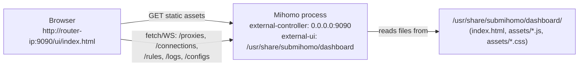
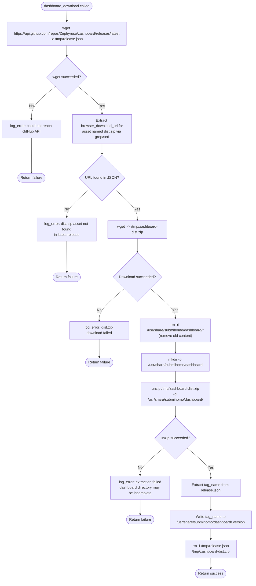
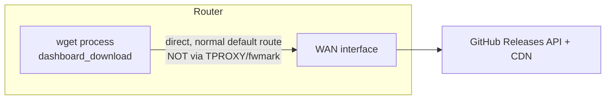
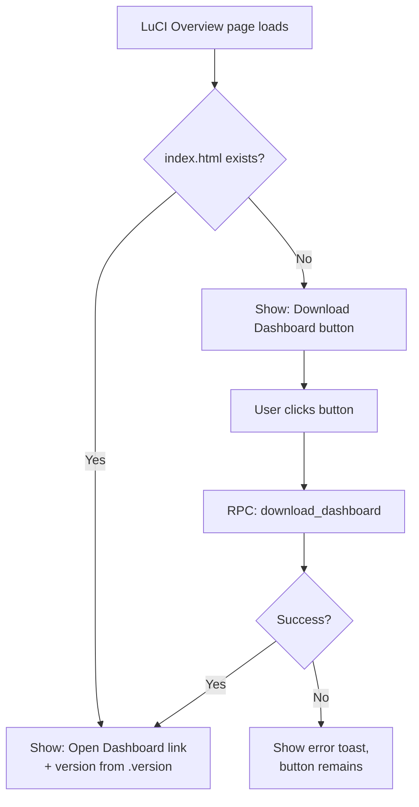
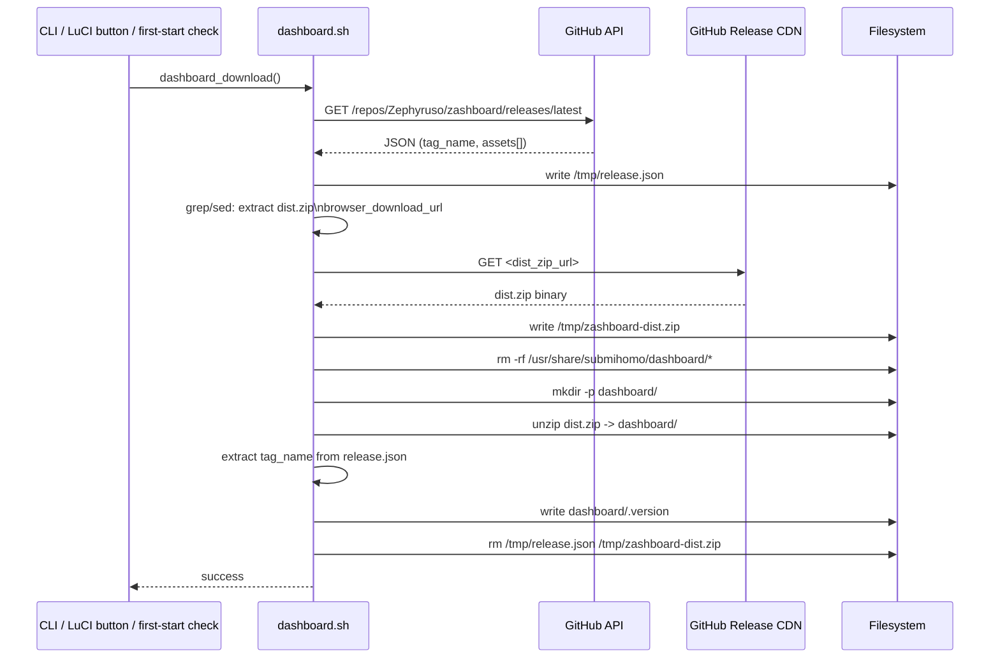
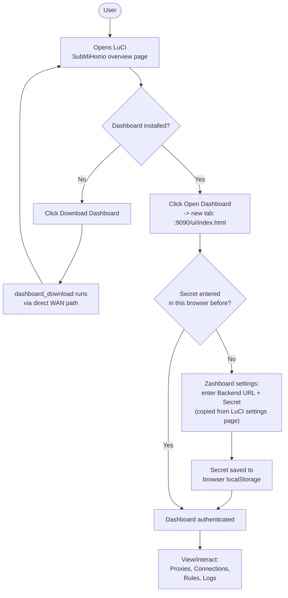

# SubMiHomo — Dashboard (Zashboard) Architecture

## Table of Contents

1. [What Is Zashboard](#1-what-is-zashboard)
2. [Why Zashboard Was Chosen](#2-why-zashboard-was-chosen)
3. [How Zashboard Is Served](#3-how-zashboard-is-served)
4. [Complete Download Flow](#4-complete-download-flow)
5. [Version Tracking](#5-version-tracking)
6. [Dashboard Configuration in Mihomo](#6-dashboard-configuration-in-mihomo)
7. [User Workflow: First Visit to Dashboard](#7-user-workflow-first-visit-to-dashboard)
8. [Auto-Download on First Start](#8-auto-download-on-first-start)
9. [Update Mechanism](#9-update-mechanism)
10. [Network Requirements for Download](#10-network-requirements-for-download)
11. [Security Model](#11-security-model)
12. [What Zashboard Shows](#12-what-zashboard-shows)
13. [Integration with SubMiHomo LuCI](#13-integration-with-submihomo-luci)
14. [Fallback When Dashboard Not Downloaded](#14-fallback-when-dashboard-not-downloaded)
15. [Flash Storage Impact](#15-flash-storage-impact)
16. [Sequence Diagram: Dashboard Download](#16-sequence-diagram-dashboard-download)
17. [Diagram: User Interaction With Dashboard](#17-diagram-user-interaction-with-dashboard)
18. [API Capability Reference](#18-api-capability-reference)
19. [Browser and Device Compatibility](#19-browser-and-device-compatibility)
20. [Troubleshooting the Dashboard](#20-troubleshooting-the-dashboard)

---

## 1. What Is Zashboard

[Zashboard](https://github.com/Zephyruso/zashboard) is an open-source, static, single-page web application that acts as a rich graphical front-end for the Clash/Mihomo **external controller REST API**. It is not a server or backend of any kind — it is a bundle of static HTML/CSS/JavaScript assets that, once loaded in a browser, speaks directly to Mihomo's HTTP API (`/proxies`, `/connections`, `/rules`, `/logs`, `/configs`, etc.) using client-side JavaScript (`fetch`/WebSocket calls originating from the user's browser, not from the router's shell environment).

Because it is purely static, Zashboard requires no runtime on the router beyond a plain HTTP file server capable of serving static assets — a role Mihomo itself already fulfills via its built-in `external-ui` feature (§3). This makes Zashboard an ideal match for a resource-constrained router: there is no Node.js server, no additional daemon, and no extra listening port beyond the one Mihomo already exposes for its API.

Zashboard presents (among other views) the current proxy-group hierarchy with live latency test results, a real-time table of active connections (source, destination, proxy chain used, rule matched, bytes transferred), the effective rule set in evaluation order, and a live/tailable log stream — everything an administrator needs to understand and steer the proxy engine's behavior without touching a config file.

---

## 2. Why Zashboard Was Chosen

Several Clash/Mihomo-compatible dashboards exist. The comparison below reflects the decision criteria for an OpenWrt-embedded deployment specifically, not a general popularity ranking.

| Dashboard | Maintenance status | Asset size | UI framework overhead | Mihomo-specific features | Decision |
|---|---|---|---|---|---|
| **Zashboard** (Zephyruso/zashboard) | Actively maintained, frequent releases, purpose-built for Mihomo/Clash Meta forks | Small, modern Vite/React build, minified | Modern SPA, but ships as static assets — no runtime cost added to the router | First-class support for Mihomo-specific API fields (rule-providers, sub-rules, smart group testing) | **Selected** |
| **Yacd** (haishanh/yacd) | Historically popular, but slower-moving; originally targeted vanilla Clash, not Mihomo's extended API surface | Small | Static assets, similar serving model | Baseline Clash API only; some Mihomo extensions unsupported or only partially reflected | Rejected — feature gap vs. Mihomo's actual capabilities |
| **MetaCubeX dashboard** (metacubex/metacubexd) | Actively maintained, Mihomo-focused | Comparable size | Static assets, similar serving model | Strong Mihomo support, comparable to Zashboard | Viable alternative; Zashboard preferred primarily for its more polished mobile-responsive layout (relevant since router dashboards are frequently checked from a phone on the LAN) and its more actively engaged release cadence with `dist.zip` release assets that are trivially scriptable to fetch (see §4) |
| **Built-in / no dashboard** | N/A | 0 bytes | None | None — API-only, no visual UI | Rejected as the *default* — a proxy router with zero visual feedback is a support and troubleshooting burden; a dashboard is expected UX for this class of product, though the system is designed to degrade gracefully to API-only access if the dashboard is never downloaded (§14) |

The deciding factors, in order of weight: (1) active, ongoing maintenance against current Mihomo API versions — a stale dashboard silently losing feature parity is worse than no dashboard; (2) predictable, scriptable release artifacts (a single `dist.zip` asset per GitHub release, with no build step required on the router); (3) small footprint appropriate for constrained flash storage; (4) a UI polish level suitable for both desktop and mobile browser access from the LAN.

---

## 3. How Zashboard Is Served

Mihomo has a native configuration key, `external-ui`, which — when set to a directory path — turns Mihomo's own external controller HTTP listener into a static file server for that directory, mounted at the `/ui` path prefix, *in addition to* its normal REST API endpoints. SubMiHomo sets:

```yaml
external-ui: /usr/share/submihomo/dashboard
```

This means the **same TCP listener and port** (`9090` by default, configurable via UCI) that serves the JSON REST API also serves the dashboard's static files. There is no separate web server (no `uhttpd`/`nginx` involvement), no separate port to open in the firewall, and no additional process. A browser pointed at `http://<router-ip>:9090/ui/index.html` receives the Zashboard SPA's `index.html`, which then makes same-origin API calls back to `http://<router-ip>:9090/...` to populate its views.



This single-listener design is a direct consequence of Mihomo's own architecture, not a SubMiHomo invention — SubMiHomo's only responsibility is (a) populating that directory with a compatible dashboard build, and (b) pointing `external-ui` at it in the generated config.

---

## 4. Complete Download Flow

The download process is implemented by `dashboard_download()` in `dashboard.sh`, driven entirely from the GitHub Releases API rather than a pinned/vendored version, so that a simple re-run always fetches whatever the upstream project currently considers "latest".



### Notes on each step

- **Step B (release metadata fetch)**: The GitHub Releases API returns a JSON document describing the latest published release, including its tag name and an `assets` array, each asset having a `name` and a `browser_download_url`. No GitHub authentication token is used or required — the public releases API is unauthenticated for read access, though it is subject to GitHub's anonymous rate limits (currently 60 requests/hour per source IP), which is generously sufficient for a manually- or rarely-triggered operation like this.
- **Step D (asset URL extraction)**: Since no JSON parser is available in the shell environment, the asset entry matching `"name": "dist.zip"` is located with `grep`/`sed` text processing (locate the `dist.zip` name field, then scan forward for the next `browser_download_url` field in the same JSON object). This mirrors the same "no parser available, use text tools" philosophy as the subscription section-extraction approach (`SUBSCRIPTIONS.md` §5.1).
- **Step H (clean removal before extraction)**: The old dashboard directory contents are fully removed before extracting the new version, rather than extracting on top of the old files. This avoids a situation where a renamed or removed asset file from an old dashboard version (e.g. `assets/index-a1b2c3.js` from the previous release) lingers alongside the new version's differently-hashed filenames, which would waste flash space indefinitely across repeated updates and could theoretically cause `index.html` to reference stale assets if extraction were interrupted mid-way.
- **Step J (extraction)**: `unzip` writes the archive's contents (typically `index.html`, an `assets/` directory with hashed JS/CSS bundle filenames, and possibly a `favicon` or manifest) directly into the target directory.
- **Step L/M (version stamping)**: The release's `tag_name` (e.g. `v1.9.2`) is persisted to a sentinel file so subsequent checks (manual update, LuCI display) can show the user which version is currently installed without needing to inspect the dashboard's bundled JS.

---

## 5. Version Tracking

A single plain-text file, `/usr/share/submihomo/dashboard/.version`, contains exactly the release's Git tag string (e.g. `v1.9.2`), written immediately after successful extraction. This design is intentionally minimal:

| Property | Design choice | Rationale |
|---|---|---|
| Format | Raw tag string, no JSON/YAML wrapper | Trivial to read (`cat`) and trivial to write (`echo > file`) from shell; no parsing needed anywhere it's consumed |
| Location | Inside the dashboard directory itself, not in `/etc/submihomo/` | The version file describes *that specific directory's contents*; if the directory is ever wiped and never re-populated, there is no stray version file elsewhere falsely claiming a version is installed |
| Update timing | Written only after `unzip` has completed successfully | Guarantees the version file is never present unless extraction actually succeeded — its mere presence is a reliable signal that a real, complete dashboard build exists on disk |
| Consumption | Read by: LuCI overview page (displays "Dashboard vX.Y.Z installed"), `submihomo-ctl` status output, RPC `status` method | A single source of truth avoids version-number drift between what LuCI reports and what's actually deployed |

Because the version file is only written on full success, its absence is also meaningful: `test -f .version` (or, more precisely, the check on `index.html` used by diagnostics — see `DIAGNOSTICS.md` check #10) doubles as a strong signal that the dashboard is either never downloaded or was left in an incomplete state by an interrupted extraction.

---

## 6. Dashboard Configuration in Mihomo

Two Mihomo config keys, both generated by `config.sh` from UCI values, jointly enable the dashboard:

```yaml
external-controller: 0.0.0.0:9090   # from UCI: external_controller_port (default 9090)
secret: "<external_controller_secret>"  # from UCI, empty string if unset
external-ui: /usr/share/submihomo/dashboard   # hardcoded path, not user-configurable
```

- **`external-controller`** is bound to `0.0.0.0` (all interfaces) rather than `127.0.0.1`, specifically so that LAN devices (a laptop or phone browser on the same network) can reach the dashboard and API — a loopback-only binding would make the dashboard inaccessible from anywhere except the router's own shell.
- **`secret`** is the bearer-token credential Zashboard (and any other API client) must present. It is sourced from UCI and is the same value used for the LuCI-triggered hot-reload calls described in `SUBSCRIPTIONS.md` §6.
- **`external-ui`** is intentionally *not* exposed as a UCI-configurable path. The dashboard is always expected at this fixed location, which simplifies both the download flow (§4) and the diagnostics check (`DIAGNOSTICS.md` check #10) — there is exactly one place the dashboard can ever live, with no configuration drift possible.

---

## 7. User Workflow: First Visit to Dashboard

1. The user opens LuCI, navigates to the SubMiHomo overview page, and clicks the "Open Dashboard" link (§13), which opens `http://<router-ip>:9090/ui/index.html` in a new browser tab.
2. Zashboard loads and, on first visit, has no way to know the router's `external_controller_secret` — the secret lives only in SubMiHomo's UCI config and is never automatically injected into the dashboard's JavaScript context (this would require server-side templating of the static files, which SubMiHomo deliberately avoids in favor of shipping the upstream `dist.zip` unmodified — see §11).
3. Zashboard's own settings UI prompts the user to enter a **Backend URL** (typically pre-fillable as the same origin, `http://<router-ip>:9090`) and an **API secret**.
4. The user copies the secret value from the LuCI SubMiHomo settings page (where it is displayed, since the LuCI admin session is already authenticated at the router level) and pastes it into Zashboard's settings form.
5. Zashboard stores this secret in the browser's `localStorage`, scoped to the dashboard's own origin, and uses it as a `Bearer` token on all subsequent API calls for that browser/profile.
6. From this point on, revisiting the dashboard from the *same browser* does not require re-entering the secret — it persists in `localStorage` until cleared by the user or the browser's storage is wiped.

This is a one-time, per-browser setup step; it is not required again unless the user switches browsers/devices, clears site data, or the router's secret is changed in UCI.

---

## 8. Auto-Download on First Start

On the very first service start, `/usr/share/submihomo/dashboard/` does not yet exist (or exists but is empty). The init flow checks for this condition and, if true, triggers `dashboard_download()` automatically — the user should not be required to know a manual CLI step exists just to get a working dashboard on a fresh install.

**Condition checked**: directory is missing entirely, or exists but contains no `index.html` (the same file existence check used by diagnostics check #10 — see `DIAGNOSTICS.md`). This is deliberately more robust than merely checking "does the directory exist", since an empty directory could exist from a prior failed extraction attempt.

**Timing**: this auto-download is deferred until *after* Mihomo itself has started (see §10 for why), so first boot is not blocked waiting on an external network call to GitHub — the proxy engine and routing become functional first, with the dashboard populating shortly after in the background.

**Error handling on first-start auto-download failure**: if the GitHub API or `dist.zip` fetch fails (no internet yet, GitHub rate-limited, DNS not yet resolving), the failure is logged (`log_warn`, not `log_error`, since a missing dashboard is a UX inconvenience, not a functional break) and the service continues operating normally. The dashboard directory simply remains absent, and:
- Diagnostics check #10 will report `fail` ("Dashboard files: index.html not found").
- LuCI's overview page shows a "Download Dashboard" button in place of the "Open Dashboard" link (§14).
- No retry loop is scheduled automatically — the user (or a future service restart, since the "directory empty" condition still holds) can retry via the button or CLI.

---

## 9. Update Mechanism

There is no automatic/scheduled dashboard update (unlike subscriptions, which have a cron-driven interval). Updating the dashboard is always an explicit, user-initiated action, available through two equivalent entry points:

| Trigger | Command / call | Typical use case |
|---|---|---|
| CLI | `submihomo-ctl dashboard` | SSH-based administration, scripting, first manual install if auto-download failed |
| LuCI button | RPC method `download_dashboard` | Point-and-click update from the web UI, e.g. after seeing a new Zashboard release announced upstream |

Both entry points invoke the exact same `dashboard_download()` function described in §4 — there is no divergent "update" vs. "install" code path, since the flow already fully removes old content before extracting new content (§4, step H), making install and update the same operation.

Because dashboard updates are infrequent (Zashboard's own release cadence, not something tied to the router's operational health) and non-critical to core proxy functionality, requiring an explicit trigger (rather than, say, checking for updates on every service start) avoids unnecessary GitHub API calls and keeps the router's outbound network chatter predictable and minimal.

---

## 10. Network Requirements for Download

The dashboard download **must occur via the router's direct WAN path, never through the Mihomo proxy tunnel itself**, for a chain of practical reasons:

1. `dist.zip` is hosted on GitHub's release CDN, a destination with no connection to the user's proxy subscription — there is no functional reason to route this traffic through Mihomo at all.
2. More importantly, **routing the dashboard download through Mihomo creates a bootstrapping problem**: if the dashboard (or the proxy configuration in general) is broken or not yet started, the download would depend on the very system it's trying to help the user manage/diagnose. By using the router's normal direct WAN connectivity (the same path used for the subscription's own Level-1 HTTPS download, and the same path DHCP/NTP/etc. already use), the dashboard can be fetched successfully even in degraded proxy states.
3. This is why, per §8, the auto-download trigger happens **after Mihomo has started** — not because the download needs Mihomo, but because service startup ordering places dashboard population as a lower-priority, best-effort background step relative to bringing up the actual proxy/routing functionality first. The download itself uses `wget` directly against the router's normal default route, entirely independent of whatever TPROXY/fwmark rules Mihomo has installed for LAN client traffic (those rules apply to marked/redirected traffic, not to the router's own locally-originated `wget` processes, consistent with the routing architecture in `ARCHITECTURE.md` §8).



---

## 11. Security Model

- **Bearer-token authentication, not user/password.** Zashboard authenticates to the Mihomo API exclusively via the `Authorization: Bearer <secret>` header, matching Mihomo's own native auth model — there is no separate Zashboard-specific account system, session cookie, or login database anywhere in this stack.
- **Client-side secret storage.** The secret is stored only in the browser's `localStorage`, scoped to the dashboard's own origin (`http://<router-ip>:9090`). It is never transmitted to, or stored by, any third party — Zashboard is a fully static, client-only application with no telemetry or external calls beyond the Mihomo API it's configured to point at.
- **What the secret grants access to.** Once authenticated, the bearer token grants full control over the running Mihomo instance's API surface: switching proxy-group selections, triggering latency tests, viewing all active connections (including destination hosts/ports — a privacy-relevant capability on a household router), closing individual connections, tailing live logs, and reloading configuration (the same `PUT /configs` endpoint used by the subscription hot-reload flow). This is a meaningfully privileged capability, equivalent to direct control of the proxy engine.
- **No secret configured.** If `external_controller_secret` is left empty in UCI, Mihomo's API (and therefore the dashboard) is accessible to **any device on the LAN with no authentication at all**. SubMiHomo does not block this configuration (some users run trusted, single-occupant LANs where this is an acceptable trade-off for convenience), but LuCI surfaces a persistent warning banner when the secret is empty, making the risk visible rather than silent.
- **Transport is plain HTTP, not HTTPS.** The external controller is served over unencrypted HTTP on the LAN. This is consistent with the vast majority of Clash/Mihomo dashboard deployments (LAN-only exposure, not WAN-facing) and is an accepted trade-off given the complexity TLS termination would add to an embedded router service (self-signed certificate management, browser trust warnings). Administrators requiring encrypted access are expected to restrict the port to trusted LAN segments/VLANs via their own firewall policy — SubMiHomo's nftables rules do not currently open the controller port to WAN, but this is a hardening layer, not a substitute for a real secret.

---

## 12. What Zashboard Shows

| View | Data source (Mihomo API) | Content |
|---|---|---|
| Proxies / Groups | `GET /proxies` | Full proxy-group hierarchy (including SubMiHomo's synthetic `PROXY` selector, see `SUBSCRIPTIONS.md` §5.3), current selection per group, live delay/latency test results per node, ability to switch selections interactively |
| Connections | `GET /connections` (and its WebSocket streaming variant) | Live table of every active connection: source LAN IP, destination host/IP, destination port, matched rule, proxy chain used, upload/download byte counters, connection duration; supports closing individual connections |
| Rules | `GET /rules` | The complete, effective rule list in evaluation order exactly as Mihomo loaded it — including SubMiHomo's injected bypass rules and `bypass_china` GEOIP rule (`SUBSCRIPTIONS.md` §5.2) interleaved with the subscription's own rules, so the administrator can see precisely why a given connection was routed the way it was |
| Logs | `GET /logs` (WebSocket streaming) | Live tail of Mihomo's own internal log stream (proxy selection decisions, connection lifecycle events, DNS resolution events) — a separate stream from the OpenWrt syslog described in `LOGGING.md`, though both ultimately originate from the same Mihomo process |
| Config / Overview | `GET /configs`, `GET /version` | Current general settings snapshot (mode, ports, DNS mode) and the running Mihomo core version string |

---

## 13. Integration with SubMiHomo LuCI

The SubMiHomo LuCI overview page includes a direct link (opened in a new browser tab, not an embedded iframe — dashboards of this kind are designed as full-page apps and iframe embedding would complicate the same-origin API calls Zashboard makes) labeled "Open Dashboard", pointing to `http://<router-ip>:9090/ui/index.html`. The router IP used is derived from whichever address/hostname the LuCI session itself is currently being accessed through, so the link works correctly whether the administrator reached LuCI via LAN IP, a custom hostname, or a non-default HTTP(S) port on LuCI's own listener (the dashboard's own port, `9090`, is independent of whatever port LuCI itself uses).

Adjacent to this link, the overview page also displays:
- The currently installed dashboard version (read from `.version`, §5), or "Not installed" if absent.
- A warning badge if `external_controller_secret` is empty (§11).
- The "Download Dashboard" / "Update Dashboard" button (context-sensitive per §14), which invokes RPC method `download_dashboard`.

---

## 14. Fallback When Dashboard Not Downloaded

If `/usr/share/submihomo/dashboard/index.html` does not exist (fresh install where auto-download hasn't run yet, auto-download failed, or the directory was manually cleared), LuCI's overview page detects this (the same file-existence condition used by diagnostics check #10) and substitutes the "Open Dashboard" link with a **"Download Dashboard"** button in the exact same UI position. Clicking it invokes the `download_dashboard` RPC method synchronously (blocking the button with a loading indicator, since the GitHub API + `dist.zip` fetch typically completes within a few seconds on a healthy WAN connection) and, on success, the page refreshes that section to show the normal "Open Dashboard" link with the newly-populated version string.

This ensures there is never a broken or dead link presented to the user — the overview page's dashboard section always offers an action that is guaranteed to work given the current on-disk state (either "go look at it" or "go get it").



---

## 15. Flash Storage Impact

Zashboard's release `dist.zip` unpacks to a modest static-asset footprint — typically in the **1–3MB** range for a modern minified Vite/React SPA build (an `index.html`, a handful of hashed JS bundle chunks, one or two CSS files, and possibly a small set of icon/font assets). This is a meaningful but acceptable consumer of flash on a router where total available overlay space is itself constrained (`ARCHITECTURE.md` §12.2).

Because the download flow always removes prior content before extracting a new version (§4, step H), the dashboard's flash footprint never grows unbounded across repeated updates — it is always approximately one release's worth of static assets, never an accumulation of historical versions. No dashboard version history or rollback capability is provided (unlike subscriptions' single-generation backup), since re-downloading any specific historical Zashboard release is trivially possible directly from GitHub if ever needed, and the dashboard itself holds no user data or state that would be lost by simply re-fetching latest.

---

## 16. Sequence Diagram: Dashboard Download



---

## 17. Diagram: User Interaction With Dashboard



---

## 18. API Capability Reference

The table below enumerates the principal Mihomo external-controller endpoints Zashboard relies on, giving a concrete picture of exactly what capability the `secret` bearer token in §11 gates. This is not an exhaustive Mihomo API reference — it lists only the calls Zashboard's UI surfaces trigger in normal use.

| Endpoint | Method | Zashboard feature | Effect |
|---|---|---|---|
| `/proxies` | GET | Proxies view | Lists all proxy-groups and members, including current selection and cached delay results |
| `/proxies/{name}` | PUT | Clicking a node in a `select` group | Switches the active member of that proxy-group |
| `/proxies/{name}/delay` | GET | "Test latency" button (single or group) | Triggers an active URL-test against the specified proxy/group and returns round-trip time |
| `/connections` | GET / WebSocket | Connections view | Streams the live table of active/recent connections |
| `/connections/{id}` | DELETE | "Close" button on a connection row | Terminates that specific connection |
| `/connections` | DELETE | "Close all" button | Terminates every active connection |
| `/rules` | GET | Rules view | Returns the full effective rule list in evaluation order |
| `/logs` | GET (WebSocket) | Logs view | Streams Mihomo's internal log lines live |
| `/configs` | GET | Overview/config panel | Returns current general settings snapshot |
| `/configs` | PUT | (Not exposed in Zashboard's default UI, but available to any authenticated caller) | Hot-reloads configuration from a given path — the same mechanism SubMiHomo itself uses after a subscription update (`SUBSCRIPTIONS.md` §6) |
| `/version` | GET | Footer/about display | Returns the running Mihomo core version string |

Every one of these endpoints requires the same `Authorization: Bearer <secret>` header when a secret is configured; there is no per-endpoint granularity in Mihomo's own auth model — a client holding the secret has full access to all of the above, including destructive actions like closing arbitrary connections or triggering a config reload. This all-or-nothing authorization scope is the primary reason §11 treats the secret as equivalent in sensitivity to a full administrative credential, not a mere "view-only" token.

---

## 19. Browser and Device Compatibility

Because Zashboard is a modern static SPA build (typically targeting current evergreen browsers via Vite/React tooling), it is expected to function correctly in any recent version of Chrome, Firefox, Safari, or Chromium-based mobile browsers. Two practical considerations follow from this on a router-hosted deployment:

- **No transpilation/polyfill layer is added by SubMiHomo.** The `dist.zip` asset is extracted and served completely unmodified (§4); SubMiHomo does not patch, minify further, or inject compatibility shims. If a future Zashboard release drops support for an older browser engine, that is an upstream compatibility decision inherited as-is — pinning to an older Zashboard release (by manually fetching a specific historical `dist.zip` from GitHub and extracting it into `/usr/share/submihomo/dashboard/`, outside of the normal `dashboard_download()` flow) is the available workaround for a user needing continued support for a legacy browser.
- **Mobile-responsive layout was one of the deciding factors in §2.** Since routers are frequently checked from a phone while away from a primary desktop, Zashboard's layout adapting cleanly to small viewports (collapsible navigation, touch-friendly latency-test buttons, a connections table that reflows into a card layout on narrow screens) was weighted meaningfully in the dashboard selection decision, over and above the technical API-compatibility factors already discussed.
- **The dashboard's origin is plain HTTP, not HTTPS** (§11), which some mobile browsers treat more cautiously than desktop counterparts for certain storage or clipboard APIs. In practice, Zashboard's core functionality (viewing/switching proxies, viewing connections and logs) does not depend on any HTTPS-gated browser API, so this has not been observed to materially affect functionality — only the browser's own "not secure" address-bar indicator, which is expected and unavoidable for a LAN-only plain-HTTP admin surface.

---

## 20. Troubleshooting the Dashboard

| Symptom | Likely cause | Resolution |
|---|---|---|
| "Open Dashboard" link shows a blank page or browser connection error | Mihomo process is not running, or `external-controller` failed to bind (see `DIAGNOSTICS.md` checks #1 and #4) | Confirm Mihomo is running; run diagnostics; restart the service |
| Dashboard loads, but every panel shows an authentication error / 401 | Secret entered in Zashboard's settings does not match the router's current `external_controller_secret` | Re-copy the current secret from LuCI settings into Zashboard's settings panel |
| Dashboard loads with no data and no error, panels stay empty | Secret field was left blank while UCI has a non-empty secret configured, so every API call is silently rejected without a clear UI error in some Zashboard versions | Enter the secret in Zashboard's settings (§7) |
| "Download Dashboard" button fails immediately | No WAN connectivity at the time of the click, or GitHub API rate-limiting from the router's WAN IP | Retry after confirming general internet connectivity (`DIAGNOSTICS.md` check #12); wait before retrying if rate-limited |
| Dashboard shows an old version after clicking update | Browser served a cached copy of `index.html`/JS bundle from before the update | Hard-refresh the browser tab (bypass cache) after a dashboard update |
| Version shown in LuCI doesn't match what Zashboard's own UI reports | `.version` file is stale relative to actual directory contents (e.g. manually replaced files without going through `dashboard_download()`) | Re-run `submihomo-ctl dashboard` to bring both back into sync |

---

### Summary

Zashboard's integration is deliberately shallow and non-invasive: SubMiHomo's only responsibilities are fetching an unmodified upstream release artifact, placing it at a fixed path, and pointing Mihomo's own `external-ui` feature at that path. All authentication, state, and interactivity live entirely client-side in the user's browser, and all administrative capability flows through Mihomo's existing, already-secured REST API — SubMiHomo introduces no new attack surface, no new daemon, and no new listening port to support the dashboard.
