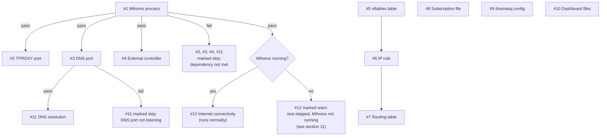
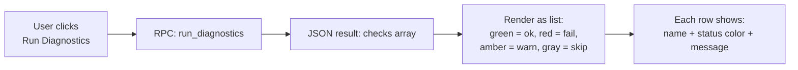
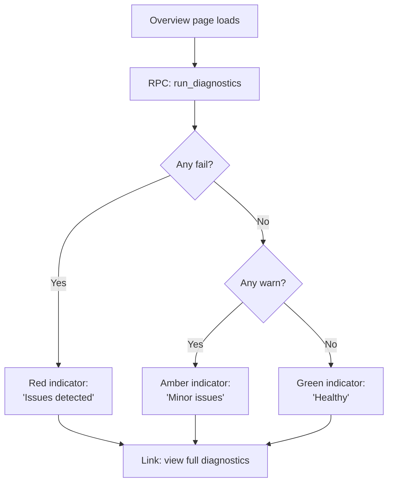
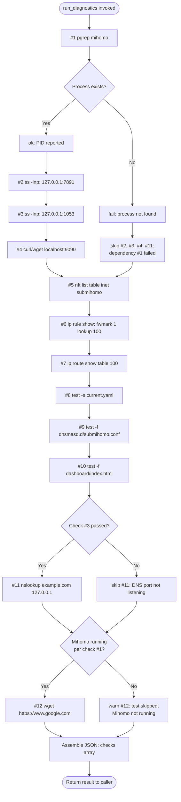

# SubMiHomo — Diagnostics Architecture

## Table of Contents

1. [Diagnostic System Purpose and Design Philosophy](#1-diagnostic-system-purpose-and-design-philosophy)
2. [Complete Check Catalog](#2-complete-check-catalog)
3. [Check Dependency Relationships](#3-check-dependency-relationships)
4. [Diagnostic Result Data Structure](#4-diagnostic-result-data-structure)
5. [How Diagnostics Are Triggered](#5-how-diagnostics-are-triggered)
6. [How LuCI Displays Diagnostic Results](#6-how-luci-displays-diagnostic-results)
7. [Recovery Suggestions](#7-recovery-suggestions)
8. [Automated Recovery](#8-automated-recovery)
9. [Self-Test on Service Start](#9-self-test-on-service-start)
10. [Connectivity Test Design](#10-connectivity-test-design)
11. [False Positive Prevention](#11-false-positive-prevention)
12. [Integration with the Overview Page](#12-integration-with-the-overview-page)
13. [Diagnostic Check Sequence Flowchart](#13-diagnostic-check-sequence-flowchart)
14. [Error → Cause → Resolution Table](#14-error--cause--resolution-table)

---

## 1. Diagnostic System Purpose and Design Philosophy

The diagnostics subsystem exists to answer a single, recurring support question as quickly and precisely as possible: **"why isn't my proxy working?"** — without requiring the user to understand SubMiHomo's internal architecture (TPROXY, fwmark routing, nftables, dnsmasq integration, the Mihomo API) well enough to check each layer manually.

Rather than a single opaque "is it working: yes/no" indicator, diagnostics is designed as a **layered check catalog** that walks the exact same dependency chain the system itself relies on to function — from "does the process exist" up through "can it actually resolve a real-world domain and reach the internet" — so that when something is broken, the *first* failing check in the sequence points directly at the layer responsible, rather than leaving the user to guess among a dozen possible causes behind a single red "broken" light.

Three design principles govern every check in the catalog:

1. **Report, never repair.** Diagnostics is strictly read-only/observational. It never modifies configuration, restarts services, or attempts to fix anything it finds wrong (§8 explains this in detail). Its sole output is a structured, human-readable status report.
2. **Fail informatively, not just fail.** Every check's `message` field is written to be actionable on its own — "Port 7891 not listening" rather than merely "FAIL" — so the result can be understood without cross-referencing this document, though §14 provides deeper cause/resolution mappings for less-obvious failures.
3. **Respect dependency ordering.** A check whose prerequisite has already failed is marked `skip` rather than `fail`, avoiding a wall of misleading red failures that are all really just downstream symptoms of one root cause (§3, §11).

---

## 2. Complete Check Catalog

The following twelve checks are executed, in order, by `run_diagnostics()` (an RPC-exposed method). The order is significant — see §3 for how ordering encodes dependency relationships.

| # | Name | Method | Success Condition |
|---|---|---|---|
| 1 | Mihomo process | `pgrep mihomo` | A matching process exists |
| 2 | TPROXY port | `ss -lnp` (or `netstat` fallback) | `127.0.0.1:7891` is in `LISTEN` state |
| 3 | DNS port | `ss -lnp` | `127.0.0.1:1053` is in `LISTEN` state |
| 4 | External controller | `curl`/`wget` against `localhost:9090` | HTTP response code is `200` or `401` |
| 5 | nftables table | `nft list table inet submihomo` | The table exists (command succeeds, non-empty output) |
| 6 | IP rule | `ip rule show` | A rule matching `fwmark 1 lookup 100` is present |
| 7 | Routing table | `ip route show table 100` | A route matching `local default dev lo` is present |
| 8 | Subscription file | `test -s /etc/submihomo/subscriptions/current.yaml` | File exists and is non-empty |
| 9 | dnsmasq config | `test -f /etc/dnsmasq.d/submihomo.conf` | File exists |
| 10 | Dashboard files | `test -f /usr/share/submihomo/dashboard/index.html` | File exists |
| 11 | DNS resolution | `nslookup example.com 127.0.0.1` | Returns a resolvable IP address |
| 12 | Internet connectivity | `wget -q -O /dev/null https://www.google.com` | Command succeeds (non-zero exit is handled gracefully, not treated as a hard failure — see §10) |

### Per-check rationale

- **#1 Mihomo process** is the foundational check — nearly every other check (2, 3, 4, 11) is only meaningful if the process is actually running, so this check's outcome directly gates whether several later checks are even attempted (§3).
- **#2 TPROXY port / #3 DNS port** verify that Mihomo, having started, actually succeeded in binding its two most functionally critical listeners. A process that exists (#1 passes) but failed to bind a port (misconfigured `bind-address`, port already in use by another process) would otherwise look "running" while being completely non-functional for traffic interception.
- **#4 External controller** confirms the management/API plane (used by both the dashboard and the hot-reload mechanism) is reachable, independent of whether the proxy *data* plane (checks 2/3) is working — a router could have a broken TPROXY listener while the API still responds, or vice versa, so these are checked independently rather than assumed to succeed/fail together.
- **#5 nftables table / #6 IP rule / #7 Routing table** verify the three layers of the kernel-level traffic redirection mechanism described in `ARCHITECTURE.md` §8 are all present: the nftables table that marks/redirects packets, the policy routing rule that sends marked packets to a custom table, and that custom table's own route back to the TPROXY listener on loopback. These three are checked as a strict chain (§3) since each layer is meaningless without the one before it.
- **#8 Subscription file** is a pure filesystem existence/non-emptiness check, distinguishing "no subscription configured, functioning as designed" (`SUBSCRIPTIONS.md` §8) from an unexpected/corrupted state — it does not re-validate the file's YAML content or re-run `mihomo -t` (that would duplicate the subscription system's own validation pipeline and is unnecessarily expensive for a routine health check).
- **#9 dnsmasq config** confirms SubMiHomo's DNS-forwarding integration file is present in `/etc/dnsmasq.d/`, without which dnsmasq would not know to forward relevant queries to Mihomo's DNS listener.
- **#10 Dashboard files** is the exact same existence check used by the dashboard subsystem itself (`DASHBOARD.md` §5) to decide whether to show "Open Dashboard" vs. "Download Dashboard" in LuCI — diagnostics and the dashboard UI logic deliberately share this one condition so they can never disagree with each other.
- **#11 DNS resolution** is an end-to-end functional test of the DNS listener validated structurally by check #3 — a listening port does not guarantee it answers queries correctly (e.g. upstream DNS servers configured in Mihomo's `nameserver` list could all be unreachable).
- **#12 Internet connectivity** is the final, most holistic check: it doesn't care *how* traffic reaches the internet (direct or proxied), only that it does — confirming the end-to-end user experience ("can this router reach the internet at all right now") independent of every internal mechanism checked above it.

---

## 3. Check Dependency Relationships

Several checks are only meaningful — or only safe to run without producing a misleading result — if an earlier check has already passed. Diagnostics encodes this as an explicit dependency chain rather than running all twelve checks unconditionally and independently.



Key dependency rules:

| Dependent check | Depends on | If dependency fails |
|---|---|---|
| #2 TPROXY port, #3 DNS port, #4 External controller | #1 Mihomo process | Marked `skip` — a port cannot be meaningfully "not listening due to misconfiguration" if the process producing it doesn't exist at all; reporting `fail` here would be redundant with #1's own failure and could mislead the user into debugging port binding when the real issue is the process not starting |
| #6 IP rule | #5 nftables table | Still run independently, but a failure here is *more likely* attributable to the same root cause as #5 (e.g. the firewall setup script never ran) — checks 5/6/7 are reported individually since they are also independently useful (e.g. an admin who manually altered `ip rule` outside of SubMiHomo would want to see exactly which layer diverged) |
| #7 Routing table | #6 IP rule | Same reasoning as above |
| #11 DNS resolution | #3 DNS port | Marked `skip` if #3 fails — attempting an `nslookup` against a port that isn't even listening would simply produce a generic connection-refused failure that adds no diagnostic value beyond what #3 already reported |
| #12 Internet connectivity | #1 Mihomo process (loosely) | Marked `warn`, not `skip` or `fail`, when Mihomo isn't running — connectivity may still work via the router's normal direct routing even without Mihomo active (see §11), so this is inconclusive rather than a hard dependency failure |

Checks #5, #6, #7, #8, #9, #10 have **no dependency on check #1** (Mihomo process) — they inspect firewall/routing state, filesystem artifacts, and static configuration that can legitimately exist (or fail to exist) independent of whether the Mihomo process happens to be running at the exact moment diagnostics is run. This is intentional: a router with Mihomo temporarily stopped for maintenance should still be able to confirm "yes, the firewall rules and subscription file are correctly in place, ready for when the service starts again."

---

## 4. Diagnostic Result Data Structure

`run_diagnostics()` returns a single JSON object with one top-level key, `checks`, containing an ordered array matching the exact sequence in §2. Each array element is an object with exactly three fields:

```json
{
  "checks": [
    {
      "name": "Mihomo process",
      "status": "ok",
      "message": "PID 1234"
    },
    {
      "name": "TPROXY port",
      "status": "fail",
      "message": "Port 7891 not listening"
    },
    {
      "name": "Internet connectivity",
      "status": "warn",
      "message": "Test skipped (Mihomo not running)"
    }
  ]
}
```

### Field schema

| Field | Type | Description |
|---|---|---|
| `name` | string | Human-readable check name, exactly matching the `Name` column in §2's catalog table — stable across releases so LuCI/scripts can match on it reliably |
| `status` | string enum | One of `ok`, `fail`, `warn`, `skip` (§4.1) |
| `message` | string | A single-line, human-readable detail string. For `ok`, typically confirms the specific observed value (e.g. a PID, a port number). For `fail`/`warn`/`skip`, always states *why*, never just restates the status word |

### 4.1 Status value semantics

| Status | Meaning |
|---|---|
| `ok` | The check's success condition was fully met; this layer is functioning correctly |
| `fail` | The check's success condition was not met, and the check had all of its own dependencies satisfied — this is a genuine, actionable problem at this specific layer |
| `warn` | The check could not conclusively determine pass/fail, or found a non-critical issue not expected to break core functionality (e.g. a check whose result is ambiguous depending on conditions outside SubMiHomo's control) |
| `skip` | The check was not run at all because a prerequisite check (per §3) had already failed — running it would produce a redundant or misleading result |

The array's ordering is itself diagnostically meaningful: when scanning results top to bottom, the **first non-`ok` entry** is, by construction of the dependency chain in §3, the most likely root cause — everything reported as `skip` beneath it is a *consequence*, not an independent problem to chase separately.

---

## 5. How Diagnostics Are Triggered

| Trigger | Interface | Typical caller |
|---|---|---|
| RPC method `run_diagnostics` | ubus / rpcd, exposed to the `luci-user` ACL role (read-only, matching the non-destructive nature of the checks — `ARCHITECTURE.md` §11.3) | LuCI's Diagnostics page, "Run Diagnostics" button |
| CLI | `submihomo-ctl diagnose` (invokes the identical underlying check routine, printing the same structured result in a readable text form to the terminal) | SSH-based troubleshooting, scripting, support requests where a user is asked to paste diagnostic output |

Both entry points execute the exact same twelve-check routine with identical logic — there is no separate "quick check" vs. "full check" mode. This guarantees a user following remote troubleshooting instructions (e.g. "run diagnostics and tell me what check #2 says") gets identical results regardless of whether they used the LuCI button or the CLI.

Diagnostics is **on-demand only** — it is never run automatically on a schedule (unlike subscription updates, `SUBSCRIPTIONS.md` §9). Continuous/background diagnostic polling was considered and rejected: the checks include a live network connectivity test (#12) and an active DNS lookup (#11), and running these unconditionally on a timer would generate unnecessary background network traffic and log noise for a check whose value is almost always tied to an active troubleshooting session, not passive monitoring. The one exception is the subset run automatically at service start (§9), which is deliberately narrower.

---

## 6. How LuCI Displays Diagnostic Results

The LuCI Diagnostics page renders the twelve checks as an ordered list (or table), each row showing:

- The check `name`, exactly as returned.
- A colored status indicator: green for `ok`, red for `fail`, yellow/amber for `warn`, gray for `skip`.
- The `message` text, always visible (not hidden behind a hover tooltip), since the message is often the single most useful piece of information for the user to copy into a support request.



Rows are rendered in the exact order returned by the RPC (matching §2's catalog order), preserving the dependency-chain readability described in §4 — a user scanning top-to-bottom naturally encounters the root-cause check before its downstream `skip` consequences. The page does not reorder, group, or collapse rows by status, since the ordering itself is part of the diagnostic signal.

Additionally, LuCI surfaces a single aggregate summary above the detailed list — a simple count such as "10 OK · 1 Warning · 1 Failed" — giving an at-a-glance health signal before the user reads into specifics (see also §12 for the overview-page-level summary, which is an even more condensed version of this same signal).

---

## 7. Recovery Suggestions

Diagnostics itself does not embed recovery instructions inside the RPC response (the `message` field states *what* was observed, not *what to do about it* — keeping the data structure a pure, stable report rather than a UI-authoring surface that would need to change independently of the check logic). Recovery guidance is instead provided as static, per-check documentation in LuCI (rendered as help text/tooltips alongside each check row) and in this document (§14's table). The mapping below summarizes what each `fail`/`warn` result should prompt the user to try:

| Check | If failing, try |
|---|---|
| #1 Mihomo process | Check `logread -e submihomo` for a startup error; attempt `submihomo restart`; verify the generated config at `/var/run/submihomo/config.yaml` is not corrupted |
| #2 TPROXY port | Confirm no other process is already bound to port 7891; check Mihomo's own log output (`submihomo.mihomo` tag) for a bind error |
| #3 DNS port | Same as above, for port 1053; confirm UCI DNS settings weren't set to a conflicting port |
| #4 External controller | Confirm `external_controller_port` in UCI; check that the process is fully initialized (not still starting up) |
| #5 nftables table | Re-run the firewall setup step (`submihomo restart` re-applies nftables rules); check for a conflicting manual `nft` ruleset that removed the table |
| #6 IP rule | Verify no other package/script is flushing `ip rule` entries; restart the service to reapply |
| #7 Routing table | Same as #6 — usually resolved by restart once #5/#6 are confirmed healthy |
| #8 Subscription file | Configure a `subscription_url` and trigger an update, or restore from backup via `submihomo-ctl restore` if the file was unexpectedly emptied |
| #9 dnsmasq config | Restart the service to regenerate the file; check `/etc/dnsmasq.d/` write permissions |
| #10 Dashboard files | Click "Download Dashboard" in LuCI, or run `submihomo-ctl dashboard` |
| #11 DNS resolution | Check Mihomo's configured upstream `nameserver` list is reachable; confirm check #3 passes first |
| #12 Internet connectivity | Check WAN link status outside of SubMiHomo entirely (this may indicate a router-wide connectivity issue, not a SubMiHomo-specific one) |

---

## 8. Automated Recovery

**Diagnostics performs no automated recovery of any kind.** Every check is strictly observational: none of the twelve checks, upon detecting a `fail` condition, take any corrective action (no automatic service restart, no automatic firewall rule reapplication, no automatic subscription rollback). This is a firm design boundary, not an incompleteness to be filled in later, for the following reasons:

1. **Diagnostics must be trustworthy as an observation tool.** If running diagnostics could itself change system state (e.g. "checking the nftables table triggers a silent re-application of firewall rules if missing"), a user could never be certain whether a subsequent "all green" result reflects the system's actual steady state or an artifact of the diagnostic run having just repaired something. Keeping checks side-effect-free preserves diagnostics' core value: an honest snapshot of current state.
2. **Auto-repair actions are already available as explicit, separate operations.** A user (or LuCI) who sees `#1 Mihomo process: fail` has an obvious, deliberate next action already available — the `restart` RPC/CLI command described in `ARCHITECTURE.md`. Diagnostics' job is to make it obvious *which* explicit action is warranted, not to take it on the user's behalf.
3. **Consistent with the subscription rollback philosophy.** Exactly as `SUBSCRIPTIONS.md` §7 argues against automatic subscription rollback, automated "fixing" in response to a failed check risks masking the actual root cause (e.g. auto-restarting Mihomo repeatedly in response to a persistently failing check #1 without surfacing *why* it keeps failing) and introduces implicit, hard-to-audit router behavior that this project's design philosophy avoids.

---

## 9. Self-Test on Service Start

A **subset** of the full catalog — specifically the checks that validate static configuration artifacts rather than runtime process state — is run automatically once, early in the init script's start sequence, *before* the Mihomo process itself is launched:

| Pre-start self-test | Corresponds to catalog check | Purpose at this stage |
|---|---|---|
| Subscription file existence/non-emptiness | #8 | Confirms whether config generation should expect real subscription data or should fall back to the empty-proxies first-run config (`SUBSCRIPTIONS.md` §8) |
| dnsmasq config file presence (post-generation) | #9 | Confirms the DNS integration file was successfully written before dnsmasq is reloaded to pick it up |
| Generated config file validity (equivalent to `mihomo -t`) | (not a catalog check itself, but the same validation primitive used in `SUBSCRIPTIONS.md` §4 Level 3) | Prevents launching Mihomo with a config known in advance to be unparsable, which would otherwise manifest later as catalog check #1 failing with a cryptic process-not-found result |

The full runtime-dependent checks (#1–#4, #6, #7, #11, #12) are **not** part of this pre-start self-test, for the obvious reason that they test conditions (a running process, bound ports, active routing marks) that cannot yet be true before the process has even been started — running them at this point would trivially and uninformatively report `fail` or `skip` for every single one, providing no diagnostic value.

This pre-start self-test is purely a **startup safety gate**: if the generated config fails its own validity check, the init script logs a specific `log_error` (per `LOGGING.md` conventions) and aborts the start sequence rather than launching Mihomo against a config known to be broken and then relying on catalog check #1 to eventually reveal the failure after the fact. It is not exposed via the `run_diagnostics` RPC method as a distinct set of results — it is an internal startup precondition, whereas `run_diagnostics` is the full, on-demand, twelve-check post-startup report described throughout this document.

```mermaid
flowchart TD
    A([init script: start]) --> B[Check: subscription file\nexists and non-empty?]
    B --> C[Generate config.yaml\nfrom UCI + subscription\nor empty-proxies fallback]
    C --> D[Check: dnsmasq config\nfile written successfully?]
    D --> E[Validate generated config\n(mihomo -t equivalent)]
    E --> F{Valid?}
    F -- No --> G[log_error, abort start]
    F -- Yes --> H[Launch Mihomo process\nvia procd]
    H --> I([Start sequence complete\nfull run_diagnostics now meaningful])
```

---

## 10. Connectivity Test Design

Check #12 is deliberately the least strict check in the entire catalog, both in the URL chosen and in how its failure is interpreted.

- **Target URL**: `https://www.google.com`, fetched via `wget -q -O /dev/null https://www.google.com`. This target is chosen for its extremely high availability and near-universal reachability across regions and network conditions, minimizing the chance that the *target itself* is the reason for a failure (as opposed to the router's own connectivity) — although administrators in specific network environments where this particular domain is unreliable should interpret a failure here in that context.
- **Timeout**: uses `wget`'s own reasonable default connection timeout behavior (no extended custom timeout is configured for this check specifically); the intent is a quick, bounded probe, not a patient retry loop — diagnostics as a whole should complete promptly since it's typically run interactively while a user is waiting on the result.
- **Interpretation of failure is graceful, not alarming.** A failed connectivity check is reported as `warn`, not `fail`, whenever it cannot be attributed with confidence to SubMiHomo itself — most notably when Mihomo is not currently running (§3, §11), since in that state connectivity may still be entirely fine via the router's own normal (non-proxied) path, and a failure here would say nothing about SubMiHomo specifically. Even when Mihomo *is* running, a failure at this final, most-integrative check is understood as potentially reflecting a WAN-level issue (upstream ISP outage, DNS misconfiguration outside SubMiHomo's scope, a captive portal) rather than automatically implicating the proxy service — this is why it is listed last: by the time it's reached, checks #1–#11 have already ruled out or confirmed every SubMiHomo-specific layer, so a failure here in isolation (all earlier checks `ok`) is a strong signal to look *outside* SubMiHomo (WAN link, ISP, DNS) rather than inside it.

---

## 11. False Positive Prevention

Several mechanisms exist specifically to prevent diagnostics from reporting a "broken" status for conditions that are actually normal, transitional, or outside SubMiHomo's control:

- **`skip` instead of `fail` for dependency-gated checks** (§3): without this distinction, a router with Mihomo intentionally stopped (e.g. the user paused the service) would show three or four `fail` results (ports not listening, controller unreachable, DNS resolution failing) that all stem from one deliberate, expected condition — potentially causing unnecessary alarm or confused troubleshooting for something that isn't actually a problem.
- **`warn` for check #12 when Mihomo isn't running** (§10): avoids conflating "the internet is down" with "SubMiHomo is down", two very different situations that would otherwise both present as a red connectivity failure.
- **First-run subscription state is not treated as a failure at all in check #8's context elsewhere in the system**: while `run_diagnostics` itself will accurately report `fail` for check #8 if the file is genuinely missing/empty (this is the check's honest job), the *overview page* (§12) is designed to distinguish this specific, expected first-run state (`SUBSCRIPTIONS.md` §8) from a genuine unexpected failure by cross-referencing it with whether a `subscription_url` has ever been configured at all — presenting it as an onboarding prompt rather than an alarming red health indicator in that specific context.
- **No check is run before its prerequisites are ready.** The self-test subset in §9 deliberately excludes runtime checks that would be meaningless (and falsely alarming) before the process has even started.
- **Checks are point-in-time, not debounced/averaged, but are also not run automatically on a timer** (§5) — a transient failure captured mid-restart (e.g. diagnostics happens to run in the exact half-second Mihomo is between stop and start during a subscription hot-reload) is a real, if rare, risk. Because diagnostics is on-demand rather than continuously polled, this class of false positive has a low practical incidence — a user re-running diagnostics moments later will see accurate, settled results.

---

## 12. Integration with the Overview Page

The SubMiHomo LuCI overview page includes a condensed health summary, distinct from (and less granular than) the full Diagnostics page, intended to answer "is everything basically fine?" at a glance without navigating to a separate page:

- A single aggregate indicator derived from the same twelve-check routine: green if all checks are `ok` (or `skip` due to an expected, deliberate condition such as Mihomo being intentionally stopped), amber if any `warn` is present with no `fail`, red if any `fail` is present.
- A "Run Diagnostics" link/button that navigates to the full Diagnostics page for the complete, per-check breakdown when the summary indicates anything other than fully green.
- The overview page independently and separately surfaces the "no subscription configured" first-run condition (`SUBSCRIPTIONS.md` §8) as its own distinct onboarding banner, rather than folding it into the generic red/amber/green health indicator — since, as noted in §11, this specific state is an expected onboarding step for a fresh install, not a fault.



---

## 13. Diagnostic Check Sequence Flowchart



---

## 14. Error → Cause → Resolution Table

| Failing check | Likely cause | Resolution steps |
|---|---|---|
| #1 Mihomo process | Config generation failed at startup; binary missing/corrupted after an APK upgrade; OOM-killed on very low-memory routers | Check `logread -e submihomo` and `logread -e submihomo.mihomo` for startup errors; verify `/var/run/submihomo/config.yaml` exists and is non-empty; run `submihomo restart` |
| #2 TPROXY port | Port 7891 already bound by another process; `tproxy-port` UCI value was changed inconsistently; Mihomo crashed after binding other ports but before this one | `ss -lnp \| grep 7891` to identify a conflicting process; confirm UCI port settings; restart the service |
| #3 DNS port | Port 1053 conflict with another local DNS process; DNS section disabled in generated config | Confirm `dns_mode`/`dns_port` UCI settings; check for a conflicting local resolver bound to the same port |
| #4 External controller | Controller bound to an unexpected address/port; process still initializing; secret-protected endpoint returning something other than 200/401 (e.g. connection refused) | Confirm `external_controller_port` UCI value; wait a few seconds after start and retry; check `submihomo.mihomo` log tag for a bind failure |
| #5 nftables table | Firewall setup step never ran (start sequence interrupted); a separate firewall management tool flushed the `inet submihomo` table | Run `submihomo restart` to reapply; check for other firewall automation on the router that might be clearing custom tables |
| #6 IP rule | The `ip rule` entry was manually removed or flushed by another script; policy routing setup step failed silently | Restart the service; check for competing `ip rule` management from other packages (e.g. a separate VPN client) |
| #7 Routing table | Table 100 was never populated (upstream of #6 failing) or was cleared by an external route-management tool | Restart the service; verify no other package manages routing table 100 |
| #8 Subscription file | Fresh install with no subscription configured yet (expected — see `SUBSCRIPTIONS.md` §8); file was manually deleted; disk/overlay corruption | If unconfigured: set `subscription_url` and trigger an update. If unexpectedly missing: restore via `submihomo-ctl restore` if a backup exists, otherwise reconfigure the URL |
| #9 dnsmasq config | Config generation step didn't complete before the check ran; write permission issue on `/etc/dnsmasq.d/` | Restart the service; verify overlay filesystem is not mounted read-only |
| #10 Dashboard files | Dashboard was never downloaded (fresh install, auto-download failed due to no WAN at first boot); directory manually cleared | Click "Download Dashboard" in LuCI, or run `submihomo-ctl dashboard` (`DASHBOARD.md` §9) |
| #11 DNS resolution | Upstream nameservers configured in Mihomo are unreachable; DNS port listening but misconfigured (e.g. wrong `enhanced-mode`) | Verify Mihomo's configured upstream `nameserver` list is reachable directly; check check #3 passed first; inspect `submihomo.mihomo` logs for DNS errors |
| #12 Internet connectivity | WAN link down; ISP outage; upstream routing issue unrelated to SubMiHomo; all currently-selected proxy nodes unreachable (if Mihomo is running and this is proxied traffic) | Check WAN interface status independent of SubMiHomo; if Mihomo is running, try switching the active proxy-group selection via the dashboard; if all other checks are `ok` and only this fails, treat as a WAN/ISP-level issue rather than a SubMiHomo defect |

---

### Summary

The diagnostics subsystem is a strictly observational, dependency-aware health report — twelve checks walking the system's actual internal dependency chain from process existence through kernel-level routing state to end-to-end internet reachability. By distinguishing genuine failures (`fail`) from expected/dependent non-issues (`skip`) and inconclusive conditions (`warn`), and by never taking corrective action on the user's behalf, it gives administrators a precise, trustworthy starting point for troubleshooting without either overwhelming them with redundant symptoms or masking real problems behind silent auto-repair.
