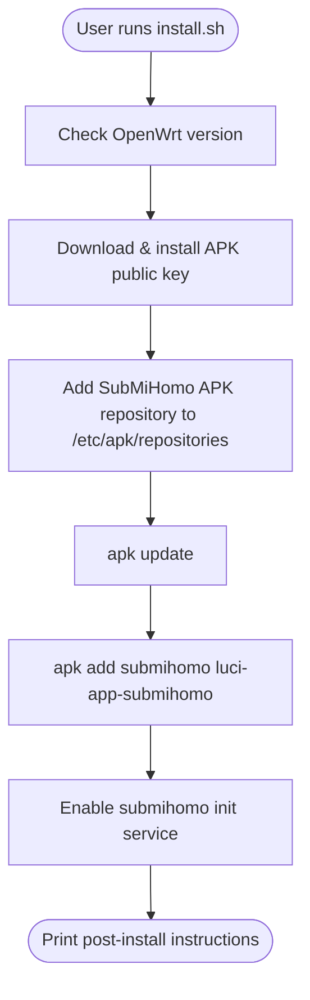
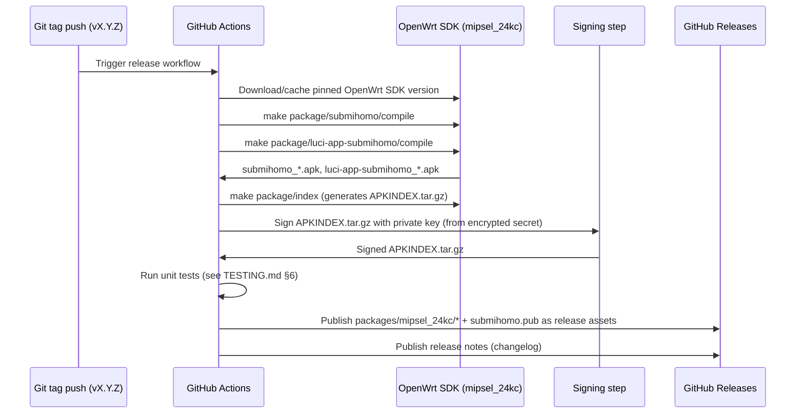

# SubMiHomo — Installation Architecture

## Table of Contents

1. [Overview](#1-overview)
2. [APK Repository Design](#2-apk-repository-design)
3. [install.sh Design](#3-installsh-design)
4. [update.sh Design](#4-updatesh-design)
5. [uninstall.sh Design](#5-uninstallsh-design)
6. [The Package Makefile](#6-the-package-makefile)
7. [CI Build and Release Process](#7-ci-build-and-release-process)
8. [Multi-Architecture Support](#8-multi-architecture-support)
9. [Installation Verification](#9-installation-verification)
10. [Troubleshooting Install Failures](#10-troubleshooting-install-failures)

---

## 1. Overview

SubMiHomo is distributed as native OpenWrt **APK** packages (OpenWrt 23+ moved from `opkg`/ipk to `apk`, and OpenWrt 25+ makes `apk` the default and only supported package manager on new builds). There is deliberately no separate "installer binary," no compiled distribution artifact, and no dependency on a build toolchain being present on the router at install time. The entire installation experience is:

1. A single `wget | sh`-style bootstrap (`install.sh`) that a user runs once, which teaches the router's `apk` where to find SubMiHomo's packages and how to trust them.
2. From that point forward, SubMiHomo is a normal APK package like any other OpenWrt package — installed, upgraded, and removed with the standard `apk` toolchain, fully integrated into whatever update workflow the administrator already uses for the rest of their router's software.

This design was chosen over alternatives (a self-contained shell installer that copies files directly, a custom feed added to `opkg`, or a `.ipk`-based approach) because:

- It leverages `apk`'s built-in signature verification, dependency resolution, and file-conflict detection rather than reimplementing any of that in shell.
- It makes `submihomo` a first-class citizen of the router's package database — visible in `apk list --installed`, upgradable via `apk upgrade`, and removable via `apk del`, with no bespoke uninstall logic required to reconstruct "what files did this thing put where."
- It cleanly separates *distribution* (this document) from *runtime behavior* (`ARCHITECTURE.md`) and *security posture* (`SECURITY.md`), each of which can evolve independently.



---

## 2. APK Repository Design

### 2.1 GitHub Releases as an APK Repository

SubMiHomo does not run or pay for dedicated package-hosting infrastructure. Instead, it uses **GitHub Releases** as a static file host that satisfies everything `apk` needs from a repository: a stable URL structure, an `APKINDEX.tar.gz` at a predictable path, and the actual `.apk` package files alongside it. `apk`'s repository protocol is simply "fetch `APKINDEX.tar.gz` from `<repo-url>/APKINDEX.tar.gz`, then fetch individual packages named within it from the same base URL" — GitHub Releases assets satisfy this with no server-side logic required.

**Why GitHub Releases specifically, rather than a self-hosted repository or a third-party OpenWrt package feed**:

- Zero hosting cost and zero infrastructure to maintain or secure independently — GitHub's own infrastructure and TLS termination is relied upon.
- Every release is versioned, immutable once published, and has a permanent URL, which makes `install.sh`'s reference to `.../releases/latest/download/...` reliable across the project's lifetime.
- Aligns with how the project is already distributed as source (a public GitHub repository) — users installing from a GitHub repo already trust GitHub as part of their supply chain; no new trust relationship is introduced.
- GitHub Releases supports arbitrary binary assets and arbitrary directory-like key structure within a release (asset filenames can encode paths conceptually, and the release's downloadable URL scheme is stable), which is sufficient for the flat `packages/<arch>/*` layout `apk` expects.

### 2.2 Directory Structure of a Release

```
https://github.com/<org>/submihomo/releases/latest/download/
├── packages/
│   └── mipsel_24kc/
│       ├── APKINDEX.tar.gz              ← signed package index for this arch
│       ├── mihomo_<ver>_mipsel_24kc.apk       (if vendored/rebuilt; see §8)
│       ├── submihomo_<ver>_mipsel_24kc.apk
│       └── luci-app-submihomo_<ver>_mipsel_24kc.apk
└── submihomo.pub                        ← public signing key (also mirrored at repo root)
```

`APKINDEX.tar.gz` is architecture-specific because APK repositories are namespaced per architecture — a `mipsel_24kc` router only ever queries the `packages/mipsel_24kc/` path. Additional architectures (§8) each get their own equivalently-structured subdirectory within the same release, e.g., `packages/x86_64/`, `packages/aarch64_cortex-a53/`.

The public key is published in two locations for redundancy and discoverability:

- As a release asset (`.../releases/latest/download/submihomo.pub`), so `install.sh`'s reference to "the latest release" always resolves to a current key even if the project rotates keys between releases.
- At a fixed path in the `main` branch of the repository (`submihomo.pub` at repo root), fetched via `raw.githubusercontent.com`, which is the path `install.sh` actually uses (a `main`-branch raw file is simpler to reference reliably than a "latest release asset" URL from a plain `wget` one-liner, and is not subject to release-tagging timing issues).

### 2.3 APKINDEX.tar.gz Generation

`APKINDEX.tar.gz` generation is a **build-system responsibility**, not something `install.sh` or any runtime script performs. It is produced by the OpenWrt SDK's own package build tooling (`make package/index` in an OpenWrt buildroot/SDK checkout, which is the standard mechanism the OpenWrt project itself uses to produce its own official package indexes) as the final step of the CI release pipeline described in §7. The index format, checksum fields, and signature block layout are entirely owned by the upstream OpenWrt/APK tooling — SubMiHomo's CI workflow only invokes that tooling correctly and supplies the signing key at the right step; it does not hand-construct the index file.

### 2.4 Key Pair Management

| Aspect | Detail |
|---|---|
| Key generation | Performed once, offline, using the OpenWrt SDK's key-generation helper (the same tool used to generate `usign`/`abuild`-compatible keypairs for official OpenWrt feeds) |
| Private key location | Stored exclusively as an encrypted CI secret (e.g., a GitHub Actions repository secret), never committed to version control, never present on a routine developer workstation |
| Public key location | Committed to the repository (`submihomo.pub` at repo root) and published as a release asset |
| Signing operation | Performed automatically inside the CI release workflow, immediately before publishing a release, as the last step that touches `APKINDEX.tar.gz` |
| Key rotation | Manual process (see `SECURITY.md` §6.3): generate new keypair, publish new public key, advise users to refresh `/etc/apk/keys/submihomo.pub`, revoke old key from CI secrets |

A maintainer who needs to sign an index manually (e.g., reproducing a release locally for debugging) uses the OpenWrt SDK's signing helper against a local copy of the private key, obtained through the same secured channel the CI pipeline uses — this is not a routine workflow and is intentionally a little inconvenient, since routine signing should only ever happen inside the audited CI pipeline.

---

## 3. install.sh Design

`install.sh` is a small, auditable POSIX shell script intended to be read before it is run (and the documentation encourages this: `curl -fsSL .../install.sh | less` before `| sh`). Every step below states not just *what* it does but *why*, and how it fails.

### 3.1 Step-by-Step Design

```mermaid
flowchart TD
    S([Start]) --> V{OpenWrt version >= 23?}
    V -- "No, < 23" --> VF[Abort: unsupported version]
    V -- "23-24" --> VW[Warn: recommend 25+, continue]
    V -- ">= 25" --> K
    VW --> K[Download APK repo public key]
    K --> KC{Download succeeded?}
    KC -- No --> KF[Abort: cannot fetch key]
    KC -- Yes --> KP[Install key to /etc/apk/keys/submihomo.pub]
    KP --> R[Append repo URL to /etc/apk/repositories]
    R --> RD{Line already present?}
    RD -- Yes --> U
    RD -- No --> RA[Append new line]
    RA --> U[apk update]
    U --> UC{Update succeeded?}
    UC -- No --> UF[Abort: repo unreachable / index invalid]
    UC -- Yes --> I[apk add submihomo luci-app-submihomo]
    I --> IC{Install succeeded?}
    IC -- No --> IF[Abort: dependency or package error, print apk output]
    IC -- Yes --> E[/etc/init.d/submihomo enable]
    E --> P([Print post-install instructions])
```

| Step | Action | Rationale | Failure Handling |
|---|---|---|---|
| 1 | Read `/etc/openwrt_release` and check `DISTRIB_RELEASE` | SubMiHomo targets OpenWrt 25+ (fw4, `apk`, kernel TPROXY support are all assumed). Versions ≥23 have `apk` but may lack fw4/nftables defaults or the exact kernel modules relied upon | If version < 23: abort with a clear message that `apk` itself is not available/supported below this line, nothing to install onto. If version is 23–24: print a **warning** (not a hard stop) that the project is validated against 25+ and some functionality (particularly the nftables/TPROXY firewall integration) may require manual adjustment on older releases, then continue — the user has been informed and can make their own call |
| 2 | Detect architecture via `opkg print-architecture`-equivalent (`apk`'s own arch detection, or reading `/etc/apk/arch`) | Used only for an informational message; SubMiHomo's repository is currently published only for `mipsel_24kc` (§8), but the script does not hard-fail on other architectures, since a user may be pointing at a self-built repository for another target | If the detected architecture does not match `mipsel_24kc` and no override is given, print an informational warning ("this release currently ships prebuilt packages for mipsel_24kc only; your architecture is `<X>` — installation will proceed, but package availability depends on what's published in the repository") rather than aborting, so the same script remains usable for future multi-arch releases (§8) without modification |
| 3 | `wget -O /etc/apk/keys/submihomo.pub https://raw.githubusercontent.com/<org>/submihomo/main/submihomo.pub` | Establishes the trust anchor `apk` needs before it will accept any signed index from the new repository. Downloaded over HTTPS only, exactly like every other network fetch in this project (see `SECURITY.md` §4.5) | If the download fails (network error, 404, non-2xx), abort immediately with a clear error and **do not** proceed to add the repository — installing a repository without a corresponding key would either silently fail at `apk update` time or, worse, tempt a user to disable verification, which the script never suggests as an option |
| 4 | Append the repository URL line to `/etc/apk/repositories` if not already present | `apk` reads all configured repositories from this file; SubMiHomo's line must coexist with the existing OpenWrt official repository lines, never replacing or reordering them | Idempotency check: `grep -qF "<repo-url>" /etc/apk/repositories` before appending, so re-running `install.sh` (for a reinstall or a manual key refresh) never duplicates the line |
| 5 | `apk update` | Refreshes all configured repository indexes, including the newly added one, and verifies the newly added index's signature against the key installed in step 3 | If this fails, abort with the raw `apk update` output surfaced to the user — this is almost always either a network reachability problem or, if it specifically flags a signature failure, a sign that the key step (3) fetched a corrupted or unexpected key, which should be investigated rather than bypassed |
| 6 | `apk add submihomo luci-app-submihomo` | Installs the core service and the LuCI frontend together (see §6.2 for the rationale on why both are installed by default rather than core-only, and how a user can opt for core-only afterward) | If this fails, abort and surface `apk`'s own dependency-resolution error output verbatim (it will name the specific missing/conflicting dependency, e.g., a missing `kmod-nft-tproxy` on an unusual kernel build) — the script does not attempt to auto-resolve dependency failures itself |
| 7 | `/etc/init.d/submihomo enable` | Registers the service to start on boot via procd's standard `enable` mechanism (symlinks into `/etc/rc.d/`) | This step does not **start** the service — see §3.2 below for why start is deliberately deferred |
| 8 | Print post-install instructions | Directs the user to LuCI → Services → SubMiHomo to enter a subscription URL and click Apply | N/A — this is the final, always-reached success step |

### 3.2 Why the Service Is Enabled but Not Started

`install.sh` calls `/etc/init.d/submihomo enable` (register for boot) but deliberately does **not** call `/etc/init.d/submihomo start` at the end of installation. This is intentional: SubMiHomo's `start_service()` requires a valid subscription (ARCHITECTURE.md §5.4, §10.1) to generate a working Mihomo config. Starting the service immediately after a fresh install, before the user has entered a subscription URL, would either fail outright or start Mihomo with an empty/placeholder proxy list — either outcome produces a confusing first-run experience. Instead, the documented flow is: install → open LuCI → paste subscription URL → click Apply (which itself triggers the first subscription download, config generation, and service start via the LuCI/rpcd path) — a single, coherent first-run action rather than "install produces a partially-working state that then needs fixing."

### 3.3 Exact Post-Install Messages

```
SubMiHomo installed. Open LuCI → Services → SubMiHomo to configure.
Set your subscription URL and click Apply.
```

These two lines are printed verbatim (matching the brief) so that documentation, support threads, and the script's own output stay in lockstep — a support responder can grep for this exact text to confirm a user completed installation successfully.

### 3.4 Error Handling Philosophy

`install.sh` uses `set -e`-style fail-fast behavior at each network/package-manager step, combined with explicit, human-readable error messages rather than relying solely on raw command exit codes. Every abort path:

- Prints a one-line summary of *what* failed.
- Prints the *exact underlying command's output* when it is a system tool (`apk`, `wget`) that already produces actionable diagnostic text — the script does not swallow or replace `apk`'s own error messages.
- Exits with a non-zero status matching the conventional meaning of the failure category (e.g., a distinct code for "unsupported OS version" versus "network fetch failed" versus "package installation failed"), so that automated deployment tooling invoking `install.sh` non-interactively can distinguish failure classes if desired.
- Never attempts automatic remediation that could mask the underlying problem (e.g., it never silently retries `apk update` in a loop, and never falls back to disabling signature verification if the signed fetch fails).

---

## 4. update.sh Design

### 4.1 Step-by-Step Design

```mermaid
flowchart TD
    S([Start]) --> A[apk update]
    A --> AC{Update succeeded?}
    AC -- No --> AF[Abort: cannot refresh index]
    AC -- Yes --> B[Check current running state of submihomo service]
    B --> C[apk upgrade submihomo luci-app-submihomo]
    C --> CC{Upgrade succeeded?}
    CC -- No --> CF[Abort: package error, service left running on old version]
    CC -- Yes --> D{Was service running before upgrade?}
    D -- Yes --> E[/etc/init.d/submihomo restart]
    D -- No --> F[Leave stopped]
    E --> G[Report new version]
    F --> G
    G --> H([Done])
```

| Step | Action | Rationale |
|---|---|---|
| 1 | `apk update` | Refreshes the package index so `apk upgrade` sees the latest published version |
| 2 | Record whether the service is currently running (`/etc/init.d/submihomo status` / procd query) before touching packages | This determines whether the script should restart the service afterward — an administrator who has deliberately stopped SubMiHomo (e.g., for maintenance) should not have it silently restarted by an update |
| 3 | `apk upgrade submihomo luci-app-submihomo` | Upgrades only SubMiHomo's own packages, explicitly, rather than a blanket `apk upgrade` that would touch every installed package on the system — an update to SubMiHomo should not become an accidental full-system upgrade with its own separate risk profile |
| 4 | If the service was running before the upgrade, `/etc/init.d/submihomo restart`; otherwise leave it stopped | A **stop → replace files → start** cycle is used rather than attempting any form of "live" in-place binary swap, because procd's own restart semantics already cleanly stop the old process, and shell modules/config templates are re-read fresh on every start regardless — there is no meaningful "live upgrade" path simpler or safer than a normal restart for a service of this size and lifecycle |
| 5 | Report the new installed version (`apk info -e submihomo`-derived version string, or a version endpoint exposed by `submihomo-ctl`) | Confirms to the operator that the upgrade actually changed the installed version, rather than silently no-opping if, e.g., the repository had no newer release |

### 4.2 Graceful Upgrade: Stop-Update-Start vs. Live Upgrade

A **live upgrade** (replacing files under a running process without stopping it) was considered and rejected:

- `apk upgrade` on OpenWrt already unpacks new package files over the old ones on disk while the old process may still be running; but a running Mihomo process holds its binary and config file descriptors open from *before* the upgrade, so it would continue running the **old** binary/config in memory until restarted regardless — there is no actual "live" behavior change achievable without a restart, only a false sense that one occurred.
- procd's restart is fast (Mihomo starts in low single-digit seconds on the target hardware, per the performance target documented in `TESTING.md` §9), so the availability cost of a clean stop→start cycle is small and bounded, unlike, say, upgrading a database server where downtime is expensive.
- A clean restart guarantees the new binary and any updated init script logic are actually exercised together, rather than running a mismatched combination of "new files on disk, old process in memory" for an indeterminate period until the next unrelated restart.

Therefore `update.sh` performs a full `/etc/init.d/submihomo restart` (which itself is a stop-then-start under procd) rather than attempting any live-swap trick, but **only if the service was already running** — it never starts a service the administrator had intentionally left stopped.

### 4.3 Rollback on Failure

If `apk upgrade` itself fails partway (e.g., a dependency conflict, a corrupted download, insufficient flash space mid-unpack), `apk`'s own transactional package database handling is relied upon: `apk` does not leave a package "half-installed" in its database on a hard failure of the upgrade transaction — either the new version's files and database entry are fully in place, or the previous version's entry remains authoritative. `update.sh` does not attempt to implement its own rollback logic on top of this (e.g., it does not try to re-download and reinstall the previous `.apk` file it detects the old version to be), because:

- `apk` publishes only the **latest** release's packages at the well-known repository path by default (§2.2); the previous version's package file is not guaranteed to still be present at a stable URL for `update.sh` to fetch, unless the project explicitly retains older per-version release assets (which it does, since GitHub Releases are immutable and versioned — see §2.1 — but `update.sh` does not automate fetching them, to keep the rollback story simple and manual).
- If an upgrade fails, `update.sh` aborts with the raw `apk` error, explicitly instructs the operator that the previously installed version remains active and the service was left in its pre-upgrade running state (untouched, since step 3's restart in §4.1 is only reached after a successful upgrade), and points to the project's release history for manually pinning an older `.apk` version if a deliberate downgrade is desired.

### 4.4 Version Reporting

After a successful upgrade, `update.sh` prints:

```
SubMiHomo updated.
```

along with the resolved package version(s) (e.g., `submihomo: 1.0.0 -> 1.1.0`, `luci-app-submihomo: 1.0.0 -> 1.1.0`) obtained via `apk info` queries run before and after the upgrade step, so the operator has confirmation of exactly what changed without needing to separately query `apk` themselves.

---

## 5. uninstall.sh Design

### 5.1 Step-by-Step Design

```mermaid
flowchart TD
    S([Start]) --> A[/etc/init.d/submihomo stop]
    A --> B[/etc/init.d/submihomo disable]
    B --> C[apk del submihomo luci-app-submihomo]
    C --> D[Remove SubMiHomo repository line from /etc/apk/repositories]
    D --> E[Remove /etc/apk/keys/submihomo.pub]
    E --> F{Prompt: remove config and subscription data too?}
    F -- "No" --> G[Preserve /etc/submihomo and /etc/config/submihomo]
    F -- "Yes" --> H[rm -rf /etc/submihomo /etc/config/submihomo]
    G --> I([Print: SubMiHomo removed])
    H --> I
```

| Step | Action | Rationale |
|---|---|---|
| 1 | `/etc/init.d/submihomo stop` | Ensures Mihomo is not left running as an orphaned process once its supervising package is removed, and ensures routing/firewall/DNS teardown (ARCHITECTURE.md §4.5, the reverse-order teardown sequence) runs cleanly *before* the shell modules implementing that teardown are deleted from disk by `apk del` |
| 2 | `/etc/init.d/submihomo disable` | Removes the boot-time enable symlink so a subsequent reboot does not attempt to start a service whose package is about to be removed |
| 3 | `apk del submihomo luci-app-submihomo` | Removes both packages together; `apk` itself resolves that `luci-app-submihomo` depends on `submihomo` (ARCHITECTURE.md §7) and removes them in the correct order, deleting all package-owned files (shell modules, init script, LuCI views, ACL file, rpcd plugin, CLI tool) |
| 4 | Remove the SubMiHomo line from `/etc/apk/repositories` | Prevents a stale repository entry from causing `apk update` to continue querying a now-unused (from this router's perspective) repository indefinitely, and avoids leaving the public key referenced with no corresponding purpose |
| 5 | Remove `/etc/apk/keys/submihomo.pub` | Cleans up the trust anchor now that no packages from this repository remain installed or intended to be installed; if the user reinstalls later, `install.sh` re-fetches and re-installs it fresh |
| 6 | Prompt interactively: "Remove SubMiHomo configuration and subscription data? [y/N]" via `read -r answer` | Configuration (the subscription URL, controller secret, and downloaded subscription YAML) is **user data**, not package data — `apk del` never touches it because these files are not package-owned/tracked files (they live under `/etc/config/` and `/etc/submihomo/`, populated by the running service, not by the package's file manifest). Removing them is destructive and irreversible (the subscription content and any manually-tuned bypass list would need to be re-entered from scratch on reinstall), so the script never removes them without explicit confirmation |
| 7 | If confirmed: `rm -rf /etc/submihomo /etc/config/submihomo` | Only executed on explicit "yes" |
| 8 | Print `SubMiHomo removed.` | Final confirmation message |

### 5.2 What Is Preserved

| Artifact | Preserved by Default? | Notes |
|---|---|---|
| `/etc/config/submihomo` (UCI config: subscription URL, secret, DNS mode, ports, bypass list) | Yes, unless user confirms removal | Considered user data |
| `/etc/submihomo/subscriptions/current.yaml`, `backup.yaml` | Yes, unless user confirms removal | Considered user data; may represent a paid subscription's downloaded state that the user would rather not re-fetch immediately |
| `/usr/share/submihomo/dashboard/` (downloaded Zashboard assets) | **No** — removed automatically as part of package removal | This directory is treated as a runtime cache of a redistributable static asset, not user data; it is trivially re-downloaded via `dashboard.sh` (or automatically on next fresh install's first start, per ARCHITECTURE.md §4.4) with no loss of user-specific information |
| `/var/run/submihomo/` (generated `config.yaml`, PID/lock files) | No — tmpfs, cleared on reboot regardless, and explicitly removed by service stop | Never persisted, never user data |
| Cron entries for subscription auto-update | Removed as part of `subscription.sh`'s own teardown, invoked during `stop_service()` | Prevents an orphaned cron job from attempting to run `submihomo-ctl update-subscription` against a now-uninstalled service |

The default behavior (`[y/N]`, i.e., defaulting to "No" if the user simply presses Enter) is deliberately the **safe, non-destructive** choice — an uninstall run in a hurry, or scripted non-interactively without a supplied answer, preserves user configuration rather than deleting it.

---

## 6. The Package Makefile

### 6.1 `Package/submihomo` Definition

```makefile
include $(TOPDIR)/rules.mk

PKG_NAME:=submihomo
PKG_VERSION:=1.0.0
PKG_RELEASE:=1
PKG_MAINTAINER:=SubMiHomo Team
PKG_LICENSE:=MIT
PKG_LICENSE_FILES:=LICENSE

include $(INCLUDE_DIR)/package.mk

define Package/submihomo
  SECTION:=net
  CATEGORY:=Network
  TITLE:=Mihomo-based transparent proxy for OpenWrt
  DEPENDS:=+mihomo +nftables +kmod-nft-tproxy +ip-full +wget-ssl +unzip +coreutils-sort
  URL:=https://github.com/<org>/submihomo
endef

define Package/submihomo/description
  Automatic transparent proxy using Mihomo on OpenWrt.
  Paste subscription URL, click Apply, done.
endef
```

### 6.2 `Package/luci-app-submihomo` Definition

```makefile
define Package/luci-app-submihomo
  SECTION:=luci
  CATEGORY:=LuCI
  SUBMENU:=3. Applications
  TITLE:=LuCI for SubMiHomo
  DEPENDS:=+submihomo +luci-base +rpcd
  URL:=https://github.com/<org>/submihomo
endef
```

The frontend is packaged **separately** from the core service (ARCHITECTURE.md §7 covers the architectural rationale for the three-package split in depth). `install.sh` installs both by default for the best out-of-box experience, but an administrator who wants a headless install (no web UI, CLI/UCI-only management via `submihomo-ctl`) can run `apk add submihomo` alone and skip the LuCI package entirely, saving flash space (ARCHITECTURE.md §12.2 estimates ~30–60 KB for the LuCI package — small in absolute terms, but non-zero on the smallest flash targets).

### 6.3 Dependency Justification

| Dependency | Why It Is Required |
|---|---|
| `+mihomo` | The proxy engine itself; SubMiHomo's shell modules and init script exist entirely to configure and supervise this binary. Declared as a `+` (auto-selected) dependency so `apk add submihomo` transparently pulls it in |
| `+nftables` | Provides the `nft` CLI tool that `firewall.sh` invokes to create/destroy the `inet submihomo` table (ARCHITECTURE.md §8.1). OpenWrt 25+ ships fw4/nftables by default, but the explicit dependency guarantees the binary is present even on a minimal/custom image |
| `+kmod-nft-tproxy` | The kernel module providing the `tproxy` nftables expression used by the PREROUTING chain. Without this module loaded, the `nft` rule referencing TPROXY fails to load even if the `nft` userspace tool itself is present — this is the single most common root cause of "traffic isn't being intercepted" support issues if omitted, so it is a hard dependency rather than a documented manual step |
| `+ip-full` | OpenWrt's default minimal `ip` (busybox-provided or the stripped `ip-tiny` package) does not support `ip rule` and `ip route ... table <N>` operations needed by `routing.sh` (ARCHITECTURE.md §8.3) in all configurations. `ip-full` (the full iproute2 build) guarantees `ip rule add fwmark 1 lookup 100` and `ip route add local default dev lo table 100` both work as expected |
| `+wget-ssl` | The TLS-capable `wget` build, required because subscription downloads are HTTPS-only and TLS verification must actually be possible (not a stub). The stripped `wget-nossl`/busybox `wget` cannot perform certificate validation at all, which would be a silent security regression if it were ever accidentally satisfied instead (see `SECURITY.md` §4.5) |
| `+unzip` | Used by `dashboard.sh` to extract the Zashboard `dist.zip` release asset into `/usr/share/submihomo/dashboard/` (ARCHITECTURE.md §4.4) |
| `+coreutils-sort` | BusyBox's built-in `sort` lacks some flags/locale behaviors relied upon during config generation (stable, byte-wise sorting used when deduplicating or ordering bypass-list entries or rule blocks). Declared explicitly rather than assumed present, since BusyBox's applet set is configurable per-image and cannot be assumed |
| `+luci-base` (luci-app-submihomo only) | Provides the LuCI JS framework runtime (`ubus` RPC client helpers, form/view rendering, session handling) that the SubMiHomo JS views (`overview.js`, `subscription.js`, `settings.js`, `proxies.js`, `logs.js`) are built against |
| `+rpcd` (luci-app-submihomo only) | Provides the rpcd daemon that loads and serves the SubMiHomo rpcd plugin (`/usr/lib/rpcd/submihomo`) and enforces the ACL file (ARCHITECTURE.md §11.3) |

### 6.4 File Installation Mapping

| Source (in repository) | Installed Path | Package | Mode |
|---|---|---|---|
| `files/submihomo.init` | `/etc/init.d/submihomo` | `submihomo` | `755` |
| `files/core.sh`, `config.sh`, `routing.sh`, `dns.sh`, `firewall.sh`, `subscription.sh`, `dashboard.sh` | `/usr/lib/submihomo/*.sh` | `submihomo` | `755` |
| `files/rpcd-submihomo` | `/usr/lib/rpcd/submihomo` | `submihomo` | `755` |
| `files/submihomo-ctl` | `/usr/bin/submihomo-ctl` | `submihomo` | `755` |
| `files/submihomo.config` | `/etc/config/submihomo` | `submihomo` | `600` (set explicitly in `postinst`, see §6.5 — `conffiles` default mode is not sufficiently restrictive on its own) |
| `files/base.yaml.tmpl` | `/etc/submihomo/templates/base.yaml.tmpl` | `submihomo` | `644` (template contains no secrets) |
| `htdocs/luci-static/resources/view/submihomo/*.js` | same path | `luci-app-submihomo` | `644` |
| `files/luci-app-submihomo.json` | `/usr/share/luci/menu.d/luci-app-submihomo.json` | `luci-app-submihomo` | `644` |
| `files/acl.json` | `/usr/share/rpcd/acl.d/luci-app-submihomo.json` | `luci-app-submihomo` | `644` |

`/etc/config/submihomo` is declared a `conffile` (via `$(call Package/submihomo/conffiles)` in the Makefile) so that `apk upgrade` never silently overwrites a user's already-configured subscription URL and secret on package upgrade — standard package manager conffile-preservation semantics apply, matching how OpenWrt handles every other `/etc/config/*` UCI file.

### 6.5 `postinst` Script

Run automatically by `apk` immediately after package files are unpacked:

1. **Set restrictive permissions explicitly** on `/etc/config/submihomo` (`chmod 600`) and on the `/etc/submihomo/` tree (`chmod 700`), rather than relying solely on the Makefile's install-time mode (belt-and-suspenders: the explicit `postinst` chmod guards against any future scenario where a file is created at runtime by a shell module with a more permissive default `umask`, rather than only at package-install time).
2. **Create runtime directories that must exist but are not shipped as package-owned files**: `/etc/submihomo/subscriptions/` (mode `700`), ensuring the directory exists before the first subscription download attempt regardless of install order.
3. **Does not start the service** — matching the rationale in §3.2, `postinst` only prepares the filesystem; starting/enabling is the responsibility of `install.sh` (`enable`) and, ultimately, the user's first "Apply" action in LuCI (`start`).
4. Prints a short reminder consistent with `install.sh`'s own post-install message, so that a user who installs via `apk add submihomo luci-app-submihomo` directly (bypassing `install.sh`, e.g., on a router where the repository/key were already configured from a previous install) still receives the same guidance.

### 6.6 `prerm` Script

Run automatically by `apk` immediately before package files are removed (on `apk del`):

1. **Stops the running service** (`/etc/init.d/submihomo stop`) if it is active, ensuring the teardown sequence (routing/firewall/DNS reversal) executes while the shell modules implementing it still exist on disk — this is the same reasoning as `uninstall.sh` step 1 (§5.1), duplicated here so that a direct `apk del submihomo` (bypassing the `uninstall.sh` wrapper entirely) is still safe and leaves no orphaned nftables table, `ip rule`, or dnsmasq config fragment behind.
2. Does **not** remove `/etc/config/submihomo` or `/etc/submihomo/subscriptions/` — conffile and user-data preservation is a property of the *package system* (conffiles are never deleted by `apk del` without an explicit purge-equivalent flag) combined with the fact that these paths are intentionally excluded from the package's file manifest where applicable, consistent with the "preserved by default" table in §5.2.

---

## 7. CI Build and Release Process

### 7.1 High-Level Flow



### 7.2 Release Trigger and Versioning

Releases are triggered by pushing an annotated Git tag matching `vX.Y.Z`. The CI workflow reads this tag to set `PKG_VERSION` for the build (overriding the Makefile's checked-in default via a build-time variable substitution step), ensuring the tag, the release title, and the built package's reported version (`apk info -e submihomo`) always agree — an important property for the version-reporting step in `update.sh` (§4.4) to be meaningful.

### 7.3 Build Environment

The workflow uses a pinned OpenWrt SDK release (matching the minimum supported OpenWrt branch — currently the 25.x SDK for `mipsel_24kc`) rather than building against `master`/development snapshots of the SDK, so that release builds are reproducible and not subject to upstream SDK churn breaking a release unexpectedly. The SDK download/extraction step is cached between CI runs (keyed on the SDK version string) to keep build times low.

### 7.4 Test Gate

Per `TESTING.md` §6, the CI release workflow runs the full unit test suite and the build-verification checks (package builds cleanly, expected files are present with expected permissions inside the built `.apk`) **before** the signing and publish steps. A release is never published from a workflow run where any of these checks failed — the publish step is gated on the preceding job's success in the GitHub Actions job graph, not merely sequenced after it.

---

## 8. Multi-Architecture Support

### 8.1 Current State

SubMiHomo v1 publishes prebuilt packages for exactly one architecture: `mipsel_24kc` (the dominant CPU architecture among the router models the project explicitly targets — see `ARCHITECTURE.md` §1.2 and §12).

### 8.2 Why the Makefile Is Architecture-Agnostic Regardless

Nothing in `Package/submihomo`'s Makefile definition (§6.1) is inherently MIPS-specific:

- `submihomo` itself contains no compiled binary — it is pure shell, Lua (rpcd plugin), and JS/JSON (LuCI package), all of which are architecture-independent by nature. The Makefile's `Build/Compile` step for `submihomo` is effectively a file-copy operation, not a cross-compilation step.
- The only architecture-specific dependency in the chain is `mihomo` itself (a Go binary, compiled per-target) and the kernel module `kmod-nft-tproxy` (compiled against a specific kernel/architecture combination) — both of which are declared as dependencies resolved by `apk` against whatever architecture-specific build of those packages the target router's own configured repositories provide (the official OpenWrt package feed already publishes `mihomo`... _if_ upstream ships it for that target; kernel modules are always per-target by nature on OpenWrt regardless of SubMiHomo's involvement).

This means that building `submihomo` and `luci-app-submihomo` for an additional architecture (e.g., `x86_64` or `aarch64_cortex-a53`, both common QEMU/testing and higher-end router targets) requires **no source changes** — only an additional CI build matrix entry pointing at a different SDK download and a corresponding additional `packages/<arch>/` subdirectory in the published release (§2.2).

### 8.3 Adding a New Architecture (Future Work)

To add architecture `<new-arch>` support, the CI workflow (§7) would be extended with:

1. An additional build matrix entry specifying the `<new-arch>` OpenWrt SDK.
2. The same `make package/submihomo/compile` / `make package/luci-app-submihomo/compile` / `make package/index` sequence, run against that SDK, producing `packages/<new-arch>/*`.
3. The same signing step applied to the new architecture's `APKINDEX.tar.gz` (using the same project keypair — the key is not architecture-specific, since it signs the index/package integrity, not anything architecture-dependent).
4. `install.sh`'s repository-line construction updated (or made architecture-aware, substituting the detected `/etc/apk/arch` value into the repository URL) so that a user on `<new-arch>` automatically points at the correct subdirectory rather than requiring a manually-edited script.

This is documented as a forward-looking design note; it is not implemented in v1 (per `ARCHITECTURE.md` §13's explicit scope boundaries), but the Makefile and repository layout were designed from the outset to make this an additive change rather than a restructuring.

---

## 9. Installation Verification

After running `install.sh` (or a manual `apk add`), the following checks confirm a healthy installation:

| Check | Command | Expected Result |
|---|---|---|
| Packages installed | `apk info -e submihomo luci-app-submihomo mihomo` | All three package names printed, confirming presence and implicit dependency resolution |
| Init script present and enabled | `ls -la /etc/init.d/submihomo && /etc/init.d/submihomo enabled; echo $?` | File exists, mode `755`; exit code `0` indicates "enabled" |
| Config file permissions | `stat -c '%a %U:%G' /etc/config/submihomo` | `600 root:root` |
| Subscription directory permissions | `stat -c '%a %U:%G' /etc/submihomo/subscriptions` | `700 root:root` |
| LuCI menu entry visible | Log into LuCI, check Services menu | "SubMiHomo" entry present under Services |
| rpcd plugin registered | `ubus list | grep submihomo` | `submihomo` object listed among ubus objects |
| ACL file loaded | `ls /usr/share/rpcd/acl.d/luci-app-submihomo.json` | File present; `/etc/init.d/rpcd reload` picks it up if installed after rpcd was already running |
| APK repository configured | `grep submihomo /etc/apk/repositories` | The SubMiHomo repository URL line present |
| APK key installed | `ls /etc/apk/keys/submihomo.pub` | File present |
| Dependencies satisfied | `nft --version`, `ip rule help` (checks for `ip-full` vs busybox `ip`), `wget --version` (check for `+ssl`), `which unzip` | Each tool present and reports the expected (non-stub) capability |

A fully successful install, prior to entering a subscription URL, is expected to show the service **enabled but not running** (`/etc/init.d/submihomo status` reporting inactive) — this is the correct, designed state (§3.2), not a fault.

---

## 10. Troubleshooting Install Failures

| Symptom | Likely Cause | Resolution |
|---|---|---|
| `install.sh` aborts at the version check with "unsupported OpenWrt version" | Router is running OpenWrt < 23, which predates `apk` | Upgrade OpenWrt firmware to 23+ (25+ recommended) before installing; SubMiHomo cannot be installed via `apk` on `opkg`-only firmware |
| `install.sh` aborts at the key-download step | No internet/DNS on the router at install time, or `raw.githubusercontent.com` blocked by an upstream filter/captive portal | Verify router WAN connectivity (`ping`/`wget` to a known-good HTTPS host) before retrying; if behind a restrictive corporate/ISP DNS filter, temporarily use a public DNS resolver |
| `apk update` fails with a signature verification error | The downloaded `submihomo.pub` does not match the key used to sign the current `APKINDEX.tar.gz` — could indicate a stale locally-cached key from a much older install, or (rare) an in-progress key rotation (`SECURITY.md` §6.3) | Re-run `install.sh`'s key-download step manually (`wget -O /etc/apk/keys/submihomo.pub https://raw.githubusercontent.com/<org>/submihomo/main/submihomo.pub`) to force a fresh key, then retry `apk update`; check the project's release notes for an active key-rotation advisory |
| `apk add submihomo` fails citing a missing `kmod-nft-tproxy` | The router's installed kernel/firmware build does not include this kernel module (uncommon on default OpenWrt 25+ builds for supported targets, but possible on heavily trimmed custom images) | Rebuild or reflash with a firmware image that includes `kmod-nft-tproxy`, or use OpenWrt's ImageBuilder to add it to a custom image before installing SubMiHomo |
| `apk add` fails citing a conflict with an already-installed `wget` variant (e.g., busybox-provided) | Some minimal images provide `wget` via BusyBox rather than a standalone package, which can conflict with `wget-ssl`'s file ownership of `/usr/bin/wget` | Resolve via `apk`'s own reported conflict message (`apk fix` or manually removing the conflicting BusyBox applet mapping); this is an `apk`/BusyBox interaction outside SubMiHomo's control, but common enough to note here |
| LuCI menu entry does not appear after install | rpcd/LuCI cache not refreshed, or `luci-app-submihomo` failed silently mid-install | Run `/etc/init.d/rpcd restart` and clear the browser's LuCI session cache (or `rm -f /tmp/luci-indexcache*` then reload), then confirm `apk info -e luci-app-submihomo` reports the package as installed |
| Service will not start after entering a subscription URL | Subscription download/validation failed (see `TESTING.md` §8 for the full failure-scenario matrix); check `logread | grep submihomo` for the specific validation stage that failed | Follow the masked-URL log output to identify whether the failure is network-level (download), format-level (missing `proxies:` key), or semantic (fails `mihomo -t`) and address accordingly; the previous (or shipped default empty) subscription state is preserved, so the router remains in a known state throughout |
| `install.sh` runs but architecture warning is shown for a supported device | The device's `/etc/apk/arch` reports something other than `mipsel_24kc` for a device the project does consider "supported" (rare naming edge cases across MIPS 24Kc variants) | This is an informational warning only (§3.1, step 2) and does not block installation; if package installation itself subsequently fails for architecture-mismatch reasons, this indicates the device is genuinely outside the currently published architecture set (§8.1) and requires either a self-built package or the future multi-arch support described in §8.3 |
| Uninstall leaves the APK repository line or key behind | `uninstall.sh` was interrupted (e.g., SSH session dropped) partway through steps 3–5 | Manually complete the remaining steps: remove the SubMiHomo line from `/etc/apk/repositories`, `rm -f /etc/apk/keys/submihomo.pub`, then `apk update` to confirm no residual repository errors remain |

---

*End of INSTALL.md*
