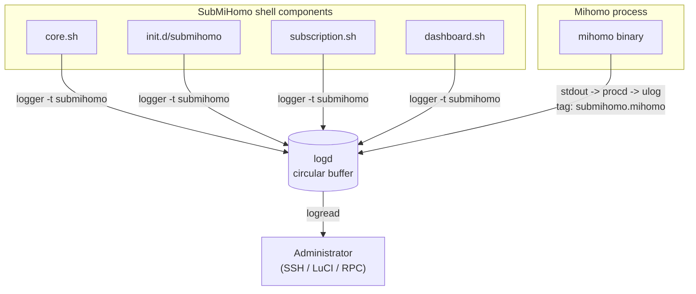
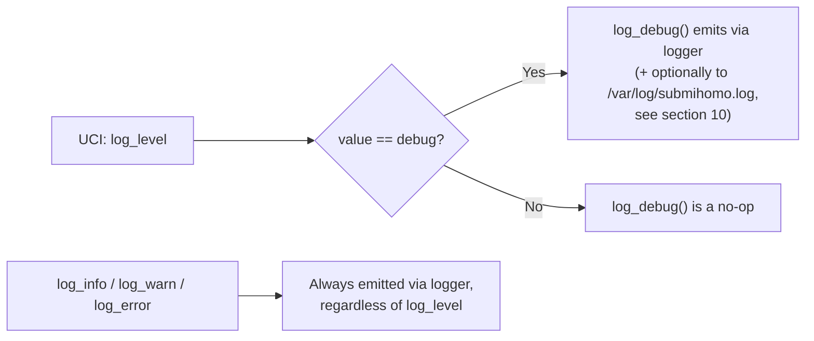
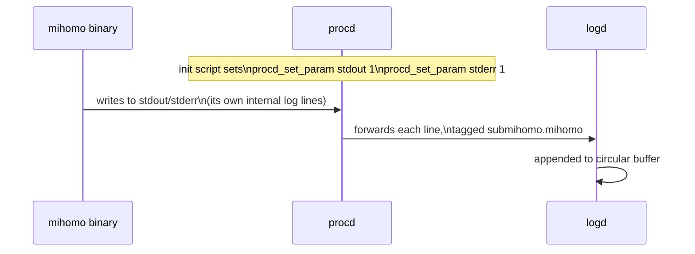
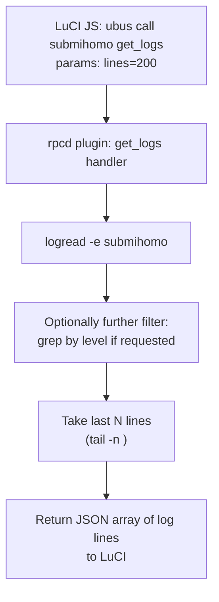
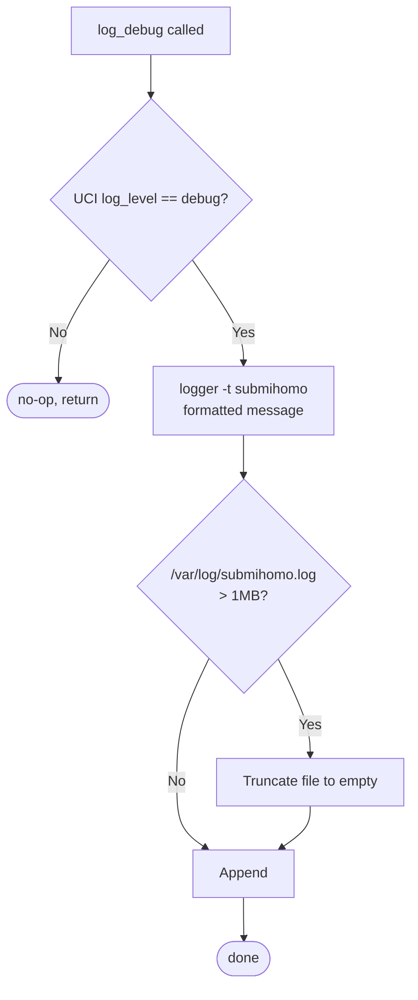

# SubMiHomo — Logging Architecture

## Table of Contents

1. [Logging Philosophy](#1-logging-philosophy)
2. [Log Sources Table](#2-log-sources-table)
3. [Log Level Design](#3-log-level-design)
4. [The `logger` Command Usage Pattern](#4-the-logger-command-usage-pattern)
5. [How to Read Logs](#5-how-to-read-logs)
6. [Mihomo Log Capture via procd](#6-mihomo-log-capture-via-procd)
7. [Module-Level Logging Convention](#7-module-level-logging-convention)
8. [RPC `get_logs` Implementation Design](#8-rpc-get_logs-implementation-design)
9. [Log Format Specification](#9-log-format-specification)
10. [Debug Mode](#10-debug-mode)
11. [Log Persistence](#11-log-persistence)
12. [Privacy Considerations](#12-privacy-considerations)
13. [Troubleshooting Guide Using Logs](#13-troubleshooting-guide-using-logs)
14. [Performance Impact of Logging](#14-performance-impact-of-logging)
15. [Log Message Catalog](#15-log-message-catalog)

---

## 1. Logging Philosophy

SubMiHomo does not implement its own logging subsystem, log file format, or rotation mechanism. It exclusively uses OpenWrt's existing system logging facility — `logd`, accessed via the standard `logger` command for writing and `logread` for reading — for every log message the shell-based components produce. This is a direct application of the project's broader "minimal abstraction, use what the platform already provides" philosophy (`ARCHITECTURE.md` §2.2).

The reasoning behind this choice is threefold:

1. **OpenWrt already solves log storage correctly for this hardware class.** `logd` maintains a fixed-size, circular, RAM-backed buffer (default 64KB, admin-configurable via `/etc/config/system`'s `log_size` option) specifically designed for flash-constrained embedded devices where continuous disk-based log files would both wear flash and eventually consume all available storage. Reinventing this — a custom log file with manual rotation logic — would duplicate functionality the platform already provides reliably, and would risk introducing flash-wear or storage-exhaustion bugs that `logd` has already solved.
2. **Users and administrators already know how to use `logread`.** Anyone who has administered an OpenWrt router has encountered `logread` before. By emitting all messages through the same syslog pipeline as DHCP, firewall, wireless, and every other OpenWrt subsystem, SubMiHomo's logs are immediately accessible using tools the administrator already has muscle memory for, with no new mental model to learn.
3. **A single, unified timeline.** Because SubMiHomo's messages interleave with every other subsystem's log lines in the same `logread` output (ordered by timestamp), an administrator investigating "why did my internet drop for 10 seconds" can see a WAN interface flap, a firewall reload, and a SubMiHomo subscription update side by side in one chronological view — instead of needing to correlate timestamps across multiple disjoint log files.

The corollary of this philosophy is that SubMiHomo intentionally does **not** maintain a persistent, dedicated log file for normal operation — the one exception being an opt-in debug-mode file described in §10, which is itself explicitly bounded and transient.

---

## 2. Log Sources Table

Every component that emits log output is listed below, along with the syslog tag it uses and the nature of what it logs. All SubMiHomo-authored shell code (as opposed to the Mihomo binary itself) uses the single tag `submihomo`, deliberately **not** a per-module tag (e.g. not `submihomo.subscription`, not `submihomo.dashboard`) — see §7 for the rationale on why module identity is embedded in the message body instead of the syslog tag.

| Source | Syslog tag | Content |
|---|---|---|
| `core.sh` and shared shell modules | `submihomo` | Service lifecycle orchestration, cross-module errors, general status transitions |
| `init.d/submihomo` (start/stop/reload) | `submihomo` | Service start/stop events, procd instance setup failures, boot-time validation results |
| Mihomo process itself | `submihomo.mihomo` | Proxy engine's own internal logging: proxy selection decisions, connection lifecycle, DNS resolution activity, any startup errors Mihomo itself emits |
| `subscription.sh` | `submihomo` | Subscription download attempts, each validation level's pass/fail result, hot-reload/restart outcomes, cron entry updates |
| `dashboard.sh` | `submihomo` | Dashboard download attempts (GitHub API fetch, `dist.zip` fetch, extraction result), version stamp writes |

The Mihomo process is the **sole exception** to the unified `submihomo` tag, receiving its own distinct `submihomo.mihomo` tag. This separation exists because Mihomo's log volume and content are qualitatively different from SubMiHomo's own shell-driven lifecycle messages — Mihomo may emit a continuous stream of per-connection log lines at `info` level, and keeping this stream under a distinguishable tag allows `logread -e submihomo.mihomo` to isolate pure proxy-engine chatter from SubMiHomo's own comparatively sparse lifecycle/error messages when both are being watched simultaneously.



---

## 3. Log Level Design

SubMiHomo shell code recognizes four log levels, each exposed as a dedicated shell function so call sites read naturally and consistently across all modules:

| Function | Level | Always logged? | Typical use |
|---|---|---|---|
| `log_debug "msg"` | debug | Only when UCI `log_level = debug` | Verbose internal state useful only when actively troubleshooting: variable values, intermediate command output, step-by-step flow tracing |
| `log_info "msg"` | info | Yes | Normal, expected lifecycle events: "service started", "subscription updated successfully", "dashboard downloaded (v1.9.2)" |
| `log_warn "msg"` | warn | Yes | Non-fatal but noteworthy conditions: "no subscription URL configured", "external controller secret is empty" |
| `log_error "msg"` | error | Yes | Failures that prevented an operation from completing: "subscription download failed: HTTP 403", "mihomo -t validation failed" |

Only `log_debug` output is gated behind the UCI `log_level` setting. `info`, `warn`, and `error` messages are **always** emitted regardless of `log_level`, because these represent the minimum operational visibility needed to understand what the service is doing and whether it's healthy — suppressing them (e.g. to reduce log volume) would undermine the ability to diagnose problems after the fact, which is the entire purpose of having a logging system at all. The only thing `log_level` controls is whether the *additional, verbose* debug tier is also emitted.



This design mirrors standard practice in mature logging frameworks (only the most verbose tier is filterable; baseline operational events are never silenced), adapted to a simple shell-function implementation rather than a full logging library.

---

## 4. The `logger` Command Usage Pattern

Every log emission funnels through a single underlying primitive: OpenWrt's `logger` command, which writes a message into the syslog pipeline with a specified tag. SubMiHomo's four level-functions (`log_debug`, `log_info`, `log_warn`, `log_error`) are thin wrappers around this command, each responsible for:

1. Checking whether the message should be suppressed (only relevant for `log_debug`, per §3).
2. Prefixing the message with a level indicator and module identifier so the raw syslog line is self-describing without needing to know which shell function produced it (see §9 for the exact format).
3. Invoking `logger -t submihomo "<formatted message>"` (or `submihomo.mihomo` for anything sourced from the Mihomo process itself, though in practice the Mihomo binary's own stdout is captured by procd rather than calling `logger` directly — see §6).

Conceptually:

```
log_info "subscription updated successfully"
  -> logger -t submihomo "[INFO] [subscription] subscription updated successfully"

log_error "download failed: HTTP 403"
  -> logger -t submihomo "[ERROR] [subscription] download failed: HTTP 403"
```

Using the single `logger` binary (rather than writing directly to a device node, a named pipe, or a custom file) ensures messages are properly serialized through `logd`'s own locking/ordering, so concurrent log writers (e.g. a cron-triggered subscription update happening at the same moment as a user-triggered LuCI action) never interleave partial lines or corrupt the log stream — a risk that would exist if multiple shell processes wrote directly to a shared file with simple shell redirection instead.

---

## 5. How to Read Logs

The canonical read-back command, used both by administrators via SSH and internally by the RPC `get_logs` method (§8), is:

```sh
logread -e submihomo
```

The `-e` flag performs a substring/pattern filter against `logread`'s full output, matching any line whose syslog tag contains `submihomo` — which, given the tagging scheme in §2, captures both the `submihomo` tag (shell components) and the `submihomo.mihomo` tag (Mihomo process output), since `-e` is a plain substring match rather than an exact-tag match.

Common variations administrators use in practice:

| Command | Purpose |
|---|---|
| `logread -e submihomo` | All SubMiHomo-related log lines (shell + Mihomo), in chronological order |
| `logread -e submihomo.mihomo` | Only Mihomo's own internal proxy-engine log lines, excluding shell lifecycle messages |
| `logread -e submihomo \| grep -v submihomo.mihomo` | Only shell-originated lifecycle/error messages, excluding Mihomo's own chatter |
| `logread -f -e submihomo` | Live-follow mode — new matching lines are printed as they arrive, useful for watching a subscription update or service restart happen in real time |
| `logread -e submihomo \| grep ERROR` | Quickly surface only error-level events across the entire buffer |

Because `logread` reads from the same circular buffer regardless of which flags are used, none of these commands are destructive or consume/clear the log — the same buffer can be queried repeatedly and by multiple tools (a human SSH session and the RPC `get_logs` method, for instance) without interfering with each other.

---

## 6. Mihomo Log Capture via procd

Mihomo is launched as a procd-managed service instance (`ARCHITECTURE.md` §6.4), and its init script instance definition sets:

```
procd_set_param stdout 1
procd_set_param stderr 1
```

This instructs procd to capture the process's stdout/stderr streams and route them into the system log itself, rather than allowing them to be discarded (the default for a backgrounded daemon with no explicit redirection) or written to an arbitrary file. procd internally tags captured output using the service instance's name, which SubMiHomo's init script names such that the resulting syslog tag is `submihomo.mihomo` (a service-instance-qualified tag, distinguishing it from the shell components' plain `submihomo` tag).

This means **Mihomo's own internal logging** — controlled by Mihomo's own `log-level` config key (itself sourced from UCI, independent of SubMiHomo's shell-level `log_level` option, though administrators typically set both consistently) — flows into the exact same `logd` circular buffer as every shell-emitted message, without SubMiHomo needing to write any explicit capture/forwarding code. procd's stdout/stderr capture *is* the entire mechanism; there is no additional log-shipping, `tail -f`-and-pipe, or named-pipe wiring involved.



---

## 7. Module-Level Logging Convention

Every shell module in SubMiHomo follows a consistent logging convention so that reading a chronological `logread -e submihomo` stream is enough to reconstruct what the service was doing, without needing to read source code alongside it:

- **Start and end of significant operations are both logged.** For example, `subscription_update()` logs `log_info "subscription update starting (url configured)"` at entry and either `log_info "subscription update completed successfully"` or a specific `log_error` describing the failure reason at exit — there is no code path where an operation silently completes or silently fails with nothing written to the log.
- **Every error condition includes the specific, concrete reason**, not a generic failure message. Compare `log_error "update failed"` (unhelpful) to `log_error "subscription download failed: HTTP 403 Forbidden"` (immediately actionable) — the latter is the required convention throughout the codebase.
- **Module identity is embedded in the message text, not the syslog tag.** As noted in §2, all shell modules share the single `submihomo` tag rather than each having their own (`submihomo.subscription`, `submihomo.dashboard`, etc.). Instead, each log function call includes a bracketed module label as part of the formatted message body (see the exact format in §9): `[subscription]`, `[dashboard]`, `[core]`, `[init]`. This keeps the *tag* namespace small and predictable (useful for the coarse `logread -e submihomo` / `logread -e submihomo.mihomo` split in §5) while still preserving fine-grained module attribution for anyone reading or `grep`-ing the message bodies themselves.
- **State transitions are logged at `info` level**, while diagnostic detail leading up to a transition is logged at `debug` level. For example, a subscription update logs each validation level's outcome at `debug` (`"level 2 validation: proxies key found, 47 proxy entries detected"`), but only the overall terminal outcome (`"subscription update completed successfully"` or the specific failure) at `info`/`error` — so that a non-debug administrator sees a clean, high-signal timeline, while a debug-mode administrator sees the full step-by-step trace.

---

## 8. RPC `get_logs` Implementation Design

The `get_logs` rpcd method exists so LuCI's JavaScript frontend can display recent log activity in the browser without requiring SSH access. Its implementation is a thin wrapper around the same `logread` command an administrator would run manually:



Design characteristics:

- **Filtering is delegated to `logread -e submihomo`**, exactly as described in §5 — the RPC method does not reimplement pattern matching, it reuses the same substring filter an administrator would type by hand, guaranteeing the RPC output and a manual SSH `logread` invocation are always consistent with each other.
- **A `lines` parameter bounds the response size.** Since `logread`'s underlying buffer could (depending on `log_size` configuration) contain a large volume of interleaved system-wide log content, the RPC method takes the tail of the filtered output rather than returning the entire buffer, keeping the ubus/ RPC payload — and the resulting browser-side render — bounded and responsive. A sensible default (e.g. 200 lines) is used when the caller does not specify one.
- **No log-level-specific server-side filtering by default**, though the RPC accepts an optional level filter (e.g. only `ERROR`/`WARN` lines) for LuCI views that want to highlight problems specifically (such as a "recent errors" widget on the overview page) without requiring the browser to fetch and locally filter the full log text.
- **Read-only, side-effect-free.** `get_logs` never clears, rotates, or mutates the underlying `logd` buffer — it is purely a query. This is reflected in the rpcd ACL model (`ARCHITECTURE.md` §11.3), where `get_logs` is available to the read-only `luci-user` role, not restricted to `luci-admin`.

---

## 9. Log Format Specification

Every message emitted by SubMiHomo's shell-level `log_*` functions follows a single, consistent textual format, so that both human readers and any future automated log-scraping tooling can parse it reliably:

```
[TIMESTAMP] [LEVEL] [MODULE] message
```

| Field | Source | Example |
|---|---|---|
| `TIMESTAMP` | Supplied automatically by `logd`/`logread` itself (syslog's own timestamp prefix), not embedded redundantly by SubMiHomo's own message text | `Wed Jul  2 14:33:07 2026` |
| `LEVEL` | One of `DEBUG`, `INFO`, `WARN`, `ERROR`, uppercase, set by which `log_*` function was called | `[ERROR]` |
| `MODULE` | The calling module's short label, hardcoded per module (`core`, `init`, `subscription`, `dashboard`) | `[subscription]` |
| `message` | Free-text, human-readable description of the event, including concrete specifics per the convention in §7 | `download failed: HTTP 403 Forbidden` |

A representative full log line, as it would appear under `logread -e submihomo`:

```
Wed Jul  2 14:33:07 2026 daemon.err submihomo[1421]: [ERROR] [subscription] download failed: HTTP 403 Forbidden
```

Here, `Wed Jul 2 14:33:07 2026 daemon.err submihomo[1421]:` is syslog's own standard prefix (timestamp, facility.severity, tag and PID) generated by `logd`/`logger` itself, and `[ERROR] [subscription] download failed: HTTP 403 Forbidden` is the message body SubMiHomo constructed. This deliberate separation means SubMiHomo's own formatting logic never needs to generate or track timestamps itself (avoiding clock-skew or formatting-inconsistency bugs), while still providing structured, greppable `[LEVEL]`/`[MODULE]` markers within the body for anyone filtering with plain-text tools.

---

## 10. Debug Mode

When UCI `log_level` is set to `debug`, two things change relative to normal operation:

1. **`log_debug()` calls are no longer suppressed** — every debug-tier message throughout the codebase begins flowing into the normal `logd` circular buffer via `logger`, exactly like `info`/`warn`/`error` messages (§3).
2. **`log_debug()` additionally writes to a dedicated file**, `/var/log/submihomo.log`, located on tmpfs (RAM-backed, not flash) and therefore **lost on every reboot** — this file exists purely as a debugging convenience for an active troubleshooting session, not as a persistence mechanism.

### Why a separate debug file at all, if `logd` already captures debug messages?

`logd`'s circular buffer is shared across the *entire* system (DHCP, firewall, wireless, every other subsystem's log output all compete for the same fixed-size buffer). During an intensive debugging session, SubMiHomo's own debug-tier output — which can be considerably more verbose than normal operation (per-validation-step tracing, intermediate variable dumps) — could be evicted from the shared circular buffer relatively quickly if other subsystems are also logging heavily, especially on a router with a small configured `log_size`. The dedicated file gives a debugging administrator a stable, SubMiHomo-only view of the *most recent* debug session that isn't competing for space with unrelated system log volume.

### Size bound and truncation

`log_debug()` checks the size of `/var/log/submihomo.log` before appending and truncates it if it exceeds **1MB**, preventing unbounded growth of a tmpfs-resident file (which consumes RAM, not flash, but RAM is at least as constrained on this hardware class — `ARCHITECTURE.md` §12.1). Truncation is a simple "reset to empty and continue" operation rather than a rotating multi-file scheme (e.g. `.log.1`, `.log.2`), consistent with the project's preference for the simplest mechanism that satisfies the actual need — a debugging session's *most recent* verbose trace, not a historical archive.



### When to enable debug mode

Debug mode should be enabled only for the duration of active troubleshooting (e.g. reproducing a subscription update failure, tracing a config-generation issue) and disabled afterward, since sustained debug-level logging increases both log volume competing with other subsystems in the shared `logd` buffer and the frequency of writes to the tmpfs debug file.

---

## 11. Log Persistence

| Storage | Backing | Survives reboot? | Bounded by |
|---|---|---|---|
| `logd` circular buffer (all levels, all sources) | RAM | No | `log_size` in `/etc/config/system` (default 64KB) |
| `/var/log/submihomo.log` (debug mode only) | tmpfs (RAM) | No | 1MB, self-truncating (§10) |

**Nothing SubMiHomo logs is persisted across a reboot.** This is a deliberate consequence of relying entirely on RAM-backed logging facilities (per the philosophy in §1) rather than writing to flash. The practical implication for administrators: if a problem is observed, logs describing its cause should be captured (via `logread -e submihomo` over SSH, or the LuCI log viewer backed by `get_logs`) **before** rebooting the router, since a reboot clears the buffer entirely. This trade-off is considered acceptable given the alternative (flash-based persistent logging) would introduce flash wear-leveling concerns on a device class where flash write endurance is a real constraint, for a feature (historical log archaeology across reboots) that is rarely needed for a proxy service's day-to-day operation.

---

## 12. Privacy Considerations

A deliberate design constraint across every log-emitting code path is that **the subscription URL is never logged**, in whole or in part, under any log level including debug. This matters because, as established in `SUBSCRIPTIONS.md` §11, the subscription URL frequently embeds an authentication token equivalent to a bearer credential for the user's proxy provider account. If this token were ever written to `logread` output, it would be visible to:

- Any local user with permission to run `logread` (which, depending on the router's user model, may be broader than who can read `/etc/config/submihomo` directly, since UCI config files are `0600` while `logread` access is generally available to any authenticated shell session).
- The LuCI `get_logs` RPC method, which per the ACL model (`ARCHITECTURE.md` §11.3) is available even to the read-only `luci-user` role — a role explicitly intended to *not* have access to sensitive configuration.

Instead, all subscription-related log messages describe **outcomes and statuses only**: `"subscription update starting"`, `"download failed: HTTP 403"`, `"subscription update completed successfully"`, `"no proxies found in subscription"`. None of these carry the URL, any query-string token, or any content from the subscription body itself (proxy server hostnames, UUIDs, passwords). The same principle extends to the `external_controller_secret` — it is never logged, even when a hot-reload API call using it fails, since the failure reason (`"connection refused"`, `"HTTP 401"`) is sufficient for diagnosis without echoing the credential itself.

This constraint is treated as an invariant of the codebase, not an optional hardening step — any new log call site that would include a URL, secret, or proxy credential in its message text is considered a defect.

---

## 13. Troubleshooting Guide Using Logs

The following table maps commonly observed log messages (as they'd appear via `logread -e submihomo`) to their likely cause and the corresponding next diagnostic step. This complements the more general check-based troubleshooting flow in `DIAGNOSTICS.md`.

| Log message pattern | Likely cause | What to check next |
|---|---|---|
| `[WARN] [subscription] no subscription URL configured` | Fresh install, or URL was cleared | Configure `subscription_url` in LuCI/UCI; expected on first run (see `SUBSCRIPTIONS.md` §8) |
| `[ERROR] [subscription] URL must be HTTPS` | User entered an `http://` URL, or a malformed URL | Correct the URL in UCI to use `https://` |
| `[ERROR] [subscription] download failed: HTTP 403 Forbidden` (or 401/404) | Subscription token expired, revoked, or provider changed the URL | Re-check the subscription URL/token with the provider; regenerate if expired |
| `[ERROR] [subscription] download failed: timeout` | WAN connectivity issue, or provider's server is slow/down | Check general internet connectivity (`DIAGNOSTICS.md` check #12); retry later |
| `[ERROR] [subscription] no proxies found in subscription` | Provider returned an empty or placeholder response (e.g. an account-suspended landing page instead of the real subscription) | Verify the subscription URL directly in a browser or via `wget` from another machine |
| `[ERROR] [subscription] mihomo -t validation failed` | Subscription content is syntactically malformed, or references unsupported proxy types/fields | Enable debug mode (§10) and re-run the update to capture `mihomo -t`'s specific parse error in the debug log |
| `[INFO] [subscription] subscription update completed successfully` | Normal successful update | No action needed |
| `[ERROR] [dashboard] could not reach GitHub API` | No WAN connectivity at the time of the attempt, or GitHub is rate-limiting/unreachable | Retry later via `submihomo-ctl dashboard`; verify general connectivity |
| `[ERROR] [dashboard] dist.zip asset not found in latest release` | Upstream Zashboard project changed its release asset naming | This indicates an upstream compatibility issue requiring a SubMiHomo update; report the issue |
| `[WARN] [core] external controller secret is empty` | No `external_controller_secret` configured in UCI | Set a secret in LuCI settings to secure the dashboard/API (`DASHBOARD.md` §11) |
| Lines tagged `submihomo.mihomo` showing repeated connection errors to a specific proxy node | A specific subscription proxy server is down or unreachable | Switch the active proxy-group selection away from that node via the dashboard, or wait for the provider to restore it |
| Absence of any `submihomo.mihomo` lines at all, ever | Mihomo process never started, or procd stdout/stderr capture isn't wired up | Check process status directly (`DIAGNOSTICS.md` check #1) and init script logs for startup failures |

---

## 14. Performance Impact of Logging

Logging is a background, non-blocking concern for SubMiHomo's shell components, but it is still worth being deliberate about its cost on constrained hardware:

- **`logger` invocations are individual process forks.** Each call to `log_info`/`log_warn`/`log_error`/`log_debug` spawns a short-lived `logger` process (BusyBox's built-in applet, not a heavyweight external binary), but a fork/exec nonetheless. On a mipsel_24kc router with a modest CPU, this is negligible for the actual call volume SubMiHomo produces during normal operation (lifecycle events, occasional subscription updates), which is on the order of a handful of log lines per hour of steady-state operation, not a high-frequency per-packet logging pattern.
- **Mihomo's own log volume is the dominant contributor, not SubMiHomo's shell code.** Because Mihomo's stdout/stderr is captured continuously by procd (section 6), the practical log volume flowing into `logd` is overwhelmingly driven by Mihomo's own configured `log-level` (its internal connection/DNS/selection logging), not by SubMiHomo's comparatively sparse shell-level messages. Administrators concerned about log volume or its marginal CPU/RAM cost on very constrained hardware should tune Mihomo's own `log-level` (typically to `warning` or `error` for normal use), independent of SubMiHomo's `log_level` UCI option, which only governs the shell-level `log_debug` gate described in section 3.
- **Debug mode's file-write path (section 10) adds a small additional cost per debug call** — a file size check and a conditional append/truncate on `/var/log/submihomo.log`, which resides on tmpfs (RAM), so this is a memory-bandwidth cost rather than a flash-write cost, and is only active when `log_level=debug` is explicitly set, not during normal operation.
- **No log message is ever synchronously blocking on network I/O or slow storage.** Because everything terminates at `logd`'s in-memory circular buffer (or, for debug mode, a tmpfs file), no log call can stall waiting on flash write latency or a network filesystem, keeping logging calls fast and predictable regardless of overall system load.

---

## 15. Log Message Catalog

The table below is a representative (not exhaustive) catalog of the specific log messages emitted at each level across the modules described in section 2, useful as a quick reference when correlating `logread` output back to the operation that produced it.

| Module | Level | Representative message |
|---|---|---|
| `core` | info | `service starting` |
| `core` | info | `service stopped` |
| `core` | warn | `external controller secret is empty` |
| `core` | error | `config generation failed, aborting start` |
| `init` | info | `procd instance registered` |
| `init` | error | `pre-start validation failed: generated config invalid` |
| `subscription` | info | `subscription update starting` |
| `subscription` | debug | `level 1 validation: HTTP 200, 84213 bytes` |
| `subscription` | debug | `level 2 validation: proxies key found, 47 proxy entries detected` |
| `subscription` | debug | `level 3 validation: mihomo -t exit 0` |
| `subscription` | info | `subscription update completed successfully` |
| `subscription` | warn | `no subscription URL configured` |
| `subscription` | error | `URL must be HTTPS` |
| `subscription` | error | `download failed: HTTP 403 Forbidden` |
| `subscription` | error | `download failed: timeout after 30s` |
| `subscription` | error | `subscription exceeds 5MB size limit` |
| `subscription` | error | `no proxies found in subscription` |
| `subscription` | error | `mihomo -t validation failed` |
| `subscription` | info | `hot-reload succeeded via API` |
| `subscription` | warn | `hot-reload API call failed, falling back to restart` |
| `dashboard` | info | `dashboard download starting` |
| `dashboard` | info | `dashboard downloaded successfully (v1.9.2)` |
| `dashboard` | error | `could not reach GitHub API` |
| `dashboard` | error | `dist.zip asset not found in latest release` |
| `dashboard` | error | `dist.zip download failed` |
| `dashboard` | error | `extraction failed, dashboard directory may be incomplete` |

This catalog is not a strict contract (message text may be refined over time for clarity), but the `[LEVEL] [MODULE]` structure and the presence of concrete, specific detail in every non-info message (per the convention in section 7) is the invariant that should hold across any future additions to this table.

---

### Summary

SubMiHomo's logging design treats OpenWrt's own `logd`/`logger`/`logread` toolchain as the entire logging subsystem, deliberately avoiding custom log files, rotation logic, or persistence mechanisms for normal operation. A small, well-defined set of shell-level conventions (four log levels, a fixed message format, module labels embedded in message text, and a strict no-credentials-in-logs rule) ensures the resulting log stream is consistent, greppable, privacy-respecting, and immediately familiar to anyone who has administered an OpenWrt router before.
