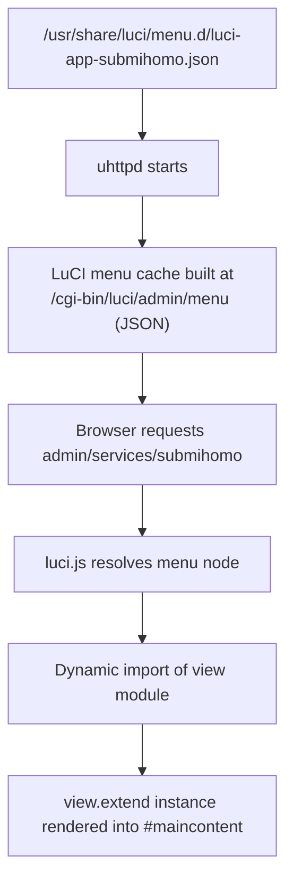
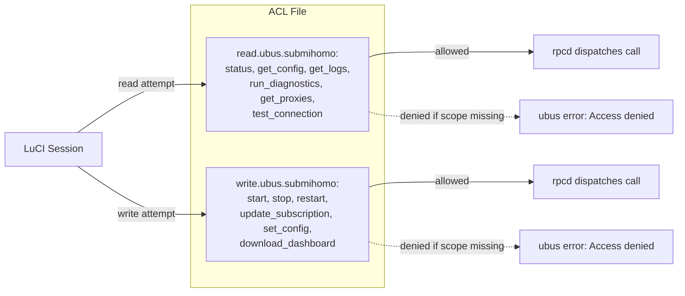
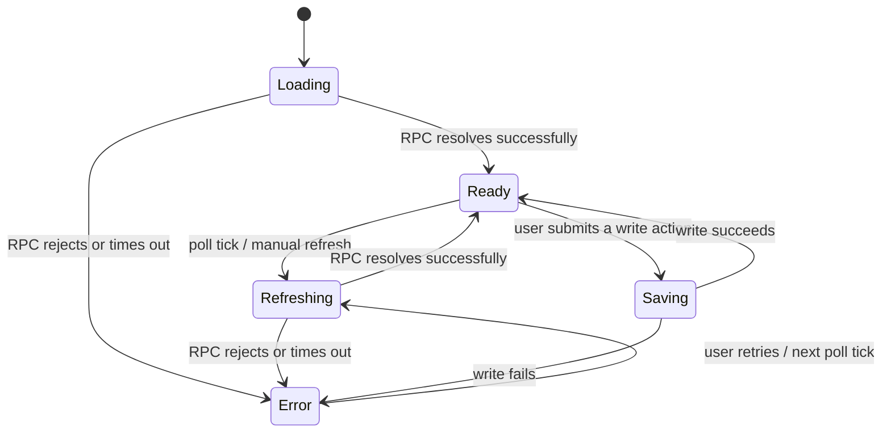
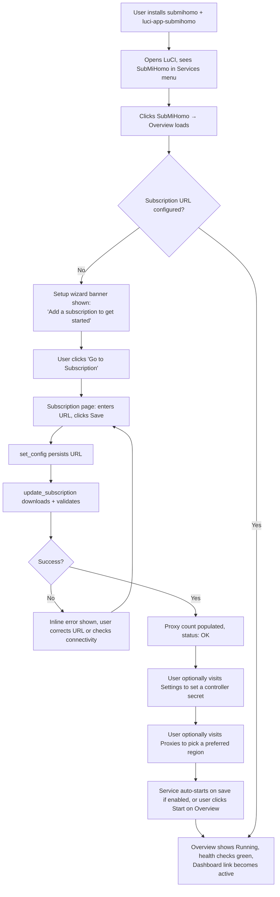
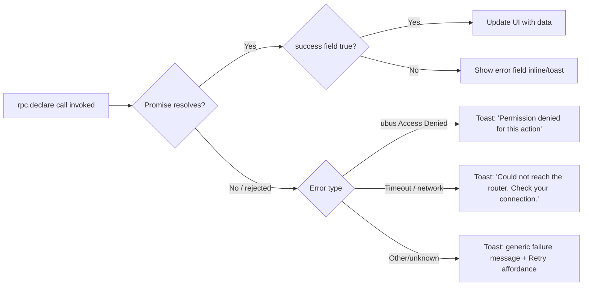
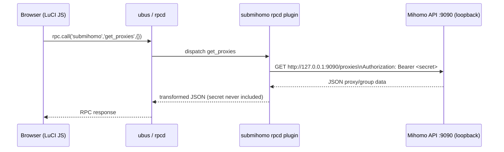
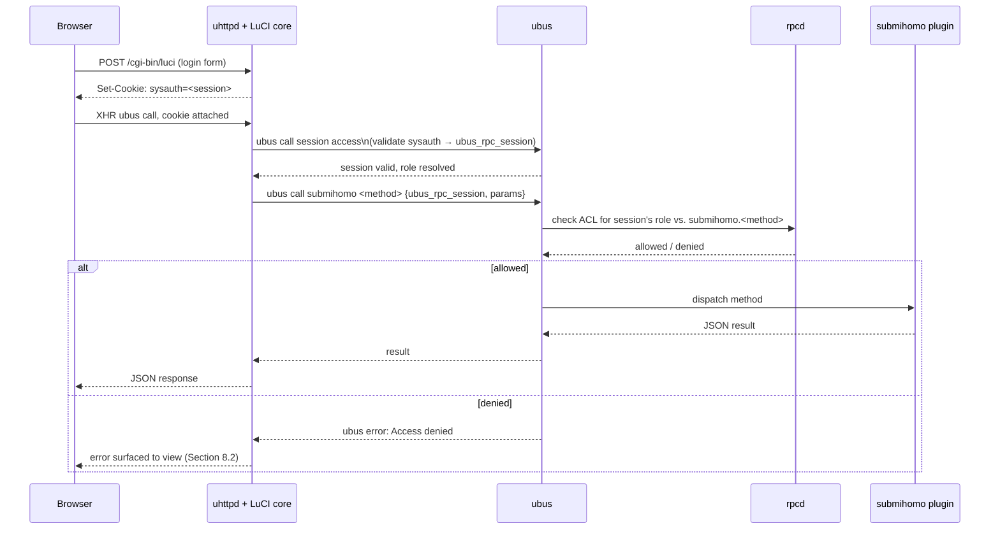
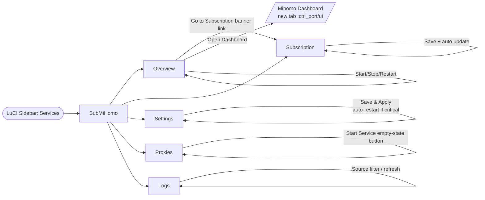
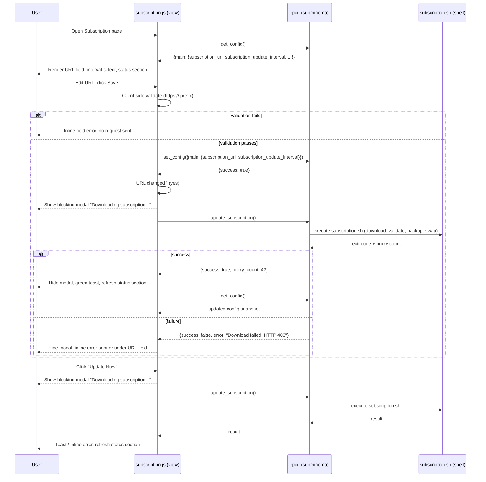

# SubMiHomo — LuCI Frontend Architecture

## Table of Contents

1. [LuCI JS Framework Overview](#1-luci-js-framework-overview)
2. [Navigation Structure](#2-navigation-structure)
3. [ACL System](#3-acl-system)
4. [Page Specifications](#4-page-specifications)
   - [4.1 Overview](#41-overview-page)
   - [4.2 Subscription](#42-subscription-page)
   - [4.3 Settings](#43-settings-page)
   - [4.4 Proxies](#44-proxies-page)
   - [4.5 Logs](#45-logs-page)
5. [Frontend/Backend Communication Pattern](#5-frontendbackend-communication-pattern)
6. [State Management](#6-state-management)
7. [User Workflow Walkthrough](#7-user-workflow-walkthrough)
8. [UX Error Handling](#8-ux-error-handling)
9. [Internationalization](#9-internationalization)
10. [The Setup Wizard Concept](#10-the-setup-wizard-concept)
11. [Mobile Responsiveness Considerations](#11-mobile-responsiveness-considerations)
12. [LuCI ↔ Mihomo API Interaction](#12-luci--mihomo-api-interaction)
13. [Performance](#13-performance)
14. [Security](#14-security)
15. [Diagram: Page Navigation Flow](#15-diagram-page-navigation-flow)
16. [Diagram: Subscription Page Interaction Sequence](#16-diagram-subscription-page-interaction-sequence)

---

## 1. LuCI JS Framework Overview

SubMiHomo's web interface is built exclusively on the **modern LuCI JS framework** introduced in OpenWrt 21.02 and matured through OpenWrt 25+. It deliberately avoids the legacy CBI (Configuration Bind Interface) Lua templating system and the "classic" server-rendered LuCI pages. This decision is not incidental — CBI pages require Lua template files (`.htm`), server-side form processing, and full-page reloads on every interaction. LuCI JS pages are single-page-application fragments loaded once by the LuCI JS runtime shell (`luci.js`), and they communicate with the backend exclusively through asynchronous `XMLHttpRequest`-based calls, either to `ubus` (via `rpc.js`) or to plain HTTP JSON endpoints (via `L.Request`).

### 1.1 Runtime model

Every SubMiHomo view is a single ECMAScript module located under:

```
/htdocs/luci-static/resources/view/submihomo/<page>.js
```

Each file calls `L.require()` or ES module imports (`luci.js`, `luci.form.js`, `luci.ui.js`, `luci.rpc.js`) and returns a class produced by `view.extend({...})`. The LuCI JS runtime:

1. Reads the requested URL path (e.g., `admin/services/submihomo/subscription`).
2. Resolves the menu tree (built by the server from `/usr/share/luci/menu.d/*.json` and cached to a JSON blob served at `/cgi-bin/luci/admin/menu`).
3. Dynamically imports the JS module bound to that menu node's `action.path`.
4. Instantiates the view class and calls its lifecycle methods in order: `load()` → `render(data)` → (user interaction handlers) → `handleSave()` / `handleSaveApply()` (if the view uses `form.Map`) or custom handlers (if the view is a plain `view.extend` without a form map).

### 1.2 Key framework primitives used by SubMiHomo

| Primitive | Purpose | Used by |
|---|---|---|
| `view.extend({ load, render })` | Base class for all five SubMiHomo pages | All pages |
| `rpc.declare({ object, method, params, expect })` | Declares a strongly-typed ubus RPC call bound to the `submihomo` ubus object | All pages |
| `poll.add(fn, interval)` | Registers a recurring background refresh callback tied to the view's lifecycle (automatically stopped on navigation away) | Overview, Proxies, Logs |
| `ui.Table` | Renders tabular data (proxy lists, config summaries) without a full CBI form | Proxies, Overview (health checks) |
| `ui.Textfield`, `ui.Select`, `ui.Checkbox` | Standalone form widgets used outside `form.Map` when a full UCI-bound form model is unnecessary (e.g., the Subscription URL field, which triggers custom validation logic) | Subscription, Settings |
| `form.Map`, `form.Section`, `form.Value` | Declarative UCI-bound form generation for straightforward option/value pairs | Settings |
| `ui.showModal()` / `ui.hideModal()` | Modal dialogs for confirmations (e.g., "Restore from backup?") and blocking progress indicators (e.g., subscription update in progress) | Subscription, Settings |
| `ui.addNotification()` | Toast-style success/error banners | All pages |
| `L.resolveDefault(promise, fallback)` | Promise wrapper that swallows RPC failures and substitutes a safe default, used heavily to avoid unhandled rejection crashes when the service is stopped | All pages |

### 1.3 Why not CBI/form.Map for every page

SubMiHomo mixes two paradigms deliberately:

- **Settings** uses `form.Map` almost entirely because its fields map 1:1 onto UCI options with well-understood validation semantics (integers, booleans, enumerations). `form.Map` gives us automatic UCI read/write, automatic "Save & Apply" button wiring, and built-in per-field validation feedback for free.
- **Overview, Subscription, Proxies, and Logs** use plain `view.extend` classes with manually constructed DOM (via `E()`, LuCI's hyperscript-style element builder) because their data does not originate from UCI alone — it is a blend of UCI values, live process state, and live Mihomo API state, refreshed on a timer. Forcing this into `form.Map` would fight the framework rather than leverage it.

This hybrid approach is standard practice among modern first-party LuCI apps (e.g., `luci-app-mwan3`, `luci-app-wireguard`) and is the recommended pattern per the OpenWrt LuCI JS porting documentation.

---

## 2. Navigation Structure

### 2.1 Menu registration

LuCI JS menus are declared as static JSON files under `/usr/share/luci/menu.d/`. SubMiHomo ships exactly one menu file: `luci-app-submihomo.json`. Each key is a menu path relative to `admin/`; each value describes the page's title, its position among siblings (`order`), the view module it resolves to, and (optionally) the ACL scope required to see the entry at all.



The menu tree registered by SubMiHomo is exactly the five-node tree specified in the project brief: a parent entry (`admin/services/submihomo`, order 60, acting as the Overview page itself) and four child entries beneath it (`subscription` order 10, `settings` order 20, `proxies` order 30, `logs` order 40). Because the parent node's `action.path` is `submihomo/overview`, visiting the top-level "SubMiHomo" menu item and visiting "Overview" via tab navigation are the same destination — there is no redundant intermediate index page.

### 2.2 Tab bar rendering

LuCI JS automatically renders a horizontal tab bar for any menu node that has children, using the `order` field to determine left-to-right position. This gives SubMiHomo the following tab bar, present on all five pages:

```
[ Overview ]  [ Subscription ]  [ Settings ]  [ Proxies ]  [ Logs ]
```

This tab bar is generated entirely from the menu JSON — no SubMiHomo-specific navigation code is required in any view file. Each view is otherwise independent and does not need to know about its siblings.

### 2.3 URL scheme

| Menu path | Resulting URL | View module |
|---|---|---|
| `admin/services/submihomo` | `/cgi-bin/luci/admin/services/submihomo` | `view/submihomo/overview.js` |
| `admin/services/submihomo/subscription` | `/cgi-bin/luci/admin/services/submihomo/subscription` | `view/submihomo/subscription.js` |
| `admin/services/submihomo/settings` | `/cgi-bin/luci/admin/services/submihomo/settings` | `view/submihomo/settings.js` |
| `admin/services/submihomo/proxies` | `/cgi-bin/luci/admin/services/submihomo/proxies` | `view/submihomo/proxies.js` |
| `admin/services/submihomo/logs` | `/cgi-bin/luci/admin/services/submihomo/logs` | `view/submihomo/logs.js` |

### 2.4 Menu visibility gating

The parent menu node's `depends.acl` references the `luci-app-submihomo` ACL scope name (see Section 3). If a logged-in LuCI user's role does not grant even read access to this scope, the entire "SubMiHomo" entry — including all four children — is omitted from the sidebar. This is standard LuCI behavior: ACL-gated menu nodes are filtered server-side when the menu JSON is generated, so unauthorized users cannot discover the feature exists by inspecting client-side JavaScript.

---

## 3. ACL System

### 3.1 How LuCI JS + rpcd ACLs interact

OpenWrt's permission model for LuCI JS pages is **not** based on classic Unix users; it is based on `rpcd` ACL groups matched against the authenticated LuCI session's role (`root` sessions implicitly have full access; non-root sessions are matched against ACL group JSON files in `/usr/share/rpcd/acl.d/`). SubMiHomo ships exactly one ACL group definition, `luci-app-submihomo`, in `/usr/share/rpcd/acl.d/luci-app-submihomo.json`.

An ACL group JSON file declares two independent permission sets:

- **`read`**: methods and UCI config sections the session may query without modifying anything.
- **`write`**: methods and UCI config sections the session may invoke or modify.



### 3.2 Practical implication for each page

| Page | Methods invoked | ACL class required |
|---|---|---|
| Overview | `status`, `run_diagnostics`, `get_proxies` (traffic/connections via Mihomo API forwarding) | read (write only if Start/Stop/Restart buttons are clicked) |
| Subscription | `get_config`, `update_subscription`, `set_config` | read + write |
| Settings | `get_config`, `set_config` | read + write |
| Proxies | `get_proxies`, (proxy selection and latency test call the Mihomo API directly through a thin RPC forwarding method — see Section 12) | read (proxy selection is a write-class action even though it does not touch UCI, because it changes live system behavior) |
| Logs | `get_logs` | read |

A read-only LuCI account (one whose role grants only the `read` block of the ACL) can view every page, see live status, tail logs, and inspect proxy state — but every button that performs a write action (Start/Stop/Restart, Save on Subscription/Settings, proxy group selection) is either hidden or rendered disabled with a tooltip explaining "Your account does not have permission to modify SubMiHomo configuration." This is implemented by checking `L.hasViewPermission()` / by inspecting the resolved ACL scopes returned from the session ACL query LuCI performs at login, and gating `ui.Button` disabled state accordingly.

### 3.3 UCI-level ACL

In addition to the `ubus` method grants, the ACL file grants `read`/`write` on the UCI config section `submihomo` itself. This matters because `form.Map`-based pages (Settings) may, depending on LuCI core version, perform a secondary direct UCI read (`uci` ubus object, not the `submihomo` custom object) for autocomplete or default-value purposes. Without this grant, `form.Map` would fail to load default values even if the custom RPC methods were separately permitted.

---

## 4. Page Specifications

### 4.1 Overview Page

**Route**: `admin/services/submihomo` · **File**: `view/submihomo/overview.js`

#### 4.1.1 Layout mockup (textual)

```
┌──────────────────────────────────────────────────────────────────┐
│  SubMiHomo                                                        │
│  ┌────────────┬────────────┬────────────┬────────────┬─────────┐  │
│  │  Overview  │Subscription│  Settings  │  Proxies   │  Logs   │  │
│  └────────────┴────────────┴────────────┴────────────┴─────────┘  │
│                                                                    │
│  ● Running          [ Stop ]  [ Restart ]                         │
│  Mihomo 1.18.6  ·  SubMiHomo 1.0.0                                 │
│                                                                    │
│  ┌ Subscription ─────────────────────────────────────────────┐    │
│  │ URL:  https://exam...5f8a2c (masked)                      │    │
│  │ Last update: 2026-07-02 08:00:14   Proxies: 42             │    │
│  └────────────────────────────────────────────────────────────┘   │
│                                                                    │
│  ┌ Health ───────────────────────────────────────────────────┐    │
│  │  ✔ Process   ✔ DNS   ✔ Firewall   ✔ Connectivity           │    │
│  └────────────────────────────────────────────────────────────┘   │
│                                                                    │
│  ┌ Traffic ──────────────────────────┐  ┌ Connections ────────┐   │
│  │ ↑ Upload:   1.2 GB                │  │ Active: 37           │   │
│  │ ↓ Download: 8.7 GB                │  └───────────────────────┘  │
│  └────────────────────────────────────┘                           │
│                                                                    │
│  [ Open Dashboard ↗ ]      [ Download Dashboard ]  (if absent)     │
└──────────────────────────────────────────────────────────────────┘
```

#### 4.1.2 Data elements

| Element | Source | RPC/API call |
|---|---|---|
| Status indicator (green/red dot) + text (Running/Stopped/Error) | `status.running`, derived error state | `status` |
| Mihomo version | `status.version` | `status` |
| SubMiHomo version | Static string baked into the view at package build time (read from a small `version.js` constant module shipped alongside the view, or embedded in the ACL/menu package metadata) | none (build-time constant) |
| Subscription URL (masked) | `status.subscription_url_masked` | `status` |
| Last update timestamp | `status.last_update` (Unix epoch, rendered via `luci.utils.formatDate` / manual `Date` formatting) | `status` |
| Proxy count | `status.proxy_count` | `status` |
| Health check icons (process/DNS/firewall/connectivity) | `run_diagnostics().checks[]` | `run_diagnostics` |
| Traffic upload/download totals | Mihomo API `/traffic` or the cumulative counters surfaced by `/connections` | forwarded via `get_proxies`-adjacent RPC, see Section 12 |
| Active connections count | Mihomo API `/connections` (count of `connections[]`) | forwarded via RPC |
| Dashboard link | `status.ctrl_port`, current `window.location.hostname` | none (constructed client-side as `http://<host>:<ctrl_port>/ui`) |
| "Download Dashboard" visibility | `status.has_dashboard === false` | `status` |

#### 4.1.3 Actions

| Control | Behavior |
|---|---|
| Start | Calls `start()`. Disabled while `status.running === true`. Shows a spinner overlay on the status card while in flight. |
| Stop | Calls `stop()`. Prompts a confirmation modal ("Stopping SubMiHomo will disable proxying for all clients. Continue?"). |
| Restart | Calls `restart()`. No confirmation (restart is non-destructive to configuration). |
| Open Dashboard | Opens `http://<router-ip>:<ctrl_port>/ui` in a new browser tab via `window.open(url, '_blank')`. Disabled (with tooltip) if `has_dashboard === false` or `status.running === false`. |
| Download Dashboard | Calls `download_dashboard()`. Shown only when `has_dashboard === false`. Displays a modal progress indicator because this call may take up to 120 seconds (per the RPC timeout budget documented in `RPC.md`). |

#### 4.1.4 Auto-refresh behavior

The Overview page registers a `poll.add()` callback at a **10-second interval** that re-fetches `status()`, `run_diagnostics()` (throttled — see below), and the Mihomo traffic/connections forwarding call. `run_diagnostics()` is more expensive than `status()` (it performs live checks including a connectivity test), so the view calls it at a **reduced cadence of once per 30 seconds** by keeping an internal tick counter and only invoking it on every third poll cycle. `poll.add()` callbacks are automatically unregistered by the LuCI JS runtime when the user navigates to a different tab, so no manual cleanup code is required in `load()`/`render()`.

---

### 4.2 Subscription Page

**Route**: `admin/services/submihomo/subscription` · **File**: `view/submihomo/subscription.js`

#### 4.2.1 Layout mockup

```
┌──────────────────────────────────────────────────────────────────┐
│  Subscription URL                                                  │
│  ┌──────────────────────────────────────────────────────────────┐ │
│  │ https://provider.example.com/sub/abcdef1234567890...          │ │
│  └──────────────────────────────────────────────────────────────┘ │
│  Must begin with https://                                          │
│                                                                     │
│  [ Save ]   [ Update Now ]                                         │
│                                                                     │
│  Status: OK        Last update: 2026-07-02 08:00:14                │
│  Proxies: 42        Update interval: [ 24h ▾ ]                     │
│                                                                     │
│  ┌ Subscription Contents ─────────────────────────────────────┐    │
│  │  vmess: 18   trojan: 12   ss: 8   vless: 4                  │    │
│  │  Groups: PROXY, Auto, Fallback, HK, US, JP                   │    │
│  └────────────────────────────────────────────────────────────┘    │
│                                                                     │
│  Restore from backup ↺  (last known-good, taken 2026-06-28)        │
└──────────────────────────────────────────────────────────────────┘
```

#### 4.2.2 Form design and validation

| Field | Widget | Client-side validation | Server-side validation |
|---|---|---|---|
| Subscription URL | `ui.Textfield` (full width, monospace font for URL legibility) | Must be non-empty; must match `^https://`; length capped at 2048 chars | `set_config` re-validates `https://` prefix and rejects otherwise, per the RPC contract |
| Update interval | `ui.Select` with options `0 (Disabled)`, `6h`, `12h`, `24h`, `48h`, `72h` | n/a (fixed enum) | Value must be one of the accepted enum values; invalid values rejected with a field-level error |

Client-side validation runs on blur and on Save click. If the URL fails the `https://` check, the field is decorated with LuCI's standard invalid-input red outline and an inline message ("Subscription URL must use HTTPS") is shown directly beneath the field — the Save request is never sent in this case, avoiding a round trip for a validation failure that can be caught locally.

#### 4.2.3 Update flow UX

1. User edits the URL field and clicks **Save**.
2. The view diffs the new value against the value returned by the last `get_config()` load. If unchanged, the click is a no-op UCI write skip (still calls `set_config` for other changed fields like interval, but does not force a re-download).
3. If the URL changed, Save internally triggers `update_subscription()` immediately after a successful `set_config()`, and the UI transitions into a **blocking progress state**: a modal ("Downloading and validating subscription…") with an indeterminate progress bar, since the RPC call is synchronous and may take up to the 60-second timeout documented in `RPC.md`.
4. On success, the modal closes, a green toast ("Subscription updated — 42 proxies loaded") appears, and the Status/Subscription Contents section re-renders from the response's `proxy_count` plus a fresh `get_config()` call.
5. On failure, the modal closes and an inline error banner appears directly below the URL field (not a toast — this error is important enough to persist until dismissed), showing the exact error string returned by the RPC call (e.g., "Download failed: HTTP 403"). The previously active subscription remains untouched, and the Status section continues to show the last known-good state.
6. **Update Now** performs step 3–5 without touching the URL field, for users who want to force a refresh of an unchanged URL (e.g., the upstream subscription content changed server-side).

#### 4.2.4 Restore from backup

Clicking "Restore from backup" opens a `ui.showModal()` confirmation dialog: "This will replace the active subscription with the last known-good backup taken on `<backup timestamp>`. Continue?" On confirmation, the view calls a restore-capable path — this is implemented as a special invocation the shell layer supports via the subscription script and exposed through the same `update_subscription`-class write ACL scope (the mechanism for how this is expressed at the RPC layer is defined in `RPC.md`; from the LuCI perspective, it is a single write call that returns the same `{success, proxy_count}` / `{success, error}` shape as `update_subscription()`).

#### 4.2.5 Error display

All errors from `set_config()` are rendered as a list under the field(s) they pertain to, using the `errors[]` array returned by the RPC method. Each string is parsed for a leading `field: message` pattern (as documented in `RPC.md`) and, when the field name matches a known form field, the error is attached directly to that field's LuCI JS validation state (`ui.Textfield.prototype.setValidity` equivalent) rather than shown only in a generic banner. Unrecognized field names fall back to a generic error list at the top of the page.

---

### 4.3 Settings Page

**Route**: `admin/services/submihomo/settings` · **File**: `view/submihomo/settings.js`

#### 4.3.1 Controls

| Control | Widget | UCI option | Description shown to user |
|---|---|---|---|
| DNS Mode | Radio group (two options) | `main.dns_mode` | "Fake-IP (recommended): assigns synthetic addresses instantly and resolves the real address only when a proxy connection is made. Fastest option, works with almost all clients." / "Real-IP: performs full DNS resolution before proxying. Use this only if a specific application breaks with fake addresses." |
| External Controller Port | `ui.Textfield` (numeric, `type="number"`) | `main.external_controller_port` | "Port used by the Mihomo management API and dashboard (default 9090). Changing this requires a restart." |
| External Controller Secret | `ui.Textfield` (`type="password"` with a show/hide eye-icon toggle button) | `main.external_controller_secret` | "Protects the dashboard and management API from unauthorized access on your LAN. Leave blank only if you fully trust every device on your network." |
| Allow LAN direct access | `ui.Checkbox` (toggle style) | `main.allow_lan_access` | "Expose a mixed HTTP/SOCKS proxy port so LAN devices can explicitly configure this router as a proxy, in addition to transparent interception." |
| Bypass China traffic | `ui.Checkbox` (toggle style) | `main.bypass_china` | "Adds a rule routing traffic to Mainland China IP ranges directly, skipping the proxy. Recommended for users physically located in Mainland China." |
| Log Level | `ui.Select` (`Silent`/`Error`/`Warning`/`Info`/`Debug`) | `main.log_level` | "Controls the verbosity of Mihomo's own log output shown on the Logs page. Debug produces a large volume of output and should only be used for troubleshooting." |
| Custom Bypass list | Dynamic list widget (`ui.DynamicList`, add/remove rows) | `bypass.address` | "Additional IP addresses or CIDR ranges that should never be sent through the proxy, beyond the built-in private ranges." |

#### 4.3.2 Save behavior and restart triggers

Settings is implemented with `form.Map` bound conceptually to the `submihomo` UCI config, but persisted through the `get_config()`/`set_config()` RPC pair rather than the generic `uci` ubus object, so that server-side validation (`RPC.md` §5) and secret redaction logic run uniformly for both the LuCI page and the CLI. On "Save & Apply":

1. The view collects only the fields that changed since the last successful load (tracked via a snapshot taken in `load()`), and sends a partial `set_config()` payload containing just those keys, consistent with the RPC contract's partial-update semantics.
2. If the response contains `errors[]`, the relevant fields are marked invalid and no restart is triggered.
3. If the response is `{success: true}`, the view determines whether any of the changed fields are in the **critical set**: `dns_mode`, `external_controller_port`, `external_controller_secret`, `allow_lan_access`, `bypass_china`, `bypass.address`. If any critical field changed, the view automatically calls `restart()` and shows a toast: "Settings saved — SubMiHomo restarted to apply changes." If only `log_level` changed (a non-critical, hot-reloadable-in-spirit setting that in practice still requires the config file to be regenerated), the toast reads "Settings saved" without an automatic restart, and a secondary informational note is shown: "Log level will take effect on next restart."

| Changed field | Triggers automatic restart? |
|---|---|
| `dns_mode` | Yes |
| `external_controller_port` | Yes |
| `external_controller_secret` | Yes |
| `allow_lan_access` | Yes |
| `bypass_china` | Yes |
| `bypass.address` (custom list) | Yes |
| `log_level` | No (applies on next natural restart) |

#### 4.3.3 Secret field handling

Because `get_config()` returns the literal string `"REDACTED"` for `external_controller_secret` when a secret is set (per the RPC contract), the password field is pre-filled with a sentinel display value and is **not editable in place** — instead, it is rendered as a disabled field showing dots/asterisks with a small "Change" link. Clicking "Change" clears the field and enables it for input. If the user never clicks "Change," the field's value remains the literal string `"REDACTED"` and is submitted unchanged, which the backend interprets as "do not modify the secret" (see `RPC.md` §7). If the field is empty (no secret configured), a warning banner is shown at the top of the Settings page: "No external controller secret is set. The Mihomo dashboard and API are unauthenticated on your LAN. Set a secret to secure it."

---

### 4.4 Proxies Page

**Route**: `admin/services/submihomo/proxies` · **File**: `view/submihomo/proxies.js`

#### 4.4.1 Layout mockup

```
┌──────────────────────────────────────────────────────────────────┐
│  Proxy Groups                                    [ Test All ⟳ ]   │
│                                                                     │
│  ▾ PROXY (Selector)                          currently: HK-01      │
│    ○ HK-01        ● 42ms                                           │
│    ○ US-01        ● 187ms                                          │
│    ○ Auto                                          [ Test ]        │
│                                                                     │
│  ▾ Fallback (Fallback)                        currently: JP-02     │
│    ○ JP-02        ● 61ms                                            │
│    ○ SG-01        ● 612ms                                           │
└──────────────────────────────────────────────────────────────────┘
```

#### 4.4.2 Data loading and display

On `load()`, the view calls `get_proxies()`, which returns the shape documented in `RPC.md` (`groups[]` and `proxies[]`). The view builds a lookup map from proxy name to its `proxies[]` entry so that each row inside a group's expandable list can render its latency badge without a second pass over the data. Latency values come from `proxies[].history[0].delay` (the most recent measurement Mihomo itself recorded); a proxy with no history entries is rendered with a gray "—" badge and the label "Not tested."

| Latency | Badge color |
|---|---|
| `< 100ms` | Green |
| `100–500ms` | Yellow |
| `> 500ms` or timeout | Red |
| No data | Gray |

Each group is rendered as a collapsible section (default: expanded for the first group, collapsed for subsequent groups on first load, remembering user-toggled expand/collapse state in the view's local instance state for the duration of the session). The radio-button-style selection reflects `groups[].now`.

#### 4.4.3 User actions

| Action | Effect |
|---|---|
| Click a proxy name (radio row) inside a Selector-type group | Immediately issues a proxy-switch call (forwarded through RPC to Mihomo's `PUT /proxies/{group}`, see `RPC.md` §8) with the clicked proxy's name. The row highlights optimistically before the network response returns; on failure, the selection reverts and a toast shows the error. |
| Click "Test" next to a single proxy | Issues a latency-test forwarding call (Mihomo `GET /proxies/{name}/delay`). The badge shows a small spinner in place of its color dot while in flight, then updates to the new measured value. |
| Click "Test All" | Sequentially (or with limited concurrency, e.g., 3 at a time, to avoid overloading a MIPS CPU with many simultaneous test connections) issues per-proxy latency tests for every proxy across all visible groups. A small progress indicator ("Testing 7 / 42…") is shown in place of the button label. |
| Group type badge (Selector / URLTest / Fallback / LoadBalance) | Informational only. `URLTest` and `LoadBalance` groups are rendered without clickable rows (Mihomo manages their active member automatically) — instead showing only the currently active member and its latency, with a note: "This group selects automatically." |

#### 4.4.4 Unavailable state

If `get_proxies()` returns its documented error shape (`{groups: [], proxies: [], error: "Service not running"}`), the page renders a centered empty-state panel: an icon, the text "SubMiHomo is not running," and a button "Start Service" that calls `start()` and re-triggers a `get_proxies()` load on success — avoiding forcing the user to navigate back to Overview just to start the service.

#### 4.4.5 Auto-refresh

The Proxies page polls `get_proxies()` every **30 seconds** via `poll.add()`, to pick up latency changes and active-member changes for auto-managed groups (URLTest/LoadBalance can change their active member on their own schedule). To avoid visually disruptive re-renders, the poll callback performs a **diff-based patch**: only rows whose `now`/latency/alive values actually changed are updated in the DOM, rather than tearing down and rebuilding the entire table on every tick.

---

### 4.5 Logs Page

**Route**: `admin/services/submihomo/logs` · **File**: `view/submihomo/logs.js`

#### 4.5.1 Layout mockup

```
┌──────────────────────────────────────────────────────────────────┐
│  Source: [ All ▾ ]     [ ⟳ Refresh ]   [x] Auto-refresh (5s)       │
│                                                                     │
│  ┌──────────────────────────────────────────────────────────────┐  │
│  │ 2026-07-02 09:14:01 submihomo: Service started                │  │
│  │ 2026-07-02 09:14:02 submihomo.mihomo: INFO listening tproxy   │  │
│  │ 2026-07-02 09:14:05 submihomo.mihomo: WARN dns cache miss     │  │
│  │ ...                                                            │  │
│  └──────────────────────────────────────────────────────────────┘  │
│                                                                     │
│  [ Clear Display ]                              [ Download .log ]  │
└──────────────────────────────────────────────────────────────────┘
```

#### 4.5.2 Design details

- The log viewer is a read-only, monospace `<textarea>` (or a `<pre>` with `overflow-y: scroll` for better text-selection ergonomics than a `textarea`), fixed at a height sized to roughly 25 lines, with the view scrolled to the bottom on every refresh unless the user has manually scrolled up (tracked via a scroll-position check before each re-render — if the user is not at the bottom, auto-scroll is suppressed so they can read earlier lines undisturbed).
- **Source selector**: `ui.Select` with `All` / `Service only` / `Mihomo only`, mapped to the RPC `source` parameter values `all` / `service` / `mihomo`. Changing the selector immediately triggers a fresh `get_logs()` call with `lines: 100`.
- **Refresh button**: manual immediate re-fetch.
- **Auto-refresh toggle**: a checkbox bound to a `poll.add()` registration at a **5-second interval**, matching the brief's specification. When unchecked, the poll is removed via `poll.remove()` (LuCI JS supports removing a previously registered poll function by reference).
- **Clear Display**: purely client-side — empties the rendered text buffer without calling any RPC method or affecting the actual system log ring buffer (`logread`'s underlying circular buffer is untouched; this is explicitly a local view-state operation, not a "clear logs" administrative action).
- **Download button**: takes the current in-memory log buffer (the last fetched `lines[]` array) and constructs a `Blob` client-side (`text/plain`), then triggers a browser download via a synthetic `<a download>` click — no server round trip is needed since the content is already loaded in the browser.

---

## 5. Frontend/Backend Communication Pattern

Every RPC call from every page is declared once via `rpc.declare()` at module scope (not re-declared per render), following LuCI JS convention. The table below is the complete communication matrix for the entire application:

| Page | Method | When called | Frequency |
|---|---|---|---|
| Overview | `status` | On `load()`, and every poll tick | Every 10s |
| Overview | `run_diagnostics` | On `load()`, and every 3rd poll tick | Every 30s |
| Overview | `get_proxies` (for traffic/connection counters, a superset response) | On `load()`, and every poll tick | Every 10s |
| Overview | `start` / `stop` / `restart` | On button click | On demand |
| Overview | `download_dashboard` | On button click | On demand |
| Subscription | `get_config` | On `load()`, after successful save/update | On demand |
| Subscription | `set_config` | On Save click | On demand |
| Subscription | `update_subscription` | On Save (if URL changed) or Update Now click | On demand |
| Settings | `get_config` | On `load()` | On demand |
| Settings | `set_config` | On Save & Apply click | On demand |
| Settings | `restart` | After Save & Apply, if a critical field changed | On demand |
| Proxies | `get_proxies` | On `load()`, and every poll tick | Every 30s |
| Proxies | Proxy-select forwarding call | On row click | On demand |
| Proxies | Latency-test forwarding call | On Test / Test All click | On demand |
| Logs | `get_logs` | On `load()`, on source change, on manual refresh, and every poll tick (if auto-refresh enabled) | Every 5s (if enabled) |

No page issues more than one *kind* of write call as a direct result of a single user click — composite flows (e.g., Subscription's Save-then-update-if-changed) are sequenced explicitly in the view's promise chain rather than fired concurrently, to guarantee ordering (UCI must be persisted before the download-and-validate step reads it).

---

## 6. State Management

Each view maintains three coarse-grained UI states, mirrored consistently across all five pages so users get a predictable experience regardless of which page they are on:



- **Loading**: shown only on first mount, using LuCI's standard `<div class="spinning">` placeholder pattern inside the content area returned by `render()`'s initial skeleton, before the first data resolves. `load()` returns a `Promise.all([...])` of the page's required RPC calls, and LuCI JS itself displays a global loading indicator until that promise settles, per framework convention.
- **Ready**: the steady state; all cards/tables show live data.
- **Refreshing**: a background poll or manual refresh is in flight. Rather than blanking the UI, pages show a subtle non-blocking indicator (a small spinner icon in a corner of the affected card) so users are not interrupted by their own periodic refresh — this is important for Logs and Proxies, which refresh frequently.
- **Saving**: a write action is in flight. Save/Update buttons are disabled and show an inline spinner to prevent duplicate submission; long-running writes (`update_subscription`, `download_dashboard`) additionally show a blocking modal because their duration (up to 60–120 seconds) makes silent background operation confusing to the user.
- **Error**: distinguished into two sub-cases the views handle differently:
  - *Transient/refresh error* (a poll tick failed): the last-known-good data remains visible, and a small warning icon/tooltip ("Last refresh failed: <reason>") is shown near the affected section, without replacing the whole page with an error screen.
  - *Fatal/initial-load error* (the very first load failed, e.g., ACL denial or the ubus object is entirely unavailable): the page renders a full-width error panel in place of its content, with a "Retry" button that re-invokes `load()`.

---

## 7. User Workflow Walkthrough

This section describes the end-to-end experience of a new user, from first opening the page after installing `luci-app-submihomo` through to a fully operational proxy.



Each numbered stage in the diagram corresponds directly to a page described in Section 4, and no stage requires the user to leave the browser (e.g., no SSH access or manual file editing is ever required for the primary happy path).

---

## 8. UX Error Handling

### 8.1 Service stopped

When the backend service is stopped, several RPC methods degrade gracefully rather than erroring outright, and the frontend is designed around these documented degraded responses rather than around generic HTTP failure handling:

| Page | Behavior when service is stopped |
|---|---|
| Overview | Status card shows red dot / "Stopped." Traffic/connections cards show "—" placeholders. Health checks show the `process` check as failed and downstream checks (`connectivity`) as skipped/gray rather than red, since a failed connectivity check when the process isn't running is not itself informative. |
| Subscription | Fully functional — subscription management does not require the service to be running. A small note is shown: "SubMiHomo is currently stopped. Subscription changes will apply the next time it starts." |
| Settings | Fully functional, same rationale as Subscription. |
| Proxies | Empty-state panel with "Start Service" button, per Section 4.4.4. |
| Logs | Fully functional — historical log lines remain readable via `logread` even after the process exits, until the log buffer rotates. |

### 8.2 RPC call failures

All RPC-calling code paths are wrapped so that a rejected promise never results in an unhandled exception bubbling to the browser console as the only feedback. The general pattern:



- **Access denied** (ACL rejection): shown as a distinct message rather than a generic failure, since it is actionable information for the user (they need elevated permissions, not a retry).
- **Timeout**: LuCI's `L.Request` and `rpc.call` both support call-level timeouts; SubMiHomo sets client-side timeouts slightly above the corresponding backend timeout documented in `RPC.md` (e.g., 65s client timeout for a 60s backend `update_subscription` budget) so that a legitimate slow backend response is not pre-empted by an overly aggressive client timeout.
- **Malformed response**: defensively handled with `L.resolveDefault()` and explicit shape-checking before rendering, so a future backend change that adds/removes a field cannot crash the page — missing fields render as "—" rather than `undefined` or `NaN`.

---

## 9. Internationalization

SubMiHomo's LuCI views follow the standard OpenWrt LuCI i18n convention: all user-visible strings are wrapped in the global `_()` translation function (an alias for `L.tr()`), e.g. `_('Subscription URL')`. This has two consequences views must respect:

1. **String literals must be passed directly to `_()`** — not constructed via runtime concatenation — because the `po2lmo`/`xgettext`-based extraction tooling used by OpenWrt's translation pipeline (`build/i18n-scan.pl`) statically scans source files for `_('...')` call patterns to generate `.pot` templates. Dynamic values (proxy names, timestamps, counts) are interpolated using `%s`/`%d`-style placeholders passed as additional arguments to `_()`, mirroring the `printf`-like substitution LuCI's translation helper supports (e.g., `_('%d proxies loaded').format(count)`).
2. **Translation files** live outside the JS view files entirely, under `/po/<lang>/luci-app-submihomo.po`, and are compiled to `.lmo` binary catalogs at package build time. No SubMiHomo-specific i18n infrastructure is required beyond populating the `.po` files — the LuCI core i18n runtime (`L.i18n`) automatically loads the catalog matching the browser/session's negotiated language and substitutes translated strings at render time.

Adding a new translation involves: extracting current strings into a new `<lang>.po` file (via the standard `make i18n-add-language` style workflow used by other LuCI apps), translating the `msgstr` values, and rebuilding the package — no changes to any `.js` view file are required, provided the string was correctly wrapped in `_()` originally.

---

## 10. The Setup Wizard Concept

SubMiHomo does not ship a dedicated multi-step wizard page; instead, it implements a **contextual first-run banner** pattern that is simpler to build and maintain while achieving the same goal of guiding a new user to a working state.

### 10.1 Detection

On every Overview page load, after `status()` resolves, the view checks `status.subscription_url` for emptiness (an empty string, distinct from a masked-but-present URL). If empty, a prominent banner is inserted at the top of the page, above the status card:

```
┌──────────────────────────────────────────────────────────────────┐
│  👋  Welcome to SubMiHomo!                                         │
│  You haven't added a subscription yet. Add your subscription URL   │
│  to start proxying traffic.                                        │
│                                        [ Go to Subscription → ]    │
└──────────────────────────────────────────────────────────────────┘
```

### 10.2 Why not a modal-driven multi-step wizard

A classic "wizard" UX (a full-screen multi-step modal collecting URL, DNS mode, and secret in sequence before allowing any other interaction) was considered and rejected for this project:

- It would duplicate form logic already present on the Subscription and Settings pages, doubling the maintenance surface for a small embedded-systems team.
- OpenWrt/LuCI users are, by definition, already comfortable navigating a tabbed settings UI; unlike a consumer mobile app, a heavy-handed onboarding flow is inconsistent with the rest of OpenWrt's administrative surface (no other core LuCI app uses a wizard pattern).
- The banner pattern degrades gracefully: it disappears permanently and automatically once a subscription URL is present, requiring no "wizard completion" state to track, persist, or reset.

### 10.3 Sensible defaults reducing wizard necessity

Because `/etc/config/submihomo` ships with reasonable defaults for every field except the subscription URL itself (DNS mode defaults to fake-ip, controller port defaults to 9090, log level defaults to warning, bypass ranges are pre-populated with the standard private ranges), the *only* mandatory action for a new user to reach a working state is entering a subscription URL and clicking Save — collapsing what might otherwise be a five-step wizard into a single guided action from the banner.

---

## 11. Mobile Responsiveness Considerations

OpenWrt's LuCI theme (`luci-theme-bootstrap` and its variants) is responsive by default down to typical phone viewport widths (~360px), and SubMiHomo's views are built to cooperate with this rather than impose fixed-width layouts:

- All page layouts use the Bootstrap-grid-derived CSS classes already provided by the active LuCI theme (`row`/`col-*`) rather than custom absolute-positioned CSS, so that cards reflow to a single column automatically on narrow viewports.
- The Overview page's card grid (Traffic + Connections side-by-side on desktop) collapses to a vertical stack on mobile widths — achieved simply by using the theme's standard responsive grid classes, not custom media queries.
- Tables (Proxies page) that are wide on desktop (name, type, latency, alive indicator) drop lower-priority columns (`type`) on narrow viewports using the theme's existing responsive table utilities, keeping `name`, latency badge, and the select control visible at all times since those are the essential interactive elements.
- Touch targets: buttons and radio rows on the Proxies page are sized to at least 40×40 CSS px, per standard mobile touch-target guidance, since selecting a proxy group member is the single most common mobile interaction with this app (users frequently switch proxies from their phone while away from their home network, connected via VPN back to the router's LuCI).
- The Logs page's monospace log viewer uses `white-space: pre` with horizontal scroll rather than wrapping, since wrapped log lines are harder to read on any viewport; this is an accepted trade-off consistent with how OpenWrt's own System → Logs page behaves.
- Modals (confirmation dialogs, progress indicators) use LuCI's built-in `ui.showModal()`, which is already responsive and constrains itself to viewport width on small screens without any SubMiHomo-specific styling.

No separate "mobile" view or breakpoint-specific JS logic is implemented; responsiveness is achieved entirely through cooperating with the existing theme's CSS grid and component library, consistent with how all other first-party LuCI apps behave on mobile.

---

## 12. LuCI ↔ Mihomo API Interaction

A critical architectural rule: **the browser never talks to the Mihomo external controller API directly for authenticated management operations initiated from LuCI pages.** All Mihomo API interactions needed by the Proxies and Overview pages are proxied through the `submihomo` rpcd plugin, which holds the controller secret server-side and injects the `Authorization: Bearer <secret>` header itself.



### 12.1 Rationale

- The controller secret is a sensitive credential; if the browser called Mihomo directly, the secret would need to be shipped to client-side JavaScript (readable via dev tools, browser extensions, or a compromised LAN device sniffing plaintext HTTP if `allow_lan_access` traffic is intercepted on an unencrypted network segment) — an unacceptable exposure.
- Proxying through rpcd also means the **Open Dashboard** link (which does load the Zashboard UI directly in a new tab, bypassing this proxy layer) is the one deliberate exception: Zashboard is a full third-party SPA that needs direct, low-latency access to the full Mihomo API surface (far larger than SubMiHomo's LuCI needs), and it prompts the user for the secret itself on first load, storing it in the browser's local storage scoped to the dashboard's own origin — a well-understood, pre-existing trust boundary that SubMiHomo does not attempt to re-architect.
- Proxying also allows response *transformation* — e.g., `get_proxies()` reshapes Mihomo's raw `/proxies` response into the flattened `groups[]`/`proxies[]` shape the LuCI views expect (see `RPC.md` §8), and gracefully substitutes an empty/error shape when Mihomo is unreachable, rather than surfacing a raw connection-refused error to the browser.

### 12.2 Which pages touch the Mihomo API indirectly

| Page | Mihomo API endpoint(s) touched (server-side only) |
|---|---|
| Overview | `/version`, `/traffic` or `/connections` (for totals), used to enrich `status()`'s response |
| Proxies | `/proxies`, `/proxies/{group}` (PUT), `/proxies/{name}/delay` (GET) |
| Subscription, Settings, Logs | None — these pages do not touch the live Mihomo API at all |

---

## 13. Performance

### 13.1 Page load time budget

| Page | Target time-to-interactive | Dominant cost |
|---|---|---|
| Overview | < 500ms after navigation | Three parallel RPC calls (`status`, `run_diagnostics`, proxy/traffic forwarding), the slowest of which (`run_diagnostics`) is bounded by a documented 30s worst case but typically completes in well under 1s when the service is healthy |
| Subscription | < 300ms | Single `get_config` call |
| Settings | < 300ms | Single `get_config` call |
| Proxies | < 400ms | Single `get_proxies` call; render cost scales with proxy count (typically 20–100 entries on a subscription-based config, well within DOM rendering budget for a single unvirtualized table on modern browsers) |
| Logs | < 400ms | Single `get_logs` call with `lines: 100`; text-based rendering is cheap |

### 13.2 RPC call batching

Where a page needs multiple independent pieces of data on load (Overview being the primary example), calls are issued **concurrently** via `Promise.all([...])` rather than sequentially, since `rpc.call` requests are independent, stateless GET-like reads with no ordering dependency between `status`, `run_diagnostics`, and the proxy/traffic forwarding call. ubus itself serializes dispatch to a single plugin process per call (rpcd spawns/reuses a handler synchronously per invocation), so "batching" here refers specifically to *client-side concurrent dispatch*, not a single combined RPC payload — SubMiHomo intentionally does not implement a combined "get everything" mega-method, because:

- It would couple unrelated concerns (health diagnostics vs. simple status) into one method, complicating independent caching/refresh cadences (recall `run_diagnostics` is polled at a slower cadence than `status`).
- Each individual method remains independently testable via `ubus call` (see `RPC.md` §10) and independently reusable by the CLI tool `submihomo-ctl`.

### 13.3 Avoiding redundant work on MIPS-class hardware

Given the target hardware's constrained single-core CPU (documented in `ARCHITECTURE.md` §12.3), the frontend is deliberately conservative about refresh frequency and payload size:

- Polling intervals are tuned per page based on how expensive the underlying check is (5s for cheap log tailing, 10s for status, 30s for diagnostics and proxy listing) rather than using one blanket interval everywhere.
- `get_logs` always requests a bounded `lines` count (100, per the brief) rather than unbounded tailing, keeping both the `logread`/`grep` pipeline cost and the JSON payload size small and constant regardless of how long the router has been running.
- The Proxies page's diff-based DOM patching (Section 4.4.5) avoids full table teardown/rebuild on every 30-second poll, reducing layout/reflow cost in the browser — a relevant consideration since LuCI is frequently accessed from equally low-powered client devices (older phones, budget laptops) in typical home-router administration scenarios.

---

## 14. Security

### 14.1 CSRF protection

LuCI's `rpc.call()` transport automatically includes the session's `ubus_rpc_session` token as part of every request payload — this token is bound to the authenticated LuCI session (established at login via `/cgi-bin/luci/admin` HTTP Basic/session-cookie auth) and is required by `rpcd` to authorize *any* ubus call, not just SubMiHomo's. Because the token is never exposed via a predictable URL parameter and is not itself the sole authentication factor (the underlying HTTP session cookie, `sysauth`, is also required and is set with appropriate `HttpOnly` attributes by LuCI core), a cross-site request cannot succeed in triggering a state-changing SubMiHomo RPC call purely by tricking a browser into issuing a request — the attacking page would need to also know the victim's current `ubus_rpc_session` token value, which is not derivable from cookies alone and is not sent automatically by the browser to third-party origins. SubMiHomo's views do not need to implement any additional CSRF token handling themselves; this protection is inherited entirely from the LuCI core session/ubus authentication model, consistent with every other LuCI JS app.

### 14.2 How RPC auth works end-to-end



### 14.3 No secrets in client-side state

As established in Sections 4.3.3 and 12.1, the external controller secret is never transmitted to the browser in cleartext by any SubMiHomo RPC method — `get_config()` redacts it unconditionally. The only place a secret value ever reaches the browser is the value the *user themselves just typed* into the Settings page's password field before clicking Save (which is send-only, never round-tripped back for display). This means a LuCI session transcript, browser history, or dev-tools network inspector capturing responses from SubMiHomo's own RPC methods can never leak the configured secret — only requests actively being submitted by the user in the same session could reveal it, which is an inherent and unavoidable property of any form that lets a user set a secret at all.

---

## 15. Diagram: Page Navigation Flow



---

## 16. Diagram: Subscription Page Interaction Sequence



---

*End of LUCI.md*
