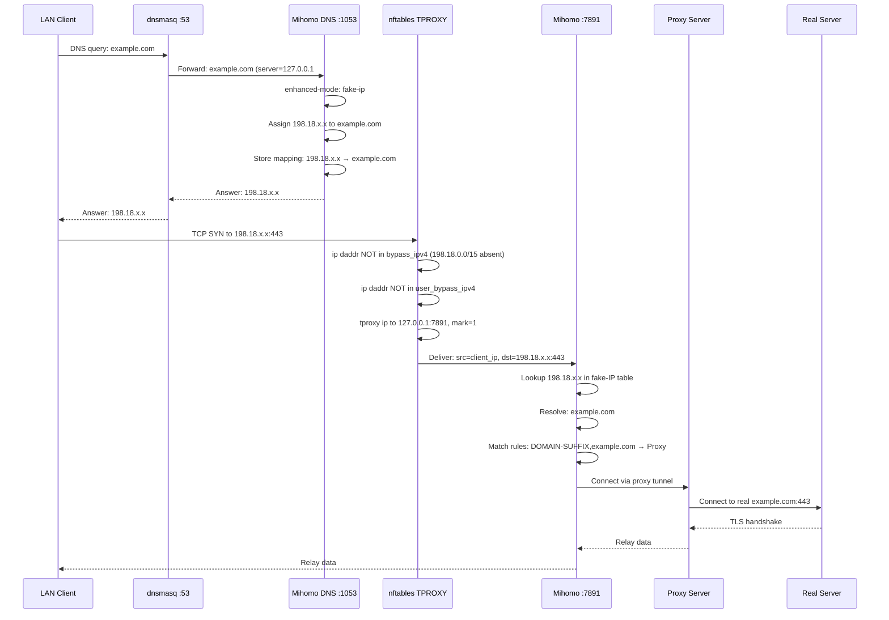
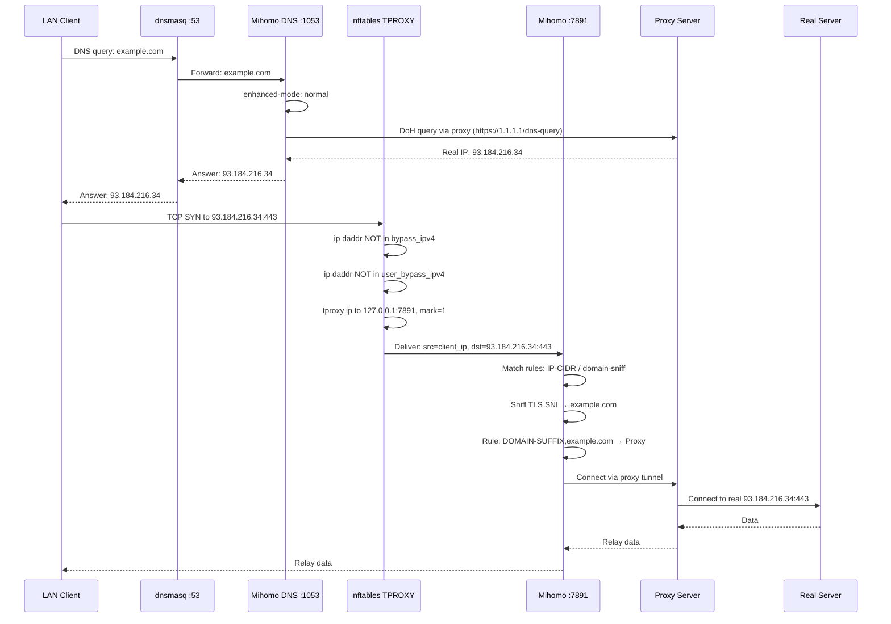
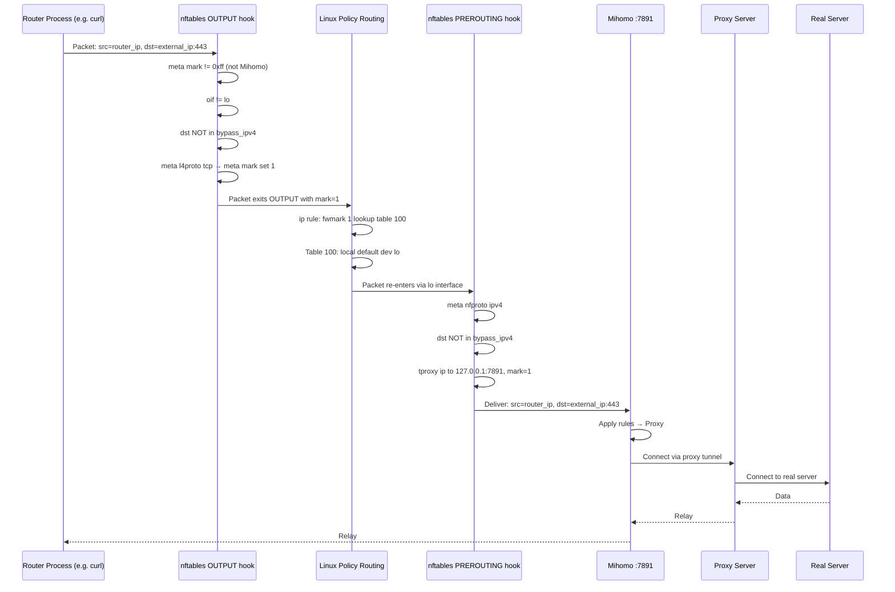
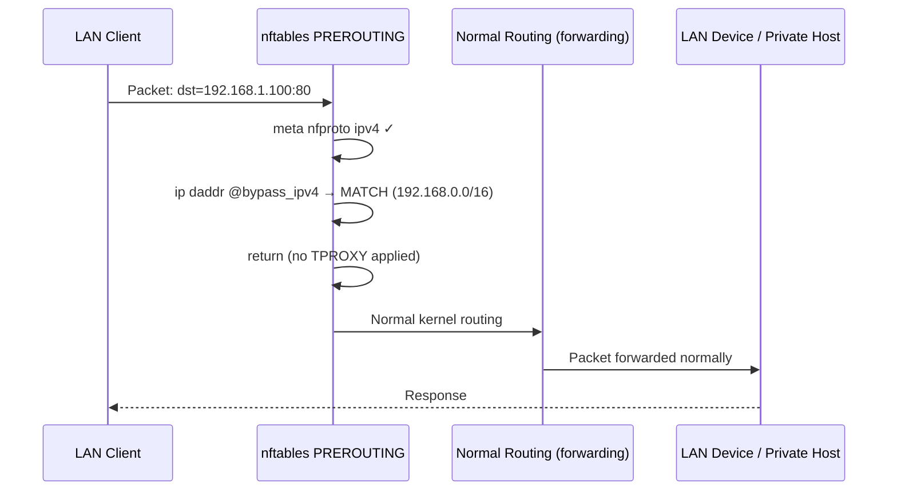
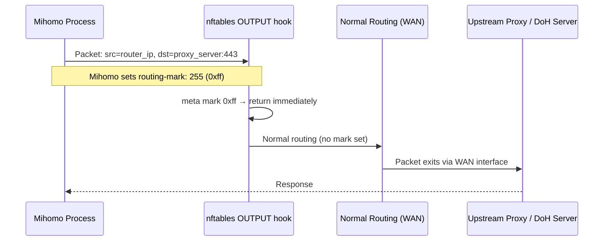

# SubMiHomo — Network Architecture

> **Target platform**: OpenWrt 25+, APK packaging, mipsel_24kc SoC  
> **Proxy engine**: Mihomo (Clash Meta fork)  
> **Firewall framework**: fw4 + nftables  
> **IPv6**: Intentionally not supported

---

## Table of Contents

1. [Problem Statement and Network Architecture Overview](#1-problem-statement-and-network-architecture-overview)
2. [TPROXY: Mechanism and Rationale](#2-tproxy-mechanism-and-rationale)
3. [Packet Flow Diagrams](#3-packet-flow-diagrams)
4. [nftables Table Structure](#4-nftables-table-structure)
5. [Hook Priority: Why `mangle - 1`](#5-hook-priority-why-mangle---1)
6. [PREROUTING Chain Design](#6-prerouting-chain-design)
7. [OUTPUT Chain Design](#7-output-chain-design)
8. [Policy Routing Mechanism](#8-policy-routing-mechanism)
9. [DNS Architecture](#9-dns-architecture)
10. [dnsmasq Integration](#10-dnsmasq-integration)
11. [Fake-IP Range Choice](#11-fake-ip-range-choice)
12. [Fake-IP Filter List](#12-fake-ip-filter-list)
13. [Bypass Mechanism](#13-bypass-mechanism)
14. [bypass_china Option](#14-bypass_china-option)
15. [Traffic That Is NOT Intercepted](#15-traffic-that-is-not-intercepted)
16. [Connection Tracking Implications](#16-connection-tracking-implications)
17. [Performance Considerations on mipsel_24kc](#17-performance-considerations-on-mipsel_24kc)
18. [Cleanup on Service Stop](#18-cleanup-on-service-stop)
19. [Interaction with fw4](#19-interaction-with-fw4)
20. [Common Failure Modes and Diagnosis](#20-common-failure-modes-and-diagnosis)

---

## 1. Problem Statement and Network Architecture Overview

### What Problem SubMiHomo Solves

A typical home or office router running OpenWrt acts as the gateway for all LAN devices. By default, traffic from those devices exits straight to the internet through whatever upstream connection (PPPoE, DHCP, etc.) the WAN interface carries. There is no facility to apply proxy routing, TLS inspection, traffic categorization, or geolocation-based forwarding at the per-connection level.

SubMiHomo's goal is to insert **Mihomo** (a Clash-compatible rule-based proxy engine) transparently between LAN devices and the internet, without requiring any configuration change on individual client devices. Clients continue to use their default gateway as normal; the router intercepts selected traffic and routes it through Mihomo, which then dispatches it according to user-defined proxy rules.

The key design constraints are:

- **Transparent**: clients on the LAN are unaware that a proxy is active.
- **Selective**: traffic to RFC 1918 addresses (and other bypass ranges) must never be sent to the proxy.
- **Protocol-agnostic at the TCP/UDP level**: both TCP and UDP traffic must be interceptable, including UDP-based protocols such as QUIC, DNS-over-UDP, and gaming traffic.
- **Correct rule matching**: Mihomo rules (DOMAIN, DOMAIN-SUFFIX, IP-CIDR, GEOSITE, GEOIP) must receive the authentic destination address and, where DNS fake-IP is in use, must be able to reconstruct the original hostname from the fake-IP mapping.
- **Minimal system footprint**: the router is a MIPS32 24Kc-class device with constrained memory and CPU. Overhead must be proportional to actual intercepted traffic, not total throughput.

### High-Level Topology

```
┌──────────────────────────────────────────────────────────────────────────────┐
│                             OpenWrt Router                                   │
│                                                                              │
│   ┌──────────┐    ┌─────────────┐    ┌───────────────┐    ┌──────────────┐  │
│   │ dnsmasq  │    │  nftables   │    │    Mihomo      │    │  fw4/nft     │  │
│   │  :53     │◄──►│inet submihomo│◄──►│  :7891 TPROXY │    │ (inet fw4)  │  │
│   │          │    │  TPROXY     │    │  :7890 Mixed  │    │             │  │
│   │server=   │    │  marks      │    │  :1053 DNS    │    │             │  │
│   │127.0.0.1 │    │  fwmark 1   │    │  :9090 API    │    │             │  │
│   │#1053     │    │             │    │               │    │             │  │
│   └──────────┘    └─────────────┘    └───────────────┘    └──────────────┘  │
│        ▲                 ▲                    │                              │
│        │                 │                    │                              │
│   ┌────┴──────────────────┴────────────────────┴────────────────────────┐    │
│   │                  Linux Kernel Netfilter + IP Routing                 │    │
│   └──────────────────────────────────────────────────────────────────────┘    │
│              │                                            │                   │
│           br-lan                                        eth0/pppoe             │
└──────────────┼────────────────────────────────────────────┼──────────────────┘
               │                                            │
         LAN Clients                                    Internet
         (192.168.x.x)                                (ISP / WAN)
```

Traffic arriving from LAN clients on `br-lan` passes through the nftables `prerouting` hook, where the `inet submihomo` table inspects and conditionally marks it for TPROXY interception. Marked traffic is steered to Mihomo's TPROXY listener on `127.0.0.1:7891` via policy routing. Traffic that should not be proxied (RFC 1918, loopback, user-defined bypass ranges) is returned immediately.

Traffic originating **on the router itself** (e.g., from system services, wget, opkg) is handled separately through the `output` hook with a mark-and-reroute technique described in §7.

---

## 2. TPROXY: Mechanism and Rationale

### What TPROXY Is

TPROXY is a Linux kernel feature (documented in `Documentation/networking/tproxy.rst`) that allows a userspace socket to receive packets whose destination IP and port do not match the socket's bound address. Normally, the kernel forwards packets to their destination; TPROXY instead delivers them to a local socket, while preserving the original destination address so the application can read it with `getsockname()` or `SO_ORIGINAL_DST`.

The key kernel-level elements are:

- **`xt_TPROXY` / nft TPROXY target**: sets a kernel socket reference on the packet's socket field (`skb->sk`) and assigns an `fwmark`.
- **`SO_IP_TRANSPARENT` socket option**: permits the socket to bind to and receive packets for non-local addresses.
- **`IP_TRANSPARENT` / `IPV6_TRANSPARENT`**: same, at the IP layer.
- **Policy routing rule**: ensures marked packets (fwmark 1) are looked up in a routing table that routes them to `lo`, making the kernel treat them as locally destined.

### Why TPROXY Instead of REDIRECT/DNAT

| Feature | REDIRECT (iptables/nftables) | DNAT | TPROXY |
|---|---|---|---|
| TCP support | Yes | Yes | Yes |
| UDP support | No | Partial | Yes |
| Original destination preserved | No (must use SO_ORIGINAL_DST) | No | Yes (socket sees original dest) |
| Required socket option | None | None | SO_IP_TRANSPARENT |
| Works without conntrack | No | No | Yes (stateless path possible) |
| Required for Mihomo | No | No | Yes (Mihomo uses it natively) |

**REDIRECT** rewrites the destination of the packet to the local machine's address and the specified port. The proxy application must call `getsockopt(SO_ORIGINAL_DST)` to find out where the client actually wanted to go. This only works for TCP; UDP datagrams do not have a concept of connection that conntrack can track, so `SO_ORIGINAL_DST` is unreliable for UDP.

**DNAT** has the same limitation: destination is rewritten, original must be recovered from conntrack, and UDP support is incomplete.

**TPROXY** never rewrites the packet's destination. The kernel intercepts the packet at a pre-routing hook, attaches it to a local socket that has `SO_IP_TRANSPARENT` set, and routes the packet to loopback. The socket's `recvmsg()` call returns the original destination via `recvfrom()` or `struct sockaddr_in` — the proxy sees exactly where the client intended to connect. This is critical for:

1. **IP-CIDR rules**: Mihomo can compare the real destination IP against user-defined CIDR ranges.
2. **Domain sniffing**: Mihomo can inspect TLS SNI or HTTP Host headers against the real destination port.
3. **Fake-IP resolution**: When a client connects to `198.18.x.x` (a fake-IP), Mihomo knows the exact fake IP and can look it up in its internal DNS mapping table to recover the domain name.
4. **UDP transparency**: QUIC, game traffic, DNS-over-UDP all use UDP. TPROXY handles these natively.

### How the Linux TPROXY Flow Works

The complete kernel path for a TPROXY-intercepted packet is:

```
Packet arrives on br-lan (from LAN client)
  │
  ▼
Netfilter: NF_INET_PRE_ROUTING
  │
  ├─ conntrack: tracked/new → fwmark may already be set
  │
  ├─ inet submihomo prerouting chain (priority mangle-1)
  │     ├─ bypass checks (return if in bypass sets)
  │     └─ tproxy ip to 127.0.0.1:7891 meta mark set 1
  │           │
  │           └─ kernel sets skb->sk = Mihomo's listening socket
  │                          skb->mark = 1
  │
  ▼
Routing decision:
  ├─ skb->sk is set → route to local socket (TPROXY path)
  │     └─ packet delivered to Mihomo at 127.0.0.1:7891
  │           Mihomo reads: src=client_ip:port, dst=real_dst_ip:port
  └─ skb->sk not set (bypass) → normal routing toward WAN
```

The TPROXY nftables statement `tproxy ip to 127.0.0.1:7891` performs two actions atomically:
1. Redirects the packet to the socket listening at `127.0.0.1:7891` (Mihomo's TPROXY listener) without changing the packet's destination field.
2. The subsequent `meta mark set 1` ensures policy routing routes this packet to loopback, completing the handoff.

---

## 3. Packet Flow Diagrams

### 3.1 LAN Client Request — Fake-IP DNS Mode

This is the primary flow for most clients on the LAN.



### 3.2 LAN Client Request — Real-IP DNS Mode

In real-IP mode, Mihomo acts as a forwarding DNS resolver returning actual IP addresses.



### 3.3 Router-Originated Traffic Flow

Traffic generated by processes running on the router itself (e.g., `curl`, `wget`, system services) follows a different path because it originates from the OUTPUT hook, which runs after routing has already occurred and after PREROUTING has been bypassed.



> **Note**: Mihomo itself is excluded from this OUTPUT path by the `meta mark 0xff return` rule. Mihomo sets `routing-mark: 255` in its configuration, so its own outbound packets carry `fwmark 0xff` and are returned before the mark-setting rule fires.

### 3.4 Bypassed Traffic Flow (RFC 1918 Destinations)

Traffic destined for private LAN addresses, loopback, or other bypass ranges is returned immediately with no interception.



### 3.5 Mihomo's Own Outbound Traffic Flow

Mihomo must send traffic to upstream proxy servers and DNS-over-HTTPS endpoints. This traffic must not be re-intercepted, otherwise a routing loop would occur.



The `routing-mark: 255` configuration in Mihomo tells the kernel to mark all outbound packets from Mihomo's process with `fwmark 0xff`. The OUTPUT chain checks for this mark as its very first rule and returns, ensuring no interception occurs.

---

## 4. nftables Table Structure

SubMiHomo operates entirely within a single nftables table named `inet submihomo`. The `inet` family covers both IPv4 and IPv6 at the address-family level, but all rules explicitly restrict to `meta nfproto ipv4`, so IPv6 packets pass through untouched.

### 4.1 Complete Table Listing

```
table inet submihomo {

    # ─────────────────────────────────────────────────
    # SET: Static bypass ranges (RFC 1918 + special-use)
    # ─────────────────────────────────────────────────
    set bypass_ipv4 {
        type ipv4_addr
        flags interval
        elements = {
            10.0.0.0/8,          # RFC 1918 Class A private
            172.16.0.0/12,       # RFC 1918 Class B private
            192.168.0.0/16,      # RFC 1918 Class C private
            127.0.0.0/8,         # Loopback (RFC 5735)
            169.254.0.0/16,      # Link-local (RFC 3927)
            224.0.0.0/4,         # Multicast (RFC 5771)
            240.0.0.0/4,         # Reserved (RFC 1112)
            100.64.0.0/10        # Shared address space (RFC 6598 / CGNAT)
        }
    }

    # ─────────────────────────────────────────────────
    # SET: User-defined bypass ranges (from UCI)
    # ─────────────────────────────────────────────────
    set user_bypass_ipv4 {
        type ipv4_addr
        flags interval
        # Populated at setup time from UCI bypass.address list
        # Empty by default; modified by service scripts without
        # rebuilding the entire ruleset
    }

    # ─────────────────────────────────────────────────
    # CHAIN: prerouting — intercept forwarded traffic
    # ─────────────────────────────────────────────────
    chain prerouting {
        type filter hook prerouting priority mangle - 1; policy accept;

        # (1) Restrict to IPv4 only
        meta nfproto ipv4

        # (2) Skip static bypass destinations
        ip daddr @bypass_ipv4 return

        # (3) Skip user-defined bypass destinations
        ip daddr @user_bypass_ipv4 return

        # (4) TPROXY TCP → Mihomo
        meta l4proto tcp tproxy ip to 127.0.0.1:7891 meta mark set 1

        # (5) TPROXY UDP → Mihomo
        meta l4proto udp tproxy ip to 127.0.0.1:7891 meta mark set 1
    }

    # ─────────────────────────────────────────────────
    # CHAIN: output — intercept router-originated traffic
    # ─────────────────────────────────────────────────
    chain output {
        type route hook output priority mangle - 1; policy accept;

        # (1) Skip Mihomo's own outbound traffic
        meta mark 0xff return

        # (2) Restrict to IPv4 only
        meta nfproto ipv4

        # (3) Skip loopback (inter-process communication)
        oif "lo" return

        # (4) Skip static bypass destinations
        ip daddr @bypass_ipv4 return

        # (5) Skip user-defined bypass destinations
        ip daddr @user_bypass_ipv4 return

        # (6) Mark TCP and UDP for policy routing
        meta l4proto { tcp, udp } meta mark set 1
    }
}
```

### 4.2 Rule-by-Rule Explanation

#### bypass_ipv4 Set

This set uses the `flags interval` flag, which allows CIDR-based ranges (intervals of addresses) rather than just discrete addresses. All entries are well-known special-use ranges:

| Range | RFC | Reason for bypass |
|---|---|---|
| `10.0.0.0/8` | RFC 1918 | Private LAN range; routing to proxy makes no sense |
| `172.16.0.0/12` | RFC 1918 | Private LAN range |
| `192.168.0.0/16` | RFC 1918 | Private LAN range (most common home network) |
| `127.0.0.0/8` | RFC 5735 | Loopback; never legitimate to proxy |
| `169.254.0.0/16` | RFC 3927 | Link-local autoconfiguration; not routable |
| `224.0.0.0/4` | RFC 5771 | Multicast; TPROXY is meaningless for multicast |
| `240.0.0.0/4` | RFC 1112 | Reserved; no legitimate traffic |
| `100.64.0.0/10` | RFC 6598 | CGNAT shared space; ISP-internal, not proxy-able |

**Intentional omission**: `198.18.0.0/15` (the Mihomo fake-IP range) is deliberately **not** in this set. If it were present, connections to fake-IP addresses would bypass the TPROXY interception, reaching a non-routable address and failing immediately. Fake-IP traffic must be intercepted so Mihomo can resolve the original domain from its internal mapping table and forward it correctly.

#### user_bypass_ipv4 Set

This set starts empty and is populated at service start from the UCI `config bypass 'bypass'` list. It uses the same `flags interval` mechanism to support CIDR notation. The service scripts use `nft add element inet submihomo user_bypass_ipv4 { ... }` to populate it, and `nft flush set inet submihomo user_bypass_ipv4` to clear it when the service stops or the config changes. This allows dynamic updates without reloading the entire nftables ruleset.

#### prerouting chain Rules

**(1) `meta nfproto ipv4`**: Restricts all subsequent rules to IPv4 packets. IPv6 packets hit this rule and, since there is no explicit `drop` or `return`, the policy (`accept`) passes them through unchanged. SubMiHomo does not attempt to proxy IPv6.

**(2) `ip daddr @bypass_ipv4 return`**: If the destination IP is in the static bypass set, the packet exits this chain immediately (the `return` verdict) and continues to whatever follows in the prerouting hook sequence (ultimately, normal routing and forwarding).

**(3) `ip daddr @user_bypass_ipv4 return`**: Same, for user-defined bypasses. This is checked second to keep the static set (more likely to match) first.

**(4) `meta l4proto tcp tproxy ip to 127.0.0.1:7891 meta mark set 1`**: For TCP packets that passed all the bypass checks, apply TPROXY. The kernel attaches the packet to Mihomo's TPROXY socket (`SO_IP_TRANSPARENT` listener on `127.0.0.1:7891`) and marks the packet `fwmark 1`. Policy routing then routes it to loopback.

**(5) `meta l4proto udp tproxy ip to 127.0.0.1:7891 meta mark set 1`**: Identical, for UDP packets. Covers DNS (when not using the dedicated 1053 path), QUIC, game traffic, and any other UDP protocol.

---

## 5. Hook Priority: Why `mangle - 1`

Netfilter hook priorities are integers; smaller values run earlier. The named constants relevant here are:

| Constant | Numeric value |
|---|---|
| `NF_IP_PRI_CONNTRACK_DEFRAG` | -400 |
| `NF_IP_PRI_RAW` | -300 |
| `NF_IP_PRI_SELINUX_FIRST` | -225 |
| `NF_IP_PRI_CONNTRACK` | -200 |
| `NF_IP_PRI_MANGLE` | -150 |
| `NF_IP_PRI_NAT_DST` | -100 |
| `NF_IP_PRI_FILTER` | 0 |
| `NF_IP_PRI_SECURITY` | 50 |
| `NF_IP_PRI_NAT_SRC` | 100 |

In nftables syntax, `priority mangle - 1` means `NF_IP_PRI_MANGLE - 1 = -151`.

### Why -151 and not -150 (mangle) or -100 (nat_dst)?

The TPROXY nftables target must run **before** connection tracking assigns a routing decision to the packet, and **before** any NAT/DNAT rules modify the destination. Specifically:

- **Before DNAT (-100)**: If fw4 or any other table performs DNAT on the same packet, the destination will be rewritten before our TPROXY rule sees it. At priority `-151`, SubMiHomo sees the original destination IP as the client intended it.
- **After conntrack initialization (-200)**: TPROXY requires that the packet be associated with a conntrack entry (or at least that conntrack has run), so that subsequent packets in the same flow are handled correctly. Running after conntrack priority is correct here.
- **At mangle - 1, not mangle**: Running at exactly `-150` would put SubMiHomo at the same level as the standard mangle table, which is undefined ordering. Using `-151` guarantees SubMiHomo runs slightly before any default mangle-priority rules.
- **Why not raw (-300)?**: At raw priority, conntrack has not yet run. TPROXY depends on conntrack for flow tracking on established connections. Running at raw priority would prevent TPROXY from working correctly on non-first packets of a connection.

In summary: `mangle - 1` places the SubMiHomo TPROXY rules at the earliest viable point where conntrack is active but no destination rewriting has occurred.

---

## 6. PREROUTING Chain Design

The `prerouting` chain uses `type filter` with the `prerouting` hook. The `filter` type is used because we are making accept/return decisions; the TPROXY action itself modifies the packet's socket binding but does not technically change the packet headers (making it conceptually a filter operation).

### Chain Ordering Rationale

The rules are ordered to minimize per-packet work:

1. **Address family check first**: The `meta nfproto ipv4` check runs before all IP-address-specific rules. IPv6 packets are rejected from further processing in one match, with no set lookups performed.

2. **Static bypass before user bypass**: `bypass_ipv4` is a compiled-in set with a small, fixed number of intervals. Lookups in interval sets are O(log n) in nftables. Checking the static set first covers the common case (RFC 1918 destinations in typical home networks) before the user set (which may be empty, consuming a lookup for nothing; but the static set is checked first regardless).

3. **Both bypass checks before TPROXY**: TPROXY is relatively expensive compared to a set lookup. By placing all bypass returns before the TPROXY statement, the common case of local traffic (to 192.168.x.x, 10.x.x.x) exits the chain with just two set lookups and no TPROXY work.

4. **TCP before UDP**: TCP connections account for the majority of web traffic. Listing TCP first means the UDP rule is only evaluated for packets that are already known to be non-TCP.

### Stateless Design

The prerouting chain does not use `ct state` (connection tracking state) to short-circuit processing of established connections. This is intentional:

- TPROXY requires the `tproxy` target to run on the SYN packet of a TCP connection so that the connection is initially attached to Mihomo's socket.
- For established connections in a TPROXY flow, the kernel automatically routes subsequent packets to the TPROXY socket via the existing socket reference — the rule does not need to re-fire.
- For UDP, there is no connection concept; each datagram is matched individually.

This means the bypass set lookups run for every packet (not just new connections), but set lookups in nftables are fast (hash or binary search), and the overhead on mipsel hardware is acceptable given the alternative of maintaining connection-level state across the bypass path.

---

## 7. OUTPUT Chain Design

### The Router-Originated Traffic Problem

The Linux netfilter PREROUTING hook only fires for packets **arriving on a network interface**. Packets generated by processes running on the router itself (the OUTPUT hook) do not pass through PREROUTING before routing. They exit via the appropriate interface (or loopback) after the OUTPUT and POSTROUTING hooks.

This creates a gap: without additional handling, traffic from router-side processes (wget, curl, opkg updates, scheduled scripts) would bypass the TPROXY interception entirely.

### Solution: Mark-and-Reroute

The OUTPUT chain is of `type route`, which means it participates in **policy routing decisions** — it can influence which routing table is consulted for the packet's egress path. By setting `meta mark 1` on the packet in OUTPUT, the policy routing rule (`ip rule priority 1000 fwmark 1 lookup 100`) takes effect, and the packet is routed via table 100 (`local default dev lo`). This routes the packet out the loopback interface.

When a packet exits via `lo`, it **re-enters the network stack as an incoming packet on the loopback interface**, which means it fires the PREROUTING hook. At that point, the standard prerouting chain applies, the TPROXY action fires, and Mihomo receives it.

```
Router process sends packet
  → OUTPUT hook (route type, priority mangle-1)
  → mark=1 set
  → policy routing: ip rule lookup 100
  → table 100: local default dev lo
  → packet sent to lo
  → PREROUTING hook (now on lo interface)
  → TPROXY: delivered to Mihomo
```

### OUTPUT Chain Rule Details

**(1) `meta mark 0xff return`**: This is the loop-prevention rule. Mihomo sets `routing-mark: 255` in its config, causing the kernel to apply `fwmark 0xff` to all packets sent by Mihomo's process. If this rule were absent, Mihomo's own outbound packets would be marked with `1` in OUTPUT, rerouted to lo, intercepted by TPROXY, re-delivered to Mihomo, which would send them again — an infinite routing loop. The mark `0xff` check must be the **first rule** in the OUTPUT chain for this reason.

**(2) `meta nfproto ipv4`**: Same as in PREROUTING — restricts to IPv4.

**(3) `oif "lo" return`**: Skip loopback-destined packets that are already on lo (e.g., inter-process communication, localhost service calls). Without this rule, packets from Mihomo to `127.0.0.1:1053` (DNS queries) could be marked and rerouted unnecessarily. Note: this rule fires before the bypass set checks because loopback interface output is checked by interface name, which is faster than an IP range lookup.

**(4) `ip daddr @bypass_ipv4 return`**: Same as PREROUTING — skip RFC 1918 and other bypass destinations.

**(5) `ip daddr @user_bypass_ipv4 return`**: Same as PREROUTING.

**(6) `meta l4proto { tcp, udp } meta mark set 1`**: For all non-bypassed TCP and UDP, set mark 1. This does not use TPROXY directly (TPROXY cannot be applied in the OUTPUT hook — it is only valid in PREROUTING). The mark alone triggers policy routing.

---

## 8. Policy Routing Mechanism

Policy routing is the bridge between the OUTPUT chain's mark-setting and the PREROUTING chain's TPROXY action. It is also what makes TPROXY work in PREROUTING for packets arriving from external interfaces.

### Components

**ip rule (routing policy rule)**:
```
ip rule add priority 1000 fwmark 1 lookup 100
```

This rule tells the kernel: for any packet with `fwmark 1`, consult routing table 100 instead of the default routing table.

**Routing table 100**:
```
ip route add local default dev lo table 100
```

This adds a single route to table 100: a `local default` route pointing to the loopback device. The `local` route type is significant — it tells the kernel to treat the packet as destined for the local machine, regardless of the destination IP. This is what allows TPROXY to receive packets addressed to any destination IP.

### Why `local default dev lo`

A standard `default via <gateway> dev eth0` route would forward the packet to the gateway, not deliver it locally. The `local` route type means:

- Packets matched by this route are considered locally-destined.
- They are delivered to a local socket.
- The socket must have `SO_IP_TRANSPARENT` to accept packets with a destination IP that is not the machine's own IP.

When Mihomo opens its TPROXY socket with `SO_IP_TRANSPARENT` set, and the packet's socket field (`skb->sk`) is populated by the TPROXY nftables target, the kernel's local delivery mechanism finds the Mihomo socket as the recipient.

### Full Policy Routing Sequence for a Forwarded Packet

```
1. LAN client sends: src=192.168.1.50, dst=1.2.3.4:443, proto=TCP

2. Packet arrives on br-lan
   → netfilter PREROUTING fires
   → SubMiHomo prerouting chain:
       meta nfproto ipv4 → pass
       ip daddr @bypass_ipv4 → no match
       ip daddr @user_bypass_ipv4 → no match
       meta l4proto tcp tproxy ip to 127.0.0.1:7891 meta mark set 1
       → skb->sk = Mihomo's TCP socket
       → skb->mark = 1

3. Routing decision:
   → skb->sk is set (TPROXY socket assigned)
   → ip rule: fwmark 1 → lookup table 100
   → table 100: local default dev lo
   → packet treated as locally destined

4. Packet delivered to Mihomo's TPROXY socket at 127.0.0.1:7891
   → Mihomo: accept()/recvfrom() returns:
       src: 192.168.1.50 (original client)
       dst: 1.2.3.4:443 (original destination, unchanged)
```

### Full Policy Routing Sequence for Router-Originated Traffic

```
1. Router process: curl https://example.com
   → src=router_ip, dst=93.184.216.34:443

2. Netfilter OUTPUT fires
   → SubMiHomo output chain:
       meta mark != 0xff → continue
       meta nfproto ipv4 → pass
       oif != lo → continue
       ip daddr @bypass_ipv4 → no match
       ip daddr @user_bypass_ipv4 → no match
       meta l4proto tcp → meta mark set 1

3. Routing decision (route-type OUTPUT chain):
   → ip rule: fwmark 1 → lookup table 100
   → table 100: local default dev lo
   → packet exits via lo

4. Packet re-enters stack on lo
   → netfilter PREROUTING fires (on lo interface)
   → SubMiHomo prerouting chain:
       ip daddr @bypass_ipv4 → no match
       meta l4proto tcp tproxy ip to 127.0.0.1:7891 meta mark set 1
       → TPROXY applied

5. Delivered to Mihomo
```

---

## 9. DNS Architecture

DNS is the entry point for domain-based proxy rule matching. SubMiHomo supports two DNS modes with meaningfully different behaviors.

### 9.1 Fake-IP Mode (Default)

In fake-IP mode, Mihomo's DNS server never returns real IP addresses to clients. Instead, it maintains an internal mapping table and assigns addresses from the `198.18.0.0/15` range.

**Why fake-IP is preferred**:

1. **Accurate domain-based routing**: When a client connects to `198.18.x.x`, Mihomo looks up the fake IP in its table and recovers the original domain name (`example.com`). This enables DOMAIN, DOMAIN-SUFFIX, GEOSITE, and other domain-based rules to fire with certainty, without relying on TLS SNI sniffing (which can fail for non-TLS traffic, or for TLS with ECH).

2. **DNS leak prevention**: In real-IP mode, Mihomo's DNS query for the domain goes through the proxy — but the initial DNS response returns a real IP. If an adversarial DNS server returns a different IP than the proxy will connect to, there is a window for IP-based tracking. Fake-IP eliminates this because the real IP is resolved only inside Mihomo, after the proxy destination has been selected.

3. **Faster connection establishment**: Fake-IP is assigned immediately from a local pool. The client receives a DNS response before Mihomo has finished resolving the real IP. Connection setup can begin, and Mihomo resolves concurrently.

**Fake-IP DNS flow detail**:

```
Client resolves example.com
  → dnsmasq forwards to Mihomo :1053
  → Mihomo: check fake-ip-filter → example.com not filtered
  → Mihomo assigns 198.18.14.42 → stores {198.18.14.42: "example.com"}
  → Returns 198.18.14.42 to dnsmasq → to client

Client connects to 198.18.14.42:443
  → nftables TPROXY (198.18.0.0/15 is NOT in bypass set)
  → Mihomo receives connection: dst=198.18.14.42:443
  → Mihomo looks up 198.18.14.42 → finds "example.com"
  → Evaluates rules against "example.com"
  → Selects proxy, resolves example.com via proxy upstream
  → Connects via proxy to real example.com
```

**Fake-IP DNS Configuration**:

```yaml
dns:
  enable: true
  listen: 127.0.0.1:1053
  enhanced-mode: fake-ip
  fake-ip-range: 198.18.0.0/15
  fake-ip-filter:
    - "*.lan"
    - "*.local"
    - "*.home"
    - router.asus.com
    - +.msftconnecttest.com
    - +.msftncsi.com
    - +.xbox.live.com
  nameserver:
    - https://1.1.1.1/dns-query
    - https://8.8.8.8/dns-query
  fallback:
    - https://1.0.0.1/dns-query
  fallback-filter:
    geoip: true
    geoip-code: CN
    ipcidr:
      - 240.0.0.0/4
      - 0.0.0.0/8
```

### 9.2 Real-IP Mode

In real-IP mode, Mihomo's DNS server resolves domains using DoH (DNS-over-HTTPS) and returns the actual IP address. Clients connect to the real IP, which nftables intercepts and TPROXY delivers to Mihomo.

**Trade-offs versus fake-IP**:

| Aspect | Fake-IP | Real-IP |
|---|---|---|
| Domain rule matching | Reliable (direct mapping) | Depends on TLS SNI sniffing |
| DNS leak risk | Very low | Low (DoH used) |
| Compatibility with DNS-pinning apps | Potential issues | Better |
| CDN IP accuracy | Not applicable (proxy resolves) | May differ from proxy's resolution |
| Setup simplicity | Moderate (fake-IP filter needed) | Simpler |

**Real-IP DNS Configuration**:

```yaml
dns:
  enable: true
  listen: 127.0.0.1:1053
  enhanced-mode: normal
  nameserver:
    - https://1.1.1.1/dns-query
    - https://8.8.8.8/dns-query
```

### 9.3 Fallback DNS in Fake-IP Mode

The `fallback` and `fallback-filter` sections are active only in fake-IP mode. When Mihomo's primary nameservers return an answer, Mihomo checks whether the resolved IP:

- Belongs to a CN GeoIP range (`geoip-code: CN` with `geoip: true`), or
- Falls into the `ipcidr` filter ranges (reserved/bogus IPs)

If either condition is true, Mihomo discards the primary nameserver result and uses the fallback resolver instead. This is designed to handle DNS pollution from Chinese ISPs, where queries for non-Chinese domains may return incorrect or blocked IPs from the primary resolver (if it has any visibility into CN network issues).

---

## 10. dnsmasq Integration

### Why Not Replace dnsmasq

OpenWrt's dnsmasq instance is the system DNS server for all LAN clients. It handles:

- DHCP for LAN devices (leases, hostname registration)
- Local domain resolution (`.lan`, `.home` hostnames from DHCP leases)
- DNS caching
- DNSSEC validation (if configured)
- Split-horizon DNS (different answers for internal vs. external queries)

Replacing dnsmasq with Mihomo's DNS listener on port 53 would break all of this functionality. It would require reimplementing DHCP, local hostname resolution, and caching in Mihomo — which Mihomo does not provide.

Instead, SubMiHomo configures dnsmasq as an **upstream forwarder** to Mihomo's DNS port (1053), so:

- dnsmasq continues to handle DHCP and local resolution.
- External domain queries are forwarded to Mihomo, which applies fake-IP or real-IP resolution.
- LAN clients continue to use dnsmasq (typically at `192.168.1.1:53`) unchanged.

### dnsmasq Configuration File

SubMiHomo creates `/etc/dnsmasq.d/submihomo.conf` on service start and removes it on service stop. The file contains:

```
no-resolv
server=127.0.0.1#1053
```

**`no-resolv`**: Prevents dnsmasq from reading `/etc/resolv.conf` for upstream server addresses. Without this option, dnsmasq would also forward queries to whatever the system resolv.conf specifies (typically the ISP's DNS), which would bypass Mihomo entirely for many queries. With `no-resolv`, dnsmasq's only upstream is `127.0.0.1#1053`.

**`server=127.0.0.1#1053`**: Directs all non-local DNS queries to Mihomo's DNS listener. The `#1053` syntax is dnsmasq's way of specifying a non-standard port. The `127.0.0.1` binding ensures Mihomo's DNS port, which is intentionally bound only to loopback, remains accessible from the router itself without requiring a firewall rule.

### dnsmasq Reload Sequence

```
SubMiHomo service start
  → Write /etc/dnsmasq.d/submihomo.conf
  → Send SIGHUP to dnsmasq (or: ubus call service dnsmasq reload)
  → dnsmasq re-reads configuration
  → dnsmasq now forwards all external queries to 127.0.0.1:1053

SubMiHomo service stop
  → Remove /etc/dnsmasq.d/submihomo.conf
  → Send SIGHUP to dnsmasq
  → dnsmasq reverts to /etc/resolv.conf upstreams (or static UCI config)
```

### Local Domain Handling

Domains ending in `.lan`, `.local`, and `.home` must NOT be forwarded to Mihomo's fake-IP resolver, because:

1. They are local hostnames known only to dnsmasq via DHCP registration.
2. Mihomo cannot resolve them (it has no visibility into the LAN).
3. If Mihomo assigned a fake-IP for `my-nas.local`, the client would try to connect to `198.18.x.x`, TPROXY would intercept it, Mihomo would look for a proxy rule for `my-nas.local`, likely send it through a proxy, and the connection would fail.

These domains are handled by:
- **dnsmasq**: responds from its local database before forwarding to upstream (Mihomo).
- **Mihomo fake-ip-filter**: even if a query reaches Mihomo, the filter excludes `*.lan`, `*.local`, `*.home` from fake-IP assignment, returning a real answer (if any) or NXDOMAIN.

---

## 11. Fake-IP Range Choice

### Why 198.18.0.0/15

The `198.18.0.0/15` range (198.18.0.0 – 198.19.255.255, 131,072 addresses) is defined by RFC 2544 as a benchmarking range. RFC 5737 defines `192.0.2.0/24`, `198.51.100.0/24`, and `203.0.113.0/24` as documentation ranges. None of these are in the RFC 1918 private-use space.

The specific choice of `198.18.0.0/15` for fake-IP is a Mihomo convention (inherited from Clash), justified by:

1. **Size**: 131,072 addresses allows a large number of simultaneous DNS mappings without exhaustion, even for busy networks.
2. **Not routable**: This range is not assigned to any public entity. Traffic to these addresses will be dropped at any ISP router. This means if the TPROXY interception somehow failed, the client's packet would be discarded at the WAN rather than reaching an unintended server.
3. **Not in RFC 1918**: Private ranges (10/8, 172.16/12, 192.168/16) are in the bypass set. Fake-IPs must NOT be in the bypass set, because they must reach Mihomo. Using 198.18.0.0/15 avoids this conflict entirely.
4. **Not in multicast or reserved**: Avoiding 224.0.0.0/4 and 240.0.0.0/4 (both in bypass set) for similar reasons.

The bypass_ipv4 set therefore intentionally omits this range, ensuring all traffic to `198.18.0.0/15` passes through TPROXY.

---

## 12. Fake-IP Filter List

The `fake-ip-filter` list specifies domains that should receive **real IP responses** even in fake-IP mode. These are domains where fake-IP would cause functional breakage.

```yaml
fake-ip-filter:
  - "*.lan"
  - "*.local"
  - "*.home"
  - router.asus.com
  - +.msftconnecttest.com
  - +.msftncsi.com
  - +.xbox.live.com
```

| Entry | Reason |
|---|---|
| `*.lan` | Local DHCP hostnames; Mihomo cannot resolve, must use dnsmasq local database |
| `*.local` | mDNS / Bonjour local discovery; fake-IP breaks device discovery |
| `*.home` | Common alternate local domain suffix (used by some ISP-branded routers) |
| `router.asus.com` | Asus router admin page redirects; fake-IP breaks the redirect-to-local-IP scheme |
| `+.msftconnecttest.com` | Windows NCSI (Network Connectivity Status Indicator); must resolve to real Microsoft servers or Windows reports "No Internet" |
| `+.msftncsi.com` | Same; Windows network diagnostic system |
| `+.xbox.live.com` | Xbox Live connectivity checks; fake-IP causes NAT type detection to fail |

The `+.` prefix in Mihomo's filter syntax means "this domain and all subdomains" (equivalent to `*.msftconnecttest.com` and `msftconnecttest.com` itself).

Domains on this list receive real-IP responses from Mihomo's nameservers. These responses pass through dnsmasq to the client. The client then connects to the real IP; nftables may or may not intercept it (depending on whether the real IP is in a bypass set). For truly local hostnames (`*.lan`, `*.local`), dnsmasq resolves them before the query ever reaches Mihomo.

---

## 13. Bypass Mechanism

### Static Bypasses (bypass_ipv4 Set)

The static bypass set is defined in the nftables ruleset itself and is populated at the time the table is loaded. It cannot be modified without reloading the nftables table. It covers all standardized non-public address ranges (see §4.2). This set is present regardless of UCI configuration.

### User-Defined Bypasses (user_bypass_ipv4 Set)

The `user_bypass_ipv4` set is defined in the nftables table with `flags interval` but no initial elements. Elements are added by the service startup script based on the UCI `config bypass 'bypass'` → `list address` values.

The workflow is:

```
1. Service reads UCI: uci get submihomo.bypass.address (returns list)
2. For each valid IPv4 CIDR in the list:
   nft add element inet submihomo user_bypass_ipv4 { <cidr> }
3. On service stop or config reload:
   nft flush set inet submihomo user_bypass_ipv4
   (re-populate if reloading)
```

Invalid entries (IPv6 addresses, malformed CIDRs) are silently ignored — this is documented in the UCI spec and validated at the UCI write layer (rpcd set_config). See UCI.md §3 for validation rules.

### Why Dual Sets Instead of One Merged Set

Separating static and user-defined bypasses has operational advantages:

- **Correctness**: The static RFC 1918 ranges are never accidentally removed by a user mistake that clears the bypass list.
- **Auditability**: `nft list set inet submihomo bypass_ipv4` always returns the known-good static set; `nft list set inet submihomo user_bypass_ipv4` returns only user additions.
- **Reload efficiency**: On a config change to bypass addresses, only `user_bypass_ipv4` needs to be flushed and repopulated. The static set and the entire chain structure remain in place.

### Common Use Cases for User Bypasses

- **Corporate VPN subnet**: If the router is also a client on a corporate VPN (e.g., `10.50.0.0/16`), that subnet should be excluded from proxy routing. Adding it to the bypass list ensures traffic to the VPN subnet exits the VPN tunnel, not through Mihomo.
- **NAS or media server**: A NAS with a fixed public IP that should always be accessed directly (not via proxy) can be added as a /32.
- **ISP-specific bypass**: Some ISPs have local CDN or speedtest servers at specific IP ranges that are faster to access directly.

---

## 14. bypass_china Option

### What It Does

When the UCI option `bypass_china: 1` is set, SubMiHomo inserts the following rule into the Mihomo rule set:

```yaml
rules:
  - GEOIP,CN,DIRECT
  # ... other rules ...
  - MATCH,<default-proxy>
```

This rule causes Mihomo to send any connection whose destination IP resolves to a Chinese GeoIP range directly to the internet (bypassing the proxy), rather than through the configured proxy server.

### Why GEOIP Rule in Mihomo Config, Not nftables

An alternative approach would be to download a list of Chinese IP CIDR ranges and populate them into `user_bypass_ipv4`. This approach has significant drawbacks:

| Approach | Pros | Cons |
|---|---|---|
| nftables CIDR list | Early bypass (no TPROXY overhead) | ~8,000+ CIDR ranges; large memory footprint; requires periodic updates; no dynamic re-download |
| Mihomo GEOIP,CN rule | Uses built-in GeoIP database (mmdb); single rule; auto-updated with Mihomo; accurate | Adds one TPROXY interception before bypass decision |

The MIPS32 24Kc SoC has limited RAM (typically 64–128 MB). Loading thousands of IP ranges into an nftables set would consume several megabytes of kernel memory for the set structure alone. Mihomo's built-in MaxMind-compatible GeoIP database (geoip.dat) already contains China IP ranges in an efficient binary format and is updated automatically with Mihomo binary releases.

The single additional TPROXY interception for Chinese IPs is negligible in practice: Mihomo receives the connection, checks the GEOIP rule, sees CN, and opens a direct connection — total overhead is one extra socket handoff per new connection.

### Rule Placement

The `GEOIP,CN,DIRECT` rule is inserted **before** the final `MATCH` rule but **after** more-specific rules (DOMAIN, DOMAIN-SUFFIX, IP-CIDR). This ensures:

- Specific domain rules for known Chinese services fire first.
- IP-based rules for non-CN but proxy-needed traffic fire.
- The GEOIP catch-all for remaining Chinese traffic fires before the default proxy.

---

## 15. Traffic That Is NOT Intercepted

The following categories of traffic are explicitly not intercepted by SubMiHomo, with the reason for each:

| Traffic Type | Reason Not Intercepted | Handled By |
|---|---|---|
| IPv6 traffic | `meta nfproto ipv4` filter; SubMiHomo is IPv4-only by design | Normal kernel routing / fw4 |
| Traffic to 10.0.0.0/8 | In bypass_ipv4 static set; RFC 1918 private range | Normal routing |
| Traffic to 172.16.0.0/12 | In bypass_ipv4 static set; RFC 1918 private range | Normal routing |
| Traffic to 192.168.0.0/16 | In bypass_ipv4 static set; RFC 1918 most common LAN range | Normal routing |
| Traffic to 127.0.0.0/8 | In bypass_ipv4 static set; loopback | Local kernel delivery |
| Traffic to 169.254.0.0/16 | In bypass_ipv4; link-local / APIPA | Normal routing |
| Traffic to 224.0.0.0/4 | In bypass_ipv4; multicast | Multicast routing |
| Traffic to 240.0.0.0/4 | In bypass_ipv4; reserved | Dropped at routing level |
| Traffic to 100.64.0.0/10 | In bypass_ipv4; CGNAT / shared address space | ISP internal routing |
| User-defined bypass CIDRs | In user_bypass_ipv4 dynamic set | Normal routing |
| Mihomo's own outbound packets | `meta mark 0xff` OUTPUT chain return; routing-mark 255 | Direct WAN routing |
| Loopback-bound traffic (oif lo) | `oif "lo" return` in OUTPUT chain | Local kernel delivery |
| Non-TCP/UDP protocols (ICMP, etc.) | `meta l4proto { tcp, udp }` in OUTPUT; TPROXY only applied to tcp/udp | Normal routing |
| Mihomo → dnsmasq or localhost DNS | oif lo return in OUTPUT + loopback bypass | Local kernel delivery |
| Traffic if SubMiHomo is stopped | nftables table deleted on stop; no rules present | Normal kernel routing |

---

## 16. Connection Tracking Implications

### Does SubMiHomo Use Stateful Rules?

SubMiHomo's nftables chains do **not** use `ct state` (connection tracking state) for any match or verdict. There are no rules of the form `ct state established,related accept`. This is intentional.

In a TPROXY design, stateful rules in the TPROXY chain can be counterproductive:

- `ct state established,related accept` would short-circuit the chain for established connections, potentially bypassing the TPROXY match for subsequent packets in a flow. However, the kernel's TPROXY socket assignment persists for the lifetime of the connection via `skb->sk`, so re-matching is not necessary. The TPROXY target on a second packet of an established TPROXY connection is a no-op (the socket is already assigned).
- Adding `ct state new` before the TPROXY action is a common optimization, but it requires conntrack to be enabled and introduces a dependency that is not strictly necessary.

SubMiHomo's design opts for simplicity: every packet passes through the bypass checks and the TPROXY target is applied if it passes. For established TPROXY connections, the kernel ignores the redundant TPROXY target on non-SYN packets (the socket is already assigned). For bypassed traffic, the `return` verdicts fire before the TPROXY target.

### conntrack and TPROXY

Although SubMiHomo does not use conntrack in its rules, conntrack is still active in the kernel (it is required by fw4 for firewall stateful processing). TPROXY itself has a complex relationship with conntrack:

- The TPROXY target marks the packet so that conntrack creates a conntrack entry with the TPROXY flag set.
- Subsequent packets in the same TCP flow are matched to the conntrack entry and routed to the TPROXY socket via the kernel's TPROXY socket tracking (not via re-matching the TPROXY nftables rule).
- UDP flows follow the same path for the duration of the conntrack entry's timeout.

This means conntrack overhead exists (conntrack entry creation, lookup) but is unavoidable in an OpenWrt system where fw4 requires conntrack. SubMiHomo neither adds to nor reduces conntrack usage relative to a baseline OpenWrt system.

---

## 17. Performance Considerations on mipsel_24kc

The MIPS32 24Kc is a single-issue, in-order processor with no hardware multiplication/division acceleration and limited cache (typically 32 KB I-cache, 32 KB D-cache). Network forwarding performance on MIPS-based home routers is typically 100–200 Mbps for softirq-based packet processing.

### TPROXY Overhead Sources

| Operation | Cost | Notes |
|---|---|---|
| nftables set lookup (bypass_ipv4) | Low | Interval tree lookup, O(log 8) = ~3 comparisons |
| nftables set lookup (user_bypass_ipv4) | Low-Medium | Proportional to number of user CIDRs |
| TPROXY socket assignment | Low | Single pointer write to skb->sk |
| Policy routing rule lookup | Low | Linear scan of ip rules (only 2-3 rules typically) |
| Routing table 100 lookup | Low | Single route entry |
| Context switch to Mihomo | Medium | Userspace wakeup per new connection (TCP SYN) |
| Mihomo rule evaluation | Medium | Linear rule matching; JIT not available on MIPS |
| Mihomo proxy tunnel overhead | High | TLS/VMESS/VLESS encryption per byte |

The primary performance cost of SubMiHomo is not the nftables or routing overhead — it is the **userspace proxy processing in Mihomo** and the **encryption overhead** for proxy protocols (Shadowsocks, VMESS, VLESS, etc.). On a mipsel_24kc device, software AES encryption typically runs at 20–50 Mbps, which is the practical throughput ceiling for encrypted proxy traffic.

### Mitigation Strategies

- **bypass_china**: Enables direct routing for Chinese IPs, significantly reducing the volume of proxied traffic for users in China or accessing CN services.
- **User bypass lists**: Well-configured bypass lists reduce the number of connections that Mihomo must handle.
- **Fake-IP mode**: Slightly reduces per-connection setup time versus real-IP mode because Mihomo can begin the proxy connection while the real DNS lookup is still in progress.
- **mixed-port (7890)**: For clients that can be configured to use an explicit HTTP/SOCKS5 proxy (e.g., browsers, curl), the mixed-port at 7890 provides a more direct path with less kernel overhead than TPROXY.

---

## 18. Cleanup on Service Stop

When SubMiHomo is stopped (via `service submihomo stop` or procd lifecycle), the following cleanup actions are performed in order:

### Step 1: Remove nftables Table

```
nft delete table inet submihomo
```

This removes the entire `inet submihomo` table, including all chains, sets, and rules. After this command:
- No new traffic is intercepted.
- Existing TPROXY connections that were in progress are terminated (their socket reference is removed).
- Traffic flows normally through fw4's own tables without SubMiHomo's interception.

### Step 2: Remove Policy Routing Rule

```
ip rule del priority 1000 fwmark 1 lookup 100
```

Without this, the routing rule would remain and continue routing `fwmark 1` packets to table 100. Since the nftables rules that set fwmark 1 are gone, this would never fire — but it is best practice to clean up all modifications to the routing policy database.

### Step 3: Remove Routing Table Entry

```
ip route del local default dev lo table 100
```

Removes the route from table 100. Table 100 itself is implicit (no command needed to delete an empty routing table — it simply has no entries).

### Step 4: Remove dnsmasq Configuration

```
rm -f /etc/dnsmasq.d/submihomo.conf
kill -HUP $(pidof dnsmasq)    # or: ubus call service dnsmasq reload
```

Removes the dnsmasq forwarding config and reloads dnsmasq. After this, dnsmasq reverts to its default upstream resolvers (from `/etc/resolv.conf` or UCI network config).

### Step 5: Stop Mihomo Process

procd stops the Mihomo process. Any in-progress proxy connections are terminated.

### Post-Stop State

After complete cleanup:
- LAN clients use dnsmasq with its original upstream resolvers (direct ISP DNS, or whatever was configured before SubMiHomo).
- All traffic routes normally through the kernel without any TPROXY interception.
- No stale routing rules, nftables rules, or dnsmasq config fragments remain.
- `/var/run/mihomo/` (Mihomo's runtime directory) is cleaned up.

### Connection Impact

Existing TCP connections that were passing through Mihomo are terminated when Mihomo stops. TCP clients will receive a RST or see a connection close, after which they can reconnect. Since normal routing is immediately restored, reconnections succeed (without proxy). UDP flows simply time out on the client side.

DNS fake-IP mappings are lost when Mihomo stops. Clients that have cached fake-IP addresses will attempt to connect to `198.18.x.x` addresses, which are not in the bypass set but are no longer handled by anything — these connections will fail until the client's DNS cache expires (or the client refreshes DNS). The TTL on fake-IP records returned by Mihomo is very short (typically 1 second) to minimize this window.

---

## 19. Interaction with fw4

### Separate Table Namespace

fw4 (OpenWrt 25's firewall frontend) uses its own nftables tables:
- `inet fw4` — the main fw4 table with input, output, forward, srcnat, dstnat chains.

SubMiHomo uses `inet submihomo` — a completely separate table. nftables tables in the same family are independent: rules in one table have no visibility into or effect on rules in another table. There is no namespace conflict.

### Hook Priority Ordering with fw4

Both fw4 and SubMiHomo use hooks in the netfilter framework. Hook priority determines execution order. fw4's chains typically use:

- `prerouting` at priority `dstnat` (-100) for DNAT rules.
- `forward` at priority `filter` (0).
- `input` at priority `filter` (0).

SubMiHomo's prerouting chain runs at priority `mangle - 1` (-151), which is **before** fw4's dstnat prerouting chain (-100). This ordering is correct and intentional:

```
Packet enters PREROUTING
  -151: inet submihomo prerouting  ← SubMiHomo TPROXY (first)
  -100: inet fw4 dstnat            ← fw4 DNAT rules (second)
    0: (filter chains)
```

By running before fw4's DNAT, SubMiHomo ensures the destination IP is the original client-intended IP, not one rewritten by fw4 NAT rules. This is important for correct TPROXY behavior.

### Does SubMiHomo Conflict with fw4 NAT?

fw4's masquerade (SNAT) rule applies to traffic exiting the WAN interface, running at the `postrouting` hook. This fires after SubMiHomo's TPROXY interception. Traffic intercepted by TPROXY never reaches the postrouting hook for that packet (it is delivered to Mihomo instead); Mihomo's own outbound packets to proxy servers do pass through postrouting and are masqueraded normally.

There is no conflict because:
1. The tables are independent.
2. Hook priorities are correctly ordered.
3. Mihomo's own traffic (mark 0xff) bypasses SubMiHomo's rules and is SNAT'd by fw4 normally.

### Does fw4 Need to Allow TPROXY Traffic?

fw4's default `input` policy in OpenWrt is `REJECT` (or `DROP`) for non-established connections. However, TPROXY-delivered connections do not appear as new connections on any external interface — they arrive on `lo` from the kernel's TPROXY machinery, and the loopback interface is typically not subject to fw4's input rules (fw4 usually has `ct state established,related accept` at high priority in input). In practice, no additional fw4 rules are needed for TPROXY to function.

---

## 20. Common Failure Modes and Diagnosis

### 20.1 All Traffic Bypassing TPROXY (No Proxy Effect)

**Symptoms**: All traffic exits directly to the internet without going through Mihomo. DNS resolves real IPs (fake-IP mode fails silently).

**Diagnosis**:
```sh
# Check if nftables table exists
nft list table inet submihomo

# Check if ip rule is present
ip rule show | grep fwmark

# Check if route table 100 has the local route
ip route show table 100

# Check if Mihomo is listening on 7891
ss -ulnp | grep 7891
ss -tlnp | grep 7891
```

**Common causes**:
- Service failed to start (check `logread | grep mihomo`).
- nftables table was deleted but ip rules were not (or vice versa) — partial cleanup from a previous failed stop.
- `routing-mark` missing from Mihomo config — Mihomo's traffic would be re-intercepted, causing a routing loop that the kernel breaks by dropping.

### 20.2 Routing Loop (High CPU, No Connectivity)

**Symptoms**: Router CPU spikes to 100%, no traffic passes, kernel log shows recursive routing.

**Cause**: The `meta mark 0xff return` rule in the OUTPUT chain is missing, or Mihomo's `routing-mark: 255` is not set in the Mihomo config. Mihomo's own outbound packets are marked with `fwmark 1` in OUTPUT, rerouted to lo, intercepted by TPROXY, re-delivered to Mihomo, which tries to send them out again — loop.

**Fix**:
```sh
# Immediate: stop the service to break the loop
service submihomo stop

# Check Mihomo config for routing-mark
grep routing-mark /etc/mihomo/config.yaml

# Check OUTPUT chain has the 0xff return rule
nft list chain inet submihomo output | grep 0xff
```

### 20.3 DNS Not Working (Clients Get No DNS Response)

**Symptoms**: DNS queries time out. Clients cannot resolve any domain.

**Diagnosis**:
```sh
# Check Mihomo DNS listener
ss -ulnp | grep 1053

# Check dnsmasq config
cat /etc/dnsmasq.d/submihomo.conf

# Test DNS directly against Mihomo
nslookup example.com 127.0.0.1 -port=1053

# Check dnsmasq is forwarding
logread | grep dnsmasq
```

**Common causes**:
- Mihomo failed to bind port 1053 (check if another process is using it: `ss -ulnp | grep 1053`).
- `/etc/dnsmasq.d/submihomo.conf` has wrong content or was not created.
- dnsmasq was not reloaded after the config was written.

### 20.4 Fake-IP Addresses Leaking Past TPROXY (Connections to 198.18.x.x Fail)

**Symptoms**: Clients connect to `198.18.x.x` addresses but get connection refused or timeout. Mihomo logs show no matching connections.

**Cause**: `198.18.0.0/15` was added to `bypass_ipv4` or `user_bypass_ipv4` by mistake.

**Diagnosis**:
```sh
nft list set inet submihomo bypass_ipv4
nft list set inet submihomo user_bypass_ipv4
```

If `198.18.0.0/15` appears in either set, remove it. The static `bypass_ipv4` set should never contain this range — if it does, the nftables ruleset was modified incorrectly.

### 20.5 Local LAN Traffic Being Intercepted

**Symptoms**: Traffic to `192.168.1.x` goes through Mihomo, causing connection failures for LAN services (NAS, printers, etc.).

**Cause**: The `bypass_ipv4` set is missing the RFC 1918 entries, or the user modified the nftables set directly.

**Diagnosis**:
```sh
nft list set inet submihomo bypass_ipv4 | grep 192.168
```

**Fix**: Reload the SubMiHomo service to restore the static bypass set to its correct state.

### 20.6 Mixed-Port Not Accessible From LAN

**Symptoms**: Clients cannot use `192.168.1.1:7890` as a manual proxy.

**Cause**: `allow_lan_access: 0` in UCI config, or fw4 input rules block port 7890.

**Fix**:
```sh
uci set submihomo.main.allow_lan_access=1
uci commit submihomo
service submihomo reload
```

This causes SubMiHomo to add a fw4 rule allowing inbound connections on port 7890 from the LAN zone.

### 20.7 bypass_china Not Working

**Symptoms**: Chinese IP traffic is still being routed through the proxy.

**Diagnosis**:
```sh
# Check if rule is in Mihomo config
grep -i geoip /etc/mihomo/config.yaml

# Check if GeoIP database exists and is current
ls -la /etc/mihomo/Country.mmdb
```

The `GEOIP,CN,DIRECT` rule requires that Mihomo has a valid `Country.mmdb` (MaxMind GeoIP2 format) file. If the file is missing, the rule is silently skipped. Check Mihomo's log for GeoIP database load errors.
