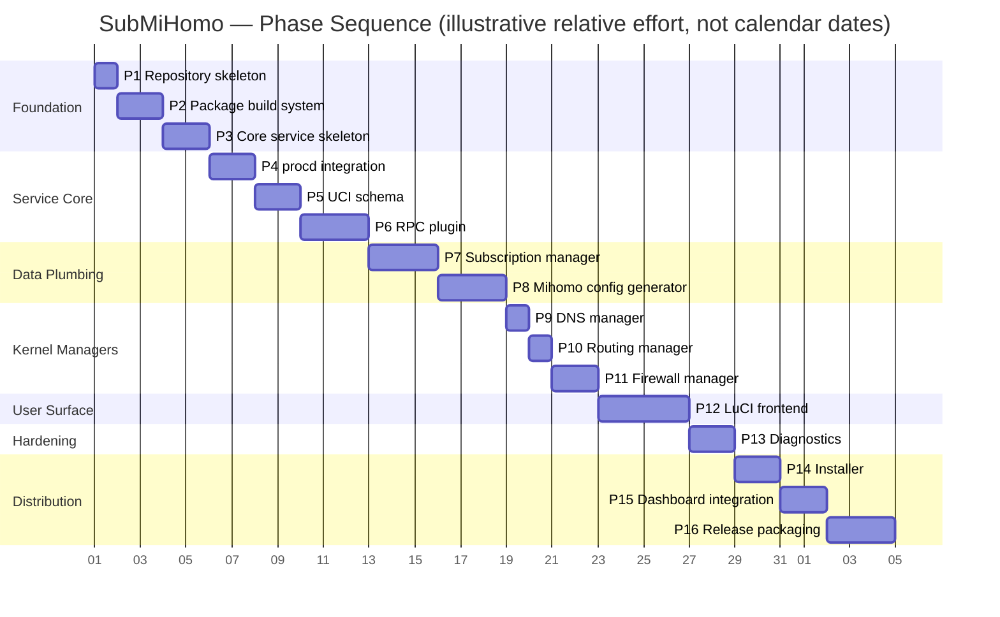
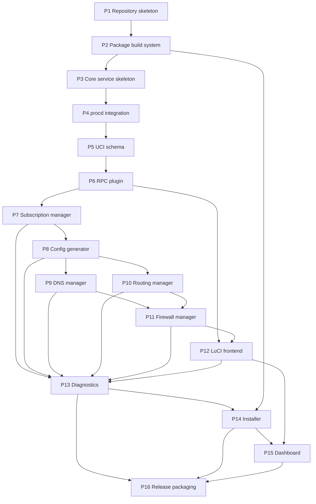

# SubMiHomo — Implementation Roadmap

## 0. How to Read This Document

This roadmap sequences the SubMiHomo build into 16 mandatory, ordered phases. It is a planning artifact, not a design document — for the authoritative technical design, consult the existing documents in `docs/`: `ARCHITECTURE.md`, `COMPONENTS.md`, `FILESYSTEM.md`, `UCI.md`, `NETWORK.md`, `SUBSCRIPTIONS.md`, `DASHBOARD.md`, `LUCI.md`, `BOOT.md`, `LOGGING.md`, `SECURITY.md`. Wherever this roadmap names a file, a function, a UCI option, or an RPC method, that name is taken directly from those documents so that planning and architecture never drift apart. In particular:

- File paths and the repository layout follow `docs/FILESYSTEM.md` §2.
- Module public interfaces (`config_generate()`, `routing_setup()`/`routing_teardown()`, `dns_setup()`/`dns_teardown()`, `firewall_setup()`/`firewall_teardown()`, `subscription_update()`, `dashboard_download()`, etc.) follow `docs/COMPONENTS.md` §3.
- The UCI schema (`enabled`, `subscription_url`, `subscription_update_interval`, `dns_mode`, `log_level`, `external_controller_port`, `external_controller_secret`, `allow_lan_access`, `bypass_china`, `dashboard_repo`, `subscription_user_agent`, `config_version`) follows `docs/UCI.md` §3.
- The rpcd RPC surface (`status`, `start`, `stop`, `restart`, `get_config`, `set_config`, `get_logs`, `run_diagnostics`, `update_subscription`, `download_dashboard`, `get_proxies`, `test_connection` — 12 methods, flat snake_case, registered under the ubus object `submihomo`) follows `docs/FILESYSTEM.md` §2.4 and §2.6.
- Firewall, routing, and DNS mechanics follow `docs/NETWORK.md`.
- Subscription download/validation/merge behavior follows `docs/SUBSCRIPTIONS.md`.
- Dashboard (Zashboard) behavior follows `docs/DASHBOARD.md`.

The 16-phase order below is fixed and must not be reordered — later phases assume the deliverables of every earlier phase are present and working. Companion document `docs/TASKS.md` decomposes each phase into individually implementable tasks (T-001 … T-098+).

---

## 1. Development Phases Overview

SubMiHomo is built bottom-up: filesystem and build tooling first, then an inert service skeleton, then process supervision, then configuration plumbing, then the management surface (RPC + subscription + config generation), then the three kernel-facing managers (DNS, routing, firewall) that actually turn the proxy on, then the user-facing LuCI application, then hardening (diagnostics), then distribution (installer, dashboard, release/CI). This ordering exists so that at every phase boundary there is a smaller, independently testable system than the one before it — nothing is deferred to "integration week."

The Gantt chart above expresses *relative* sequencing and rough effort weighting only. It is not a calendar commitment — actual duration depends on engineer availability and the realities of testing against physical mipsel_24kc hardware (see §3 risk notes throughout).

---

## 2. Phase-by-Phase Breakdown

### Phase 1 — Repository Skeleton

| Field | Detail |
|---|---|
| **Goal** | Establish the git repository and the exact directory layout that the OpenWrt build system, the package scripts, and every later phase will assume exists. |
| **Deliverables** | `Makefile` (empty/skeleton), `README.md`, `.gitignore`, the full `docs/`, `files/`, and `install/` directory trees (empty placeholders acceptable), initialized git history. |
| **Entry criteria** | None — this is the first phase. |
| **Exit criteria** | `git status` is clean on a fresh clone; every directory referenced anywhere in `docs/FILESYSTEM.md` §2 exists (even if some files are still empty placeholders); `README.md` renders correctly on the repository host. |
| **Complexity** | Simple |
| **Key risks** | Directory layout decided here is expensive to change later because every subsequent phase's file paths (and the OpenWrt Makefile's `define Package/.../install` stanzas) hard-code these paths. Getting the tree wrong here compounds. |
| **Automated verification** | A CI "lint" job that asserts the presence of every directory named in `docs/FILESYSTEM.md` §2.1–§2.8 (a simple `find`/`test -d` script is sufficient; no compiler needed yet). |

### Phase 2 — Package Build System

| Field | Detail |
|---|---|
| **Goal** | Make the repository buildable as OpenWrt APK packages using the OpenWrt SDK, even though the packages install no meaningful logic yet. |
| **Deliverables** | A complete root `Makefile` defining three packages via `define Package/submihomo`, `define Package/luci-app-submihomo`, and a `DEPENDS` reference to the upstream `mihomo` package; `postinst`/`prerm` package scripts; a build proven against the OpenWrt SDK producing installable (empty-bodied) `.apk` files. |
| **Entry criteria** | Phase 1 complete; an OpenWrt 25+ SDK (mipsel_24kc target) available in the build environment. |
| **Exit criteria** | `make package/submihomo/compile` and `make package/luci-app-submihomo/compile` succeed from a clean SDK checkout; the resulting `.apk` files pass `apk verify` (or the SDK's equivalent packaging check) and declare the correct `DEPENDS` chain (`luci-app-submihomo` → `submihomo` → `mihomo`). |
| **Complexity** | Medium |
| **Key risks** | OpenWrt's APK-based package format (25+) differs from the older `opkg`/`ipk` conventions in metadata and repository indexing; a Makefile that "looks right" by `opkg`-era convention may fail APK-specific checks. SDK version drift between contributors' local toolchains is a recurring source of "works on my machine" build failures. |
| **Automated verification** | CI job that downloads/caches the OpenWrt SDK, runs both package compiles, and asserts non-zero-size `.apk` artifacts exist in the output `bin/packages/mipsel_24kc/` tree. |

### Phase 3 — Core Service (core.sh + init.d)

| Field | Detail |
|---|---|
| **Goal** | Produce a procd-managed service that can be enabled, started, and stopped cleanly — without touching Mihomo, routing, DNS, or firewall state at all. This proves the packaging and procd wiring independently of every risky kernel-level operation that comes later. |
| **Deliverables** | `files/usr/lib/submihomo/core.sh` (constants, UCI helpers, logging helpers); `files/etc/config/submihomo` (default UCI file); `files/etc/init.d/submihomo` with a procd skeleton whose `start_service()`/`stop_service()` only log and exit (no Mihomo invocation yet). |
| **Entry criteria** | Phase 2 complete (packages install onto a test router or `chroot`). |
| **Exit criteria** | `/etc/init.d/submihomo enable`, `start`, `stop`, and `disable` all succeed with exit code 0 and produce the expected `logread -e submihomo` lines; `service submihomo status` reflects the correct running/stopped state. |
| **Complexity** | Simple/Medium |
| **Key risks** | POSIX-sh-only constraint (no bash) is easy to violate accidentally (e.g., `[[`, arrays, `local` misuse) and BusyBox `ash` will fail silently or behave differently than a developer's bash-based dev shell. |
| **Automated verification** | `shellcheck --shell=sh` (or equivalent POSIX-mode linter) across all shell files; a router/VM smoke test scripting `start`/`stop`/`enable`/`disable` and asserting exit codes and syslog output. |

### Phase 4 — procd Integration

| Field | Detail |
|---|---|
| **Goal** | Turn the inert skeleton from Phase 3 into a real procd-supervised Mihomo instance: command line, respawn policy, log capture, and UCI-change triggers. |
| **Deliverables** | `init.d/submihomo` updated with `procd_set_param command`, `procd_set_param respawn`, `procd_set_param stdout 1` / `stderr 1`, and a `service_triggers()` function declaring UCI (`submihomo`) and interface reload triggers. |
| **Entry criteria** | Phase 3 complete; the `mihomo` upstream package installable and present at `/usr/bin/mihomo`. |
| **Exit criteria** | `service submihomo start` launches a real Mihomo process (visible in `ps`), Mihomo's stdout/stderr appear in `logread` under the `submihomo.mihomo` tag, killing the Mihomo PID causes procd to respawn it within the configured respawn window, and `uci commit submihomo` followed by the appropriate reload event causes an automatic restart. |
| **Complexity** | Medium |
| **Key risks** | procd's respawn/threshold parameters are easy to misconfigure into either a restart storm (respawn too aggressive) or a silently-dead service (respawn exhausted with no operator-visible signal). `service_triggers()` firing too eagerly (e.g., on unrelated UCI config changes) causes unnecessary Mihomo restarts and dropped connections. |
| **Automated verification** | Kill-and-observe-respawn test script; a UCI-mutate-and-observe-restart test script; log inspection confirming the `submihomo.mihomo` tag is present and distinct from the `submihomo` tag (per `docs/LOGGING.md` §2). |

### Phase 5 — UCI

| Field | Detail |
|---|---|
| **Goal** | Implement the complete, validated UCI configuration schema described in `docs/UCI.md`, plus the `config_version` migration mechanism that will let future releases evolve the schema safely. |
| **Deliverables** | Full option set in `files/etc/config/submihomo` (`enabled`, `subscription_url`, `subscription_update_interval`, `dns_mode`, `log_level`, `external_controller_port`, `external_controller_secret`, `allow_lan_access`, `bypass_china`, `dashboard_repo`, `subscription_user_agent`, `config_version`) plus the `config bypass 'bypass'` list section; validation functions in `core.sh`; a `config_version`-gated migration function skeleton (current version = `1`, no migrations to run yet). |
| **Entry criteria** | Phase 4 complete (there is a running service whose behavior UCI values can meaningfully affect). |
| **Exit criteria** | Every option in `docs/UCI.md` §3.13's consolidated table can be read via `uci get`, rejects out-of-range/malformed values through the validation layer, and the migration function runs a no-op successfully against a config carrying `config_version=1`. |
| **Complexity** | Medium |
| **Key risks** | Validation logic duplicated between shell (`core.sh`) and the future RPC/Lua layer (Phase 6) can drift out of sync, producing a UI that accepts a value the shell layer later rejects (or vice-versa). Silent, un-validated writes from a future LuCI form would defeat the entire purpose of this phase. |
| **Automated verification** | A UCI validation test matrix (one test per option, covering at least one valid and one invalid value each) run via `uci`/`core.sh` shell test harness; confirmation that invalid `external_controller_port` values colliding with `7891`/`7890`/`1053` are rejected. |

### Phase 6 — RPC

| Field | Detail |
|---|---|
| **Goal** | Expose the complete SubMiHomo management surface as authenticated ubus RPC methods, so that no future UI or CLI code ever needs to read UCI files or shell out directly. |
| **Deliverables** | `files/usr/lib/rpcd/submihomo` implementing the `list` method plus all 12 methods (`status`, `start`, `stop`, `restart`, `get_config`, `set_config`, `get_logs`, `run_diagnostics`, `update_subscription`, `download_dashboard`, `get_proxies`, `test_connection`); `files/usr/share/rpcd/acl.d/luci-app-submihomo.json` granting read-only access to `luci-user` for the six read-only methods and full read/write to `luci-admin`. |
| **Entry criteria** | Phase 5 complete (UCI schema and validation exist for `get_config`/`set_config` to wrap); Phase 4 complete (procd `service` calls exist for `start`/`stop`/`restart` to delegate to). |
| **Exit criteria** | Every method is independently callable via `ubus call submihomo <method> '<json>'` and returns the documented JSON shape; unauthenticated/`luci-user`-scoped calls to write methods are rejected by rpcd's ACL enforcement, not by the plugin's own logic. |
| **Complexity** | Complex |
| **Key risks** | `run_diagnostics` and `test_connection` are stubbed in this phase (their full logic lands in Phase 13) — it is easy to accidentally under-scope them into permanently-empty placeholders instead of well-defined, extensible stubs. rpcd Lua plugins run inside the long-lived `rpcd` process, so any unhandled Lua error can affect *all* ACL-gated services on the router, not just SubMiHomo — defensive `pcall`-style error handling is mandatory. |
| **Automated verification** | A ubus-cli test script invoking every method with both valid and invalid input and asserting the JSON schema and HTTP-equivalent status; an ACL test invoking a write method as `luci-user` and asserting rejection. |

### Phase 7 — Subscription Manager

| Field | Detail |
|---|---|
| **Goal** | Implement the complete subscription lifecycle: download, three-level validation, backup, and atomic apply, exactly as specified in `docs/SUBSCRIPTIONS.md`. |
| **Deliverables** | `files/usr/lib/submihomo/subscription.sh` implementing `subscription_update()`, `subscription_status()`, `subscription_restore()`, and their private helpers (`subscription_download`, `subscription_validate`, `subscription_backup`, `subscription_apply`); cron scheduling management tied to `subscription_update_interval`. |
| **Entry criteria** | Phase 6 complete (so `update_subscription` RPC has something real to call); Phase 5 complete (`subscription_url`, `subscription_update_interval`, `subscription_user_agent` all validated and readable). |
| **Exit criteria** | A valid HTTPS subscription URL downloads, passes all three validation levels, and is atomically promoted to `current.yaml` with the prior file preserved as `backup.yaml`; every failure mode (bad URL scheme, HTTP error, oversized body, missing `proxies:` key, `mihomo -t` failure) leaves `current.yaml` completely untouched; `submihomo-ctl restore`-equivalent rollback correctly restores `backup.yaml`. |
| **Complexity** | Complex |
| **Key risks** | Router reboot or process kill mid-download must never corrupt `current.yaml` — this is only true if every intermediate write genuinely goes through `/tmp` (tmpfs) and only an atomic `mv` (same filesystem) ever touches the persistent file. A validation shortcut (e.g., skipping Level 3's `mihomo -t` check "just this once" for speed) reintroduces the exact corruption risk this phase exists to eliminate. |
| **Automated verification** | A test harness with a local HTTP fixture server serving valid, malformed, oversized, and non-200 subscription responses, asserting the correct accept/reject outcome and that `current.yaml`/`backup.yaml` are byte-for-byte unchanged on every rejection path. |

### Phase 8 — Mihomo Config Generator

| Field | Detail |
|---|---|
| **Goal** | Deterministically produce a complete, valid Mihomo `config.yaml` at `/var/run/submihomo/config.yaml` by merging the static template, UCI-derived settings, and the subscription's `proxies`/`proxy-groups`/`rules` sections. |
| **Deliverables** | `files/etc/submihomo/templates/base.yaml.tmpl`; `files/usr/lib/submihomo/config.sh` implementing `config_generate()` and its private `awk`/`sed`-based extraction and substitution helpers; the synthetic `PROXY` selector group injection and bypass-rule prepending logic described in `docs/SUBSCRIPTIONS.md` §5. |
| **Entry criteria** | Phase 7 complete (a valid `current.yaml` must exist to merge against); Phase 5 complete (all template placeholder tokens map to validated UCI values). |
| **Exit criteria** | `config_generate()` produces a file that passes `mihomo -t -f /var/run/submihomo/config.yaml` for at least three distinct real-world subscription fixtures (flat proxy list with no groups, nested groups, and a large 100+ proxy subscription); bypass rules are always ordered before subscription rules; `MATCH,PROXY` is always the final rule. |
| **Complexity** | Complex |
| **Key risks** | The `awk` column-0 state-machine extraction (§5.1 of `docs/SUBSCRIPTIONS.md`) is the single most fragile piece of shell code in the project — subtle indentation or key-ordering variance across different subscription providers can silently truncate a section instead of failing loudly. This must be treated as a hostile-input parser, not a convenience script. |
| **Automated verification** | A fixture-driven test suite feeding a library of real and adversarial subscription YAML samples through `config_generate()` and asserting both "does it validate under `mihomo -t`" and "does the extracted section contain the expected number of proxy/group/rule entries" (a naive truncation could still pass `mihomo -t` while silently dropping most of a user's proxies). |

### Phase 9 — DNS Manager

| Field | Detail |
|---|---|
| **Goal** | Forward all LAN DNS queries to Mihomo's DNS listener via a minimal, reload-only (never restart) dnsmasq drop-in configuration. |
| **Deliverables** | `files/usr/lib/submihomo/dns.sh` implementing `dns_setup()` and `dns_teardown()`, writing/removing `/etc/dnsmasq.d/submihomo.conf` and signaling dnsmasq via `HUP`. |
| **Entry criteria** | Phase 8 complete (Mihomo's DNS listener port and `dns_mode` are already baked into the generated config it will forward to). |
| **Exit criteria** | With the service running, LAN DNS queries resolve through Mihomo (verifiable by comparing a fake-IP-mode response against the `198.18.0.0/15` range, or by observing Mihomo's own DNS log entries); stopping the service restores dnsmasq's original upstream resolvers without a full dnsmasq restart (no DHCP interruption). |
| **Complexity** | Simple |
| **Key risks** | Using `service dnsmasq reload` instead of a direct `HUP` signal can trigger a full dnsmasq *restart* on some OpenWrt releases, briefly dropping DHCP leases — the distinction matters operationally even though it looks cosmetic in code review. |
| **Automated verification** | A DNS resolution test (`nslookup`/`resolvectl`-equivalent against the LAN-facing dnsmasq) executed before setup, after setup, and after teardown, asserting the expected upstream in each state; a DHCP-lease-continuity check across a `dns_setup()`/`dns_teardown()` cycle. |

### Phase 10 — Routing Manager

| Field | Detail |
|---|---|
| **Goal** | Install and remove the two kernel policy-routing constructs (`ip rule`, `ip route`) that make TPROXY-marked traffic locally deliverable. |
| **Deliverables** | `files/usr/lib/submihomo/routing.sh` implementing `routing_setup()` and `routing_teardown()`. |
| **Entry criteria** | Phase 9 complete (ordering per `docs/BOOT.md`: routing is set up before DNS in the startup sequence, but both must independently exist before Phase 11 can meaningfully be tested end-to-end). |
| **Exit criteria** | `routing_setup()` run twice in a row produces no duplicate rules/routes (verified idempotent via `ip rule show` / `ip route show table 100` diffing); `routing_teardown()` leaves zero SubMiHomo-owned entries in the routing policy database, even when called against a system where setup never ran. |
| **Complexity** | Simple |
| **Key risks** | Idempotency bugs here are subtle because `ip rule add`/`ip route add` are not naturally idempotent (`ip` fails loudly with "File exists" on a repeat call unless explicitly checked first) — an unguarded second `service submihomo restart` could otherwise fail startup entirely. |
| **Automated verification** | A repeat-setup test (`routing_setup(); routing_setup()`) asserting exactly one rule and one route exist afterward; a teardown-without-setup test asserting a clean `0` exit code. |

### Phase 11 — Firewall Manager

| Field | Detail |
|---|---|
| **Goal** | Create and remove the `inet submihomo` nftables table that performs TPROXY interception, static and user-defined bypass exclusion, and Mihomo's own-traffic loop prevention (`BYPASS_MARK`). |
| **Deliverables** | `files/usr/lib/submihomo/firewall.sh` implementing `firewall_setup()` (full replace-in-full ruleset application via `nft -f -`) and `firewall_teardown()` (single atomic `nft delete table inet submihomo`); dynamic population of the `user_bypass_ipv4` set from the UCI `bypass` list; the `bypass_china` GEOIP rule injection (implemented in `config.sh`'s rule assembly per `docs/NETWORK.md` §14, wired here as the UCI-driven toggle). |
| **Entry criteria** | Phase 10 complete (policy routing must exist for TPROXY-marked packets to be locally deliverable); Phase 8 complete (Mihomo's TPROXY port is already fixed in the generated config). |
| **Exit criteria** | With the table applied, a LAN client's TCP/UDP traffic is verifiably intercepted (visible as a new connection in Mihomo's own connection list) except for addresses in `bypass_ipv4`/`user_bypass_ipv4`, which pass through untouched; Mihomo's own outbound connections (marked `BYPASS_MARK`) are never re-captured (no routing loop); `firewall_teardown()` leaves `inet fw4` and every other nftables table completely untouched. |
| **Complexity** | Medium/Complex |
| **Key risks** | This is the highest blast-radius module in the project: a firewall rule bug can either (a) fail to proxy anything (silent no-op, hard to notice) or (b) cause a full routing loop that pegs CPU and cuts LAN internet access entirely. Rule ordering and hook priority (`mangle - 1`) must be exactly right relative to `fw4`'s own base chains — see `docs/NETWORK.md` §5 and §19. |
| **Automated verification** | A packet-marking test (`nft` rule counters or `conntrack` inspection) confirming marked vs. bypassed flows; an explicit routing-loop regression test that starts the service, generates outbound traffic from Mihomo itself, and asserts it never re-enters the TPROXY chain; a teardown test asserting `nft list ruleset` shows no `inet submihomo` table and an unchanged `inet fw4`. |

### Phase 12 — LuCI Frontend

| Field | Detail |
|---|---|
| **Goal** | Deliver the complete five-page LuCI JS application (Overview, Subscription, Settings, Proxies, Logs), communicating exclusively through the Phase 6 RPC surface. |
| **Deliverables** | `files/usr/share/luci/menu.d/luci-app-submihomo.json`; the five view modules under `files/htdocs/luci-static/resources/view/submihomo/` (`overview.js`, `subscription.js`, `settings.js`, `proxies.js`, `logs.js`). |
| **Entry criteria** | Phase 11 complete (Proxies and Overview pages need a fully functioning proxy engine to display meaningful live state); Phase 6 complete (every RPC method the UI calls must already exist and be stable). |
| **Exit criteria** | All five pages load with zero browser console errors against a stopped service, a running service with no subscription, and a running service with an active subscription; every form submission round-trips through `set_config`/`update_subscription`/`get_proxies` correctly; the tab bar navigates correctly between all five pages per the menu ordering in `docs/LUCI.md` §2. |
| **Complexity** | Complex |
| **Key risks** | LuCI JS's promise-based RPC calls fail ungracefully by default (unhandled rejections crash the view) unless every call site uses `L.resolveDefault()` or explicit `.catch()` handling — a service that is stopped or has no subscription yet is a *normal*, frequently-hit state, not an edge case, and the UI must degrade gracefully rather than showing a blank page or a stack trace. |
| **Automated verification** | A headless-browser (e.g., Playwright) smoke test loading all five pages against a live test router/VM in three service states (stopped / running-no-subscription / running-with-subscription) and asserting zero console errors and the presence of key DOM elements; a save-and-reload round-trip test on the Settings and Subscription pages. |

### Phase 13 — Diagnostics

| Field | Detail |
|---|---|
| **Goal** | Give operators and the UI a single, comprehensive, read-only health check covering every layer of the stack (binary presence, process state, API reachability, config validity, subscription presence, firewall state, routing state, DNS state, UCI consistency, disk space), fully wired into both the CLI and the RPC/LuCI surface. |
| **Deliverables** | All 12 diagnostic check functions (implemented once, shared by both call paths); the `run_diagnostics` RPC method (stubbed in Phase 6) fully wired to execute all 12 checks and return structured pass/fail/detail results; a `submihomo-ctl test` command exposing the same checks at the CLI; a diagnostics panel on the LuCI Overview page. |
| **Entry criteria** | Phases 7–11 complete (every subsystem a diagnostic check inspects — subscription, config, routing, DNS, firewall — must exist to be checkable); Phase 12 complete (there must be a UI surface to render results into). |
| **Exit criteria** | All 12 checks pass on a correctly configured, running installation; deliberately breaking each individual subsystem (removing the subscription file, corrupting the config, deleting the nftables table, killing Mihomo, removing the routing rule, stopping dnsmasq, filling the overlay filesystem) causes the corresponding — and only the corresponding — check to fail, with an actionable message. |
| **Complexity** | Medium |
| **Key risks** | Diagnostics must be strictly read-only and side-effect-free (per the constraint that `submihomo-ctl test` must be safely runnable at any time, including against a live production instance) — any check implemented as a "fix-it-if-broken" action instead of a pure observation breaks this guarantee and risks masking real failures. |
| **Automated verification** | A fault-injection test matrix: one test per check, in which the corresponding subsystem is deliberately broken and the diagnostic suite is asserted to report exactly that failure (and no unrelated false positives/negatives from the other 11 checks). |

### Phase 14 — Installer

| Field | Detail |
|---|---|
| **Goal** | Let a user go from a stock OpenWrt 25+ router to a fully installed, running SubMiHomo with a single command, and let them update or fully remove it just as cleanly. |
| **Deliverables** | `install/install.sh`, `install/update.sh`, `install/uninstall.sh`; the `files/usr/bin/submihomo-ctl` CLI tool. |
| **Entry criteria** | Phase 13 complete (the installer's final step should be able to run diagnostics to confirm success); Phase 2 complete (a real APK repository/feed must exist for `install.sh` to point at). |
| **Exit criteria** | `install.sh` run on a stock OpenWrt 25+ mipsel_24kc router results in an enabled, running service with zero manual steps beyond running the script and later pasting a subscription URL into LuCI; `update.sh` preserves all existing UCI configuration and subscription data across an upgrade; `uninstall.sh` leaves no SubMiHomo files, UCI config, cron entries, nftables tables, routing rules, or dnsmasq drop-ins behind (subject to the documented confirmation prompt for user subscription data). |
| **Complexity** | Medium |
| **Key risks** | "One command" is only genuinely true if the script correctly detects and fails loudly on unsupported conditions (wrong OpenWrt version, wrong architecture, no internet access to the package feed) rather than partially installing and leaving the router in an ambiguous state. |
| **Automated verification** | A clean-VM install test (fresh OpenWrt 25+ image → run `install.sh` → assert service running); an upgrade test (install an older tagged version → customize UCI → run `update.sh` → assert configuration byte-for-byte preserved); an uninstall test asserting the router's `nft ruleset`, `ip rule`/`ip route` tables, `crontab`, and filesystem are identical to a pristine pre-install snapshot (aside from the explicitly-retained subscription data, if the user opts to keep it). |

### Phase 15 — Dashboard

| Field | Detail |
|---|---|
| **Goal** | Automatically provision the Zashboard static web UI on first start, keep it updatable on demand, and surface its version/update controls in LuCI. |
| **Deliverables** | `files/usr/lib/submihomo/dashboard.sh` implementing `dashboard_download()` and `dashboard_version()`; an auto-download trigger in `init.d/submihomo`'s `start_service()` (only when `$DASHBOARD_DIR` is empty); the `download_dashboard` RPC method (stubbed in Phase 6) fully wired; a "Download/Update Dashboard" control and version display on the LuCI Overview page. |
| **Entry criteria** | Phase 14 complete (the installer's first `start_service()` invocation is the natural trigger point for the very first dashboard download); Phase 12 complete (a UI surface must exist to expose the manual update control). |
| **Exit criteria** | A fresh install with no prior dashboard files automatically produces a working `http://<router-ip>:<external_controller_port>/ui/` on first start; a manual re-trigger via LuCI or `submihomo-ctl` fetches and swaps in the latest GitHub release without any window in which the directory is fully empty (old content is removed only after the new archive downloads successfully). |
| **Complexity** | Medium |
| **Key risks** | GitHub API rate limiting or transient unavailability on first boot must degrade gracefully (service still starts and proxies traffic; dashboard is simply unavailable until retried) rather than blocking service startup — dashboard provisioning must never be a hard dependency of `start_service()` succeeding. |
| **Automated verification** | A first-start test on a router/VM with no prior dashboard content, asserting `/ui/index.html` becomes reachable; a GitHub-API-unreachable fault-injection test asserting the service still starts successfully and logs a clear warning. |

### Phase 16 — Release Packaging

| Field | Detail |
|---|---|
| **Goal** | Produce a signed, reproducible, continuously-tested APK release pipeline, and cut the v1.0.0 tag. |
| **Deliverables** | Generated APK signing key pair with a documented key-management process; GitHub Actions workflows for CI unit tests, package builds, and tagged releases (build → sign → publish); a final documentation review pass; the `v1.0.0` git tag. |
| **Entry criteria** | Phases 1–15 complete and all acceptance criteria in §5 of this document (project-wide) verified at least once end-to-end. |
| **Exit criteria** | A tagged release triggers CI end-to-end (unit tests → package build → APK signing → publication) with no manual intervention; a router pointed at the published feed can `apk add submihomo luci-app-submihomo` and receive a working, signed package. |
| **Complexity** | Complex |
| **Key risks** | Key management is a one-way door — losing the private signing key after users have trusted the public key means every future release requires a disruptive key-rotation/re-trust flow for existing installations. CI pipelines that "pass" without actually exercising the mipsel_24kc target (e.g., silently falling back to a host-architecture build) create false confidence. |
| **Automated verification** | A full pipeline dry run against a release-candidate tag in a non-production feed; `apk verify` against the published artifact; a clean-router install test pulling directly from the published (non-dry-run) feed. |

---

## 3. Critical Path Analysis

The following phases sit on the strict critical path — no later phase can be meaningfully started, let alone completed, before each of these finishes, because each one is a hard technical prerequisite (not merely a scheduling convenience) for what follows:

**Phase 1 → 2 → 3 → 4 → 5 → 6 → 7 → 8 → 11 → 12 → 13 → 16**

Rationale for each critical-path link:

- **1→2**: the build system needs the directory tree to exist.
- **2→3**: the init script needs to be installable via a working package before it can be tested on-router.
- **3→4**: real Mihomo supervision needs the skeleton's procd registration to already work.
- **4→5**: UCI-driven restarts (`service_triggers`) need a real running process to restart.
- **5→6**: `get_config`/`set_config` need a validated schema to wrap.
- **6→7**: `update_subscription` needs the RPC method to exist for anything beyond CLI-only use, and Phase 7's cron/manual triggers are exercised through it.
- **7→8**: config generation needs a real, validated `current.yaml` to merge.
- **8→11**: the firewall's TPROXY target port and Mihomo's own `BYPASS_MARK` routing-mark are only meaningful once a real generated config exists to launch Mihomo against.
- **11→12**: the Proxies and Overview pages are not meaningfully testable against a Mihomo instance that isn't actually receiving real traffic.
- **12→13**: diagnostics need a UI surface to render into for the acceptance criteria to be checkable end-to-end (the check *functions* could technically be written earlier, but wiring and verification cannot complete before Phase 12).
- **13→16**: release packaging's exit criteria explicitly require all project-wide acceptance criteria — including diagnostics passing — to have been verified at least once.

**Phases 9 and 10 are on a secondary, parallelizable path.** Both depend only on Phase 8 (a generated config with fixed ports) and are mutual siblings of Phase 11 rather than strict predecessors of it in a purely technical sense — however, this roadmap still sequences them before Phase 11 (9 → 10 → 11) because `docs/BOOT.md`'s documented startup order is routing → DNS → firewall, and building/testing the managers in that same order avoids constantly re-deriving "what does this module need to assume is already true" from scratch. A team with spare capacity may implement Phase 9 and Phase 10 concurrently.

**Phases 14 and 15 are softly parallelizable with each other** after Phase 13: the installer does not technically require the dashboard to exist to install a working proxy, and dashboard auto-provisioning does not technically require the installer scripts to exist (it can be tested by directly starting the service on a manually-provisioned test router). This roadmap sequences 14 before 15 because the installer's exit criteria include "diagnostics pass," and it is simpler to validate that statement once, at the end, than to re-validate it after the dashboard is added.

**Phase 6 (RPC) and Phase 12 (LuCI) deserve special schedule attention.** Phase 6 is the single largest formal interface boundary in the project (12 methods, ACL-gated, consumed by all five LuCI pages). Any late change to an RPC method's input/output shape after Phase 12 has begun ripples into every page that calls it. Locking the RPC contract before starting Phase 12 — even if some method bodies are still stubs pending Phase 13/15 — is the highest-leverage way to avoid rework.

---

## 4. Phase Dependency Graph

---

## 5. Milestones

### M1 — Service Skeleton (Phases 1–3 complete)

The first genuinely demonstrable artifact: a real OpenWrt package that installs, registers a procd service, and starts/stops cleanly with zero effect on routing, DNS, or firewall state. There is no proxying yet — this milestone exists purely to retire packaging and process-supervision risk before any networking code is written.

**Milestone acceptance check**: on a clean OpenWrt 25+ mipsel_24kc router (or equivalent VM), install the built `submihomo` package, run `service submihomo enable && service submihomo start`, confirm `service submihomo status` reports running, then `service submihomo stop` and confirm a clean exit with no residual processes.

### M2 — Core Working (Phases 4–8 complete)

Traffic is no longer proxied yet (that requires Phases 9–11), but every piece of logic that decides *what Mihomo should do* is complete and independently verified: procd supervises a real Mihomo process, UCI fully describes desired behavior, the RPC surface can drive it end-to-end, subscriptions download/validate/apply correctly, and a correct `config.yaml` is generated from real subscription data.

**Milestone acceptance check**: with a valid subscription URL configured via `ubus call submihomo set_config`, `ubus call submihomo update_subscription` succeeds, `ubus call submihomo restart` succeeds, and `mihomo -t -f /var/run/submihomo/config.yaml` passes against the freshly generated file.

### M3 — Full Feature (Phases 9–12 complete)

The complete product experience from the architectural brief's acceptance criteria: pasting a subscription URL into LuCI and clicking Apply results in all LAN traffic actually being proxied, with DNS, routing, and firewall fully wired, and every page of the LuCI application functioning against a live instance.

**Milestone acceptance check**: from a LAN client with no manual proxy configuration, browse to a subscription-selected proxy's expected egress; verify in the Proxies page that the active node matches; verify in the Overview page that status reporting is accurate; disable the service via LuCI and confirm normal (non-proxied) internet access resumes immediately.

### M4 — Production Ready (Phases 13–16 complete)

Every acceptance criterion in §6 below is met: all 12 diagnostic checks pass, the one-command installer/updater/uninstaller round-trip cleanly, the dashboard auto-provisions, and the project is packaged, signed, CI-tested, and tagged as a release.

**Milestone acceptance check**: run the full regression suite (see `docs/TASKS.md` T-096) against a freshly flashed router using only the published install command; confirm all 12 diagnostics pass; confirm `apk upgrade` from the prior minor version preserves configuration; tag `v1.0.0`.

---

## 6. Project-Wide Acceptance Criteria

These criteria (restated from the governing architectural brief) apply to the *completed* project, not to any single phase, and are the definition of "done" referenced by Phase 16 and Milestone M4:

1. A fresh OpenWrt 25+ router can be set up with **one command** (`install/install.sh`).
2. After pasting a subscription URL in LuCI and clicking Apply, all LAN traffic is proxied.
3. Disabling the service completely removes all routing/DNS/firewall changes.
4. Subscription auto-updates work on the configured schedule.
5. Zashboard is accessible and shows correct proxy data.
6. All 12 diagnostic checks pass on a working installation.
7. All unit tests pass in CI.
8. The package installs cleanly, with no errors, on mipsel_24kc.
9. The service survives a router reboot (auto-starts correctly).
10. Upgrading the package with `apk upgrade` preserves user configuration.

---

## 7. Phase Complexity Breakdown Table

| # | Phase | Complexity | Primary Risk Category | Depends On |
|---|---|---|---|---|
| 1 | Repository skeleton | Simple | Layout churn cost | — |
| 2 | Package build system | Medium | Toolchain/SDK drift | 1 |
| 3 | Core service skeleton | Simple/Medium | POSIX-sh correctness | 2 |
| 4 | procd integration | Medium | Respawn/trigger misconfiguration | 3 |
| 5 | UCI | Medium | Validation drift (shell vs. RPC) | 4 |
| 6 | RPC | Complex | ACL correctness, plugin-crash blast radius | 5 |
| 7 | Subscription manager | Complex | Atomicity / corruption on partial failure | 6 |
| 8 | Config generator | Complex | Fragile `awk` extraction on hostile input | 7 |
| 9 | DNS manager | Simple | dnsmasq restart-vs-reload distinction | 8 |
| 10 | Routing manager | Simple | Idempotency of `ip` commands | 9 |
| 11 | Firewall manager | Medium/Complex | Routing loops, LAN outage blast radius | 9, 10 |
| 12 | LuCI frontend | Complex | Ungraceful RPC-failure handling in UI | 6, 11 |
| 13 | Diagnostics | Medium | Side-effect-free guarantee | 7–12 |
| 14 | Installer | Medium | Partial-install ambiguous states | 2, 13 |
| 15 | Dashboard | Medium | Startup-blocking on network failure | 12, 14 |
| 16 | Release packaging | Complex | Signing-key custody, CI false confidence | all |

---

## 8. What Must Be Tested Before Moving to the Next Phase

The general rule: **a phase is not complete until its exit criteria (§2) are demonstrated on real (or realistically emulated) OpenWrt 25+ mipsel_24kc hardware or an equivalent VM/QEMU target — not merely reviewed as code.** In addition to each phase's specific exit criteria above, the following cross-cutting checks apply at every phase boundary:

- **No regression in earlier exit criteria.** Re-run the exit-criteria check for every previously completed phase, not just the newest one — this project's layered start/stop design (per `docs/ARCHITECTURE.md` §2.4) means a bug introduced in, say, Phase 11's firewall module can silently break Phase 9's DNS exit criteria if teardown ordering is wrong.
- **`shellcheck` (POSIX mode) is clean** on every shell file touched in the phase — this is the cheapest possible gate against accidental bash-isms, and catching it late (e.g., in Phase 16 CI) instead of at each phase boundary wastes far more time.
- **Module size budgets are respected** (see the table in §9 of `docs/TASKS.md`'s conventions section) — a module that has grown past its guideline line count is a signal to split responsibilities before compounding technical debt into later phases.
- **No new global mutable shell state** was introduced — every shell module must remain safely re-sourceable and callable in isolation for testing.
- **Every new command's return code is checked** — an unchecked `nft`, `ip`, `uci`, or `wget` invocation is exactly the kind of "incomplete error handling" the project's forbidden-patterns list exists to prevent, and it is far cheaper to catch in the phase that introduced it than to debug later as an intermittent field failure.
- **Logs are inspected, not just exit codes.** A command can return `0` while still logging a warning that indicates a latent problem (e.g., dnsmasq reload silently skipped because the daemon wasn't running) — reviewing `logread -e submihomo` output as part of exit-criteria verification, not just shell exit statuses, is part of "testing" for this project.

---

## 9. Post-Launch Considerations (Beyond v1.0)

The following are explicitly out of scope for the v1.0.0 release described by this roadmap (consistent with `docs/ARCHITECTURE.md` §13, "Intentional Omissions"), but are reasonable candidates for a v1.1+ roadmap once the project has real-world usage data:

- **IPv6 support.** Currently a hard constraint exclusion for v1.0. Adding it means doubling the nftables/routing/DNS surface (an `inet6`-aware bypass set, a second policy-routing table, `AAAA`-aware fake-IP handling) and should be scoped as its own multi-phase project, not a patch.
- **Multiple concurrent subscription sources with deduplication.** Mihomo itself only consumes one active config; merging N subscriptions safely (name collisions, duplicate proxy definitions, conflicting rules) is a non-trivial data-modeling problem deferred by design.
- **Per-device (MAC/IP) bypass and routing policy**, beyond the current global bypass list — would require stateful per-client tracking not currently modeled anywhere in the kernel-facing managers.
- **Traffic statistics UI.** Mihomo's REST API already exposes connection-level statistics; a dedicated LuCI stats page consuming them is additive to the existing RPC surface and does not require kernel-level changes.
- **Subscription version history** beyond the current single-generation backup, for users who want to roll back further than "the one before this one."
- **Automated on-target (QEMU/hardware-in-the-loop) CI testing** for mipsel_24kc, replacing or supplementing the SDK-build-only verification used in v1.0's CI (Phase 16). This is the single highest-value post-launch investment for catching hardware-specific regressions (nftables kernel module availability, procd version skew, BusyBox applet differences) that a build-only pipeline cannot detect.
- **Alternative proxy cores or dashboards** (e.g., sing-box, an alternative to Zashboard) — explicitly rejected as v1.0 scope per the technology constraints, but the modular boundary between `dashboard.sh`'s narrow interface (§3.7 of `docs/COMPONENTS.md`) and the rest of the system means a future alternate dashboard integration would be comparatively low-risk to add without touching kernel-facing code.
- **Centralized/fleet management** of multiple routers — explicitly out of scope; SubMiHomo's entire architecture (local UCI, local rpcd, local LuCI) assumes a single-router deployment model.

None of the above should be started before v1.0.0 ships; listing them here is intended to prevent scope creep during Phases 1–16 by giving reviewers a clear, written place to redirect "what about X" requests during development.
