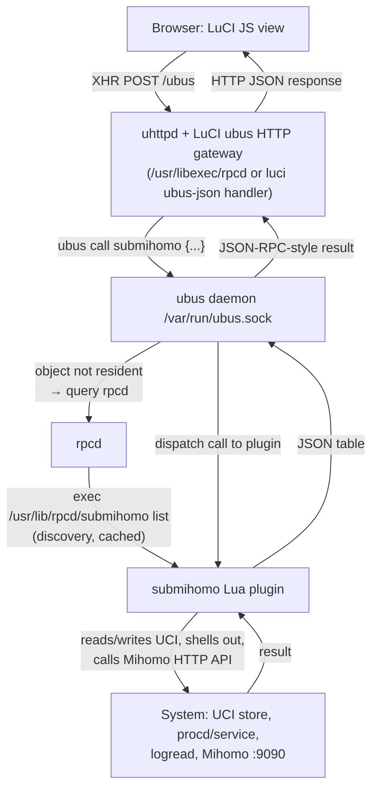
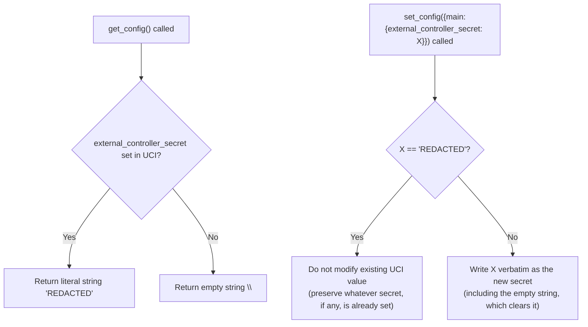
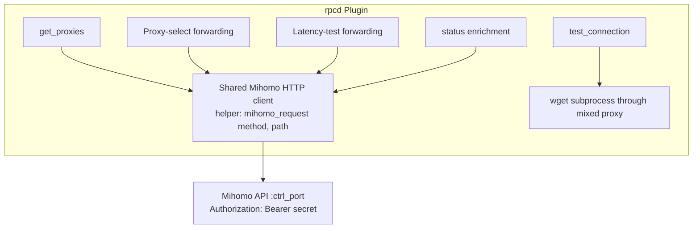
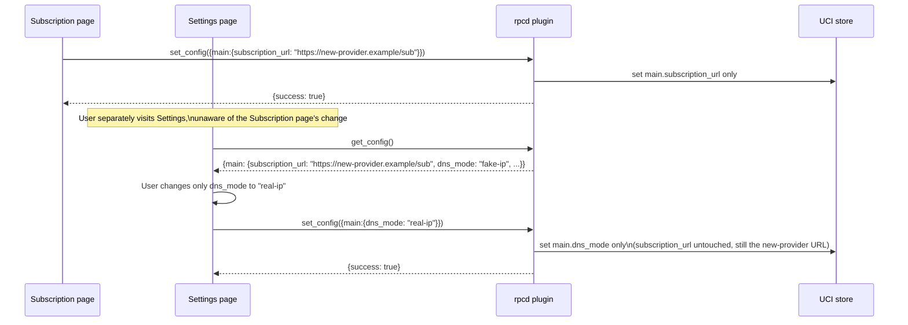
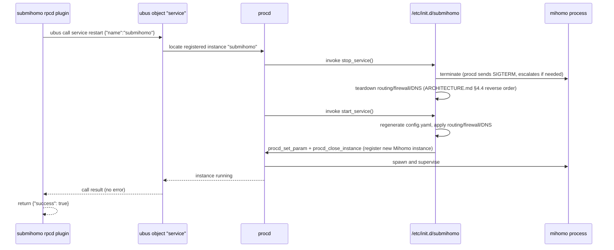
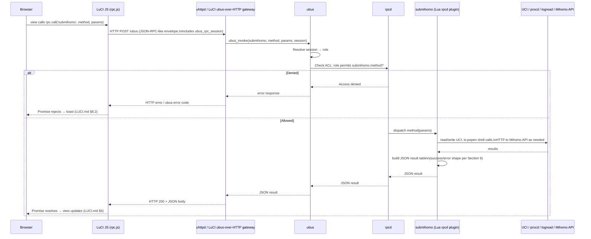

# SubMiHomo — RPC / ubus / rpcd Architecture

## Table of Contents

1. [RPC System Architecture](#1-rpc-system-architecture)
2. [Why a Lua rpcd Plugin Was Chosen](#2-why-a-lua-rpcd-plugin-was-chosen)
3. [Plugin Discovery and Registration](#3-plugin-discovery-and-registration)
4. [ubus Object Name and Namespace](#4-ubus-object-name-and-namespace)
5. [Complete Method Catalog](#5-complete-method-catalog)
6. [Authentication and Authorization](#6-authentication-and-authorization)
7. [Protecting `external_controller_secret`](#7-protecting-external_controller_secret)
8. [Mihomo API Proxy Design](#8-mihomo-api-proxy-design)
9. [RPC Error Codes and Messages](#9-rpc-error-codes-and-messages)
10. [Testing RPC Methods Manually](#10-testing-rpc-methods-manually)
11. [Rate Limiting](#11-rate-limiting)
12. [Partial Update Semantics of `set_config`](#12-partial-update-semantics-of-set_config)
13. [Service Restart Mechanism](#13-service-restart-mechanism)
14. [The Synchronous Execution Constraint](#14-the-synchronous-execution-constraint)
15. [Diagram: RPC Call Flow](#15-diagram-rpc-call-flow)
16. [Data Contract Table](#16-data-contract-table)

---

## 1. RPC System Architecture

SubMiHomo exposes all backend functionality to the LuCI frontend (and to any other authorized local client, such as the `submihomo-ctl` CLI tool or a future automation script) through a single `ubus` object named `submihomo`. This object is not a compiled C ubus service; it is registered dynamically by `rpcd`, OpenWrt's RPC daemon, from a plugin file discovered under `/usr/lib/rpcd/`.

The layered call path, from a user's click in the browser down to a line of shell/Lua code, is:



This architecture gives SubMiHomo four properties that matter for an embedded router context:

1. **No custom daemon**: SubMiHomo does not run a persistent background RPC server process consuming RAM. `rpcd` invokes the plugin script on demand, per call, and the OS reclaims all resources between calls. This is important given the RAM constraints documented in `ARCHITECTURE.md` §12.1.
2. **Uniform authentication**: because `submihomo` is a normal ubus object exposed through the standard rpcd/ACL pipeline, it automatically inherits OpenWrt's existing session-based authentication and per-role ACL enforcement — no custom auth code is needed in the plugin itself.
3. **Uniform tooling**: any ubus-aware tool (`ubus call`, `ubus-cli`, other LuCI apps, external ubus-over-SSH tunnels) can invoke SubMiHomo's methods identically to how it invokes any core OpenWrt ubus object, without SubMiHomo needing to document or maintain a bespoke protocol.
4. **Process isolation per call**: because rpcd forks a plugin execution per invocation (or per short-lived batch, depending on rpcd's internal call batching — see Section 11), a crash or hang in one method invocation (e.g., a subscription download that stalls) does not take down a persistent RPC server that other methods depend on; each call is independent at the process level.

---

## 2. Why a Lua rpcd Plugin Was Chosen

Three implementation strategies were evaluated for exposing SubMiHomo's backend functionality over ubus. The Lua rpcd plugin approach was selected as final; the other two are documented here for completeness and to explain why they were rejected.

| Approach | Description | Verdict |
|---|---|---|
| **A. Pure ubus C/compiled service** | A small compiled daemon linking `libubus` directly, registering `submihomo` as a long-lived ubus object. | **Rejected.** Requires a persistent process (RAM cost, procd supervision entry, crash-restart logic), a full C build toolchain integration for a MIPS cross-compile target, and duplicates functionality the shell modules (`ARCHITECTURE.md` §4.4) already implement. Introduces a second implementation language into a project that is otherwise entirely shell + Lua, raising long-term maintenance cost for limited benefit. |
| **B. Shell-based rpcd plugin** | A POSIX shell script at `/usr/lib/rpcd/submihomo` implementing the rpcd plugin protocol (`list` / method dispatch by argv, JSON emitted via string concatenation or `jsonfilter`/`jshn`). | **Considered, then rejected in favor of C.** Shell is already SubMiHomo's primary implementation language for the init/config/routing/dns/firewall/subscription/dashboard modules, and a shell rpcd plugin would be the most "in-family" choice stylistically. However, JSON construction and parsing in POSIX shell is fragile: nested objects (as required by `get_config`'s `main`/`bypass` structure and `set_config`'s input payload) require either the external `jshn` helper (itself a shell wrapper around `libubox`'s JSON blob API, with a non-trivial imperative API for building nested structures) or manual string escaping, both of which are error-prone for arbitrarily-shaped user input (e.g., a subscription URL containing characters that must be JSON-escaped, or a dynamic bypass address list of variable length). Error handling (malformed input, partial failures) is also harder to express robustly in shell than in Lua's structured `pcall`/table model. |
| **C. Lua rpcd plugin (chosen)** | A Lua script at `/usr/lib/rpcd/submihomo`, registered with rpcd's Lua plugin loader, using `luci.jsonc` (or `cjson`) for encoding/decoding and the `uci` Lua binding for direct, non-shelling-out UCI access. | **Chosen.** |

### 2.1 Why Lua wins for this specific project

- **Native JSON handling**: Lua tables map directly onto JSON objects/arrays via `luci.jsonc.stringify()`/`.parse()` (the same library LuCI core itself uses internally), eliminating the escaping and nested-structure-construction fragility of the shell approach. The nested `get_config`/`set_config` payloads (`main.*` keys plus a `bypass.address` array) are naturally expressed as native Lua tables.
- **Direct UCI library access**: the `uci` Lua binding (`local uci = require("uci")`) reads and writes `/etc/config/submihomo` directly via `libuci`'s C bindings, without shelling out to the `uci` CLI binary for every field access. This is both faster (no process fork per field) and safer (no shell-quoting concerns for values that might contain special characters, such as a subscription URL with query-string parameters).
- **Structured error handling**: Lua's `pcall`/`xpcall` allows each method handler to catch failures (a malformed subscription script exit, a missing file, a Mihomo API connection refusal) and translate them into the standardized `{success: false, error: "..."}` shape (Section 9) deterministically, rather than relying on shell exit-code/stderr conventions that are easy to get subtly wrong across many methods.
- **Consistency with OperWrt ecosystem precedent**: numerous mature first-party LuCI applications (`luci-app-firewall`, `luci-app-statistics`, `luci-app-wireguard`) ship Lua rpcd plugins following this exact pattern, giving SubMiHomo a well-trodden, well-understood implementation shape to follow, easing onboarding for any future contributor already familiar with OpenWrt package development.
- **Still shells out where appropriate**: the Lua plugin is not a rewrite of the shell modules. For operations that are inherently the shell layer's responsibility (running `subscription.sh`, calling `service` via `ubus call service ...`, invoking `logread`), the Lua plugin uses `io.popen()` to invoke those existing scripts/binaries and captures their stdout/exit status, treating them as opaque subprocesses. Lua is the *glue and transport* layer, not a replacement for the shell modules documented in `ARCHITECTURE.md`.

---

## 3. Plugin Discovery and Registration

`rpcd` discovers plugins by scanning `/usr/lib/rpcd/` at startup (and upon receiving `SIGHUP`, e.g., after a package install/upgrade triggers `/etc/init.d/rpcd reload`). Any executable file in that directory is treated as a candidate plugin and is queried with a `list` invocation to discover its method signatures.

```mermaid
sequenceDiagram
    participant Init as /etc/init.d/rpcd (or SIGHUP)
    participant rpcd
    participant Plugin as /usr/lib/rpcd/submihomo

    Init->>rpcd: start / reload
    rpcd->>Plugin: exec submihomo list
    Plugin-->>rpcd: JSON: {"status":{},"start":{},"stop":{},...}
    rpcd->>rpcd: Register ubus object "submihomo"\nwith one method per top-level key
    Note over rpcd: Object now resident;\nfuture "ubus call submihomo X"\ndispatches to this plugin
```

### 3.1 The `list` contract

Per the standard rpcd Lua plugin convention, the file registers its own dispatch table and, when invoked as `submihomo list` (or via rpcd's internal Lua-loader equivalent of that convention — the rpcd Lua loader calls a well-known global table/function the script defines, rather than literally re-executing itself with argv, but the effective contract is identical: enumerate method names and their expected input parameter shapes), returns a JSON object whose keys are the twelve method names documented in Section 5 and whose values describe each method's accepted parameters (empty object `{}` for no-argument methods, or a parameter-name → example-type map for methods accepting input, per rpcd's convention of using a representative value to convey the expected JSON type — e.g., `{"lines": 100, "source": "all"}` for `get_logs`).

### 3.2 File requirements

| Requirement | Detail |
|---|---|
| Path | `/usr/lib/rpcd/submihomo` |
| Permissions | `0755`, owned by `root:root` |
| Interpreter | Lua 5.1-compatible (OpenWrt's system Lua), invoked either via a `#!/usr/bin/lua` shebang or through rpcd's built-in Lua plugin loader depending on the OpenWrt rpcd build configuration |
| Dependencies | `uci` (Lua UCI bindings), `luci.jsonc` (JSON encode/decode), `luci.util` (shell execution helpers), standard `io`/`os` libraries |
| Packaging | Shipped by the `submihomo` APK package (not `luci-app-submihomo` — the RPC plugin is core backend functionality usable independently of any LuCI frontend, consistent with `ARCHITECTURE.md` §4.2's file table) |

### 3.3 Reload triggers

The `submihomo` APK package's postinst script calls `/etc/init.d/rpcd reload` (or sends `rpcd`'s process a `SIGHUP`) after installation/upgrade, ensuring the plugin is discovered immediately without requiring a full router reboot. If this step is skipped (e.g., a manual file copy during development), `rpcd` will not see the new/updated plugin until its next scan trigger — a detail worth remembering when iterating on the plugin during development (documented explicitly here to save future contributors a debugging session).

---

## 4. ubus Object Name and Namespace

The plugin registers a single ubus object named exactly **`submihomo`** (lowercase, matching the project and package name, with no version suffix or namespacing prefix). All twelve methods live under this one object — SubMiHomo does not split functionality across multiple ubus objects (e.g., `submihomo.subscription`, `submihomo.proxy`), because:

- A single flat object matches the granularity at which the ACL file (`ARCHITECTURE.md` §11.3) already grants permissions — read/write is decided per-method, not per-object, so multiple objects would add namespacing complexity without additional access-control expressiveness.
- LuCI JS's `rpc.declare()` calls are declared per-method regardless of object structure, so a single object imposes no additional verbosity on the frontend.
- Every core system ubus object exposed to LuCI (`system`, `network.interface`, `service`) follows the same flat-namespace-per-subsystem convention, and SubMiHomo intentionally mirrors this to stay idiomatic.

Fully qualified, every method is invoked as `ubus call submihomo <method> '<json-params>'`.

---

## 5. Complete Method Catalog

The following twelve methods constitute the entire `submihomo` ubus object surface. Each entry documents the method's purpose, exact input/output schema, error shape, ACL requirement, implementation approach, timeout behavior, and side effects.

### 5.1 `status`

| | |
|---|---|
| **Purpose** | Returns a consolidated snapshot of service and subscription state for the Overview page and CLI status command. |
| **ACL** | read |
| **Timeout** | 5 seconds (bounded by a single Mihomo `/version` HTTP call plus fast local file/UCI reads) |
| **Side effects** | None (read-only) |

**Input schema**: none (empty object `{}`)

**Output schema**:

| Field | Type | Nullable | Description |
|---|---|---|---|
| `running` | boolean | no | Whether the Mihomo process is currently supervised and alive |
| `version` | string | yes | Mihomo binary version, from its `/version` API; `null` if unreachable |
| `pid` | integer | yes | Process ID, from `service list`/procd instance data; `null` if stopped |
| `uptime` | integer | yes | Seconds since process start; `null` if stopped |
| `subscription_url` | string | no | Raw configured URL (empty string if unset) — used only for the "is a subscription configured" check, never rendered raw in the UI |
| `subscription_url_masked` | string | no | URL with all but the last 6 characters of the path/query replaced by a placeholder, e.g. `https://exam...5f8a2c` |
| `last_update` | integer | yes | Unix epoch seconds of the last successful subscription update; `null` if never updated |
| `proxy_count` | integer | no | Number of proxies in the active subscription (`0` if none) |
| `dns_mode` | string | no | `"fake-ip"` or `"real-ip"` |
| `tproxy_port` | integer | no | Configured TPROXY port |
| `ctrl_port` | integer | no | Configured external controller port |
| `has_dashboard` | boolean | no | Whether the dashboard directory is populated |
| `dashboard_version` | string | yes | Dashboard release tag; `null` if not installed |

**Implementation approach**: query `service list '{"name":"submihomo"}'` via `ubus call` (Lua's `ubus` binding or `io.popen`) for `running`/`pid`/`uptime`; read UCI directly via the `uci` Lua library for `subscription_url`, `dns_mode`, `tproxy_port`, `ctrl_port`; check `os.time()` against a persisted last-update marker file for `last_update`; check file existence under the dashboard install path for `has_dashboard`/`dashboard_version`; issue a short-timeout HTTP GET to `http://127.0.0.1:<ctrl_port>/version` (with the configured secret) for `version`, tolerating failure gracefully (field becomes `null`, not a method-level error).

---

### 5.2 `start`

| | |
|---|---|
| **Purpose** | Starts the SubMiHomo service if not already running. |
| **ACL** | write |
| **Timeout** | 10 seconds |
| **Side effects** | Spawns the Mihomo process under procd supervision; applies routing/firewall/DNS state (per `ARCHITECTURE.md` §4.5) |

**Input schema**: none

**Output schema** (success): `{"success": true}`
**Output schema** (failure): `{"success": false, "error": "<reason>"}`

**Implementation approach**: `ubus call service list '{"name":"submihomo"}'` to check current state; if not running, `ubus call service start '{"name":"submihomo"}'`. The method does not itself perform config generation or firewall setup — that remains entirely the init script's responsibility (per `ARCHITECTURE.md` §4.5); this RPC method is a thin trigger, not a reimplementation of service startup logic.

---

### 5.3 `stop`

| | |
|---|---|
| **Purpose** | Stops the SubMiHomo service. |
| **ACL** | write |
| **Timeout** | 10 seconds |
| **Side effects** | Terminates the Mihomo process; tears down routing/firewall/DNS state via the init script's `stop_service()` |

**Input schema**: none

**Output schema** (success): `{"success": true}`
**Output schema** (failure): `{"success": false, "error": "<reason>"}`

**Implementation approach**: `ubus call service stop '{"name":"submihomo"}'`.

---

### 5.4 `restart`

| | |
|---|---|
| **Purpose** | Restarts the service, used both by explicit user action and automatically by the Settings page after critical config changes. |
| **ACL** | write |
| **Timeout** | 15 seconds |
| **Side effects** | Full stop + start cycle; briefly interrupts proxying for all LAN clients |

**Input schema**: none

**Output schema** (success): `{"success": true}`
**Output schema** (failure): `{"success": false, "error": "<reason>"}`

**Implementation approach**: `ubus call service restart '{"name":"submihomo"}'`.

---

### 5.5 `update_subscription`

| | |
|---|---|
| **Purpose** | Triggers a synchronous subscription download, validation, and hot-swap using the URL currently stored in UCI. |
| **ACL** | write |
| **Timeout** | 60 seconds (hard ceiling; the call must return an error rather than hang past this point) |
| **Side effects** | May replace `/etc/submihomo/subscriptions/current.yaml`, rotate `backup.yaml`, regenerate `config.yaml`, and restart the Mihomo process (per `ARCHITECTURE.md` §5.4) |

**Input schema**: none (reads `main.subscription_url` from UCI)

**Output schema** (success): `{"success": true, "proxy_count": 42}`
**Output schema** (failure): `{"success": false, "error": "Download failed: HTTP 403"}`

**Implementation approach**: invoke `/usr/lib/submihomo/subscription.sh update` via `io.popen`, capturing combined stdout/exit status; the shell script performs the full flow diagrammed in `ARCHITECTURE.md` §5.4 (download → validate non-empty → validate `proxies:` key → `mihomo -t -f` syntax check → backup rotation → atomic swap → trigger config regeneration and restart). The Lua plugin parses the script's final stdout line (a single JSON object the script itself emits, e.g., `{"success":true,"proxy_count":42}`) rather than re-implementing any of that logic itself — this keeps the download/validation logic in exactly one place (the shell module) with the RPC layer acting purely as an invocation and JSON pass-through wrapper.

**Timeout enforcement**: the Lua plugin wraps the `io.popen` read loop with a wall-clock deadline check (comparing `os.time()` against a start timestamp on each read iteration); if the subprocess has not completed within 60 seconds, the plugin returns `{"success": false, "error": "Timed out waiting for subscription update"}` to the caller. The underlying shell subprocess itself may continue running briefly after this point (Lua's `io.popen` on a blocking read does not offer a true async cancel primitive without additional process-group signaling); the subscription script's own atomicity guarantees (backup-then-swap) ensure that even if the RPC caller times out first, the eventual on-disk result is still consistent, not partially written.

---

### 5.6 `get_config`

| | |
|---|---|
| **Purpose** | Returns the full current UCI configuration as structured JSON, for populating the Subscription and Settings pages. |
| **ACL** | read |
| **Timeout** | 3 seconds |
| **Side effects** | None (read-only) |

**Input schema**: none

**Output schema**:

```json
{
  "main": {
    "enabled": "1",
    "subscription_url": "https://...",
    "subscription_update_interval": "24",
    "dns_mode": "fake-ip",
    "log_level": "warning",
    "external_controller_port": "9090",
    "external_controller_secret": "REDACTED",
    "allow_lan_access": "0",
    "bypass_china": "0",
    "dashboard_repo": "Zephyruso/zashboard",
    "subscription_user_agent": "SubMiHomo/1.0"
  },
  "bypass": {
    "address": ["192.168.0.0/16", "10.0.0.0/8", "172.16.0.0/12"]
  }
}
```

| Field | Type | Nullable | Description |
|---|---|---|---|
| `main.enabled` | string ("0"\|"1") | no | Whether the service is enabled to start at boot |
| `main.subscription_url` | string | no | Raw subscription URL (empty string if unset) |
| `main.subscription_update_interval` | string (enum) | no | One of `"0"`, `"6"`, `"12"`, `"24"`, `"48"`, `"72"` (hours; `"0"` = disabled) |
| `main.dns_mode` | string (enum) | no | `"fake-ip"` or `"real-ip"` |
| `main.log_level` | string (enum) | no | `"silent"`, `"error"`, `"warning"`, `"info"`, `"debug"` |
| `main.external_controller_port` | string (numeric) | no | TCP port, `1`–`65535` |
| `main.external_controller_secret` | string | no | Literal `"REDACTED"` if a secret is set; empty string `""` if not set (see Section 7) |
| `main.allow_lan_access` | string ("0"\|"1") | no | Whether the mixed proxy port is exposed to LAN |
| `main.bypass_china` | string ("0"\|"1") | no | Whether the GeoIP CN direct-bypass rule is injected |
| `main.dashboard_repo` | string | no | GitHub `owner/repo` slug for dashboard releases |
| `main.subscription_user_agent` | string | no | User-Agent header sent when downloading the subscription |
| `bypass.address` | array of string | no | User-defined CIDR/IP bypass entries (in addition to hardcoded private ranges applied by the firewall module regardless of this list) |

**Implementation approach**: read every option under the `submihomo` UCI config's `main` named section and the `bypass` section's `address` list, directly via the Lua `uci` binding (`uci.cursor():get_all("submihomo")`), building the nested Lua table structure shown above, then encoding via `luci.jsonc.stringify()`. The `external_controller_secret` field is intercepted post-read and replaced with the literal string `"REDACTED"` (if non-empty) before encoding, per Section 7.

---

### 5.7 `set_config`

| | |
|---|---|
| **Purpose** | Applies validated partial configuration changes to UCI. |
| **ACL** | write |
| **Timeout** | 5 seconds |
| **Side effects** | Writes to `/etc/config/submihomo` and commits; does **not** itself restart the service — callers (LuCI views, CLI) are responsible for separately invoking `restart` when a critical field changes, per `LUCI.md` §4.3.2 |

**Input schema** (all fields optional; only present keys are validated/applied — see Section 12):

```json
{
  "main": {
    "enabled": "1",
    "subscription_url": "https://example.com/sub",
    "subscription_update_interval": "24",
    "dns_mode": "fake-ip",
    "log_level": "warning",
    "external_controller_port": "9090",
    "external_controller_secret": "REDACTED",
    "allow_lan_access": "0",
    "bypass_china": "0"
  },
  "bypass": {
    "address": ["192.168.0.0/16"]
  }
}
```

**Output schema** (success): `{"success": true}`
**Output schema** (failure): `{"success": false, "errors": ["subscription_url: must be https://", "external_controller_port: must be an integer between 1 and 65535"]}`

**Field-level validation rules**:

| Field | Validation rule |
|---|---|
| `main.enabled` | Must be `"0"` or `"1"` |
| `main.subscription_url` | Must be empty string OR match `^https://` and be ≤ 2048 characters |
| `main.subscription_update_interval` | Must be one of `"0"`, `"6"`, `"12"`, `"24"`, `"48"`, `"72"` |
| `main.dns_mode` | Must be `"fake-ip"` or `"real-ip"` |
| `main.log_level` | Must be one of `"silent"`, `"error"`, `"warning"`, `"info"`, `"debug"` |
| `main.external_controller_port` | Must parse as an integer in `[1, 65535]` |
| `main.external_controller_secret` | Any string accepted; special literal `"REDACTED"` triggers preserve-existing behavior (Section 7); otherwise the raw value becomes the new secret verbatim |
| `main.allow_lan_access` | Must be `"0"` or `"1"` |
| `main.bypass_china` | Must be `"0"` or `"1"` |
| `bypass.address` | Array of strings; each entry must be a syntactically valid IPv4 address or CIDR block (validated with a regex/octet-range check; invalid entries produce one error string each, identified by index, e.g., `"bypass.address[2]: invalid CIDR"`) |

**Implementation approach**: for each top-level key present in the input (`main`, `bypass`), iterate its sub-keys; for each sub-key present, run its validator; collect all validation failures into an `errors[]` array using the `field: message` string convention (parsed by the frontend per `LUCI.md` §4.2.5). If `errors[]` is non-empty, return `{"success": false, "errors": [...]}` **without applying any changes** — validation is all-or-nothing per call, preventing a partially-invalid payload from producing a partially-applied config. If validation passes for all present fields, apply them via the `uci` Lua binding's `set()`/`delete()` calls (the latter for replacing the `bypass.address` list wholesale, since UCI list options must be cleared and re-added rather than merged) followed by a single `commit()`.

---

### 5.8 `get_logs`

| | |
|---|---|
| **Purpose** | Returns recent log lines, optionally filtered by source, for the Logs page. |
| **ACL** | read |
| **Timeout** | 5 seconds |
| **Side effects** | None (read-only) |

**Input schema**:

| Field | Type | Required | Constraints |
|---|---|---|---|
| `lines` | integer | no (default `100`) | `1`–`500` inclusive; out-of-range values are clamped rather than rejected |
| `source` | string (enum) | no (default `"all"`) | `"all"`, `"service"`, or `"mihomo"`; invalid values fall back to `"all"` |

**Output schema**:

| Field | Type | Nullable | Description |
|---|---|---|---|
| `lines` | array of string | no | Up to `lines` most recent matching log entries, oldest first, each a raw `logread`-formatted line |

**Implementation approach**: construct and execute (via `io.popen`) one of three pipelines depending on `source`, each ultimately piped through `tail -n <lines>`:

| `source` value | Pipeline |
|---|---|
| `"all"` | `logread \| grep -E 'submihomo' \| tail -n <lines>` |
| `"service"` | `logread \| grep 'submihomo:' \| grep -v 'mihomo:' \| tail -n <lines>` |
| `"mihomo"` | `logread \| grep 'submihomo.mihomo' \| tail -n <lines>` |

Output is split on newlines into the `lines[]` JSON array. An empty result (no matching lines, e.g., the ring buffer has rotated past all SubMiHomo entries) returns `{"lines": []}`, not an error.

---

### 5.9 `run_diagnostics`

| | |
|---|---|
| **Purpose** | Runs a sequence of live health checks and returns a structured pass/fail/warn report for the Overview page's health summary. |
| **ACL** | read |
| **Timeout** | 30 seconds total (bounded primarily by the connectivity check, which itself has its own internal timeout) |
| **Side effects** | The connectivity check makes one outbound HTTP request through the proxy (see `test_connection`, Section 5.11, which shares its check logic) |

**Input schema**: none

**Output schema**:

```json
{
  "timestamp": 1719999999,
  "overall": "ok",
  "checks": [
    { "id": "process", "label": "Mihomo Process", "status": "ok", "message": "Running (pid 1234, uptime 1h05m)" },
    { "id": "dns", "label": "DNS Interception", "status": "ok", "message": "dnsmasq forwarding to 127.0.0.1:1053" },
    { "id": "firewall", "label": "Firewall Rules", "status": "ok", "message": "nftables table 'inet submihomo' present (2 chains)" },
    { "id": "connectivity", "label": "Internet Connectivity", "status": "ok", "message": "generate_204 reachable via proxy (128ms)" }
  ]
}
```

| Field | Type | Nullable | Description |
|---|---|---|---|
| `timestamp` | integer | no | Unix epoch seconds when the diagnostic run completed |
| `overall` | string (enum) | no | `"ok"` if all checks are `"ok"`; `"warning"` if any check is `"warning"` and none is `"error"`; `"error"` if any check is `"error"` |
| `checks` | array of object | no | Exactly four entries, always in this fixed order: `process`, `dns`, `firewall`, `connectivity` |
| `checks[].id` | string | no | Stable machine-readable identifier, one of `"process"`, `"dns"`, `"firewall"`, `"connectivity"` |
| `checks[].label` | string | no | Human-readable display label |
| `checks[].status` | string (enum) | no | `"ok"`, `"warning"`, `"error"`, or `"skipped"` |
| `checks[].message` | string | no | Human-readable detail string explaining the status |

**Per-check implementation approach**:

| Check | How it is determined |
|---|---|
| `process` | Query `service list '{"name":"submihomo"}'`; `ok` if the instance is running, `error` if not with message `"Not running"` |
| `dns` | Check for the existence and expected content of `/etc/dnsmasq.d/submihomo.conf`; `ok` if present with the expected `server=/#/127.0.0.1#1053` directive, `error` otherwise. Skipped (status `"skipped"`) if `process` failed, since DNS forwarding is meaningless without the target listener running |
| `firewall` | Run `nft list table inet submihomo` (via `io.popen`) and check for a non-empty result containing the expected chain names; `ok` if present, `error` if the table is missing. Skipped if `process` failed |
| `connectivity` | Performs the same check as `test_connection` (Section 5.11) internally; `ok` if the request succeeds within its own sub-timeout, `warning` if it succeeds but with high latency (> 2000ms), `error` if it fails or times out. Skipped if `process` failed |

The "skip cascade" (dns/firewall/connectivity all skip if `process` is down) avoids reporting three misleading "error" results for symptoms that are entirely explained by the first, root-cause failure — a deliberate UX decision carried through from `LUCI.md` §8.1's description of how the Overview page renders a failed process check alongside grayed-out downstream checks.

---

### 5.10 `download_dashboard`

| | |
|---|---|
| **Purpose** | Downloads and installs the latest Zashboard release for local dashboard hosting. |
| **ACL** | write |
| **Timeout** | 120 seconds (large asset download over potentially slow WAN links) |
| **Side effects** | Writes files under `/usr/share/submihomo/dashboard/`; does not require a service restart (Mihomo re-reads the `external-ui` directory on next request, not on a fixed schedule) |

**Input schema**: none

**Output schema** (success): `{"success": true, "version": "v1.2.3"}`
**Output schema** (failure): `{"success": false, "error": "<reason>"}`

**Implementation approach**: invoke `/usr/lib/submihomo/dashboard.sh download` via `io.popen`, mirroring the same "shell does the work, Lua passes through the final JSON line" pattern used by `update_subscription`. The script queries the GitHub Releases API for the configured `dashboard_repo` UCI value, downloads the `dist.zip` asset, extracts it, and records the version string, per `ARCHITECTURE.md` §4.4's description of `dashboard.sh`.

---

### 5.11 `get_proxies`

| | |
|---|---|
| **Purpose** | Forwards and reshapes Mihomo's live proxy/group state for the Proxies page. |
| **ACL** | read |
| **Timeout** | 5 seconds |
| **Side effects** | None (read-only HTTP GET against the local Mihomo API) |

**Input schema**: none

**Output schema** (service running):

```json
{
  "groups": [
    { "name": "PROXY", "type": "Selector", "now": "HK-01", "all": ["HK-01", "US-01", "Auto"] }
  ],
  "proxies": [
    { "name": "HK-01", "type": "vmess", "alive": true, "history": [{"delay": 45}] }
  ]
}
```

**Output schema** (service not running): `{"groups": [], "proxies": [], "error": "Service not running"}`

| Field | Type | Nullable | Description |
|---|---|---|---|
| `groups` | array of object | no | One entry per proxy-group defined in the active config (`Selector`, `URLTest`, `Fallback`, `LoadBalance` types) |
| `groups[].name` | string | no | Group name as defined in the subscription/config |
| `groups[].type` | string | no | Mihomo group type |
| `groups[].now` | string | no | Currently active member name |
| `groups[].all` | array of string | no | All member proxy/group names belonging to this group, in config-defined order |
| `proxies` | array of object | no | Flattened list of every individual proxy (not group) known to Mihomo |
| `proxies[].name` | string | no | Proxy name |
| `proxies[].type` | string | no | Proxy protocol type (e.g., `vmess`, `trojan`, `ss`, `vless`) |
| `proxies[].alive` | boolean | no | Whether Mihomo currently considers the proxy reachable |
| `proxies[].history` | array of object | no | Recent latency measurements, most recent first; empty array if never tested |
| `proxies[].history[].delay` | integer | no | Measured round-trip delay in milliseconds |
| `error` | string | yes | Present only in the degraded "service not running" shape; absent entirely on success |

**Implementation approach**: issue `GET http://127.0.0.1:<ctrl_port>/proxies` with the `Authorization: Bearer <secret>` header (secret read directly from UCI server-side, never exposed to the caller), transform Mihomo's native response (which nests all proxies and groups together under one `proxies` map keyed by name) into the flattened `groups[]`/`proxies[]` shape the frontend expects by classifying each entry based on the presence of an `all` field (indicating it is a group) versus not (indicating it is a leaf proxy). If the HTTP request fails (connection refused, indicating Mihomo is not running, or a timeout), catch the failure and return the degraded shape with `error: "Service not running"` rather than propagating a raw ubus/ HTTP-layer error to the caller.

---

### 5.12 `test_connection`

| | |
|---|---|
| **Purpose** | Performs a live connectivity test through the Mihomo mixed proxy, used both standalone (future diagnostics UI affordances) and internally by `run_diagnostics`' `connectivity` check. |
| **ACL** | read |
| **Timeout** | 10 seconds |
| **Side effects** | Makes one outbound HTTPS request to `https://www.gstatic.com/generate_204` routed through the local mixed proxy port |

**Input schema**: none

**Output schema** (success): `{"success": true, "latency": 234, "url": "https://www.gstatic.com/generate_204"}`
**Output schema** (failure): `{"success": false, "error": "timeout"}`

| Field | Type | Nullable | Description |
|---|---|---|---|
| `success` | boolean | no | Whether the request completed with an expected response |
| `latency` | integer | yes | Measured round-trip time in milliseconds; present only on success |
| `url` | string | yes | The test URL used; present only on success (echoed for UI display/debugging) |
| `error` | string | yes | Present only on failure; one of `"timeout"`, `"connection refused"`, `"proxy unavailable"`, or a raw error detail string |

**Implementation approach**: shell out to `wget -e "https_proxy=http://127.0.0.1:<mixed-port>" -q -O /dev/null https://www.gstatic.com/generate_204`, timing the call wall-clock in Lua (`os.clock()`/`os.time()` bracketing the `io.popen` call) and checking the subprocess exit status. A non-zero exit status is mapped to the `error` field based on `wget`'s documented exit codes (`4` = network failure, `5` = SSL failure, `8` = server error response, etc.), falling back to a generic message for unmapped codes. This endpoint is chosen (per the brief) specifically because it is a tiny, reliable, widely-reachable Google-operated 204 endpoint with no caching concerns, minimizing false negatives caused by the test target itself rather than the proxy path being tested.

---

## 6. Authentication and Authorization

### 6.1 Session-to-ACL resolution

Every ubus call arriving through the LuCI HTTP gateway carries a `ubus_rpc_session` token, established at login. `ubus`/`rpcd` resolves this token to a role (either the implicit unrestricted `root` session, or a named non-root ACL group) and checks the requested `object.method` pair against that role's permitted scopes before ever invoking the plugin. This check happens entirely within `rpcd`/`ubus` core — the SubMiHomo plugin itself performs **no** authentication logic; by the time its Lua handler function executes, authorization has already been decided.

### 6.2 The ACL file

```json
{
  "luci-app-submihomo": {
    "description": "SubMiHomo management",
    "read": {
      "ubus": {
        "submihomo": ["status", "get_config", "get_logs", "run_diagnostics", "get_proxies", "test_connection"]
      },
      "uci": ["submihomo"]
    },
    "write": {
      "ubus": {
        "submihomo": ["start", "stop", "restart", "update_subscription", "set_config", "download_dashboard"]
      },
      "uci": ["submihomo"]
    }
  }
}
```

| Aspect | Detail |
|---|---|
| Scope name | `luci-app-submihomo` — the identifier referenced by the LuCI menu's `depends.acl` (per `LUCI.md` §2.4) and by any custom role assignment in `/usr/share/rpcd/acl.d/` or router-local user role configuration |
| `read.ubus.submihomo` | Six read-only methods: no state mutation, safe for a monitoring-only account |
| `write.ubus.submihomo` | Six write-capable methods: state-mutating or externally-visible-effect operations |
| `read.uci` / `write.uci` | Grants direct UCI object access to the `submihomo` config section, needed as a fallback/complement for any LuCI core machinery (e.g., `form.Map` internals) that may query UCI directly rather than exclusively through the custom RPC methods |

### 6.3 Root sessions

A session authenticated as `root` (OpenWrt's default single-admin-account model) bypasses ACL group matching entirely and is granted unconditional access to every ubus object and method, including `submihomo`'s full method set. The ACL file therefore only becomes operative in multi-user OpenWrt deployments where non-root accounts with restricted roles have been configured — a less common but supported OpenWrt configuration that SubMiHomo's ACL design accommodates without requiring it.

---

## 7. Protecting `external_controller_secret`

The controller secret is the single most sensitive value SubMiHomo manages (it gates access to the Mihomo dashboard and full proxy-management API on the LAN, per `ARCHITECTURE.md` §11.2). Its handling follows a strict **write-only from the client's perspective** contract:



| Scenario | `get_config` returns | Frontend behavior (per `LUCI.md` §4.3.3) | `set_config` input | Resulting UCI state |
|---|---|---|---|---|
| Secret previously set, user makes no change | `"REDACTED"` | Field shown disabled with dots, "Change" link available | `"REDACTED"` (echoed unchanged) | Unchanged — original secret preserved |
| Secret previously set, user clicks "Change" and enters a new value | `"REDACTED"` (before edit) | Field cleared and enabled | New literal string typed by the user | Overwritten with the new value |
| No secret set | `""` | Warning banner shown; field empty and editable | Empty string, or a new value if the user sets one | Set to whatever value (if any) the user provided |
| User explicitly wants to clear an existing secret | `"REDACTED"` (before edit) | User clicks "Change," then submits an empty field | `""` | Secret cleared (the literal `"REDACTED"` sentinel only means "preserve"; an explicit empty string is a valid, distinct instruction to clear) |

This design guarantees the secret's cleartext value is never transmitted from server to client under any circumstance — only from client to server, and only when the human operator is actively typing a new value. This is the same one-way-secret pattern used by countless password-change forms and is not specific to LuCI/ubus, but it is worth stating explicitly here since `set_config`'s general partial-update contract (Section 12) would otherwise imply that omitting a field vs. sending `"REDACTED"` might be ambiguous — SubMiHomo resolves this ambiguity by treating them identically (both preserve the existing value); `"REDACTED"` is accepted purely because the frontend, per its own round-trip simplicity, always sends the full `main` object it loaded (with edits merged in) rather than computing a diff for this specific field.

---

## 8. Mihomo API Proxy Design

Two methods — `get_proxies` and `test_connection` — along with the enrichment portion of `status`, exist specifically to give the LuCI frontend read access to live Mihomo state without ever handing the controller secret to the browser (per `LUCI.md` §12). A third, unlisted-but-implied capability — changing a group's active proxy and triggering a per-proxy latency test, both described in `LUCI.md` §4.4.3 — is implemented as thin forwarding logic layered on the same authenticated HTTP client the plugin already uses for `get_proxies`.

### 8.1 Forwarding architecture



All Mihomo API calls funnel through one internal helper function within the Lua plugin (conceptually `mihomo_request(method, path, body)`), which:

1. Reads `external_controller_port` and `external_controller_secret` fresh from UCI on each call (never cached across invocations, since the plugin process itself does not persist between calls — each ubus dispatch is a fresh Lua interpreter execution).
2. Constructs the request using a lightweight HTTP client approach appropriate for OpenWrt's constrained environment — either a Lua HTTP socket library if available, or a shelled-out `curl`/`wget` invocation with the `Authorization` header attached and output captured — consistent with the project's general preference for reusing well-tested system tools over reimplementing network protocol handling in Lua.
3. Enforces a short per-request timeout (2–3 seconds) distinct from the method's overall RPC timeout budget, so that a single slow Mihomo API response cannot alone consume the entire method timeout without leaving room for JSON parsing/transformation.
4. Returns either the parsed JSON body or a Lua `nil, errmsg` pair that calling methods translate into their documented degraded/error shapes.

### 8.2 Endpoint mapping

| RPC-level action | Mihomo HTTP endpoint | HTTP method |
|---|---|---|
| `get_proxies` | `/proxies` | GET |
| Proxy-select forwarding (Proxies page row click) | `/proxies/{group}` | PUT (body: `{"name": "<selected>"}`) |
| Latency-test forwarding (Proxies page Test button) | `/proxies/{name}/delay` | GET (query params: `timeout`, `url`) |
| `status` enrichment | `/version` | GET |
| `test_connection` / `run_diagnostics` connectivity check | *(not a Mihomo API call — goes through the mixed proxy port directly via `wget`, not through the controller API)* | n/a |

Note the distinction in the last row: `test_connection` does not use the Mihomo *management* API at all — it uses Mihomo's *proxy* port (the mixed HTTP/SOCKS listener) as an actual proxy for a real outbound test request, which is a functionally different verification (does traffic actually flow through the proxy engine end-to-end) than querying the management API (is the control plane responsive).

---

## 9. RPC Error Codes and Messages

SubMiHomo standardizes on a **two-tier error model** distinguishing transport-level ubus/rpcd errors (which the plugin does not generate and cannot suppress) from method-level application errors (which every write-oriented and several read-oriented methods generate deliberately as part of their documented JSON response body, not as a ubus-level fault).

### 9.1 Transport-level (ubus) errors

These occur *before* the plugin's handler function is invoked, or when the underlying `ubus` call mechanism itself fails:

| ubus error | Meaning | Typical cause |
|---|---|---|
| `Access denied` (ubus error code `5`, `UBUS_STATUS_PERMISSION_DENIED`) | The session's role lacks the required ACL grant for the requested method | Read-only account attempting a write method |
| `Method not found` (`UBUS_STATUS_METHOD_NOT_FOUND`) | The method name does not exist on the `submihomo` object | Frontend/backend version mismatch, or a typo during development |
| `Object not found` (`UBUS_STATUS_NOT_FOUND`) | The `submihomo` ubus object is not registered at all | rpcd has not (re)discovered the plugin (Section 3.3), or the plugin file is missing/not executable |
| `Timeout` | The plugin did not respond within ubus's own internal call timeout | Plugin hang (should not happen given each method's documented internal timeout budget, but acts as a final safety net) |

These are surfaced to the LuCI frontend as JavaScript promise rejections (not as a JSON `{success:false}` body), and are handled generically per `LUCI.md` §8.2's error-handling flowchart.

### 9.2 Method-level (application) errors

These are always well-formed JSON returned with a normal successful ubus dispatch (from ubus's perspective, the call succeeded — it is the *application result* that indicates failure). Every write method and several read methods that can fail for operational reasons (not ACL reasons) use one of two consistent shapes:

| Shape | Used by | Example |
|---|---|---|
| `{"success": false, "error": "<string>"}` | `start`, `stop`, `restart`, `update_subscription`, `download_dashboard`, `test_connection` | `{"success": false, "error": "Download failed: HTTP 403"}` |
| `{"success": false, "errors": ["<string>", ...]}` | `set_config` only (the sole method whose failures are inherently multi-field) | `{"success": false, "errors": ["subscription_url: must be https://"]}` |

`get_proxies` uses a third, purpose-specific degraded shape (`{"groups": [], "proxies": [], "error": "..."}`) rather than the generic `success` boolean, because its "successful" response shape has no top-level `success` field at all (it is a direct data payload, not an action-result payload) — this is a deliberate, documented exception rather than an inconsistency, and frontend code checks for the presence of the `error` key on this specific method rather than a `success` boolean.

### 9.3 Error message conventions

- Error strings are always human-readable English sentences or fragments suitable for **direct display** to the user (per `LUCI.md`'s toast/inline-banner rendering) — they are not machine error codes requiring a separate lookup table. This is a deliberate simplicity trade-off appropriate for a project with exactly one consuming frontend and one CLI tool, both maintained in the same repository.
- Field-scoped errors (currently only from `set_config`) follow the fixed convention `"<field name>: <message>"`, with the field name matching either a `main.*`/`bypass.*` dotted key or, for list entries, an indexed form like `bypass.address[2]`, enabling the frontend's field-error-attachment logic (`LUCI.md` §4.2.5) to parse and route each message to the correct form control.
- No numeric application-level error codes are used anywhere in the twelve methods — string messages are the sole error-detail mechanism, deliberately avoiding the maintenance burden of a parallel code-to-message registry for a project of this scope.

---

## 10. Testing RPC Methods Manually

Every method can be exercised directly from an OpenWrt shell (SSH) using the standard `ubus` CLI tool, independent of the LuCI frontend — useful for development, debugging, and for the `submihomo-ctl` CLI tool's own implementation, which is expected to shell out to these same `ubus call` invocations rather than duplicate the plugin's logic.

```sh
# Discover the object and its methods
ubus list submihomo
ubus -v list submihomo   # verbose: show method signatures

# status (read)
ubus call submihomo status

# start / stop / restart (write)
ubus call submihomo start
ubus call submihomo stop
ubus call submihomo restart

# update_subscription (write, may take up to 60s)
ubus call submihomo update_subscription

# get_config (read) — secret will show as "REDACTED" if set
ubus call submihomo get_config

# set_config (write) — partial update example: change only the log level
ubus call submihomo set_config '{"main": {"log_level": "debug"}}'

# set_config — full example including bypass list replacement
ubus call submihomo set_config '{"main": {"dns_mode": "fake-ip"}, "bypass": {"address": ["192.168.0.0/16", "10.0.0.0/8"]}}'

# get_logs (read) — last 50 mihomo-only lines
ubus call submihomo get_logs '{"lines": 50, "source": "mihomo"}'

# run_diagnostics (read, may take up to 30s)
ubus call submihomo run_diagnostics

# download_dashboard (write, may take up to 120s)
ubus call submihomo download_dashboard

# get_proxies (read)
ubus call submihomo get_proxies

# test_connection (read, may take up to 10s)
ubus call submihomo test_connection
```

### 10.1 Testing ACL enforcement

To verify that a restricted (non-root) session correctly has write methods denied, use `ubus -S` with an explicit session ID obtained from a non-root login, or use `rpcd`'s test harness convention of invoking via the `session` ubus object first:

```sh
# Obtain a session token for a restricted test user (example convention)
ubus call session login '{"username": "testuser", "password": "..."}'
# Use the returned ubus_rpc_session value explicitly
ubus -S <ubus_rpc_session> call submihomo start
# Expect: Access denied, if 'testuser' role lacks the write scope
```

### 10.2 Testing plugin discovery independently of ubus

Because the plugin is a Lua script following the rpcd Lua plugin convention, its `list`-equivalent output can also be sanity-checked by forcing a fresh rpcd scan and re-listing:

```sh
/etc/init.d/rpcd reload
ubus list | grep submihomo
```

If `submihomo` does not appear, check that the file is present at `/usr/lib/rpcd/submihomo`, is executable (`ls -l`), and does not contain a Lua syntax error (`lua -l submihomo` style load-check, or inspecting `logread` for rpcd's own error output about the plugin failing to load).

---

## 11. Rate Limiting

SubMiHomo's RPC layer implements **no explicit rate limiting of its own** — no token buckets, no per-session call counters, no cooldown timers on any of the twelve methods. This is an intentional design choice, not an oversight, for the following reasons:

1. **ubus itself serializes and queues concurrent requests** to a given object/plugin combination. Because rpcd dispatches to the same underlying plugin script/process management for all `submihomo` calls, naturally-occurring request bursts (e.g., a LuCI page firing several `Promise.all` calls at once, or multiple browser tabs open simultaneously) are handled by ubus's existing request queue rather than requiring SubMiHomo-specific throttling logic.
2. **Every method has a bounded worst-case cost** (documented per-method timeouts in Section 5), and the most expensive methods (`update_subscription`, `download_dashboard`) are write-ACL-gated and triggered only by explicit, infrequent user actions (clicking Save/Update Now/Download Dashboard) — not by any polling loop. The frontend's own poll intervals (`LUCI.md` §13.3) are the *de facto* rate limit on read-method call frequency, and they are tuned conservatively (5–30 second intervals) specifically because the target hardware is CPU-constrained, not because the RPC layer would otherwise be overwhelmed.
3. **Single-admin-router threat model**: SubMiHomo is designed for a home/small-office router with typically one or a small handful of trusted LAN administrators, not a multi-tenant API surface exposed to untrusted or adversarial callers at scale. Building rate-limiting infrastructure (which would itself consume RAM/CPU on already-constrained hardware) to defend against a threat model that does not apply here would be unjustified complexity, consistent with the project's stated Intentional Omissions philosophy (`ARCHITECTURE.md` §13).
4. If a future deployment scenario did require protection against abusive call rates (e.g., a shared-access router with a semi-trusted guest admin account), the correct layer to add such protection would be `rpcd`/`uhttpd` configuration (e.g., connection limits, `uhttpd`'s own request throttling directives) rather than bespoke logic inside the `submihomo` plugin — keeping cross-cutting infrastructure concerns out of an application-specific plugin.

---

## 12. Partial Update Semantics of `set_config`

`set_config` is explicitly designed as a **partial-update (PATCH-like) operation**, not a full-replace (PUT-like) operation, mirroring how the LuCI Settings and Subscription pages independently save only the fields relevant to their own form (`LUCI.md` §4.2/§4.3), without either page needing to know or preserve the other's fields.

### 12.1 Rules

1. **Only keys present in the input JSON are considered for validation and application.** A top-level key (`main` or `bypass`) that is entirely absent from the input is left completely untouched — none of its sub-fields are reset, cleared, or defaulted.
2. **Within a present top-level key, only present sub-keys are applied.** For example, `{"main": {"log_level": "debug"}}` updates only `log_level`; every other `main.*` option (subscription URL, DNS mode, controller port, etc.) retains its prior UCI value.
3. **List-valued options (`bypass.address`) are replaced wholesale, not merged element-wise**, when present in the input. There is no "append to bypass list" or "remove single bypass entry" operation at the RPC layer — the caller (the Settings page's dynamic list widget) is responsible for submitting the complete desired list state on every save, since UCI list options do not have a natural partial-merge semantic and attempting one would introduce ordering/deduplication ambiguity that is better resolved once, in the frontend's already-materialized list widget state, than reimplemented in the backend.
4. **Validation is atomic across the entire call**: if any present field fails validation, the entire call fails (`{"success": false, "errors": [...]}`) and **no** field is applied, even those that individually would have been valid. This "all-or-nothing" behavior prevents a config from ending up in a state where some intended changes silently applied while others silently failed, which would be confusing to reconcile from the UI.
5. **The special `"REDACTED"` sentinel** for `external_controller_secret` is the one documented exception to "present key = apply new value," per Section 7 — it is present in the input yet does not change the stored value, by explicit design.

### 12.2 Example: independent, non-conflicting partial updates



This flow demonstrates why partial-update semantics are essential: if `set_config` instead required a full `main` object on every call, the Settings page (which never loads or displays the subscription URL) would need to either round-trip the URL value it never touched, or risk clobbering it with a stale/empty value — the partial-update contract eliminates this entire class of cross-page data-loss bug by construction.

---

## 13. Service Restart Mechanism

SubMiHomo's RPC layer **never directly signals, kills, or forks the Mihomo process itself.** All process lifecycle actions (`start`, `stop`, `restart`) are delegated entirely to OpenWrt's `service` ubus object, which in turn communicates with `procd`, the system's process supervisor.



### 13.1 Why not signal the process directly

- **Correctness**: only the init script knows the full sequence of routing/firewall/DNS setup and teardown steps that must happen alongside the Mihomo process lifecycle (`ARCHITECTURE.md` §4.5). Directly killing/restarting the binary from the RPC plugin would skip this orchestration entirely, leaving stale nftables rules, ip rules, or dnsmasq forwarding configuration in place even though the process itself changed state.
- **Consistency with CLI and boot-time behavior**: `submihomo-ctl` and the system's own boot sequence both go through `/etc/init.d/submihomo` (directly, or via `service`), so routing all RPC-triggered lifecycle actions through the same `service` ubus object guarantees there is exactly one code path responsible for start/stop orchestration, regardless of which caller (LuCI, CLI, boot) initiated it.
- **procd supervision benefits are preserved**: because procd remains the sole owner of the Mihomo process handle, its crash-restart/respawn logic, instance tracking, and `ubus call service list` status reporting all continue to function correctly after an RPC-triggered restart — none of that bookkeeping would be reliably maintained if the plugin bypassed procd with a raw `kill`/`exec`.

### 13.2 Restart is not partial

`restart()` always performs a full stop-then-start cycle (equivalent to `/etc/init.d/submihomo restart`), not an in-place config reload signal (e.g., `SIGHUP`). Mihomo does not provide a documented safe hot-reload signal that SubMiHomo relies on; consistently using full restarts avoids depending on partially-supported reload behavior and keeps the mental model simple: any RPC-triggered restart re-runs the entire init script sequence, guaranteeing the running state always matches the current UCI configuration and current subscription file, with no risk of stale in-memory state persisting across a restart.

---

## 14. The Synchronous Execution Constraint

Every one of the twelve `submihomo` ubus methods is **fully synchronous**: the RPC call blocks until the method has a final result to return, and there is no asynchronous/polling job-status pattern (no "start job, poll job ID for completion" two-call flow) anywhere in the API surface.

### 14.1 Why synchronous, given some methods take up to 120 seconds

This is a deliberate simplicity trade-off, weighed against the alternative of an async job-queue pattern:

| Consideration | Synchronous (chosen) | Async job-queue (rejected) |
|---|---|---|
| Implementation complexity | Each method is a single self-contained function; no job-state storage, no job-ID generation, no separate "get job status" method needed | Requires a persistent job registry (in a tmpfs file or a long-lived process), a job-ID scheme, and at least one additional method (`get_job_status`) per long-running operation |
| Frontend complexity | The frontend already needs a "long operation in progress" blocking-modal UX pattern regardless (per `LUCI.md` §4.2.3/§4.1.4) — a single blocking RPC call maps naturally onto a single blocking modal | Frontend would need to manage a polling loop against a job-status endpoint, with its own timeout/cancellation handling — strictly more frontend state to manage for no additional capability the current UX requires |
| Consistency with ubus norms | Ordinary, expected ubus/rpcd usage pattern; every core OpenWrt ubus method behaves this way | Would be a bespoke pattern unique to SubMiHomo, inconsistent with how every other LuCI app's RPC layer behaves, increasing the learning curve for future contributors |
| Failure/timeout handling | A single, per-method timeout budget (documented in Section 5) covers the entire operation's worst case; simple to reason about and to test manually (Section 10) | Requires reasoning about both the initiating call's timeout *and* the polling call's timeout *and* orphaned-job cleanup if a client never polls again |

### 14.2 Practical implications this constraint imposes

- **Every method's timeout budget (Section 5) is a hard design constraint**, not just documentation — it directly bounds how long a browser tab's XHR (and, transitively, a human waiting at a keyboard) will block. This is why `update_subscription` (60s) and `download_dashboard` (120s) are the two clear outliers, and why both are explicitly called out in `LUCI.md` as requiring a blocking progress modal rather than a background toast — the frontend UX had to be designed *around* this backend constraint, not the other way around.
- **No method may spawn a detached background process and return immediately** while work continues after the RPC response — doing so would silently violate the synchronous contract users and the frontend depend on (e.g., a `download_dashboard` that returned `{"success": true}` immediately while the download continued in the background would cause the frontend to report success prematurely, contradicting the actual on-disk state at that moment).
- **rpcd's own dispatch timeout must be configured (or confirmed to default) generously enough** to accommodate the longest method (120 seconds for `download_dashboard`) — a detail worth validating explicitly during implementation, since rpcd's default call timeout in some OpenWrt configurations may be shorter than 120 seconds and would need an explicit per-call override or a documented rpcd configuration adjustment to avoid the transport layer timing out a call that the plugin itself would have completed successfully given more time.

---

## 15. Diagram: RPC Call Flow



---

## 16. Data Contract Table

The following table enumerates **every field of every method's input and output**, across all twelve methods, in one place, as the authoritative field-level reference for both frontend and backend implementers.

| Method | Direction | Field | Type | Nullable | Description |
|---|---|---|---|---|---|
| `status` | out | `running` | boolean | no | Whether the process is alive |
| `status` | out | `version` | string | yes | Mihomo binary version |
| `status` | out | `pid` | integer | yes | Process ID |
| `status` | out | `uptime` | integer | yes | Seconds since start |
| `status` | out | `subscription_url` | string | no | Raw URL (empty if unset) |
| `status` | out | `subscription_url_masked` | string | no | Masked URL for display |
| `status` | out | `last_update` | integer | yes | Unix epoch of last successful update |
| `status` | out | `proxy_count` | integer | no | Number of proxies loaded |
| `status` | out | `dns_mode` | string | no | `"fake-ip"` \| `"real-ip"` |
| `status` | out | `tproxy_port` | integer | no | TPROXY port |
| `status` | out | `ctrl_port` | integer | no | Controller port |
| `status` | out | `has_dashboard` | boolean | no | Dashboard present |
| `status` | out | `dashboard_version` | string | yes | Dashboard release tag |
| `start` | in | *(none)* | — | — | No parameters |
| `start` | out | `success` | boolean | no | Result flag |
| `start` | out | `error` | string | yes | Present only on failure |
| `stop` | in | *(none)* | — | — | No parameters |
| `stop` | out | `success` | boolean | no | Result flag |
| `stop` | out | `error` | string | yes | Present only on failure |
| `restart` | in | *(none)* | — | — | No parameters |
| `restart` | out | `success` | boolean | no | Result flag |
| `restart` | out | `error` | string | yes | Present only on failure |
| `update_subscription` | in | *(none)* | — | — | Uses UCI-stored URL |
| `update_subscription` | out | `success` | boolean | no | Result flag |
| `update_subscription` | out | `proxy_count` | integer | yes | Present only on success |
| `update_subscription` | out | `error` | string | yes | Present only on failure |
| `get_config` | in | *(none)* | — | — | No parameters |
| `get_config` | out | `main.enabled` | string ("0"\|"1") | no | Boot-enable flag |
| `get_config` | out | `main.subscription_url` | string | no | Raw URL |
| `get_config` | out | `main.subscription_update_interval` | string (enum) | no | `"0"`,`"6"`,`"12"`,`"24"`,`"48"`,`"72"` |
| `get_config` | out | `main.dns_mode` | string (enum) | no | `"fake-ip"` \| `"real-ip"` |
| `get_config` | out | `main.log_level` | string (enum) | no | `"silent"`..`"debug"` |
| `get_config` | out | `main.external_controller_port` | string (numeric) | no | 1–65535 |
| `get_config` | out | `main.external_controller_secret` | string | no | `"REDACTED"` or `""` |
| `get_config` | out | `main.allow_lan_access` | string ("0"\|"1") | no | LAN mixed-proxy toggle |
| `get_config` | out | `main.bypass_china` | string ("0"\|"1") | no | GeoIP CN bypass toggle |
| `get_config` | out | `main.dashboard_repo` | string | no | GitHub `owner/repo` |
| `get_config` | out | `main.subscription_user_agent` | string | no | Download User-Agent |
| `get_config` | out | `bypass.address` | array of string | no | Custom bypass CIDRs |
| `set_config` | in | `main.*` | (mirrors `get_config` fields) | yes | Any subset of `main` fields |
| `set_config` | in | `bypass.address` | array of string | yes | Full replacement list, if present |
| `set_config` | out | `success` | boolean | no | Result flag |
| `set_config` | out | `errors` | array of string | yes | Present only on failure |
| `get_logs` | in | `lines` | integer | yes | Default 100, clamped 1–500 |
| `get_logs` | in | `source` | string (enum) | yes | Default `"all"`; `"all"`\|`"service"`\|`"mihomo"` |
| `get_logs` | out | `lines` | array of string | no | Matching log lines |
| `run_diagnostics` | in | *(none)* | — | — | No parameters |
| `run_diagnostics` | out | `timestamp` | integer | no | Epoch seconds of run completion |
| `run_diagnostics` | out | `overall` | string (enum) | no | `"ok"`\|`"warning"`\|`"error"` |
| `run_diagnostics` | out | `checks[].id` | string | no | `"process"`\|`"dns"`\|`"firewall"`\|`"connectivity"` |
| `run_diagnostics` | out | `checks[].label` | string | no | Human-readable label |
| `run_diagnostics` | out | `checks[].status` | string (enum) | no | `"ok"`\|`"warning"`\|`"error"`\|`"skipped"` |
| `run_diagnostics` | out | `checks[].message` | string | no | Detail message |
| `download_dashboard` | in | *(none)* | — | — | No parameters |
| `download_dashboard` | out | `success` | boolean | no | Result flag |
| `download_dashboard` | out | `version` | string | yes | Present only on success |
| `download_dashboard` | out | `error` | string | yes | Present only on failure |
| `get_proxies` | in | *(none)* | — | — | No parameters |
| `get_proxies` | out | `groups[].name` | string | no | Group name |
| `get_proxies` | out | `groups[].type` | string | no | `Selector`\|`URLTest`\|`Fallback`\|`LoadBalance` |
| `get_proxies` | out | `groups[].now` | string | no | Active member name |
| `get_proxies` | out | `groups[].all` | array of string | no | Member names |
| `get_proxies` | out | `proxies[].name` | string | no | Proxy name |
| `get_proxies` | out | `proxies[].type` | string | no | Protocol type |
| `get_proxies` | out | `proxies[].alive` | boolean | no | Reachability flag |
| `get_proxies` | out | `proxies[].history[].delay` | integer | no | Latency ms |
| `get_proxies` | out | `error` | string | yes | Present only when service not running |
| `test_connection` | in | *(none)* | — | — | No parameters |
| `test_connection` | out | `success` | boolean | no | Result flag |
| `test_connection` | out | `latency` | integer | yes | Present only on success (ms) |
| `test_connection` | out | `url` | string | yes | Present only on success |
| `test_connection` | out | `error` | string | yes | Present only on failure |

---

*End of RPC.md*
