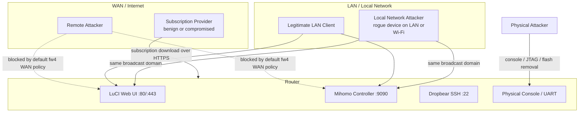
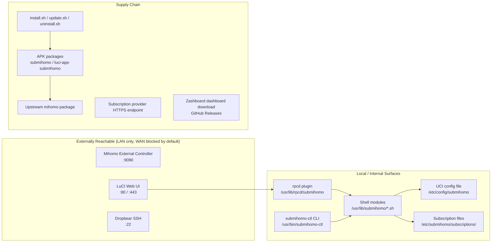
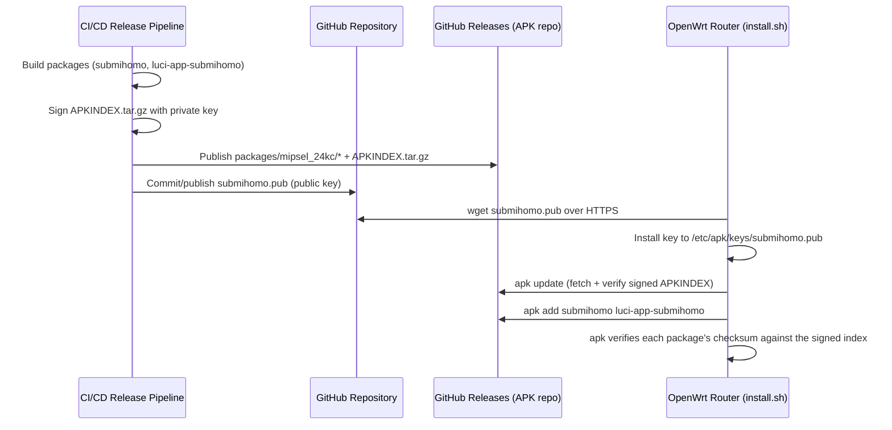

# SubMiHomo — Security Architecture

## Table of Contents

1. [Purpose and Scope](#1-purpose-and-scope)
2. [Threat Model](#2-threat-model)
3. [Attack Surface Analysis](#3-attack-surface-analysis)
4. [Security Controls](#4-security-controls)
5. [Mihomo Process Privilege Design](#5-mihomo-process-privilege-design)
6. [APK Package Signing](#6-apk-package-signing)
7. [Subscription Security in Depth](#7-subscription-security-in-depth)
8. [External Controller Security](#8-external-controller-security)
9. [LuCI and rpcd Security](#9-luci-and-rpcd-security)
10. [Secret Storage and Protection](#10-secret-storage-and-protection)
11. [Audit Log Considerations](#11-audit-log-considerations)
12. [Known Limitations and Acceptable Risks](#12-known-limitations-and-acceptable-risks)
13. [Security Hardening Checklist](#13-security-hardening-checklist)

---

## 1. Purpose and Scope

This document describes the security architecture of SubMiHomo: the threats it is designed to resist, the threats it explicitly does not attempt to resist, the concrete controls implemented at each layer of the stack, and the residual risks a router administrator should understand before deploying it.

SubMiHomo runs with elevated privileges (root) on a device that mediates all LAN-to-WAN traffic. It handles a subscription URL that frequently embeds an authentication token, and it exposes a management API on the LAN. Every one of these facts is a legitimate security consideration, and this document treats them as such rather than glossing over them.

This document should be read alongside `docs/ARCHITECTURE.md`, particularly §4 (Component Overview), §8 (Routing and Firewall Architecture), §9 (DNS Architecture), §10 (Configuration Lifecycle), and §11 (Security Architecture summary). This document expands substantially on that summary.

---

## 2. Threat Model

### 2.1 Actors

SubMiHomo's threat model considers four classes of actor. Each has a different position relative to the router and a different set of capabilities.

| Actor | Position | Assumed Capability | Primary Goal |
|---|---|---|---|
| **Local network attacker** | Connected to the same LAN or Wi-Fi as the router (e.g., a compromised IoT device, a malicious guest, a cracked Wi-Fi password) | Can send packets to any router LAN-side listener, including LuCI and the Mihomo external controller. Cannot directly read router flash or memory. | Steal the subscription token, exfiltrate proxy credentials, redirect traffic, or pivot to other LAN devices via the router's proxy trust relationship |
| **Remote / WAN attacker** | Anywhere on the internet | Can only reach services fw4 explicitly exposes on the WAN interface. By default, SubMiHomo exposes **nothing** on WAN — no rule opens 9090, 80, 443, or 22 to the WAN zone. | Requires the administrator to have misconfigured fw4 (e.g., manually added a WAN-facing port forward to 9090) before any of this document's other controls become relevant |
| **Compromised or malicious subscription provider** | Controls the content served at the configured `subscription_url` | Can serve arbitrary YAML content, including malicious `proxies:`, `proxy-groups:`, or `rules:` blocks | Redirect specific domains to attacker-controlled proxy nodes, exfiltrate DNS queries, or attempt to inject configuration outside the intended YAML sections (YAML/template injection) |
| **Physical attacker** | Has the router in hand, or access to its console/UART/JTAG | Can remove flash, attach a serial console, or boot in failsafe mode | Extract `/etc/config/submihomo` (subscription URL, controller secret) and subscription YAML in plaintext |

### 2.2 What Each Actor Can and Cannot Do

**Local network attacker.** This is the most realistic and most important actor in SubMiHomo's threat model, because the Mihomo external controller and LuCI are both, by design, reachable from the LAN (see §8). A local attacker who can reach `0.0.0.0:9090` without a secret configured has full read/write control of Mihomo: they can read proxy configuration (including embedded credentials if the subscription format ever surfaces them via the API — Mihomo intentionally avoids exposing raw credential fields, but proxy server hostnames and node names are visible), switch proxy selectors, and view connection logs. This is why SubMiHomo enforces a non-empty secret at the UI layer (§8.2) even though it cannot enforce it at the network layer.

**Remote/WAN attacker.** SubMiHomo does not add any fw4/nftables rule that opens a WAN-facing listener. It does not run a WAN-facing service. Its only network-facing exposure is through interfaces the router administrator already controls via LuCI's own firewall configuration. A WAN attacker's only path into any SubMiHomo-managed surface is:

1. The administrator manually created a WAN port-forward or WAN input rule to 9090, 22, 80, or 443 — a decision made entirely outside SubMiHomo's control.
2. A vulnerability in Mihomo itself, LuCI itself, or the underlying OpenWrt firmware — outside SubMiHomo's code, but within its supply chain (see §6).
3. Compromise of the subscription provider's HTTPS endpoint or DNS (see the third actor).

**Compromised subscription provider.** This actor cannot execute arbitrary shell code on the router. The subscription content is never interpolated into a shell command, never `eval`'d, and never templated into a config file as a whole block of untrusted text that could break out of its intended YAML context (see §4.4, YAML injection prevention). The blast radius of a malicious subscription is bounded to: defining proxy nodes and rules that Mihomo itself will parse and enforce, and Mihomo's own YAML parser rejecting the file outright (validated via `mihomo -t -f` before it is ever made active — see ARCHITECTURE.md §5.4).

**Physical attacker.** OpenWrt's overlay filesystem is not encrypted at rest on typical embedded targets, and SubMiHomo does not attempt to change this. A physical attacker with flash access can read `/etc/config/submihomo` and the subscription files directly. This is treated as an **accepted risk** (§12) consistent with the rest of the OpenWrt ecosystem (root passwords, Wi-Fi keys, and VPN credentials in `/etc/config/*` are equally exposed to this actor). SubMiHomo's controls (file mode 0600) raise the bar only against a *software*-level attacker who has gained an unprivileged shell, not against someone with a hardware programmer.

### 2.3 Explicit Non-Goals

The following are **not** part of SubMiHomo's threat model, and no control in this document should be read as attempting to address them:

- Protecting against a fully root-compromised router (if an attacker already has root, no application-layer control in `/usr/lib/submihomo/` can meaningfully resist them).
- Protecting the confidentiality of proxy traffic content from the proxy operator themselves (the proxy operator is a trusted, if not fully trusted-forever, party by definition of the user's subscription choice).
- Defending against nation-state-grade traffic analysis or protocol fingerprinting of the tunneled proxy protocol (that is Mihomo's and the proxy protocol's concern, not SubMiHomo's).
- Providing anonymity guarantees. SubMiHomo is a transparent proxy convenience layer, not an anonymity tool.

---

## 3. Attack Surface Analysis

| Surface | Reachable By | Exposure | Primary Controls |
|---|---|---|---|
| Mihomo external controller (`:9090`) | LAN clients (bound `0.0.0.0`) | Read/write API for proxy state, config, logs | Bearer token secret (§8), LuCI-enforced non-empty secret warning |
| LuCI web interface (`:80`/`:443`) | LAN clients | Full router administration | Standard OpenWrt `uhttpd` + `sysauth` login, unchanged by SubMiHomo |
| Shell modules (`*.sh`) | Only invoked by init script, `submihomo-ctl`, or the rpcd plugin as root | Not directly network-reachable | Input validation on all UCI-sourced values before use (§4.6); no SUID bits; no listening sockets opened by the scripts themselves |
| `submihomo-ctl` CLI | Local shell users (SSH/console) with root or sudo | Full service control | Standard Unix file permission (0755, root:root); requires an authenticated shell session, which is itself gated by SSH/console auth |
| rpcd plugin | LuCI JS views, via authenticated rpcd/ubus session | Bridges browser to shell/API | rpcd's own session-token authentication (shared with all of LuCI) + SubMiHomo's own ACL split between read and write methods (§9.2) |
| UCI config file | Root-owned files on disk; reachable only via local shell or LuCI (which itself proxies through rpcd) | Contains subscription URL and controller secret | File mode 0600, owner root:root (§4.1); RPC responses redact the secret and mask the URL (§4.3) |
| Subscription files | Root-owned files on disk | Contains proxy server list, potentially credentials | File mode 0600/0700, owner root:root; content never executed, only parsed as YAML text (§4.4) |
| APK packages | Anyone who can reach the configured APK repository URL | Code execution as root at install/upgrade time | Package signing with project key, HTTPS-only key/index distribution, APK's built-in checksum verification (§6) |
| install/update/uninstall scripts | Anyone who downloads and runs them | Code execution as root at install time | Scripts perform no destructive action without explicit user confirmation where relevant (uninstall config removal); scripts are auditable, plain shell, published in the repository (§6, INSTALL.md) |
| Subscription provider endpoint | The subscription operator; anyone who intercepts network traffic without valid TLS | Supplies the proxy node list and rules that Mihomo will trust | HTTPS-only enforcement (regex rejects non-`https://` URLs), default TLS verification never disabled, size-limited download, `mihomo -t` syntax validation before activation (§4.5, §7) |
| Zashboard dashboard download | GitHub Releases infrastructure | Static JS/HTML/CSS assets served locally by Mihomo's `external-ui` | HTTPS download, extraction to a fixed non-executable path, no server-side code execution risk (dashboard is static assets only) |

---

## 4. Security Controls

### 4.1 File Permissions

This is the foundational control layer: every file that could reveal a secret, a token, or allow tampering with the service is restricted to root ownership with the narrowest mode that still allows the service to function.

| Path | Mode | Owner | Group | Rationale |
|---|---|---|---|---|
| `/etc/config/submihomo` | `600` | root | root | Contains subscription URL (may embed an auth token) and the external-controller secret in plaintext |
| `/etc/submihomo/` | `700` | root | root | Parent directory; prevents directory listing/traversal by non-root users |
| `/etc/submihomo/subscriptions/` | `700` | root | root | Contains subscription YAML, which may include proxy server credentials |
| `/etc/submihomo/subscriptions/current.yaml` | `600` | root | root | Active subscription content |
| `/etc/submihomo/subscriptions/backup.yaml` | `600` | root | root | Previous-known-good subscription content, retained for rollback |
| `/usr/lib/submihomo/*.sh` | `755` | root | root | Shell library modules; world-readable/executable is acceptable since they contain no secrets, only logic — secrets are read from UCI at runtime |
| `/usr/lib/rpcd/submihomo` | `755` | root | root | rpcd plugin binary/script; invoked exclusively by the rpcd daemon, itself running as root |
| `/usr/bin/submihomo-ctl` | `755` | root | root | CLI tool; requires a local root-capable shell session to invoke meaningfully |
| `/etc/init.d/submihomo` | `755` | root | root | Standard procd init script convention |
| `/usr/share/submihomo/dashboard/` | `755` | root | root | Static dashboard assets; no secrets, world-readable is intentional so `uhttpd`/Mihomo's built-in `external-ui` server can serve them |
| `/var/run/submihomo/config.yaml` (generated) | `640` | root | root | Contains the plaintext controller secret and the fully expanded proxy list; tmpfs-resident, regenerated on every start, never persisted to flash |

**Design principle**: nothing that must remain confidential is ever placed at a path with group- or world-read permission. The one path where the secret exists in fully expanded form — the generated `config.yaml` passed to Mihomo — uses mode `640` rather than `600` only because Mihomo itself may, depending on build, drop from root to a restricted internal context that still needs to open the file; in practice Mihomo is started as root by procd and reads the file before any privilege changes, so `600` is equally viable and is the preferred mode where the init script sets permissions explicitly.

### 4.2 External Controller Secret Enforcement

The Mihomo external controller is bound to `0.0.0.0:9090` (rationale in §8.1). The only control standing between an arbitrary LAN device and full read/write access to Mihomo's runtime state is the `secret` field.

Enforcement mechanism:

1. UCI stores `option controller_secret '<value>'` under the `submihomo` config section.
2. `config.sh` writes this value verbatim into the generated `config.yaml`'s `secret:` field.
3. Mihomo requires every HTTP request to the controller API to carry `Authorization: Bearer <secret>` once `secret` is non-empty in its config. Requests without a valid header are rejected by Mihomo itself (not by SubMiHomo — this is Mihomo's built-in behavior).
4. **LuCI-side enforcement**: the `settings.js` view checks whether `controller_secret` is empty. If it is, the view renders a persistent, highly visible warning banner ("No controller secret set — the management API is accessible to anyone on your LAN without authentication") and does not allow the user to dismiss it permanently. The Apply button remains functional (SubMiHomo does not hard-block an empty secret, since some advanced users run fully isolated LANs), but the warning is unavoidable.
5. The `status()` RPC method includes a `secret_configured: true/false` boolean so that other UI surfaces (e.g., the overview page) can also reflect the warning state without re-reading UCI.

There is no mechanism to disable the controller secret enforcement short of manually clearing the field and dismissing the LuCI warning — no "I understand the risk" checkbox that permanently silences it. This is a deliberate friction point.

### 4.3 Subscription URL and Secret Masking

Two independent forms of sensitive-value redaction are implemented, because the two values appear in different places for different reasons.

**Subscription URL masking** — implementation details:

- The canonical masking function takes the full URL string and returns the first 20 characters followed by a literal `...` suffix, regardless of URL length. Example: `https://sub.example.` + `...` for a URL like `https://sub.example.com/link/abcdef0123456789TOKEN`.
- This masked form is the *only* form of the URL that ever reaches: syslog (`log_info`/`log_warn`/`log_err` calls in `subscription.sh`), the `status()` RPC response field `subscription_url_masked`, and any diagnostic bundle generated by `run_diagnostics`.
- The **unmasked** URL is used only in-process, in memory, for the single `wget` invocation that performs the download. It is never written to a temp file under its own name, never passed as a `wget` command-line argument that could appear in `/proc/<pid>/cmdline` readable by other local users for longer than the invocation (OpenWrt's default process listing permissions make this a low but non-zero exposure, discussed in §12), and never echoed to stdout/stderr.
- The `get_config()` RPC method, which LuCI's `subscription.js` view calls to display current settings, returns the masked form only. There is no RPC method that returns the raw URL to the browser. If a user genuinely needs to view or copy their full URL, they must read `/etc/config/submihomo` directly via SSH/console — a deliberate design choice that avoids ever transmitting the unmasked URL over the LuCI HTTP session, even though that session is itself authenticated.

**Controller secret redaction**:

- The `get_config()` RPC method redacts the `controller_secret` field whenever it is non-empty, replacing it with a fixed sentinel value (e.g., `"********"`) rather than echoing it back. This prevents the secret from being visible in browser dev tools' network tab, in LuCI's own request logging, or to a LAN attacker who might be observing an unencrypted LuCI session (LuCI is normally served over HTTPS on OpenWrt 25+, but this redaction is defense-in-depth regardless of transport).
- When the field is empty, the RPC response reports it as empty (not redacted), so the LuCI UI can distinguish "no secret set" (render the warning banner) from "secret set" (render the redacted sentinel, with an explicit "change secret" input that overwrites rather than reveals).
- Setting a new secret via `set_config()` always requires the full new value; there is no "confirm previous secret" round-trip that would require un-redacting it.

### 4.4 YAML Injection Prevention

The subscription file is authored by a third party (the proxy provider) and is inherently untrusted input. The design goal is to ensure that no matter what content a malicious or compromised provider serves, that content cannot escape its intended role as *data* and become *executable configuration directives* outside the `proxies:`, `proxy-groups:`, and `rules:` sections it is entitled to define.

The prevention mechanism, described functionally (see ARCHITECTURE.md §10.2 for the merge strategy):

1. `config.sh` never treats the subscription file as a template to be string-substituted into the base config, and never opens the subscription file with a YAML parser that would evaluate anchors, aliases, or custom tags across the whole document.
2. Instead, it locates the three specific top-level keys (`proxies:`, `proxy-groups:`, `rules:`) using line-anchored text processing (`awk`/`sed`/`grep` scanning for a key at column 0, followed by capturing all subsequent indented lines until the next column-0 key or end-of-file). Each block is extracted as an opaque byte range and appended, verbatim and unmodified, under the corresponding key in the assembled config.
3. Because extraction is purely positional/structural (find key, capture indented children) and not substitutional (no `sed 's/PLACEHOLDER/$value/'` style templating of subscription content into a larger string), there is no code path where a byte sequence inside the subscription — however cleverly crafted — could be interpreted as closing one YAML block and opening another, or as escaping into the `general`, `dns`, or `external-controller` sections of the final config.
4. A malicious subscription can, at most, define proxy nodes, proxy groups, and match rules — all of which are semantically bounded by what Mihomo itself is willing to parse and act on. It cannot, for example, inject its own `external-controller:` block to move the API to a different port, or inject its own `secret:` to override the administrator's configured value, because those keys are written by `config.sh` from UCI values *after* the subscription blocks are placed, and the generation order is fixed (general → dns → external-controller → external-ui → proxies → proxy-groups → rules, per ARCHITECTURE.md §10.1) with SubMiHomo-controlled keys never re-read from subscription content.
5. As a final backstop, the fully assembled file is validated with `mihomo -t -f <path>` (dry-run config syntax and semantic check) before it is treated as the active config. A subscription block that is syntactically well-formed but semantically bizarre (e.g., a proxy-group referencing a non-existent proxy) is caught here — Mihomo refuses to start with such a config, and the previous known-good subscription is retained (ARCHITECTURE.md §5.4).

### 4.5 TLS Verification

TLS certificate verification for subscription downloads is **always enabled** and cannot be disabled through any UCI option, CLI flag, or LuCI setting. There is no `--no-check-certificate` (wget) or equivalent flag anywhere in `subscription.sh`. This is an intentional absence, not an oversight: no configuration surface exists for it, precisely so it cannot be toggled off by a confused user following bad advice from a forum post.

Enforced constraints on subscription downloads:

- URL must match `^https://[a-zA-Z0-9._/:?=&%-]+$` — any URL not beginning with `https://` is rejected by input validation before `wget` is ever invoked (§4.6).
- `wget-ssl` is a hard APK dependency (not the stripped-down `wget-nossl` build), ensuring the binary present on the system is actually capable of TLS in the first place.
- Default `wget` behavior (certificate validation against the system trust store) is relied upon and never overridden with `--no-check-certificate`, `--no-hsts` bypass tricks, or a custom (potentially permissive) CA bundle.
- `--max-redirect=0` prevents the download from silently following a redirect to a different, potentially attacker-controlled or non-HTTPS host.
- `--max-file=5242880` (or equivalent) enforces a 5 MB hard cap on the downloaded file, mitigating resource-exhaustion from a malicious or misbehaving provider serving an oversized response.
- The download is written to a temp file in `/tmp` (tmpfs, cleared on reboot) with restrictive permissions before any validation occurs, so a partially-downloaded or invalid file is never briefly world-readable.

### 4.6 Input Validation

All values that originate from UCI (i.e., from the administrator, but which flow into shell commands, file paths, or generated config) are validated before use. This protects against both malicious tampering with UCI (an attacker who somehow gained write access to UCI but not full root) and, more commonly, simple user error that could otherwise produce a broken or dangerous configuration.

| Field | Validation Rule | Rejected Examples | Enforcement Point |
|---|---|---|---|
| `subscription_url` | `^https://[a-zA-Z0-9._/:?=&%-]+$` | `http://...` (non-HTTPS), `https://evil.com/$(whoami)`, URLs containing spaces or shell metacharacters (`` ` ``, `;`, `\|`, `&&`) | `subscription.sh` before invoking `wget`; also enforced client-side in `subscription.js` for immediate feedback |
| Bypass addresses | `^([0-9]{1,3}\.){3}[0-9]{1,3}/[0-9]{1,2}$` plus range validation (each octet 0–255, prefix length 0–32) | `999.1.1.1/24`, `10.0.0.0/33`, `10.0.0.0` (missing prefix) | `firewall.sh` before adding to the nftables bypass set |
| Port numbers (controller, mixed-port, tproxy-port) | Integer, `1024`–`65535` | `80` (privileged range, risk of conflict with system services), `99999`, non-numeric strings | `config.sh` before writing into `config.yaml`; also enforced in LuCI form validation |
| Controller secret | Any UTF-8 string, length-unbounded but practically capped by UCI's line limits | N/A (no rejection; injection risk is mitigated by YAML-safe escaping, not by restricting content) | Escaped using YAML single-quote/double-quote quoting rules when written into `config.yaml`, ensuring characters like `:`, `#`, or leading `-` inside the secret do not corrupt the YAML document structure |
| Cron schedule (subscription auto-update) | Restricted to a small set of pre-defined intervals selectable in LuCI (e.g., every 6h/12h/24h/weekly), rather than free-form cron syntax | Arbitrary cron expressions are not accepted from the UI, avoiding a class of cron-injection or resource-abuse concerns entirely | `subscription.sh` cron management function; LuCI presents a dropdown, not a text field |

Validation failures are logged (with the offending value masked or omitted where it might be sensitive) and cause the operation to abort without partially applying the change — UCI's transactional `uci commit` semantics are relied upon so that a rejected value never reaches a "half-applied" state.

---

## 5. Mihomo Process Privilege Design

### 5.1 The Options Considered

| Option | Description | Verdict |
|---|---|---|
| **Run as root** | procd launches `mihomo` as `root`, with unrestricted privilege | **Chosen** |
| **CAP_NET_ADMIN + CAP_NET_BIND_SERVICE via a dedicated user** | Create a `submihomo` system user, drop all capabilities except those needed for TPROXY (`SO_IP_TRANSPARENT`) and binding low ports, and launch Mihomo under that reduced-privilege identity | Considered, rejected for v1 |
| **Full sandbox (seccomp/namespaces)** | Run Mihomo inside a restricted namespace with a seccomp filter | Not evaluated in depth; disproportionate complexity for the target embedded platform |

### 5.2 Why TPROXY Requires Elevated Privilege

`SO_IP_TRANSPARENT` (the socket option that allows Mihomo's TPROXY listener to accept connections addressed to *any* destination IP, not just its own bound address) is a privileged operation on Linux. Historically this required `CAP_NET_ADMIN`; binding to low-numbered ports (if the administrator configures `mixed-port` or `external-controller` below 1024, though SubMiHomo's own validation restricts UCI-configurable ports to ≥1024) requires `CAP_NET_BIND_SERVICE`. Full root implies both capabilities and more.

### 5.3 Decision: Run as Root

**Decision**: SubMiHomo runs the Mihomo process as `root` via procd, rather than constructing a dedicated low-privilege user with a minimal capability set.

**Rationale**:

1. **No meaningful additional attack surface on this platform.** OpenWrt embedded routers do not run a general-purpose multi-user environment. There is no "other tenant" process on the box whose compromise-blast-radius root privilege for Mihomo would meaningfully worsen relative to the dozens of other root-privileged daemons already running on a stock OpenWrt system (`netifd`, `dnsmasq`, `firewall`/`fw4`, `odhcpd`, `uhttpd`, all of which run as root on a typical install). Mihomo joining that list does not qualitatively change the device's risk posture.
2. **Simplicity and maintainability.** Capability-based privilege dropping requires careful process lifecycle management (capabilities must be set *before* the exec, preserved across `setuid`, and re-verified after any binary upgrade in case Mihomo's own internal privilege-drop logic changes between versions). This is meaningful ongoing maintenance burden for a project targeting a single embedded platform with a small maintainer team, for a security benefit that is marginal given point 1.
3. **No performance gain from capabilities on embedded hardware.** Some projects drop root purely to reduce the impact radius of an in-process memory-safety bug. On MIPS embedded routers, this consideration is real but secondary to the fact that a memory-safety bug in Mihomo (written in Go, which has strong memory safety guarantees relative to C/C++) is a substantially lower-likelihood event than the classes of misconfiguration or supply-chain risk this document spends most of its space on.
4. **Consistency with OpenWrt's own conventions.** OpenWrt's own core network daemons (`netifd`, `odhcpd`, `dnsmasq` when handling DHCP) run as root because they, too, need to manipulate routing tables, firewall rules, or bind privileged resources. SubMiHomo aligns with this platform norm rather than introducing a bespoke privilege model that diverges from how the rest of the router's software is operated and audited.

**What is done instead to bound the blast radius of root execution**:

- Mihomo's own outbound traffic is tagged with `routing-mark: 255`, which the nftables PREROUTING/OUTPUT chains explicitly skip (ARCHITECTURE.md §6.7, §8.1). This is not a privilege control, but it is a correctness/isolation control that prevents Mihomo's own root-originated traffic from being re-intercepted into an infinite redirect loop — a failure mode that *could* otherwise be triggered or worsened by an attacker who can influence Mihomo's outbound connections (e.g., via a malicious proxy node).
- The external controller — the one network-reachable interface Mihomo exposes — is gated by the secret (§4.2, §8), which is the practical control against a LAN attacker leveraging Mihomo's root process indirectly through its API.
- File-level isolation (§4.1) ensures that even though Mihomo runs as root, the files it reads (config, subscription) are not writable by any non-root local process, bounding the paths through which a local unprivileged process could influence Mihomo's root-level behavior.
- This decision is revisited if a future OpenWrt kernel/Mihomo combination made a documented, low-maintenance capability-based mode available upstream in Mihomo itself; SubMiHomo would adopt it rather than reimplement privilege-dropping logic independently.

---

## 6. APK Package Signing

### 6.1 Key Management

| Artifact | Location | Purpose |
|---|---|---|
| Private signing key | Held offline / in a secured CI secret store (GitHub Actions encrypted secret), **never committed to the repository** | Signs the `APKINDEX.tar.gz` for each architecture's package repository at build/release time |
| Public key (`submihomo.pub`) | Committed to the repository root and published as a release asset | Distributed to end-user routers so `apk` can verify package signatures before installation |

The private key is generated once (per APK signing conventions — an `abuild`-style keypair) and stored exclusively as an encrypted secret in the CI/CD environment used to produce releases. It is never present on any developer's local machine as a matter of routine workflow, and never appears in any build log, artifact, or commit history. Only the release pipeline (a controlled, auditable GitHub Actions workflow) has access to it at build time, and only for the duration of the signing step.

### 6.2 Distribution and Verification Flow

Two independent layers of trust exist:

1. **Transport trust**: the public key and the package index/artifacts are only ever fetched over HTTPS (both from `raw.githubusercontent.com`/GitHub Releases), so a network-position attacker cannot substitute a different key or package set without also compromising GitHub's TLS.
2. **Content trust**: once the public key is installed, `apk`'s own signature verification (built into the package manager, not reimplemented by SubMiHomo) checks that `APKINDEX.tar.gz` is signed by the corresponding private key, and that each package's checksum matches the entry in that verified index. A package that has been tampered with post-build, or substituted by a man-in-the-middle who does not hold the private key, fails this verification and `apk` refuses to install it.

### 6.3 Key Compromise Response

If the private signing key is ever suspected of compromise:

1. Generate a new keypair immediately.
2. Publish the new public key at the same well-known path (`submihomo.pub`), and simultaneously publish a security advisory (GitHub Security Advisory + release notes) instructing existing users to re-run the key-download step of `install.sh` (or manually replace `/etc/apk/keys/submihomo.pub`) before their next `apk update`.
3. Revoke/rotate the compromised key in the CI secret store so it can no longer be used to sign new releases.
4. Any packages signed with the compromised key that were published after the suspected compromise window are rebuilt and re-released signed with the new key; the old, potentially-tampered release assets are removed from GitHub Releases where feasible.

This is a manual process in v1 (no automated key-rotation tooling ships with SubMiHomo itself); it is documented here so that the response plan exists in writing rather than being improvised during an incident.

---

## 7. Subscription Security in Depth

### 7.1 Token Exposure Risk

Subscription URLs issued by commercial proxy/VPN providers frequently embed a bearer-style token directly in the URL path or query string (e.g., `https://sub.provider.com/link/9f8e7d6c5b4a...`). Anyone who obtains this URL can, in most subscription formats, download the exact same proxy configuration the legitimate user has — effectively impersonating them to the provider's subscription service. This makes the URL as sensitive as a password, even though it is nominally "just a link."

SubMiHomo treats the subscription URL with that level of sensitivity throughout:

- Storage: `/etc/config/submihomo`, mode `600`, root:root (§4.1).
- Logging: never logged unmasked (§4.3).
- Display: never returned unmasked over any RPC or LuCI interface (§4.3).
- Transport: only ever transmitted over HTTPS, to the single host specified by the administrator, never proxied through a third party or telemetry endpoint.

### 7.2 What Happens If the URL Is Leaked

If the subscription URL is exposed (e.g., through a misconfigured backup, a screenshot, or a support forum post), the practical consequences are provider-dependent but generally include:

- An attacker can download the same proxy node list, potentially consuming the account's bandwidth quota or node-slot allowance.
- Depending on the provider's subscription link design, the attacker may be able to determine the plan tier, expiration date, or other account metadata embedded in the response.
- The attacker generally **cannot** use the leaked URL to pivot into the router itself — the subscription endpoint is provider infrastructure, not the router, and downloading a subscription does not grant any access to `/etc/config/submihomo` or router shell access.
- The attacker **can**, if they are positioned to also intercept or influence what is served at that URL going forward (e.g., if they've compromised the provider account, not just observed the link once), serve a malicious YAML payload the next time the router's `subscription.sh` polls it — bounded, as described in §4.4, to defining proxy nodes/groups/rules within Mihomo's own semantic limits.

### 7.3 Token Rotation

Rotating a leaked or suspected-compromised subscription token is a UCI-level operation:

1. Obtain a new subscription URL from the provider (providers generally support regenerating the link/token independently of the account itself).
2. In LuCI: Services → SubMiHomo → Subscription, replace the URL field, click Apply.
3. Equivalently via CLI: `submihomo-ctl set-subscription-url '<new-https-url>'` followed by `submihomo-ctl update-subscription`.
4. The old URL is simply overwritten in UCI; SubMiHomo does not retain any history of previously configured URLs beyond the current UCI value (the `backup.yaml` subscription content file does not store the URL, only the previously downloaded proxy config).
5. No service restart is strictly required to rotate the URL alone (it only affects future download operations), but triggering an immediate `update-subscription` after rotation confirms the new URL is valid before the old subscription content ages out of relevance.

---

## 8. External Controller Security

### 8.1 Why Bind to 0.0.0.0

Mihomo's external controller is configured to listen on `0.0.0.0:9090` rather than `127.0.0.1:9090`. This is a deliberate, necessary choice, not an oversight:

- The Zashboard dashboard (served by Mihomo's own `external-ui` static file server, also reachable through the controller's HTTP listener) is a browser-based UI intended to be opened directly from a LAN client's browser (e.g., navigating to `http://192.168.1.1:9090/ui`), not merely from the router's own loopback.
- LuCI's proxy-related views (`proxies.js`) make client-side or rpcd-proxied calls to the controller API to display live proxy group state; while some of these calls could theoretically be proxied entirely through rpcd (which does run on the router and could reach `127.0.0.1:9090`), the dashboard's own direct browser access requirement makes loopback-only binding insufficient for the product's intended functionality regardless.
- Binding to the LAN-facing address specifically (rather than `0.0.0.0`) was considered, but OpenWrt's LAN bridge interface address is user-configurable and not reliably knowable at config-generation time in all deployment topologies (multiple VLANs, bridged LAN+guest, etc.), making `0.0.0.0` the pragmatic choice while relying on the secret (§4.2) as the actual access control, and on fw4's WAN-zone default-deny (unrelated to SubMiHomo, but structurally relevant) to ensure this binding is never reachable from the WAN side.

### 8.2 Secret Enforcement Mechanism

Covered in detail in §4.2. Summarized here for completeness: LuCI shows a non-dismissible warning banner when `controller_secret` is empty; Mihomo itself refuses unauthenticated API requests once a secret is configured; the secret is never echoed back through any RPC response.

### 8.3 What an Attacker Can Do With API Access

An attacker who reaches `:9090` **without** a valid secret (either because none is configured, or because they have obtained a valid one) can, subject to Mihomo's own API surface:

| Capability | Impact |
|---|---|
| Read current proxy group selections and available nodes | Discloses which proxy provider/nodes are in use (moderate information disclosure) |
| Switch the active proxy in a `SELECTOR` group | Redirects the router's proxied traffic through a different (possibly attacker-favored, if the node list itself is attacker-influenced) node — degrades service or enables downstream traffic manipulation if a malicious node is present in the list |
| Read real-time connection logs / active connections | Discloses which domains/IPs the LAN is currently communicating with — a meaningful privacy exposure |
| Query and modify some runtime configuration (log level, etc.) via the API | Could be used to increase log verbosity (minor DoS via disk/flash log growth) or reduce logging (anti-forensic) |
| Trigger a config reload via the controller's reload endpoint | Could cause a brief service interruption |

Importantly, **API access alone does not grant shell access, UCI write access, or the ability to change the subscription URL** — those are SubMiHomo/LuCI/rpcd concerns, gated independently by rpcd's own authentication and ACLs (§9). The controller API's blast radius is scoped to Mihomo's own runtime state.

---

## 9. LuCI and rpcd Security

### 9.1 LuCI Authentication

SubMiHomo introduces no custom authentication mechanism for its web views. It relies entirely on OpenWrt's standard LuCI session authentication (`sysauth`), which requires the router's root/administrative password and issues a session cookie honored by `uhttpd`. This is unchanged, unmodified, and un-bypassed by any SubMiHomo code. Any hardening applied at the OpenWrt level (strong root password, disabling HTTP in favor of HTTPS-only LuCI, IP-based access restriction on the LuCI listener) applies equally to SubMiHomo's views without any SubMiHomo-specific configuration.

### 9.2 rpcd ACL Model

Beyond LuCI's session authentication (which answers "is this a legitimate logged-in administrator or user session"), rpcd's ACL system (`/usr/share/rpcd/acl.d/luci-app-submihomo.json`) answers the finer-grained question "which specific methods may this authenticated session's assigned role invoke."

| Role | Permitted Methods | Nature |
|---|---|---|
| `luci-user` (read-only administrative role) | `status`, `get_config`, `get_logs`, `get_proxies`, `run_diagnostics`, `test_connection` | Observation only — cannot change any state |
| `luci-admin` (full administrative role) | All `luci-user` methods, plus `start`, `stop`, `restart`, `update_subscription`, `set_config`, `download_dashboard` | Full control, including operations that alter routing/firewall/DNS state or fetch new remote content |

This split exists so that OpenWrt installations using LuCI's multi-user features (some routers are configured with a restricted "viewer" account for less-trusted household members or junior staff, distinct from the primary admin account) do not inadvertently grant subscription-modification or service-restart capability to a viewer-tier session. It also limits the damage a compromised low-privilege LuCI session (e.g., via a browser-based attack against a logged-in viewer) can do to the SubMiHomo service specifically.

### 9.3 Why This Two-Layer Model Matters

The combination of LuCI session auth (coarse: "are you logged in") and rpcd ACLs (fine: "what can this login do") means that even a successful attack against the *outer* layer (e.g., a stolen viewer-role session cookie) does not automatically translate into the ability to exfiltrate the subscription URL, change the controller secret, or trigger a subscription update that could be used to smuggle a malicious config in. An attacker would need to escalate to an admin-role session specifically to reach the higher-impact methods.

---

## 10. Secret Storage and Protection

### 10.1 Storage

The controller secret and subscription URL are the two values in SubMiHomo's data model that constitute "secrets" in the traditional sense. Both live exclusively in `/etc/config/submihomo` (mode `600`, root:root, per §4.1). There is no secondary copy maintained anywhere except the transient, tmpfs-resident `/var/run/submihomo/config.yaml` that Mihomo itself reads (mode `640`/`600`, regenerated on every service start, never written to persistent flash).

### 10.2 How rpcd Reads the Secret

The rpcd plugin (`/usr/lib/rpcd/submihomo`) runs as root (as all rpcd plugins do) and reads UCI values, including the secret, via the same `uci get` mechanism the shell modules use. Because the plugin itself runs with root privilege and is only invocable through the authenticated rpcd/ubus session mechanism (not directly reachable from the network), the act of reading the secret from UCI is not itself an exposure point — the exposure risk is entirely in what the plugin subsequently *returns* to the calling (browser-side) session, which is where redaction (§4.3, §10.3) is enforced.

### 10.3 REDACTED-in-API-Responses Contract

This is treated as an invariant of the RPC interface, not an incidental behavior:

- `get_config()` MUST return the controller secret as a fixed redaction sentinel whenever the stored value is non-empty, and as an empty string only when the stored value is genuinely empty (so the UI can distinguish "unset" from "set but hidden").
- No other RPC method (status, get_logs, get_proxies, run_diagnostics, test_connection) includes the secret field at all — it is only ever surfaced (in redacted form) by the one method whose job is to describe current configuration.
- Any future RPC method added to the plugin must be reviewed against this contract before being merged: if it returns configuration data, the secret and subscription URL fields must be redacted/masked by construction, not by an easily-forgotten call-site check.

---

## 11. Audit Log Considerations

SubMiHomo does not implement a dedicated audit-log subsystem (no separate audit database or signed log chain — this would be disproportionate for an embedded router service). Instead, it treats `syslog` (via `logger -t submihomo`, per ARCHITECTURE.md §4.4's description of `core.sh`) as the audit trail, and ensures the following security-relevant events are **always** logged at `info` level or higher, regardless of the configured verbosity for routine operational messages:

| Event | Logged Detail | Never Logged |
|---|---|---|
| Service start | Timestamp, DNS mode, whether a controller secret is configured (boolean only) | Secret value, full subscription URL |
| Service stop | Timestamp, triggering source (manual/procd-respawn-exhausted/system shutdown) | — |
| Subscription update attempt (manual or cron-triggered) | Timestamp, trigger source, masked URL, outcome (success/validation-failure/download-failure) | Unmasked URL, raw subscription content |
| Subscription rollback to backup | Timestamp, reason for rollback | — |
| UCI configuration change applied (`set_config`) | Timestamp, which fields changed (by name, not by value, for sensitive fields) | Old/new values of `controller_secret` or `subscription_url` |
| Controller secret changed from empty → non-empty, or vice versa | Timestamp, direction of change only | The secret value itself in either direction |
| Dashboard download/update | Timestamp, version fetched, outcome | — |
| Firewall table create/destroy | Timestamp | — |
| Validation rejection (bad URL format, bad bypass CIDR, out-of-range port) | Timestamp, which field failed validation | The rejected value itself, if it might contain a partial token (e.g., a malformed subscription URL is logged as "subscription_url failed format validation" without echoing the attempted value) |

This log is intentionally the same `logger -t submihomo` facility used for routine operational messages (ARCHITECTURE.md §4.4), rather than a separate file, so that it is captured by whatever system-wide log retention/rotation/forwarding the administrator has already configured for OpenWrt (e.g., `logread`, remote syslog forwarding), without SubMiHomo needing to reinvent log management.

---

## 12. Known Limitations and Acceptable Risks

| Risk | Description | Why It Is Accepted |
|---|---|---|
| Plaintext secrets at rest on flash | `/etc/config/submihomo` is not encrypted; a physical attacker with flash access reads the URL and secret in cleartext | Consistent with how OpenWrt stores every other sensitive config value (Wi-Fi PSKs, root password hash, VPN keys) on non-encrypted-flash embedded routers. Full-disk encryption is impractical on the target hardware class (no secure element, boot-time key entry is not viable for a headless router) |
| Controller bound to `0.0.0.0` | Any LAN device can reach the API without a secret configured | Necessary for the dashboard/LuCI proxy-view functionality (§8.1); mitigated by mandatory secret warning, not eliminated by network-layer restriction |
| Subscription URL briefly visible in process listing | During the `wget` invocation, the URL may appear as a command-line argument, visible to other local root-equivalent processes via `/proc/<pid>/cmdline` for the duration of the download | On a single-tenant embedded router, only root-level processes can read another process's `/proc/<pid>/cmdline` in practice under default OpenWrt configuration; if the attacker already has root, the URL stored at rest is equally readable, so this exposure adds negligible incremental risk |
| No mutual TLS / certificate pinning for subscription downloads | Standard system CA trust store validation only; a compromised or coerced CA could theoretically enable an MITM | Certificate pinning is fragile against legitimate provider CA rotation and would require SubMiHomo to ship/maintain pin lists per provider — impractical given SubMiHomo does not know in advance which providers users will configure |
| Mihomo runs as root | See full discussion in §5 | Deliberate decision; consistent with platform norms; no meaningful capability-based alternative was found to reduce risk proportionate to its added complexity |
| Cron-triggered subscription updates run unattended | An update could apply a subscription that has changed content since the administrator last reviewed it | Bounded by the same validation pipeline as manual updates (`mihomo -t`, non-empty, contains `proxies:`) — the update cannot introduce a fundamentally new attack class beyond what a manual update already accepts |
| No built-in intrusion detection for the controller API | Repeated failed-auth attempts against `:9090` are not rate-limited or alerted on by SubMiHomo (this is Mihomo's own API surface, outside SubMiHomo's code) | Out of scope; administrators wanting this should rely on OpenWrt-level connection tracking/logging or a dedicated IDS package |
| Dashboard download from GitHub Releases has no separate signature check beyond HTTPS | `dashboard.sh` trusts GitHub's TLS and the repository's release integrity, without an additional detached-signature verification step for the `dist.zip` asset | GitHub Releases over HTTPS is treated as an acceptable trust anchor for static, non-privileged UI assets (no code execution occurs from these files beyond being served as static HTML/JS/CSS by Mihomo's own sandboxed static file handler); revisit if a supply-chain incident affecting Zashboard's release pipeline is ever reported |

---

## 13. Security Hardening Checklist

Recommended actions for an administrator deploying SubMiHomo, beyond SubMiHomo's own built-in defaults:

- [ ] **Set a strong, unique controller secret** in LuCI → Services → SubMiHomo → Settings before enabling the service in a shared or untrusted LAN environment.
- [ ] **Do not expose port 9090, LuCI (80/443), or SSH (22) to the WAN.** Verify no port-forward or WAN input rule exists for these in Network → Firewall.
- [ ] **Use a strong LuCI/root password.** SubMiHomo's rpcd ACL model only meaningfully separates risk between authenticated roles; a weak root password undermines the entire model.
- [ ] **Prefer HTTPS-only access to LuCI** (disable plain HTTP on the LAN interface if the client devices support it) to protect the LuCI session cookie from local network sniffing.
- [ ] **Rotate the subscription URL/token** if it is ever suspected of having been exposed (screenshot, shared support ticket, misconfigured backup) — see §7.3.
- [ ] **Review syslog periodically** (`logread | grep submihomo`) for unexpected subscription update failures, unexpected service restarts, or repeated validation-rejection log lines, which may indicate a misbehaving or compromised subscription provider.
- [ ] **Keep the `mihomo` package updated independently** (`apk upgrade mihomo`) when upstream security advisories are published, without waiting for a SubMiHomo release, since the three-package split (ARCHITECTURE.md §7) is designed to allow exactly this.
- [ ] **Verify the APK public key fingerprint** the first time it is installed, if operating in a high-assurance environment, rather than blindly trusting the HTTPS download (see INSTALL.md for the exact key path and recommended verification command).
- [ ] **Confirm hardware flow offloading is disabled** if previously enabled for other reasons — it is incompatible with TPROXY and, while not itself a security control, its interaction with SubMiHomo's traffic interception should be understood by the administrator (see ARCHITECTURE.md §12.4).
- [ ] **Restrict which LAN devices may reach LuCI/controller ports**, if the router's hardware/firmware supports per-interface or per-VLAN firewall zones, especially on networks with guest Wi-Fi or IoT segments that should not have management access at all.
- [ ] **Back up `/etc/config/submihomo` securely** (encrypted backup storage) if included in a router configuration backup routine, since it contains the subscription URL and controller secret in plaintext.

---

*End of SECURITY.md*
