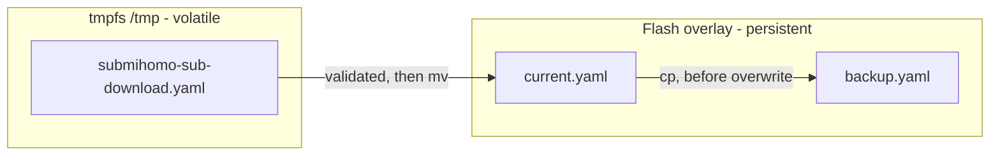
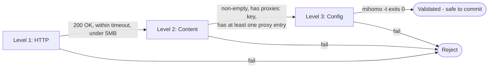
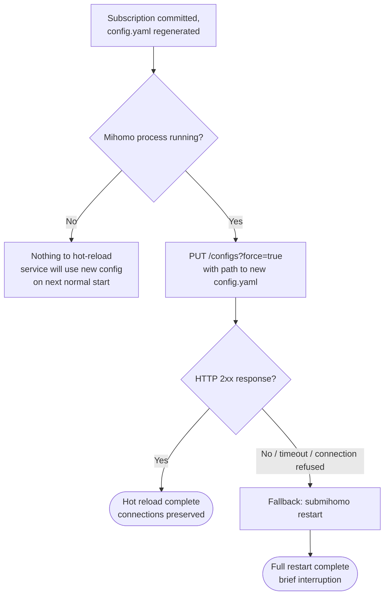
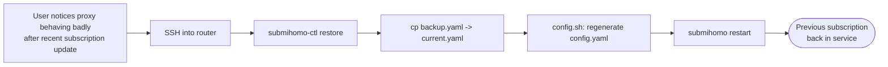
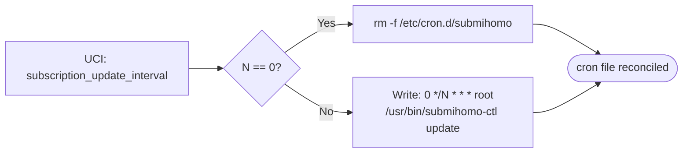
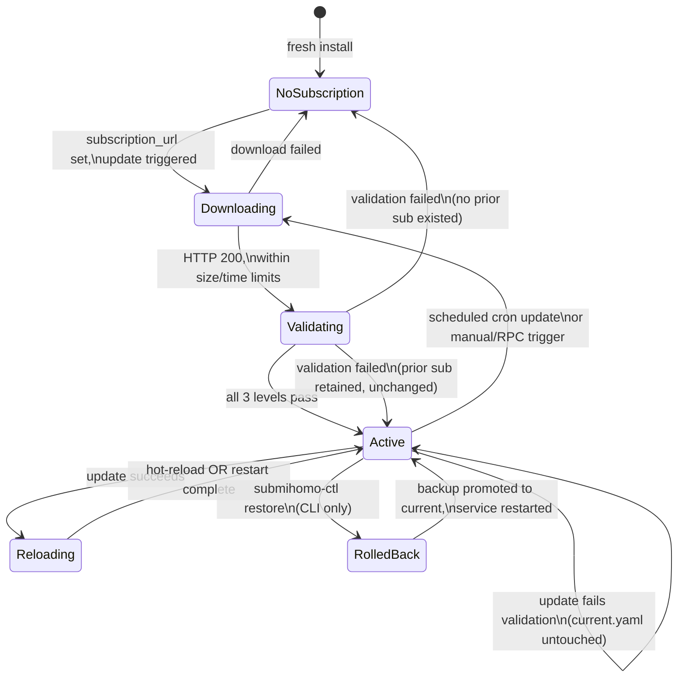
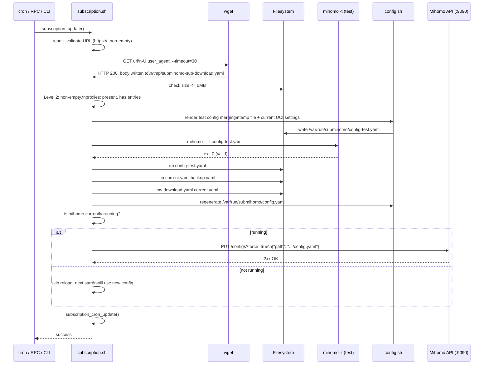
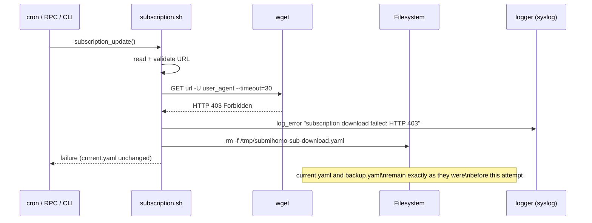

# SubMiHomo — Subscription System Architecture

## Table of Contents

1. [What Is a Clash/Mihomo Subscription](#1-what-is-a-clashmihomo-subscription)
2. [Subscription Storage Design](#2-subscription-storage-design)
3. [Complete Download and Validation Flow](#3-complete-download-and-validation-flow)
4. [The Three-Level Validation System](#4-the-three-level-validation-system)
5. [Config Merging Strategy](#5-config-merging-strategy)
6. [Hot-Reload Mechanism](#6-hot-reload-mechanism)
7. [Rollback Design and Rationale](#7-rollback-design-and-rationale)
8. [First-Run Behavior](#8-first-run-behavior)
9. [Update Scheduler](#9-update-scheduler)
10. [Error Handling for Every Failure Mode](#10-error-handling-for-every-failure-mode)
11. [Security Considerations](#11-security-considerations)
12. [The `subscription_user_agent` Rationale](#12-the-subscription_user_agent-rationale)
13. [Subscription Lifecycle State Diagram](#13-subscription-lifecycle-state-diagram)
14. [Sequence Diagram: Successful Update](#14-sequence-diagram-successful-update)
15. [Sequence Diagram: Failed Update](#15-sequence-diagram-failed-update)

---

## 1. What Is a Clash/Mihomo Subscription

A "subscription" in the Clash/Mihomo ecosystem is not a payment mechanism — it is a **remote configuration fragment** published by a proxy service provider (or self-hosted by the user) as a single YAML document, retrieved over HTTP(S). The provider maintains this document server-side and updates it as their infrastructure changes (new nodes added, old nodes retired, load rebalanced), while the client (SubMiHomo, in this case) periodically re-fetches it so the local proxy core always reflects the provider's current node list.

A subscription YAML document is a strict subset of the full Mihomo configuration schema, containing (at minimum) three top-level keys:

```yaml
proxies:
  - name: "US-01"
    type: vmess
    server: us01.example.net
    port: 443
    uuid: "..."
    # ...proxy-type-specific fields

proxy-groups:
  - name: "Auto"
    type: url-test
    proxies: ["US-01", "US-02", "JP-01"]
    url: "http://www.gstatic.com/generate_204"
    interval: 300

rules:
  - DOMAIN-SUFFIX,netflix.com,Auto
  - GEOIP,CN,DIRECT
  - MATCH,Auto
```

Providers may also include `dns`, `experimental`, or other advanced sections, but SubMiHomo treats the subscription strictly as a **source of `proxies`, `proxy-groups`, and `rules`** and discards everything else (see [§5](#5-config-merging-strategy)). This is a deliberate architectural boundary: SubMiHomo — not the subscription provider — owns general settings, listener ports, DNS behavior, and the external controller. A subscription is a *data feed*, never a *configuration authority* over the router itself.

Subscriptions are conventionally served from a per-user URL such as `https://provider.example.com/sub?token=abc123&flag=clash`. The token embedded in the URL is the provider's authentication mechanism — there is no separate login step. This has direct security implications discussed in [§11](#11-security-considerations).

---

## 2. Subscription Storage Design

SubMiHomo maintains exactly three files related to subscription content, each with a distinct lifecycle and purpose:

| Path | Storage medium | Persistence | Purpose |
|---|---|---|---|
| `/etc/submihomo/subscriptions/current.yaml` | Flash (overlay) | Survives reboot | The active subscription in use by the running (or next-started) Mihomo instance |
| `/etc/submihomo/subscriptions/backup.yaml` | Flash (overlay) | Survives reboot | The subscription that was active *immediately before* the most recent successful update |
| `/tmp/submihomo-sub-download.yaml` | tmpfs (RAM) | Lost on reboot / cleaned after use | Scratch space for an in-progress download, never trusted until fully validated |

### Why this three-file approach?

**Separation of "download" from "commit".** A subscription download is inherently untrusted input arriving over the network from a third party. It must never be written directly to `current.yaml`, because a partial write (e.g., router loses power mid-download, or `wget` is killed) could corrupt the one file the running service depends on at next boot. By downloading to tmpfs first and only *moving* (atomic rename, same filesystem within `/tmp`) into place after full validation, SubMiHomo guarantees `current.yaml` is either the last-known-good subscription or a newly-validated one — never a half-written file.

**A single-generation backup, not a version history.** SubMiHomo intentionally keeps only one backup generation rather than a rotating history of N subscriptions. This is a deliberate simplicity trade-off for an embedded router:
- Flash space is precious (see `ARCHITECTURE.md` §12.2); a growing history of subscription snapshots is not justified when providers typically only need "the version before this one" for a rollback.
- A single backup answers the only rollback question that matters in practice: *"the update I just did looks broken — can I go back to what I had five minutes ago?"* Deeper history is a power-user feature explicitly out of scope.
- Simpler mental model for CLI-only rollback (`submihomo-ctl restore`): there is one unambiguous backup, no version selection UI or numbering scheme required.

**tmpfs for the download target.** `/tmp` on OpenWrt is backed by tmpfs (RAM-backed), which has two benefits: it avoids wearing flash storage with a file that will usually be immediately discarded or promoted, and it guarantees the temp file cannot survive an unclean reboot in a stale, half-downloaded state — the directory is empty again after every boot.



---

## 3. Complete Download and Validation Flow

The entire process is implemented as `subscription_update()` inside `subscription.sh`. The following decision tree describes every branch:

```mermaid
flowchart TD
    Start([subscription_update called]) --> ReadURL[Read subscription_url from UCI]
    ReadURL --> URLEmpty{URL empty?}
    URLEmpty -- Yes --> WarnSkip[log_warn: no URL configured\nservice continues with existing sub]
    WarnSkip --> EndSkip([Return: skipped])

    URLEmpty -- No --> URLHttps{Starts with https://?}
    URLHttps -- No --> ErrHttps[log_error: URL must be HTTPS]
    ErrHttps --> EndFailA([Return: failure, current.yaml unchanged])

    URLHttps -- Yes --> Download["wget --timeout=30 -U \"$user_agent\"\n-O /tmp/submihomo-sub-download.yaml \"$url\""]
    Download --> HttpCode{HTTP 200\nand wget exit 0?}
    HttpCode -- No --> ErrHttp[log_error: download failed / timeout / non-200]
    ErrHttp --> Cleanup1[rm -f /tmp/submihomo-sub-download.yaml]
    Cleanup1 --> EndFailB([Return: failure, current.yaml unchanged])

    HttpCode -- Yes --> SizeCheck{File size <= 5MB?}
    SizeCheck -- No --> ErrSize[log_error: subscription exceeds 5MB limit]
    ErrSize --> Cleanup2[rm -f /tmp/submihomo-sub-download.yaml]
    Cleanup2 --> EndFailC([Return: failure, current.yaml unchanged])

    SizeCheck -- Yes --> L1[Level 1: HTTP validation - already passed above]
    L1 --> L2Empty{File non-empty?}
    L2Empty -- No --> ErrEmpty[log_error: downloaded file is empty]
    ErrEmpty --> Cleanup3[rm -f temp file]
    Cleanup3 --> EndFailD([Return: failure])

    L2Empty -- Yes --> L2Proxies{Matches ^proxies: and\nat least one\n^\s*-\s*name: or ^\s*-\s*{name: line?}
    L2Proxies -- No --> ErrNoProxies[log_error: no proxies found in subscription]
    ErrNoProxies --> Cleanup4[rm -f temp file]
    Cleanup4 --> EndFailE([Return: failure])

    L2Proxies -- Yes --> L3[Level 3: generate full test config\nmerging temp file with current UCI settings]
    L3 --> MihomoTest["mihomo -t -f /var/run/submihomo/config-test.yaml"]
    MihomoTest --> TestOk{Exit code 0?}
    TestOk -- No --> ErrConfig[log_error: mihomo -t failed, config invalid]
    ErrConfig --> Cleanup5[rm -f temp file and config-test.yaml]
    Cleanup5 --> EndFailF([Return: failure, current.yaml unchanged])

    TestOk -- Yes --> RmTestCfg[rm -f config-test.yaml]
    RmTestCfg --> DoBackup["cp current.yaml backup.yaml\n(if current.yaml exists)"]
    DoBackup --> DoMove["mv /tmp/submihomo-sub-download.yaml\n-> current.yaml"]
    DoMove --> Regen[config.sh: regenerate /var/run/submihomo/config.yaml]
    Regen --> RunningCheck{Mihomo currently running?}
    RunningCheck -- Yes --> HotReload[PUT 127.0.0.1:9090/configs?force=true]
    RunningCheck -- No --> SkipReload[Skip reload - nothing running to reload]
    HotReload --> CronUpdate[subscription_cron_update]
    SkipReload --> CronUpdate
    CronUpdate --> EndOk([Return: success])
```

Key properties of this flow:

- **Fail closed, not fail open.** Any validation failure at any level leaves `current.yaml` completely untouched. The service continues operating exactly as it did before the update attempt.
- **No partial commits.** The `cp` (backup) and `mv` (promote) steps only occur after *all three* validation levels pass. There is no code path that writes to `current.yaml` with unvalidated content.
- **Every failure path cleans up `/tmp`.** The temp file (and, if created, `config-test.yaml`) is always removed on failure, so tmpfs never accumulates stale downloads across repeated failed attempts (e.g. an hourly cron retry against a temporarily-down provider).

---

## 4. The Three-Level Validation System

Validation escalates from cheap/fast checks to expensive/thorough checks, so that obviously-bad input is rejected before spending CPU cycles on a full Mihomo config test — important on a mipsel_24kc router with limited CPU.

### Level 1 — HTTP-level validation

| Check | Method | Rationale |
|---|---|---|
| HTTP status code | `wget` must report success and the server must return `200 OK` | A 401/403/404/5xx response means the URL is wrong, the token expired, or the provider is down — the body (if any) is not a subscription and must not be inspected further |
| Transfer completion | `wget --timeout=30` with no partial-file retention | A hung connection past 30 seconds is treated as failure; embedded routers cannot afford to block subscription updates indefinitely, especially when triggered from cron |
| File size ceiling | Downloaded file must be ≤ 5MB | Prevents a misbehaving or malicious server from exhausting `/tmp` (tmpfs, which is RAM) and starving the rest of the system of memory. 5MB is enormously generous for a text-based YAML proxy list (typical subscriptions are 10–200KB), so this is purely a safety ceiling, not a practical constraint |

### Level 2 — Content-level validation

This level performs a structural sanity check *without* invoking a full YAML parser (none is available in the BusyBox shell environment):

1. **Non-empty check**: `[ -s /tmp/submihomo-sub-download.yaml ]` — rejects zero-byte responses (e.g. a provider returning `200 OK` with an empty body during an outage).
2. **`proxies:` key present**: `grep -qE '^proxies:' file` — confirms the document root actually declares a `proxies` block, using an anchored regex so a `proxies:` key nested under another mapping (unlikely, but possible in malformed YAML) does not falsely satisfy the check.
3. **At least one proxy entry present**: `grep -qE '^\s*-\s*name:|^\s*-\s*\{name:' file` — matches both YAML block-sequence style (`  - name: "US-01"`) and flow-mapping style (`  - {name: "US-01", ...}`), since providers use both conventions. This confirms the `proxies:` key is not simply present but empty (`proxies: []` or `proxies:` with no children), which would otherwise pass check 2 alone.

These checks are deliberately regex-based rather than a full parse, consistent with the project's "minimal abstraction" philosophy (`ARCHITECTURE.md` §2.2) — a full YAML AST is unnecessary when the only two questions that matter are "is this a subscription document" and "does it have proxies".

### Level 3 — Config-level validation

The most expensive and most authoritative check: SubMiHomo generates a *complete, real* Mihomo configuration by merging the downloaded (but not-yet-committed) subscription with the current UCI settings, exactly as it would for production use, and writes it to `/var/run/submihomo/config-test.yaml`. It then invokes:

```
mihomo -t -f /var/run/submihomo/config-test.yaml
```

Mihomo's `-t` flag performs a dry-run configuration parse: it loads the file, validates every proxy definition against its type-specific schema, validates proxy-group references (a group referencing a non-existent proxy name is an error), validates rule syntax, and exits non-zero on any problem — without binding to any port or starting the proxy engine.

This catches classes of errors invisible to Level 2's regex checks:
- YAML syntax errors (bad indentation, unescaped special characters, duplicate keys).
- Proxy entries with a `name:` field but missing other required fields for their `type` (e.g. a `vmess` proxy missing `uuid`).
- Proxy-groups referencing proxy names that don't exist in the `proxies:` list.
- Malformed rule lines that don't match any valid Mihomo rule syntax.

The test config file `config-test.yaml` is always deleted immediately after the `mihomo -t` invocation, whether it passed or failed — it is scratch space only, never inspected by any other component, and never referenced by a running Mihomo process.



---

## 5. Config Merging Strategy

SubMiHomo never asks a subscription provider to configure the router's general behavior. Instead, it treats the subscription purely as a **data source for three YAML blocks** — `proxies`, `proxy-groups`, `rules` — which are extracted and spliced into a config that SubMiHomo otherwise controls end to end.

### 5.1 Section extraction algorithm (no YAML parser available)

Because the BusyBox/`ash` environment on OpenWrt has no YAML library, extraction is performed with `awk` using a simple but robust top-level-key state machine. The algorithm exploits the fact that valid Mihomo/Clash YAML always writes top-level keys starting in column 1 (no leading whitespace), while everything belonging to that section is indented:

```
awk '
  /^proxies:/      { in_section=1; print; next }
  /^[a-zA-Z_-]+:/  { if (in_section && $0 !~ /^proxies:/) in_section=0 }
  in_section        { print }
' current.yaml > /tmp/extracted-proxies.yaml
```

The same pattern (parameterized on the target key) is reused for `proxy-groups:` and `rules:`. The state machine has three states:

1. **Searching** — scanning lines until a line matches `^<key>:` exactly (anchored at column 0).
2. **Inside section** — once matched, every subsequent line is captured *until* a new top-level key is encountered (a line matching `^[a-zA-Z_-]+:` with no leading whitespace).
3. **Exited** — the moment a new top-level key appears, the section is closed; extraction stops even if the same key name were to reappear later (which would itself indicate a malformed document, since YAML disallows duplicate mapping keys at the same level).

This approach is deliberately tolerant of:
- Arbitrary indentation *within* the section (2-space, 4-space, or flow-style — the extraction only cares about column-0 boundaries).
- Comments and blank lines within the section (passed through harmlessly; Mihomo's own parser handles them).
- Any ordering of top-level keys in the subscription document (extraction searches, it does not assume `proxies:` is the first key).

It deliberately does **not** attempt to validate the *internal* structure of the section — that is Level 3's job (§4). The `awk` extraction's only responsibility is correctly identifying section boundaries.

### 5.2 Assembly order and the bypass rules injection

The final `/var/run/submihomo/config.yaml` is assembled by `config.sh` as an ordered concatenation of fragments:

```mermaid
flowchart TB
    T[base.yaml.tmpl\nrendered from UCI:\nports, DNS, controller, external-ui] --> A
    A[proxies: extracted from current.yaml] --> B
    B["proxy-groups:\nSELECTOR group 'PROXY' prepended\n+ subscription's proxy-groups"] --> C
    C["rules:\nbypass rules prepended\n+ bypass_china GEOIP rule (if enabled)\n+ subscription rules\n+ MATCH,PROXY appended last"] --> F[/var/run/submihomo/config.yaml]
```

**Bypass rules are always prepended, never appended**, because Mihomo (like Clash) evaluates rules top-to-bottom and stops at the first match. If bypass rules for private/reserved address ranges were placed *after* subscription rules, a broad subscription rule (e.g. a catch-all `MATCH,Auto` placed early by a provider, or an overly generic `IP-CIDR,0.0.0.0/0,Proxy`) could shadow them and send LAN-local or loopback traffic into the tunnel, breaking basic router functionality (e.g. DHCP, local DNS, LuCI access itself). Example of the injected bypass block:

```yaml
rules:
  - IP-CIDR,127.0.0.0/8,DIRECT
  - IP-CIDR,10.0.0.0/8,DIRECT
  - IP-CIDR,172.16.0.0/12,DIRECT
  - IP-CIDR,192.168.0.0/16,DIRECT
  - IP-CIDR,169.254.0.0/16,DIRECT
  # --- bypass_china GEOIP rule injected here if UCI bypass_china=1 ---
  - GEOIP,CN,DIRECT
  # --- subscription's own rules follow ---
  - DOMAIN-SUFFIX,netflix.com,Auto
  - GEOIP,CN,DIRECT
  # --- final catch-all always appended by SubMiHomo, never sourced from subscription ---
  - MATCH,PROXY
```

### 5.3 The `PROXY` selector group

SubMiHomo prepends a synthetic `proxy-groups` entry named `PROXY` of type `select`, whose member list is populated with the *names* of every top-level group already defined in the subscription's own `proxy-groups:` section (plus a literal `DIRECT` option):

```yaml
proxy-groups:
  - name: PROXY
    type: select
    proxies:
      - Auto        # subscription-defined group
      - Manual-US   # subscription-defined group
      - DIRECT
  # ...subscription's original groups follow, unmodified
```

This exists so that:
- The final rule catch-all (`MATCH,PROXY`) always has a stable, predictable target name regardless of what the subscription author chose to call their groups (`Auto`, `Select`, `节点选择`, etc.).
- Zashboard (`DASHBOARD.md` §12) always has one canonical top-level group to present as the "master switch", from which the user can descend into the subscription's own group hierarchy.
- If a subscription defines zero proxy-groups (rare, but permitted by the format when there is only a flat `proxies:` list), the `PROXY` group still has a meaningful fallback: `DIRECT`.

### 5.4 The `bypass_china` GEOIP rule injection

When the UCI option `bypass_china` is enabled, SubMiHomo injects `GEOIP,CN,DIRECT` immediately after the static private-range bypass rules and before any subscription-sourced rules. This is a deliberate design choice, not a default subscription behavior:

- Many subscription providers already include their own `GEOIP,CN,DIRECT` rule, but relying on the subscription to do so is fragile — if the provider changes their rule set (or the user switches providers), the router's "domestic traffic should not be proxied" expectation should not depend on a third party's file.
- Placing it before subscription rules means it always wins the first-match evaluation for CN-geolocated destinations, regardless of what the subscription's own top rules say — consistent with SubMiHomo's principle that *routing-affecting policy decisions are owned by the router*, not the provider.
- This rule is entirely omitted from the generated config when `bypass_china=0`, so users who want all traffic (including CN-routed IPs) proxied are not affected.

---

## 6. Hot-Reload Mechanism

Mihomo exposes a `PUT /configs` endpoint on its external controller (`127.0.0.1:9090` internally) that instructs the running process to reload its configuration from a file path on disk **without restarting the process or dropping active connections**. This is the preferred mechanism after every subscription update.

### Preferred path — hot reload via API

```
PUT http://127.0.0.1:9090/configs?force=true
Content-Type: application/json
Authorization: Bearer <external_controller_secret>   (only if secret is set)

{"path":"/var/run/submihomo/config.yaml"}
```

`force=true` instructs Mihomo to apply the new config even if certain fields (such as listener ports) differ from the running instance, forcing listeners to rebind if necessary. Because subscription updates virtually never change SubMiHomo's own general/listener settings (only `proxies`, `proxy-groups`, `rules` change), this typically results in an in-place swap of the proxy/rule engine state with zero observable interruption to already-established connections using unaffected proxies, and no interruption at all to direct (non-proxied) traffic.

### Fallback path — full service restart

If the API call fails (connection refused, non-2xx response, curl/wget error), SubMiHomo falls back to `submihomo restart`, which performs a full init-script-driven stop/start cycle of the Mihomo process. This is strictly a fallback, used only when:

- Mihomo is not currently running at all (nothing to hot-reload; a restart is actually a cold start in this case, gated by the `RunningCheck` branch in §3).
- The external controller is unreachable for any reason (e.g. bound to a non-default address, blocked by local firewall misconfiguration, or the process is in an unhealthy state where it's running but its API is not responding).

A full restart briefly interrupts all active connections (typically 1–3 seconds on this hardware class), which is why it is never the first choice.



---

## 7. Rollback Design and Rationale

### Manual rollback only — `submihomo-ctl restore`

The only supported rollback mechanism is the CLI command `submihomo-ctl restore`, which copies `backup.yaml` over `current.yaml` and restarts the service (a full restart is used here, not a hot reload, since restoring is treated as a deliberate, infrequent administrative action rather than a routine update). There is **no RPC method** exposing this to LuCI, and this is intentional, not an oversight.

### Why no automatic rollback?

It might seem natural to automatically roll back to `backup.yaml` whenever an update fails Level 3 validation, or whenever Mihomo fails to start after a config regeneration. SubMiHomo deliberately does not do this, for the following reasons:

1. **The failed update never touches `current.yaml`.** As established in §3, every validation failure path leaves `current.yaml` completely untouched. There is nothing to "roll back" from an update-failure perspective — the currently active subscription was never at risk. Automatic rollback would only be meaningful if the *currently active* subscription itself later turns out to be broken (e.g. the provider deprecated a proxy the user relies on, and Mihomo begins to misbehave hours after a successful update) — a scenario that has no reliable, automatable trigger.
2. **`backup.yaml` might also be broken.** If a user's proxy issues stem from something other than the most recent subscription update (a provider-side outage affecting all recent subscription versions, a network issue, a firewall misconfiguration), blindly restoring `backup.yaml` gives no improvement and silently discards the newer (and possibly better) subscription, confusing the user about what state their router is actually in.
3. **Silent, automatic file swaps are an operational hazard on a router.** A router is expected to behave predictably; an agent (cron, a watchdog, or the update flow itself) silently rewriting `current.yaml` based on a heuristic ("this looks broken, let's revert") without direct user action is exactly the kind of implicit, hard-to-audit behavior this project's design philosophy avoids (`ARCHITECTURE.md` §2.2, "Minimal Abstraction"). A human should make the rollback decision, especially since it discards the most recent subscription content until the next successful update.
4. **CLI-only avoids a dangerous RPC surface.** Exposing "restore previous subscription and restart" as a one-click LuCI button invites accidental clicks with no meaningful confirmation step, and — combined with the fact it forces a full restart, briefly dropping all proxied connections — the cost/benefit for an automated or lightly-gated UI action is unfavorable. A CLI command requires deliberate SSH/console access, which is judged to be sufficient friction for a destructive-ish, infrequently-needed operation.



---

## 8. First-Run Behavior

On the very first service start — before any subscription URL has ever been configured, or before the first `subscription_update` has ever succeeded — `/etc/submihomo/subscriptions/current.yaml` does not exist. SubMiHomo is designed to start successfully in this state rather than fail closed on the whole service:

- `config.sh` detects the missing (or empty) `current.yaml` and generates a config with an **empty `proxies:` list**, an empty `proxy-groups:` list (the synthetic `PROXY` selector group is still created, but its only member is `DIRECT` since there are no subscription groups to reference), and a `rules:` section containing only `MATCH,DIRECT`.
- Mihomo starts normally and binds all its listeners (TPROXY, DNS, external controller) exactly as it would with an active subscription.
- **All LAN traffic passes through unproxied** — every packet matches the sole `MATCH,DIRECT` rule. This is a deliberate fail-safe: a router with "no subscription configured" should behave like a router with proxying disabled, not like a router with broken internet access.
- LuCI's overview page detects this condition (empty/missing `current.yaml`, surfaced via the `status` RPC method) and displays a persistent "No subscription configured" warning banner.
- The Subscription settings page in LuCI proactively prompts the user to enter a `subscription_url`, rather than presenting an empty/confusing proxy list.

This mirrors the same "fail-safe by default" principle applied elsewhere in the project (`ARCHITECTURE.md` §2.3): a missing or invalid subscription degrades the router to "acts like proxying doesn't exist" rather than "internet is broken".

---

## 9. Update Scheduler

Recurring subscription updates are driven by a single cron file, `/etc/cron.d/submihomo`, managed entirely by the `subscription_cron_update()` function in `subscription.sh`.

### Cron entry format

```
0 */N * * * root /usr/bin/submihomo-ctl update >> /dev/null 2>&1
```

Where `N` is the UCI option `subscription_update_interval` (expressed in hours). Output is discarded at the cron level (`>> /dev/null 2>&1`) because `submihomo-ctl update` itself is responsible for logging its own outcome via `logger` (see `LOGGING.md`); duplicating that output into a separate cron log file would be redundant and would bypass OpenWrt's normal syslog-based log management.

### Interval-to-file-state mapping

| `subscription_update_interval` (UCI) | Resulting `/etc/cron.d/submihomo` state |
|---|---|
| `0` | File is removed entirely — no scheduled updates. Manual/CLI/RPC-triggered updates still work. |
| `N` > 0 | File contains a single line: `0 */N * * * root /usr/bin/submihomo-ctl update >> /dev/null 2>&1` |

### When the cron file is (re)written

`subscription_cron_update()` is invoked from three call sites, ensuring the on-disk cron entry never drifts from the UCI-configured intent:

1. **On service start** (init script calls into `subscription.sh` during the startup sequence) — guarantees the cron entry reflects UCI even if it was hand-edited or lost (e.g. after a firmware reset that preserved `/etc/config/submihomo` but not `/etc/cron.d/`).
2. **On UCI config change**, via the procd `service_triggers`/reload mechanism — as soon as the user changes `subscription_update_interval` in LuCI and applies it, the reload handler recomputes the cron file without requiring a full service restart.
3. **Immediately after a successful `subscription_update()`** — while the interval itself hasn't changed, this call site keeps the cron subsystem's state explicitly reconciled with UCI on every update cycle, which is cheap (a single file write) and removes any possibility of drift accumulating silently over many update cycles.



---

## 10. Error Handling for Every Failure Mode

| Error | Detection point | Current behavior | User-visible surface |
|---|---|---|---|
| URL empty | Before download | Skip download entirely; service starts/continues with existing `current.yaml` (or empty config per §8) | Warning logged; no RPC error since this isn't a triggered failure, it's a no-op |
| URL not HTTPS | Before download | Reject immediately, no network call made | RPC error response when triggered via LuCI; error logged |
| Download timeout | During `wget` (30s) | Keep existing `current.yaml`; temp file removed | RPC error response; error logged with "timeout" reason |
| HTTP non-200 | After `wget` completes | Keep existing `current.yaml`; temp file removed | RPC error response; error logged with status code |
| File too large (> 5MB) | After download completes | Keep existing `current.yaml`; temp file removed | RPC error response; error logged |
| No `proxies:` / no proxy entries | Level 2 validation | Keep existing `current.yaml`; temp file removed | RPC error response; error logged with specific reason ("no proxies found") |
| Config test fails (`mihomo -t`) | Level 3 validation | Keep existing `current.yaml`; temp + test-config files removed | RPC error response; error logged, ideally including a snippet of `mihomo -t` stderr for diagnosis |
| No backup exists (fresh install, never updated before) | During a *successful* update's backup step | `cp` of a nonexistent `current.yaml` is a no-op / skipped guard; this is not an error — there's simply nothing to back up yet | N/A — invisible to the user, this is normal on the very first successful update |

Every failure branch above converges on the same invariant: **`current.yaml` is only ever modified by a fully-validated update.** There is no error path that leaves the router in an intermediate or ambiguous subscription state. This uniformity is what allows the "no automatic rollback" design in §7 to be safe — a failed update is a no-op from `current.yaml`'s perspective, so there is never a partially-applied subscription to recover from.

---

## 11. Security Considerations

- **The subscription URL frequently embeds an authentication token** (e.g. `?token=...`), making it equivalent to a bearer credential. It is stored in `/etc/config/submihomo`, which is set to mode `0600` (see `ARCHITECTURE.md` §11.1) so it is unreadable by non-root users on the router, and it is never included in log output (see `LOGGING.md` §12) — only status/result messages ("download succeeded", "download failed: HTTP 403") are logged, never the URL itself.
- **HTTPS is mandatory, not merely recommended.** The Level-1 check that rejects any non-`https://` URL exists specifically to prevent the router from ever transmitting a subscription token in plaintext over the WAN, where it could be intercepted by an on-path observer (ISP, malicious Wi-Fi, compromised upstream router).
- **Downloaded content is inherently untrusted** until it passes all three validation levels. The `awk`-based section extraction (§5.1) operates only on already-validated content (Level 2 has confirmed a `proxies:` key and at least one proxy entry exist, and Level 3 has confirmed the *complete* generated config parses successfully under Mihomo itself) — so by the time extraction/merging happens for the *committed* config, the content has already been proven safe to feed to Mihomo.
- **File permissions on subscription content mirror the URL's sensitivity.** `current.yaml` and `backup.yaml` may contain server hostnames, ports, and credentials (UUIDs, passwords, pre-shared keys) for every proxy node the provider issued to the user. Both files are stored at mode `0600` inside a `0700` directory, exactly like the UCI config, since compromise of either file is equivalent to leaking the user's proxy account credentials.
- **The temp download path in `/tmp` is world-writable-directory-adjacent by default on many systems**, but since OpenWrt's `/tmp` is a private tmpfs mount dedicated to the router itself (no multi-tenant access), and the file is short-lived and removed on every code path, this is judged an acceptable risk profile for the embedded target.

---

## 12. The `subscription_user_agent` Rationale

SubMiHomo sends a configurable `User-Agent` header (UCI option `subscription_user_agent`, defaulting to `SubMiHomo/1.0`) with every subscription download request, rather than using `wget`'s default User-Agent string or a hardcoded, unconfigurable value. This exists for a concrete, practical reason:

**Many commercial subscription providers key their served content off the User-Agent header.** It is common practice in this ecosystem for a provider's subscription endpoint to detect the requesting client (`Clash`, `ClashX`, `stash`, `sing-box`, etc.) via User-Agent and tailor the response — for example, returning a smaller node list to unrecognized clients, appending client-specific rule sets, or reporting usage/quota metadata compatible with a specific dashboard format that particular client expects. A hardcoded or generic User-Agent (e.g. `Wget/1.21.3`) risks:

- Being rate-limited or blocked outright by providers that allow-list known Clash-compatible clients.
- Receiving a stripped-down or generic subscription that omits provider-specific proxy-group templates the user has configured on the provider's dashboard.

By making this configurable, a user whose provider requires (for example) impersonating `ClashX` to receive full functionality can set `subscription_user_agent='ClashX/1.95.1'` without needing a code change. The `SubMiHomo/1.0` default is honest (it identifies the actual client) and works correctly with the majority of providers that don't discriminate on User-Agent, while leaving an escape hatch for the minority that do.

---

## 13. Subscription Lifecycle State Diagram



---

## 14. Sequence Diagram: Successful Update



---

## 15. Sequence Diagram: Failed Update



---

### Summary

The subscription system's central design invariant is that **`current.yaml` is write-once-per-validated-update**: it is never touched by an in-progress or failed operation, only replaced atomically after a three-level validation pipeline succeeds in full. Combined with a single-generation manual-only backup, a hot-reload-first restart strategy, and fail-safe first-run behavior, the system favors predictability and operator control over cleverness — consistent with the project's broader design philosophy for an embedded router service.
