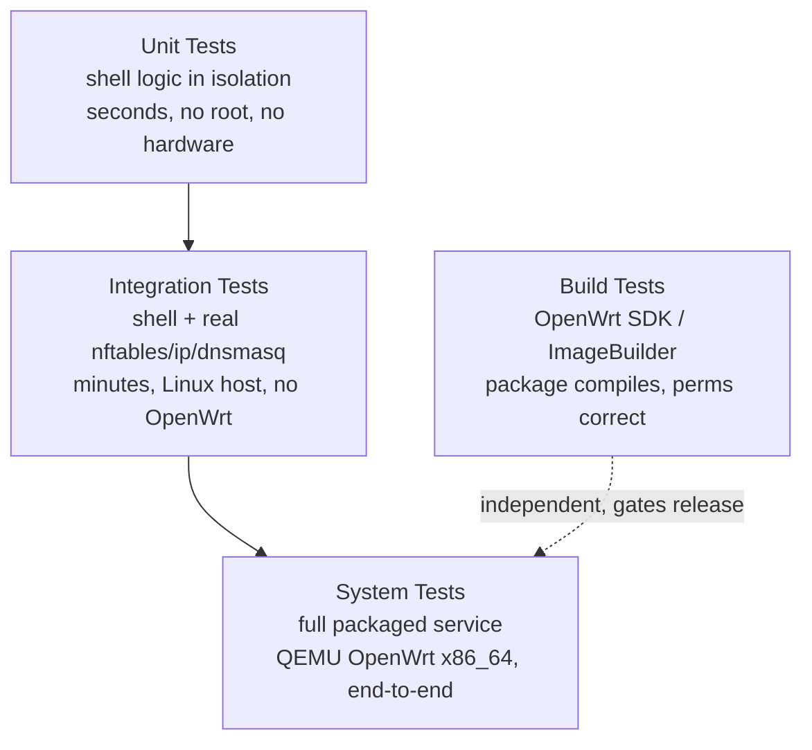
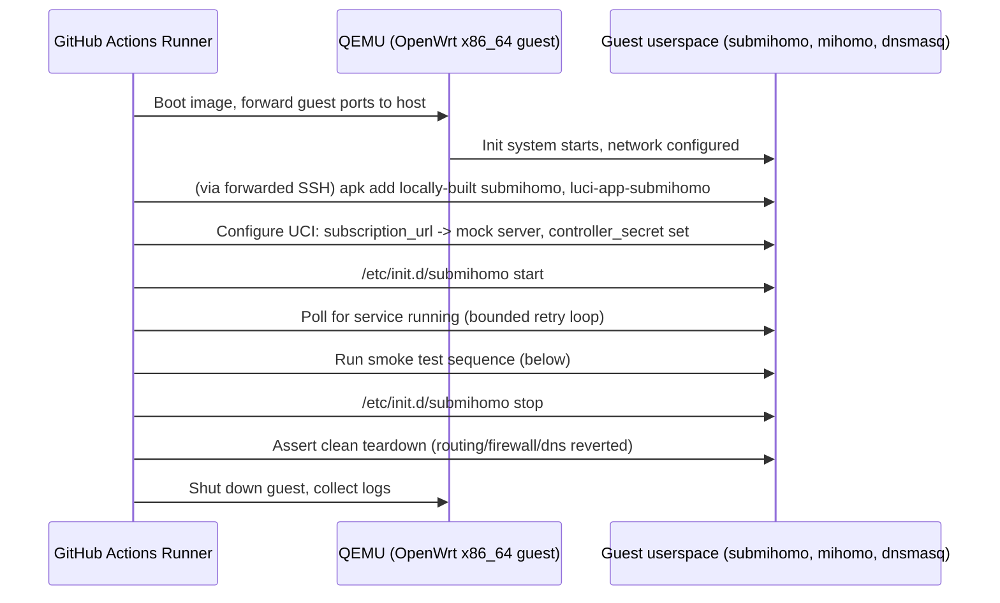
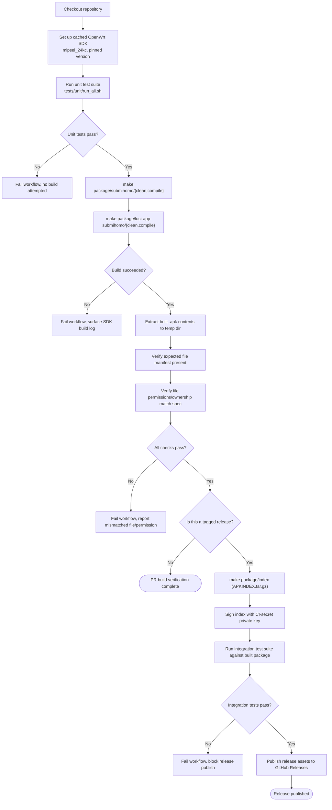

# SubMiHomo — Testing Architecture

## Table of Contents

1. [Testing Philosophy](#1-testing-philosophy)
2. [Test Structure Overview](#2-test-structure-overview)
3. [Unit Test Design](#3-unit-test-design)
4. [Integration Test Design](#4-integration-test-design)
5. [System Test Design](#5-system-test-design)
6. [Build Test Design](#6-build-test-design)
7. [Test Data](#7-test-data)
8. [Failure Scenarios to Test](#8-failure-scenarios-to-test)
9. [Performance Benchmarks](#9-performance-benchmarks)
10. [Regression Test Checklist](#10-regression-test-checklist)
11. [Manual Testing Guide](#11-manual-testing-guide)

---

## 1. Testing Philosophy

SubMiHomo is a shell-based system service that manipulates kernel networking state (routing tables, nftables, dnsmasq configuration) and supervises an external binary (Mihomo) it does not control the source of. This shapes what is practical and valuable to test:

**What is tested:**

- The **logic SubMiHomo owns**: UCI value extraction and validation, YAML block extraction from subscriptions, config assembly ordering, URL/secret masking, routing/firewall/DNS setup and teardown command sequences, subscription download/validate/apply/rollback state machine, and the RPC contract exposed to LuCI.
- The **interactions** between SubMiHomo's modules and the real system tools they depend on (`nft`, `ip`, `uci`, dnsmasq, `wget`), verified against actual Linux networking primitives in a container, not just against mocks.
- The **end-to-end behavior** of the packaged system on a real (emulated) OpenWrt environment: does traffic actually get intercepted, does DNS actually resolve, does the dashboard actually load.
- The **build artifact** itself: does the package actually compile and install correctly on the target SDK, with the correct files and permissions.

**What is not tested, and why:**

- Mihomo's own internal correctness (proxy protocol implementations, rule matching engine, fake-IP algorithm) — this is upstream Mihomo's testing responsibility, not SubMiHomo's. SubMiHomo's tests treat Mihomo as a black box that either accepts a config (`mihomo -t` exit code 0) or does not.
- Real-world proxy server connectivity — SubMiHomo cannot test against a user's actual paid subscription infrastructure in CI, and does not attempt to. System tests use either a local mock proxy/DNS server or, where genuine outbound connectivity is exercised, a known-stable public endpoint used only to prove that *traffic flows through the interception path at all*, not to validate any specific commercial provider.
- OpenWrt kernel/firmware correctness itself (TPROXY kernel support, nftables kernel modules) — assumed present per the package's declared dependencies (`INSTALL.md` §6.3); a missing kernel module is treated as an environment/dependency failure, not a SubMiHomo defect, though it is still included as a **failure scenario** to test for graceful error reporting (§8).
- Cross-browser LuCI JS rendering — LuCI's own JS framework and browser compatibility are out of scope; SubMiHomo's JS views are tested only insofar as their RPC calls produce the expected data shape, not their visual rendering.
- True MIPS hardware behavior at scale (thermal throttling, flash wear, real-world Wi-Fi interaction) — infeasible to reproduce in CI; addressed instead by the manual testing guide (§11) for maintainers with access to physical target hardware before a release.

**Core testing principle**: each layer should catch the class of bug that the layer below it cannot. Unit tests catch logic errors in isolation quickly and cheaply (seconds, no root, no hardware). Integration tests catch wrong assumptions about how shell logic interacts with real system tools (minutes, needs Linux+nftables, no OpenWrt). System tests catch wrong assumptions about the *whole packaged system* working together on the actual target OS (longer, needs QEMU). Build tests catch packaging/dependency/permission mistakes that no amount of correct shell logic would reveal (needs the OpenWrt SDK).



---

## 2. Test Structure Overview

| Layer | Location | Runs On | Speed | What It Proves |
|---|---|---|---|---|
| Unit | `tests/unit/` | `ubuntu-latest` GitHub Actions runner, plain shell | Seconds | Individual functions in `core.sh`, `config.sh`, `subscription.sh`, etc. behave correctly given controlled inputs, independent of any real system state |
| Integration | `tests/integration/` | `ubuntu-latest` with `nftables` kernel module loaded (or a privileged container) | Minutes | Modules correctly create/tear down real Linux networking constructs (`ip rule`, `ip route`, `nft` tables), correctly generate config YAML, and correctly interact with a mock subscription HTTP server |
| System | `tests/system/` (executed against QEMU) | OpenWrt x86_64 QEMU image | Longest (image boot + full service cycle) | The fully packaged, installed service starts, stops, proxies traffic, resolves DNS in both modes, updates its subscription, and serves the dashboard — on an actual OpenWrt userspace |
| Build | GitHub Actions workflow (`.github/workflows/build.yml`) | `ubuntu-latest` with OpenWrt SDK/ImageBuilder | Minutes (SDK setup is cached) | The package Makefile produces a valid, installable `.apk` with the correct file manifest and permissions, and the unit test suite passes as a pre-publish gate |

All four layers run automatically in GitHub Actions CI/CD on every pull request and on tag pushes (release builds), with the exception that **system tests** (requiring QEMU boot time) are configured to run on merges to the main integration branch and on release tags, rather than on every single commit in a fast-iteration PR, to keep PR feedback latency reasonable. Unit, integration, and build-verification-without-publish run on every PR.

---

## 3. Unit Test Design

### 3.1 What Functions Are Tested

Unit tests target pure(-ish) shell functions that can be exercised without touching real kernel state, real network sockets, or a real UCI database — anything that depends on those is either mocked (§3.2) or pushed down to the integration layer (§4).

| Module | Functions Under Test | Example Assertions |
|---|---|---|
| `core.sh` | UCI getter wrappers (`submihomo_get_dns_mode`, etc.), logging wrapper output format, lock-file acquire/release logic | Getter returns the mocked UCI value verbatim; logging wrapper prefixes messages with the correct syslog tag and level; lock function refuses a second acquisition while a lock file exists and its owning PID is alive |
| `config.sh` | YAML block extraction (`proxies:`, `proxy-groups:`, `rules:` boundary detection), section-ordering assembly logic, template variable substitution for non-subscription-derived values (ports, DNS mode, secret) | Extraction returns exactly the lines belonging to a target key, correctly stopping at the next column-0 key; a block containing nested lists/mappings at varying indentation is captured in full; a missing key produces an empty (not error-crashing) result that downstream code handles by falling back to a sane default |
| `subscription.sh` | URL format validation regex, URL masking function, content validation (non-empty check, `proxies:` key presence check), backup/restore file-move sequencing | Validation regex accepts well-formed `https://` URLs and rejects `http://`, javascript-scheme, or shell-metacharacter-containing strings; masking returns exactly the first 20 characters plus literal `...` regardless of input length (including inputs shorter than 20 characters, where the behavior at the boundary is explicitly asserted); an empty downloaded file is rejected before any file-move occurs |
| `firewall.sh` | Bypass CIDR validation regex and octet/prefix range checks | Valid CIDRs like `10.0.0.0/8` pass; invalid octets (`999.1.1.1/24`), invalid prefix lengths (`10.0.0.0/33`), and malformed strings (missing prefix, extra segments) are all rejected with the specific expected reason |
| `routing.sh` | Command-string construction for `ip rule`/`ip route` invocations (verifying the exact arguments that *would* be passed, without actually invoking `ip`) | Constructed command strings match the exact expected `ip rule add fwmark 1 lookup 100` / `ip route add local default dev lo table 100` invocations for the documented fwmark/table values (ARCHITECTURE.md §8.3) |
| rpcd plugin helpers | Secret redaction logic, subscription URL masking as surfaced through `get_config()`, ACL-adjacent method routing (dispatch table correctness, not actual rpcd process integration) | `get_config()` output never contains the raw secret string when a secret is configured; output reports empty (not redacted) when no secret is configured; dispatch correctly maps a requested RPC method name to its implementing function or returns a clean "unknown method" error for anything unrecognized |

### 3.2 Mock Design

Unit tests must run in a plain `ubuntu-latest` container with no OpenWrt userspace, no `uci` binary, no `nft` binary, and (deliberately) no root. This is achieved by placing mock shell functions **earlier in `$PATH`** (or sourced to shadow the real function names, for functions rather than external binaries) than any real system tool, so that the modules under test — unmodified — call what they believe is `uci`, `nft`, `ip`, or `logger`, and instead invoke a test-controlled stand-in.

| Mocked Command | Mock Behavior | Purpose |
|---|---|---|
| `uci` | A shell function/script that reads from an associative-array-like flat file or a `case`-based dispatcher keyed on the `get`/`set`/`commit` subcommand and config path argument, returning pre-programmed test-fixture values | Lets tests set up "UCI already contains X" preconditions without a real UCI database, and lets tests assert that `config.sh` correctly reads whatever value the fixture provides |
| `nft` | A no-op function that records the exact arguments it was invoked with (appended to a scratch log file) and returns success, without touching any real netfilter state | Lets `firewall.sh` unit tests assert on *what would have been executed* without needing `CAP_NET_ADMIN` or a real nftables-enabled kernel |
| `ip` | Same recording-no-op pattern as `nft`, for `routing.sh` | Same rationale — validates command construction, not actual kernel effect (kernel effect is validated at the integration layer, §4) |
| `logger` | A function that appends to a scratch log file instead of writing to the real syslog socket | Lets tests assert on log message content/format without depending on `syslog`/`logread` being available in a bare container |
| `wget` | A function that returns a pre-programmed canned response (a fixture file's content) or a specific failure exit code, depending on the test case, without performing any real network I/O | Lets `subscription.sh` unit tests exercise the download-success, download-failure, and various malformed-content paths deterministically and offline |
| `mihomo` (specifically the `-t -f <file>` config-check invocation) | A function that inspects the given file for a simple marker (e.g., presence of a `# TEST_INVALID` fixture comment, or absence of a `proxies:` key) and returns exit code 0 or 1 accordingly | Lets tests exercise both the "subscription passes Mihomo's own validation" and "subscription fails Mihomo's own validation" branches of `subscription.sh` without needing the actual Mihomo binary present in the unit test container |

Each unit test file sources a shared `tests/unit/mocks.sh` helper that defines all of the above, then sources the real module under test, then defines the specific fixture data for its own test cases before invoking the function(s) it is testing. This keeps mock definitions centralized (one canonical mock implementation reused by every test file) while fixture *data* remains local to each test file.

### 3.3 Test File Structure

```
tests/unit/
├── mocks.sh                  # Shared mock implementations (uci, nft, ip, logger, wget, mihomo)
├── test_core.sh              # core.sh: UCI getters, logging, locking
├── test_config_extraction.sh # config.sh: YAML block extraction and assembly ordering
├── test_subscription_validation.sh   # subscription.sh: URL regex, masking, content checks
├── test_firewall_validation.sh       # firewall.sh: bypass CIDR validation
├── test_routing_commands.sh          # routing.sh: constructed ip command correctness
├── test_rpcd_redaction.sh            # rpcd plugin: secret/URL redaction contract
├── fixtures/
│   ├── subscription_valid_minimal.yaml
│   ├── subscription_missing_proxies.yaml
│   ├── subscription_empty.yaml
│   ├── subscription_malformed_yaml.yaml
│   └── uci_config_samples/
│       ├── default.conf
│       ├── no_secret.conf
│       └── custom_bypass.conf
└── run_all.sh                 # Discovers and runs every test_*.sh file, aggregates pass/fail
```

`run_all.sh` is the single entry point invoked by CI (§6). It runs each `test_*.sh` file as an isolated subshell (so that one file's mock state or fixture mutation cannot leak into another file's run), collects each file's pass/fail tally, and exits non-zero overall if any individual assertion failed anywhere, printing a summary table of files run, assertions passed, and assertions failed.

### 3.4 Example Test Cases (Described in Prose)

- **URL masking, exact-boundary case**: given a URL of exactly 20 characters, the masking function must still append the literal `...` suffix (it does not special-case "short enough to show in full"), consistent with the security posture in `SECURITY.md` §4.3 that treats the mask as an unconditional transformation, not a conditional one.
- **URL validation, HTTPS-only enforcement**: a table-driven test feeds a list of URL strings — some valid HTTPS subscription-style URLs with query parameters, some `http://` URLs, some URLs containing a backtick or semicolon, some containing spaces — and asserts the validation function returns success only for the well-formed HTTPS entries, per the regex documented in `SECURITY.md` §4.6.
- **YAML block extraction, adjacent-key boundary**: given a fixture subscription file where `proxies:` is immediately followed by `proxy-groups:` with no blank line between them, the extraction function must not "bleed" the first line of `proxy-groups:` into the captured `proxies:` block. This specifically tests the column-0 key-boundary detection logic described in `SECURITY.md` §4.4.
- **YAML block extraction, missing key**: given a fixture subscription file with no `rules:` key at all (a provider that omits custom rules, relying entirely on SubMiHomo's default catch-all), extraction returns an empty result and `config.sh`'s assembly logic falls back to just the default `MATCH,PROXY` rule without erroring.
- **Subscription content validation, empty file**: an empty fixture file is rejected before any `mihomo -t` invocation is attempted (this check should short-circuit, since invoking the mocked `mihomo` on an empty file is a wasted step the real validation pipeline is designed to avoid).
- **Subscription content validation, missing `proxies:` key**: a fixture file that is well-formed YAML but lacks a top-level `proxies:` key is rejected at the content-check stage, before the `mihomo -t` stage, matching the documented flowchart order in `ARCHITECTURE.md` §5.4 (non-empty check → `proxies:` key check → `mihomo -t` check).
- **Bypass CIDR validation, boundary octets**: `0.0.0.0/0` and `255.255.255.255/32` are accepted as syntactically valid (even though `/0` is a semantically unusual bypass entry, the *validation function's* job is only syntactic/range correctness, not policy judgment about whether the entry is a sensible bypass choice); `256.0.0.0/8` and `10.0.0.0/-1` are rejected.
- **Secret redaction, empty vs. set**: `get_config()` mock-invocation with a fixture UCI file where the secret field is unset returns an empty string for that field; the same call against a fixture where the secret is set to any non-empty value returns the fixed redaction sentinel, never the fixture's actual configured value — this is asserted by checking the fixture's actual secret string does **not** appear anywhere in the function's output, not merely that *a* string was returned.
- **Lock function, concurrent acquisition**: acquiring the lock once succeeds; a second acquisition attempt in the same test (simulating a second invocation of the init script while the first is still "running," represented by the lock file's recorded PID still being present in the mocked process table) fails cleanly rather than proceeding, and releasing the lock allows a subsequent acquisition to succeed.

### 3.5 Assertion Format

Assertions use plain shell conditionals with an explicit failure message and process exit, deliberately avoiding any external testing framework dependency (no `bats`, no `shunit2`) so that the entire test suite has zero installation prerequisites beyond a POSIX-compliant shell — consistent with the project's own "pure shell, no external testing framework" principle.

The canonical assertion pattern used throughout every test file:

```
[ "$actual" = "$expected" ] || { echo "FAIL: <test description> — expected '$expected', got '$actual'"; exit 1; }
```

Variants of this pattern are used for:

- Exit-code assertions (`[ "$exit_code" -eq 0 ]` / `-ne 0`).
- Substring-absence assertions (used specifically for the secret-redaction tests, via a `case` statement or `grep -qv` check rather than an exact-match comparison, since the assertion is "this string must not appear anywhere in the output," not "the output equals exactly this string").
- Multi-line output assertions, where the actual and expected values are first normalized (e.g., trailing-whitespace-stripped) before comparison, to avoid spurious failures from incidental formatting differences unrelated to the logic under test.

Every individual assertion failure prints a self-describing `FAIL:` line naming the specific test case and the expected-vs-actual mismatch, so that a CI log can be scanned for the word `FAIL` to immediately locate the failing case without needing to re-run anything locally first.

---

## 4. Integration Test Design

### 4.1 What Interactions Are Tested

Integration tests exercise the same shell modules as unit tests, but **without** the `nft`/`ip`/`logger` mocks from §3.2 — instead running against a real Linux kernel's real networking stack inside a privileged container, to prove that the *arguments* validated at the unit layer actually produce the *intended kernel state* when executed for real.

| Interaction | What Is Verified |
|---|---|
| Routing setup | After `routing.sh`'s setup function runs, `ip rule show` contains a rule matching `fwmark 0x1 lookup 100`, and `ip route show table 100` contains `local default dev lo` |
| Routing teardown | After the corresponding teardown function runs, neither of the above entries remain — `ip rule show` and `ip route show table 100` return to their pre-test state |
| Firewall setup | After `firewall.sh`'s setup function runs, `nft list table inet submihomo` shows both the `PREROUTING` and `OUTPUT` chains with the expected hook/priority attributes, the bypass set populated with the hardcoded private ranges plus any test-fixture-supplied UCI bypass entries, and the fwmark-0xff skip rule present ahead of the TPROXY redirect rule (evaluation order matters and is explicitly asserted, not just rule presence) |
| Firewall teardown | After teardown, `nft list tables` no longer includes `inet submihomo` at all — a full, atomic table deletion, not a partial rule removal |
| dnsmasq config creation | After `dns.sh`'s setup function runs, `/etc/dnsmasq.d/submihomo.conf` (or the container's equivalent test path) contains exactly the expected `server=/#/127.0.0.1#1053` directive, and a mocked/real dnsmasq reload signal is confirmed to have been triggered (verified via a test dnsmasq process's PID/reload-timestamp changing, or via a stand-in reload-trigger script recording invocation, depending on whether a real dnsmasq binary is available in the container) |
| dnsmasq config removal | After teardown, the config file no longer exists, and a reload is triggered again so a real dnsmasq would pick up its absence |
| Config generation, full assembly | Running `config.sh` end-to-end against a fixture UCI config and a fixture subscription file produces a `config.yaml` whose structure — section presence, section order, and the literal subscription-derived `proxies`/`proxy-groups`/`rules` content — matches an expected fixture output, checked via structural comparison (parsing both the produced file and the expected fixture with a YAML-aware comparison, e.g., Python's `yaml` module invoked as a comparison helper within the test script, rather than a fragile line-by-line text diff that would be sensitive to insignificant whitespace differences) |
| Subscription download, mock HTTP server | `subscription.sh`'s download function, run against a locally-hosted mock HTTP server (§4.3) serving a fixture subscription file, correctly downloads, validates, and activates the fixture as `current.yaml`, with `backup.yaml` correctly populated from whatever `current.yaml` existed beforehand |
| Subscription download, failure paths against the mock server | The mock server is configured (per test case) to return a 404, to hang past a timeout threshold, to return an oversized response (exceeding the 5 MB cap), or to return a 200 with genuinely invalid/empty content — each case is verified to result in `current.yaml` remaining **unchanged** from its pre-test value, and the appropriate masked-URL log line being emitted |

### 4.2 Docker/Container Requirements

Integration tests run inside a **privileged** container (required for `ip rule`/`ip route table`/`nft` operations, which need `CAP_NET_ADMIN` at minimum, and in practice are simplest to grant via full `--privileged` in CI rather than hand-enumerating the minimum capability set) on a `ubuntu-latest` GitHub Actions runner with the `nf_tables` kernel module confirmed loaded (`modprobe nf_tables` as a pre-test step; GitHub-hosted runners' kernels support this natively without needing a custom kernel build). The container image includes: `nftables`, `iproute2` (providing the full `ip` command), `dnsmasq` (a real, minimal instance startable within the container network namespace for the dnsmasq-interaction tests), and `python3` (for the mock HTTP server, §4.3, and for YAML-aware fixture comparison, §4.1).

Each integration test run creates and destroys its own isolated network namespace (`ip netns add submihomo-test-<run-id>`) so that the real `ip rule`/`nft table` state it creates is scoped to that namespace and does not leak into the CI runner's actual networking configuration, and so that parallel test runs (if the CI matrix ever runs integration suites in parallel) cannot interfere with one another.

### 4.3 Mock HTTP Server for Subscription Testing

A minimal Python `http.server`-based script (`tests/integration/mock_subscription_server.py`) is started as a background process before subscription-related integration tests run, and stopped afterward. It is deliberately built on Python's standard library `http.server` module rather than any additional dependency, since Python 3 is already a natural CI-environment fixture and this avoids adding a new external test dependency for a single-purpose mock.

The mock server supports, via simple path-based routing or a small request-count-based state machine:

- Serving a valid fixture subscription YAML file with a `200 OK` response, for the success-path tests.
- Returning `404 Not Found`, for the "URL no longer valid" failure scenario.
- Deliberately delaying its response beyond `subscription.sh`'s configured `wget` timeout, for the timeout-handling failure scenario.
- Serving a response larger than the 5 MB cap, for the oversized-response failure scenario (`SECURITY.md` §4.5).
- Serving a `200 OK` with an empty body, and separately a `200 OK` with well-formed-but-`proxies:`-lacking YAML content, for the two distinct "downloaded successfully but content is invalid" scenarios.

Because subscription URLs are HTTPS-only by validation (`SECURITY.md` §4.6), the mock server is fronted with a locally-generated, test-only self-signed TLS certificate, and the integration test's invocation of `subscription.sh` is pointed at `https://127.0.0.1:<mock-port>/...` with the test-only CA injected into the container's trust store for the duration of the test run — this preserves the property that the *same* HTTPS-only code path is exercised in integration tests as in production, rather than testing a separately-maintained HTTP-only code branch that would not actually reflect production behavior.

### 4.4 Test File Structure

```
tests/integration/
├── mock_subscription_server.py
├── test_routing_setup_teardown.sh
├── test_firewall_setup_teardown.sh
├── test_dns_setup_teardown.sh
├── test_config_generation_full.sh
├── test_subscription_download_success.sh
├── test_subscription_download_failures.sh
├── fixtures/
│   ├── subscription_full_realistic.yaml
│   ├── expected_config_output.yaml
│   └── uci_config_integration.conf
├── run_all.sh
└── README.md   # documents container/privilege requirements for local reproduction
```

### 4.5 What Constitutes a Passing Integration Test

An integration test is considered passing only when, in addition to each individual assertion succeeding:

1. The test's own **teardown** step is verified to have actually restored the pre-test kernel/filesystem state (asserted explicitly, not merely assumed) — an integration test that verifies setup but never confirms teardown cleanliness is considered incomplete, since leftover `ip rule`/`nft table` state is exactly the class of bug most valuable for this layer to catch.
2. No real outbound network access is required — all HTTP interaction is against the local mock server (§4.3); a test suite that silently depends on reaching the real internet is treated as a flaky/unreliable test and is not accepted.
3. The test namespace/container is fully cleaned up regardless of whether the test passed or failed (using a `trap`-based cleanup at the top of each test script), so that a failing test does not leave state that causes *subsequent, unrelated* tests to fail for spurious reasons.

---

## 5. System Test Design

### 5.1 QEMU OpenWrt Setup

System tests run against an **OpenWrt x86_64 QEMU image**, not `mipsel_24kc`, despite `mipsel_24kc` being the project's primary target architecture. This is a deliberate pragmatic choice:

- OpenWrt publishes ready-made `x86_64` QEMU-bootable images (`generic-ext4-combined.img.gz` or equivalent) that boot quickly under standard GitHub Actions runner CPU emulation/virtualization support, whereas MIPS emulation under QEMU is markedly slower (full software CPU emulation rather than any acceleration) and would push system test runtime into a range that is impractical for routine CI use.
- The logic under test at this layer (service startup sequencing, routing/firewall/DNS integration, subscription handling, dashboard serving) is **architecture-independent shell and configuration logic** — none of it depends on MIPS-specific behavior. The one architecture-sensitive component (the `mihomo` binary itself) is available as an upstream-published `x86_64` build, so the same test scenarios validate the same integration points regardless of which architecture's Mihomo binary is actually running.
- True `mipsel_24kc` hardware/timing-sensitive validation (flash write latency, real Wi-Fi behavior, thermal/CPU-throttling effects on startup time) is explicitly deferred to the manual testing guide (§11), performed by a maintainer with physical target hardware before a release is tagged, rather than attempted in CI.

The QEMU image is booted headlessly in CI with a serial console redirected to a log file and, separately, a host-side TCP port forwarded to the guest's LAN-facing HTTP/API ports, allowing the CI job to script interactions against the guest exactly as an external LAN client would (`curl` against the forwarded LuCI/controller ports from the CI runner), rather than needing to inject commands via the serial console for every test step.



### 5.2 Test Sequence for Full Smoke Test

1. **Boot and provisioning**: boot the base OpenWrt x86_64 image, install the CI-built `submihomo` and `luci-app-submihomo` packages (built from the same commit under test, sideloaded rather than fetched from the real APK repository, so system tests validate the current change rather than the last published release), and confirm `mihomo` (upstream or vendored `x86_64` build) is present.
2. **Initial configuration**: set UCI values via `uci set`/`uci commit` (not through the LuCI web UI at this stage — that is validated separately as part of the LuCI-facing checks below) pointing `subscription_url` at the mock subscription server (§4.3, re-used at this layer) and setting a controller secret.
3. **Start and health check**: run `/etc/init.d/submihomo start`, then poll (bounded retries with a total timeout, not an unbounded loop) until the service reports running via `submihomo-ctl status`.
4. **Routing/firewall verification**: from within the guest, confirm `ip rule show`, `ip route show table 100`, and `nft list table inet submihomo` reflect the expected state — the same assertions as the integration layer (§4.1), now verified on the actual target init/service stack rather than a bare shell invocation of the module functions directly.
5. **DNS resolution — fake-IP mode**: configure `dns_mode` to fake-IP, restart the service, and from a simulated LAN client (a second network namespace or a helper container bridged to the guest's LAN interface) issue a DNS query for a test domain, confirming a `198.18.0.0/15` response is returned, and that a subsequent connection attempt to that fake IP is observed being intercepted (via `nft` counters or connection tracking on the guest) rather than routed directly to the WAN interface.
6. **DNS resolution — real-IP mode**: repeat the equivalent check with `dns_mode` set to real-IP, confirming a genuine resolved IP is returned for the same test domain (using the mock server or a stable known-good DNS test target, per the scoping notes in §1) and that TPROXY interception still occurs for the connection.
7. **Connectivity through Mihomo**: with a minimal reachable test target (either the mock HTTP server extended to also serve a trivial "hello" response representing an "upstream destination," or a well-known, stable, low-risk public endpoint used strictly as a connectivity probe, consistent with the scoping boundary in §1 that this proves interception works, not that any specific commercial proxy provider works), confirm a simulated LAN client's request is observed to traverse the TPROXY path (via connection tracking / Mihomo's own connection-log API queried through the controller) and receives a valid response.
8. **Subscription update**: trigger `submihomo-ctl update-subscription` (or the equivalent RPC call, exercising the rpcd plugin path specifically, to also validate that integration point) against the mock server serving an updated fixture, and confirm `current.yaml` is updated, `backup.yaml` reflects the prior content, and the service picks up the new config (verified via a distinguishing marker proxy-group name unique to the "updated" fixture, visible through the controller API after the update).
9. **Dashboard download and serving**: invoke `submihomo-ctl download-dashboard` (or confirm it ran automatically on first start per `ARCHITECTURE.md` §4.4), then `curl` the forwarded controller port's `/ui` path from the CI runner and confirm a `200 OK` with recognizable dashboard HTML/JS content is returned.
10. **LuCI-facing checks**: authenticate against the guest's LuCI session endpoint (scripted login using the test image's known root credentials), then invoke each read-only rpcd method (`status`, `get_config`, `get_logs`, `get_proxies`, `run_diagnostics`) via `ubus call submihomo <method>` and confirm well-formed JSON responses; separately confirm that `get_config`'s response never contains the raw configured secret or unmasked subscription URL (re-validating the redaction contract from `SECURITY.md` §4.3/§10.3 at the fully integrated system level, not just at the unit level).
11. **Graceful stop and teardown verification**: `/etc/init.d/submihomo stop`, then re-check `ip rule show`/`ip route show table 100`/`nft list tables`/`/etc/dnsmasq.d/submihomo.conf` presence to confirm complete, symmetric teardown.
12. **Shutdown and log collection**: the guest's full syslog (`logread` output) and QEMU serial console log are collected as CI artifacts regardless of pass/fail, so a system test failure can be diagnosed from the CI run without needing to reproduce it locally first.

### 5.3 What DNS Modes Are Tested

Both officially supported DNS modes are exercised in every system test run (steps 5 and 6 above), not just the default/recommended mode, since the two modes exercise materially different code paths in `dns.sh`/`config.sh` (`ARCHITECTURE.md` §9, §5.2, §5.3) and a regression specific to real-IP mode would otherwise go undetected if only the (more commonly used) fake-IP mode were tested.

### 5.4 Connectivity Test Methodology

Connectivity verification favors **observability over blind trust**: rather than merely asserting "the `curl` command returned exit code 0," the test additionally checks Mihomo's own connection-tracking state through the controller API (confirming the connection appears in Mihomo's active/recent connections list, attributed to the expected proxy-group decision) and/or nftables packet/byte counters on the relevant chain, so that a false-positive pass (e.g., a client-side DNS or routing table misconfiguration accidentally allowing direct, non-intercepted connectivity that happens to still succeed) is distinguished from a true pass where traffic demonstrably flowed through the TPROXY interception path as designed.

### 5.5 Subscription Update Test

Covered in step 8 above; the key property under test is **atomicity as experienced by the running service** — the update sequence's intermediate states (per the flow in `ARCHITECTURE.md` §5.4) are exercised specifically including a deliberately-injected failure case (the mock server serving an invalid "update" fixture) to confirm the rollback branch leaves `current.yaml` and the running service's active config completely unchanged, with only a log entry recording the rejected attempt.

---

## 6. Build Test Design

### 6.1 GitHub Actions Workflow Structure



Build verification (SDK build + file manifest/permission checks + unit tests) runs on **every pull request**, giving fast feedback that a change has not broken packaging. The signing, integration-test-gated, and publish steps run only on tagged releases, matching the release process described in `INSTALL.md` §7.

### 6.2 OpenWrt SDK Setup in CI

The workflow downloads a pinned OpenWrt SDK release archive matching the `mipsel_24kc` target (the same pinned version referenced in `INSTALL.md` §7.3), extracts it, and populates the project's package feed (via a symlink or `feeds.conf.default` entry pointing at the repository's `package/submihomo` and `package/luci-app-submihomo` directories) so that `make package/submihomo/compile` resolves correctly within the SDK's build system. The extracted SDK is cached between workflow runs, keyed on the SDK version string plus a checksum of the toolchain configuration, so that unchanged SDK versions do not re-download on every CI run.

### 6.3 APK Build Verification

After `make package/<name>/{clean,compile}` completes, the workflow locates the produced `.apk` file(s) under the SDK's `bin/packages/mipsel_24kc/` output directory and performs the following automated checks before considering the build step successful:

- The `.apk` file exists and is non-empty.
- `apk`'s own package inspection (`apk info` run against the local file, or unpacking the package's internal control/data tarball structure directly) reports the expected package name, version (matching the tag/`PKG_VERSION` for release builds), and declared dependency list matching exactly the dependency table in `INSTALL.md` §6.3 — a build test that silently allowed a dependency to be accidentally dropped from the Makefile would otherwise only be caught much later, at install time on a real router.
- The package's description and metadata fields (`SECTION`, `CATEGORY`, `TITLE`, `URL`, `LICENSE`) are present and non-empty, since these are user-facing fields surfaced in `apk search`/`apk info` output on end-user routers.

### 6.4 Package File Permission Verification

The workflow extracts the built package's file payload to a temporary directory and asserts, file by file, against the permission table documented in `SECURITY.md` §4.1 / `INSTALL.md` §6.4:

| Path (within extracted package) | Expected Mode | Verified By |
|---|---|---|
| `etc/init.d/submihomo` | `755` | `stat -c '%a'` on the extracted file, compared to the expected value in a test-fixture table |
| `usr/lib/submihomo/*.sh` | `755` | Same pattern, iterated over every file matching the glob |
| `usr/lib/rpcd/submihomo` | `755` | Same pattern |
| `usr/bin/submihomo-ctl` | `755` | Same pattern |
| `etc/config/submihomo` (as shipped in the package; actual runtime mode is additionally re-asserted by `postinst`, per `INSTALL.md` §6.5) | `600` | Same pattern; this check specifically guards against a regression where the Makefile's install rule forgets to set the restrictive mode on this particular file, since it is easy to accidentally copy-paste a `644` install rule for it by mistake |
| `etc/submihomo/templates/base.yaml.tmpl` | `644` | Same pattern |
| LuCI JS views, menu JSON, ACL JSON (within `luci-app-submihomo`) | `644` | Same pattern |

Any mismatch fails the build workflow with a message naming the specific file and the expected-versus-actual mode, so that a permissions regression is caught at the PR stage — before it could ever reach a real router — rather than being discovered later as a security issue in production (this check is one of the more important tests in the entire suite specifically because a permissions mistake here has direct security consequences per `SECURITY.md` §4.1, not merely a functional one).

---

## 7. Test Data

### 7.1 Sample Subscription YAML — Valid, Minimal

A minimal valid fixture used across unit and integration tests represents the smallest subscription document that satisfies every validation stage (non-empty, contains `proxies:`, passes `mihomo -t`):

```yaml
proxies:
  - name: "test-node-1"
    type: ss
    server: 203.0.113.10
    port: 8388
    cipher: aes-256-gcm
    password: "test-password-only-used-in-fixtures"

proxy-groups:
  - name: "auto"
    type: select
    proxies:
      - "test-node-1"

rules:
  - "MATCH,auto"
```

This fixture is intentionally minimal (one proxy, one group, one catch-all rule) so that assertions about extracted block boundaries and assembled config structure remain simple to reason about and simple to update if the format evolves; more elaborate, closer-to-real-world fixtures (`subscription_full_realistic.yaml`, referenced in §4.4) are used specifically for the integration-layer full-assembly test, where realistic complexity (multiple proxy types, nested proxy-group references, a larger rule list) is the point of the test.

### 7.2 Sample Invalid Subscription YAML — Various Failure Modes

| Fixture File | Defect | Expected Rejection Stage |
|---|---|---|
| `subscription_empty.yaml` | Zero-byte file | Non-empty check (earliest stage) |
| `subscription_missing_proxies.yaml` | Well-formed YAML, has `proxy-groups:` and `rules:`, but no `proxies:` key at all | `proxies:` key presence check |
| `subscription_malformed_yaml.yaml` | Contains a `proxies:` key textually, but the document as a whole has invalid YAML syntax elsewhere (e.g., inconsistent indentation, an unterminated quoted string) | `mihomo -t -f` semantic/syntax validation stage (passes the earlier, shallower text-based checks since those only look for the literal `proxies:` key marker, not full-document validity — this fixture specifically exists to prove the final `mihomo -t` backstop catches what the earlier shallow checks cannot) |
| `subscription_proxy_group_dangling_ref.yaml` | Valid YAML, has both `proxies:` and `proxy-groups:`, but a `proxy-groups:` entry references a proxy `name` that does not exist under `proxies:` | `mihomo -t -f` semantic validation (Mihomo itself rejects an unresolvable proxy-group reference) |
| `subscription_oversized.yaml` | A generated fixture exceeding 5 MB | Rejected by the download-layer size cap before content validation is ever reached (integration-layer test only, via the mock server, §4.3) |

### 7.3 Sample UCI Configs — Various States

| Fixture | State Represented | Used By |
|---|---|---|
| `default.conf` | Freshly installed, unconfigured state — empty subscription URL, empty secret, default DNS mode | Tests confirming the service correctly refuses to start (or LuCI correctly shows its warning banners) in the unconfigured state |
| `no_secret.conf` | Valid subscription URL configured, but controller secret left empty | Tests specifically targeting the `SECURITY.md` §4.2 non-dismissible-warning behavior and the `status()` RPC's `secret_configured: false` field |
| `custom_bypass.conf` | Valid subscription URL and secret, plus several user-added bypass CIDR entries (a mix of valid and, in one dedicated negative-test variant, deliberately invalid entries) | Tests of `firewall.sh`'s bypass-set population logic and of the input-validation rejection path for a malformed user-supplied bypass entry |
| `real_ip_mode.conf` / `fake_ip_mode.conf` | Otherwise-identical valid configs differing only in `dns_mode` | System-layer DNS mode tests (§5.3) |

---

## 8. Failure Scenarios to Test

Each scenario below states the triggering condition, the expected observable behavior, and the layer(s) at which it is exercised.

| Scenario | Triggering Condition | Expected Behavior | Test Layer(s) |
|---|---|---|---|
| Service start with missing subscription | `subscription_url` is empty and no `current.yaml` exists yet | `start_service()` aborts early with a clear log message ("no subscription configured") and does not attempt to launch Mihomo with an empty/invalid proxy list; LuCI's overview page reflects a distinct "not configured" state rather than a generic failure | Unit (early-abort logic), System (full boot with unconfigured UCI) |
| Service start with invalid subscription | `current.yaml` exists on disk but is corrupted/invalid (e.g., manually edited into a broken state, or left over from an interrupted prior update) | Boot-time validation (`ARCHITECTURE.md` §5.4's note on boot-time validation) detects the invalid file, falls back to `backup.yaml` if it validates successfully, and logs the fallback; if `backup.yaml` is also invalid or absent, the service aborts start with a clear error rather than launching Mihomo against a broken config | Unit (fallback selection logic), Integration (full config generation against a corrupted fixture), System (boot with a pre-seeded corrupted `current.yaml`) |
| Subscription update failure — timeout | Mock server configured to delay past the configured `wget` timeout | Download attempt is aborted at the timeout boundary, `current.yaml` remains unchanged, a masked-URL log line records a timeout-classified failure | Integration (§4.1, §4.3), System (§5.2 step 8 variant) |
| Subscription update failure — 404 | Mock server returns `404 Not Found` | Same unchanged-state guarantee as above, with a distinctly-classified log message ("subscription fetch returned HTTP 404") so an operator can distinguish "URL is wrong/expired" from "network unreachable" from the log alone | Integration, System |
| Subscription update failure — invalid content | Mock server returns `200 OK` with content missing the `proxies:` key, or genuinely empty | Same unchanged-state guarantee; log line specifically names the failed validation stage (content-empty vs. missing-key vs. `mihomo -t` failure), not just a generic "update failed" | Unit (validation function directly), Integration (through the full download pipeline) |
| Routing setup failure — missing kernel module | Simulated by removing/blacklisting `nf_tables`/TPROXY-related kernel module support in the test container/guest before attempting setup | `routing.sh`/`firewall.sh` setup detects the `nft`/`ip` command failure (non-zero exit, specific stderr pattern) and surfaces a clear, actionable log message ("required kernel module not available — is `kmod-nft-tproxy` installed?") rather than a bare, unexplained command failure trace; `start_service()` aborts rather than proceeding with partially-applied networking state | Integration (kernel module removed/blocked in the privileged test container), documented as a scenario for System-layer QEMU testing where feasible |
| DNS setup failure — dnsmasq not running | `dns.sh`'s setup function is invoked in an environment where the dnsmasq process is not active (service stopped, or reload signal target PID absent) | The config file write itself still succeeds (it is just a file write), but the reload-trigger step detects the absence of a running dnsmasq process and logs a warning rather than crashing the whole start sequence outright — the file will still take effect whenever dnsmasq is next started, and this fact is captured in the warning text | Integration (dnsmasq deliberately not started in the test container for this specific test case) |
| Config generation with empty proxies | Subscription content has a `proxies:` key present but with zero entries under it (an edge case distinct from the "missing key" scenario) | Content validation stage: this passes the shallow "`proxies:` key exists" text check, but assembly produces a `config.yaml` whose `proxy-groups` `auto`/`PROXY` selector has no members to select from; `mihomo -t` is relied upon as the actual backstop here, since Mihomo itself is expected to reject (or at minimum warn on) a proxy-group with zero resolvable members — the test explicitly asserts on which of these two outcomes actually occurs, so the behavior is documented and intentional rather than accidentally discovered later | Unit (content-check does not itself reject this — documented as an intentional pass-through), Integration (through `mihomo -t` in the full pipeline) |
| Dashboard download failure | GitHub Releases API unreachable, or the release asset 404s, simulated via a redirected/mocked endpoint in the test environment | `dashboard.sh` logs a clear failure and leaves any previously-downloaded dashboard version in place (does not delete a working prior version before confirming the new one downloaded successfully) — the controller's `/ui` path continues serving the last-known-good dashboard rather than becoming unavailable because of a failed *update* attempt | Integration (mocked GitHub endpoint), System (verifying `/ui` still serves content after a simulated failed update attempt) |

---

## 9. Performance Benchmarks

| Metric | Target | Rationale | Measured At |
|---|---|---|---|
| Full service startup time (`start_service()` invocation to Mihomo reporting ready via the controller API) | **< 5 seconds** on typical target hardware | Documented as an architectural constraint in `ARCHITECTURE.md` §12.3 given MIPS 24Kc's single-core, in-order CPU; a startup budget this tight is necessary so that SubMiHomo does not noticeably delay overall router boot completion (init priority 95, per `ARCHITECTURE.md` §4.5) or make manual restarts feel sluggish during troubleshooting | System tests (QEMU, as an approximate proxy measurement) and the manual testing guide (§11, as the authoritative measurement on real `mipsel_24kc` hardware, since QEMU x86_64 timing is not representative of actual MIPS performance) |
| Config generation time (`config.sh` full run, from UCI read through final `config.yaml` write) | < 1 second for a subscription of typical size (dozens to low hundreds of proxy entries) | Config generation runs synchronously as part of every start and every subscription update; it should be a negligible fraction of the overall 5-second startup budget | Integration tests (timed assertion around the full config generation test case, §4.1) |
| Subscription download + validation time | < 10 seconds for a subscription file up to the 5 MB size cap, on a typical broadband WAN connection | Bounds the user-perceived latency of clicking "Apply"/"Update" in LuCI; this is dominated by network transfer time and the `mihomo -t` validation pass, not by SubMiHomo's own shell logic | Integration tests (against the local mock server, primarily measuring the shell-side + `mihomo -t` overhead in isolation from real-world network variability) and manual testing guide (for a real-world, real-network measurement) |
| Firewall table setup/teardown time (`nft` table create or delete) | < 200 ms | nftables table operations are a single atomic kernel operation; this budget is intentionally generous relative to typical measured performance, serving mainly as a regression guard against an accidental future design that adds per-rule incremental inserts instead of a single atomic table load | Integration tests |
| Routing rule setup/teardown time (`ip rule`/`ip route` operations) | < 100 ms | Two simple, single kernel operations; similarly a regression guard rather than a tight optimization target | Integration tests |

Performance assertions in automated tests are treated as **regression guards with generous margins**, not tight optimization targets — the goal of automated performance testing here is to catch an accidental order-of-magnitude regression (e.g., a future change that accidentally introduces a per-proxy-entry shell loop with an expensive subprocess spawn inside it, silently turning a sub-second operation into a multi-second one), not to chase marginal micro-optimizations. The authoritative, real-world performance validation against the actual `mipsel_24kc` target hardware and its single-core CPU constraints happens as part of the manual testing guide (§11) before each release, since QEMU x86_64 CI timing does not reliably represent MIPS performance characteristics.

---

## 10. Regression Test Checklist

Run before tagging any release, in addition to (not instead of) the automated CI suite passing:

- [ ] Full unit test suite passes with zero failures (`tests/unit/run_all.sh`).
- [ ] Full integration test suite passes with zero failures (`tests/integration/run_all.sh`), including explicit confirmation that every teardown-verification assertion passed, not just setup assertions.
- [ ] System test smoke sequence (§5.2) passes against a freshly built package on the QEMU x86_64 image.
- [ ] Build workflow's file manifest and permission verification (§6.3, §6.4) passes against the release-candidate build specifically (not merely a development build from an earlier commit).
- [ ] Both DNS modes (fake-IP and real-IP) manually spot-checked on real `mipsel_24kc` hardware per the manual testing guide (§11), since this is the one dimension CI's QEMU x86_64 environment cannot fully substitute for.
- [ ] Startup time measured on real target hardware and confirmed under the 5-second budget (§9).
- [ ] Fresh install flow (`install.sh` end-to-end) manually exercised on a clean/reset real router or a freshly reflashed test unit, not merely re-tested against an already-configured environment.
- [ ] Upgrade flow (`update.sh`) manually exercised from the immediately prior published release to the release candidate, confirming the version-reporting output (`INSTALL.md` §4.4) reflects the correct old/new version strings.
- [ ] Uninstall flow (`uninstall.sh`) manually exercised at least once per release cycle, confirming both the "preserve config" and "remove config" branches behave as documented (`INSTALL.md` §5.2).
- [ ] Dashboard download and serving spot-checked against the currently-published Zashboard release (an external dependency whose release cadence is independent of SubMiHomo's own, and which should therefore be re-verified each cycle rather than assumed stable).
- [ ] Subscription update tested against at least one real (or realistically-shaped) third-party subscription format sample, in addition to the synthetic fixtures used in automated tests, to catch format assumptions that synthetic fixtures might not surface.
- [ ] `SECURITY.md`'s redaction contract (§10.3 of that document) manually spot-checked via the browser's network inspector against a live LuCI session, confirming no unmasked secret or subscription URL appears in any RPC response payload observed at the browser layer.
- [ ] Release notes/changelog reviewed for accuracy against the actual diff since the last tagged release.

---

## 11. Manual Testing Guide

This section is written for a tester who does not have access to the project's CI infrastructure (e.g., a community contributor validating a build on their own hardware) and needs a self-contained, step-by-step procedure.

### 11.1 Prerequisites

- A physical OpenWrt 25+ router, `mipsel_24kc` architecture (or a compatible device), reset to a known-clean state (fresh firmware flash recommended for the most representative "new user" test, though a router with a prior unrelated configuration is acceptable for most steps other than the fresh-install flow specifically).
- SSH access to the router.
- A subscription URL from a real proxy provider (a free/trial subscription is sufficient; the goal is realistic format coverage, not sustained production use), **or** a self-hosted test subscription YAML file served over HTTPS from any reachable host, for testers who prefer not to use a commercial provider's credentials for testing.
- A LAN client device (laptop or phone) on the same network as the router, for browser-based LuCI testing and connectivity checks.

### 11.2 Step-by-Step Procedure

1. **Fresh install**: SSH into the router and run the `install.sh` one-liner exactly as documented in the project's README/`INSTALL.md`. Confirm the exact expected output lines appear (`SubMiHomo installed. Open LuCI → Services → SubMiHomo to configure.` / `Set your subscription URL and click Apply.`).
2. **Verify installation** using the checklist in `INSTALL.md` §9 (package presence, file permissions, LuCI menu entry, rpcd registration, APK repository/key presence).
3. **Open LuCI** in a browser from the LAN client device, navigate to Services → SubMiHomo, and confirm the "no controller secret set" warning banner is visible and non-dismissible (per `SECURITY.md` §4.2) before any secret has been configured.
4. **Configure**: enter the subscription URL, set a controller secret, choose a DNS mode (test fake-IP first), and click Apply. Time this operation informally with a stopwatch/phone timer — it should feel snappy (a few seconds), consistent with the startup and subscription-download performance targets (§9).
5. **Confirm service is running**: check the LuCI overview page reflects a "running" state, and independently confirm via SSH (`submihomo-ctl status` or `/etc/init.d/submihomo status`).
6. **Verify routing/firewall state on the router** via SSH: `ip rule show`, `ip route show table 100`, `nft list table inet submihomo` — confirm the entries match what is documented in `ARCHITECTURE.md` §8.
7. **Verify DNS resolution from the LAN client**: on the LAN client device, resolve a well-known domain and confirm (fake-IP mode) the returned address falls within `198.18.0.0/15`, or (after switching to real-IP mode and re-applying) that a genuine public IP is returned instead.
8. **Verify connectivity from the LAN client**: browse to a few different websites from the LAN client and confirm they load normally; check the dashboard (navigate to `http://<router-ip>:9090/ui`, log in with the configured secret) to confirm active connections are visible and attributed to the expected proxy/group.
9. **Test subscription update**: click the manual "Update Subscription" action in LuCI (or run the equivalent `submihomo-ctl` command over SSH), and confirm the operation completes and the dashboard/LuCI reflects the refreshed proxy list.
10. **Test both DNS modes explicitly**: switch `dns_mode` between fake-IP and real-IP at least once each during this manual pass, re-verifying step 7's resolution behavior after each switch, since this is one of the areas where automated System tests (running on non-MIPS QEMU) benefit most from an independent real-hardware confirmation.
11. **Measure startup time on real hardware**: stop and start the service several times (`/etc/init.d/submihomo stop` then `start`), timing from the `start` command to the service reporting "running," and confirm it is comfortably under the 5-second target (§9) on the specific hardware under test — note the measured figure in the release's test notes, since this can vary meaningfully across different `mipsel_24kc` router models with different clock speeds.
12. **Test the upgrade path**: if validating an upgrade (not a fresh install) release candidate, start from the immediately prior published version, run `update.sh`, and confirm the version-reporting output names the correct old and new versions, and that the service (if it was running before the update) is running again afterward.
13. **Test the uninstall path**: run `uninstall.sh`, first answering "No" to the config-removal prompt and confirming `/etc/config/submihomo` and `/etc/submihomo/` remain present; then, on a disposable test unit (or after noting down configuration for easy re-entry), run it again answering "Yes" and confirming those paths are fully removed.
14. **Security spot-check**: with the browser's developer tools network inspector open, reload the LuCI SubMiHomo pages and inspect the raw RPC response payloads for `get_config` — confirm the controller secret never appears in plaintext and the subscription URL is shown only in its masked (first-20-characters-plus-ellipsis) form.
15. **Log review**: run `logread | grep submihomo` and confirm the security-relevant event categories described in `SECURITY.md` §11 (start/stop, subscription update attempts, config changes) are present and that no secret or unmasked URL appears anywhere in the log output collected during this entire manual test session.

A tester following this guide should be able to complete the full pass in under an hour on a single router, and should record the measured startup time (step 11) and any deviations from expected behavior in the release's test notes for the benefit of the maintainers preparing the release.

---

*End of TESTING.md*
