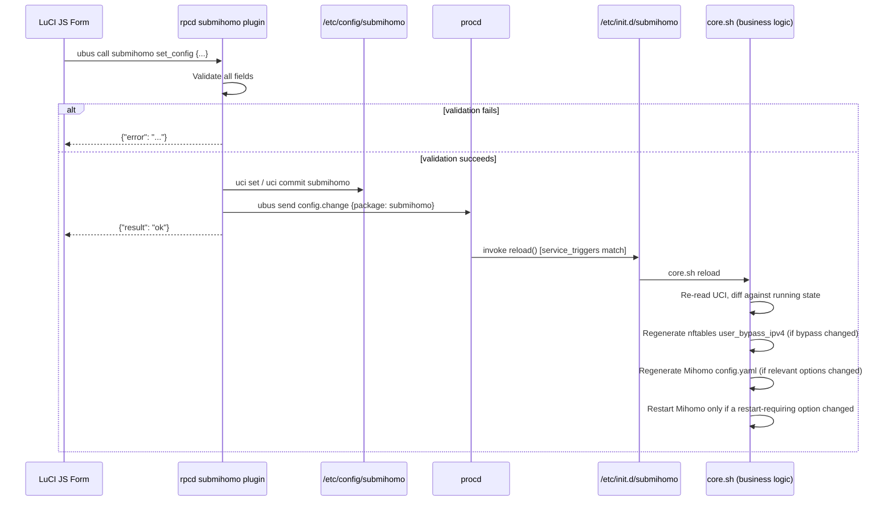
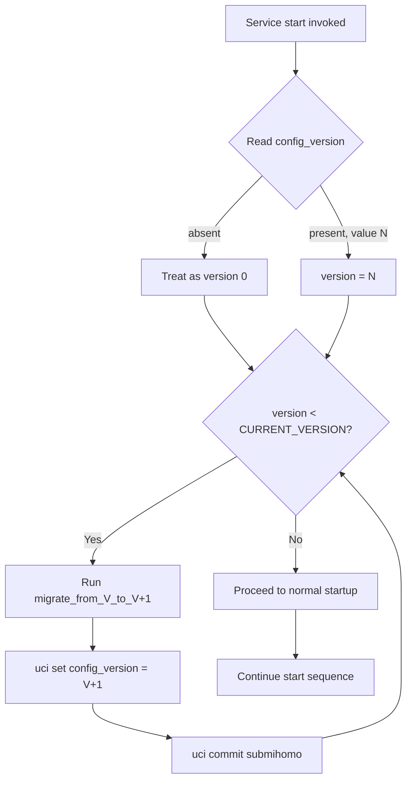

# SubMiHomo — UCI Configuration Architecture

> **Target platform**: OpenWrt 25+, APK packaging  
> **Configuration system**: UCI (Unified Configuration Interface)  
> **Frontend**: LuCI JS (JavaScript-based LuCI application)  
> **Backend**: ubus/rpcd `set_config` method, procd service scripts

---

## Table of Contents

1. [UCI System Overview](#1-uci-system-overview)
2. [SubMiHomo Config File Location and Format](#2-submihomo-config-file-location-and-format)
3. [Complete Option Reference](#3-complete-option-reference)
4. [Bypass List Section](#4-bypass-list-section)
5. [UCI Read/Write Conventions](#5-uci-readwrite-conventions)
6. [How UCI Changes Trigger Service Actions](#6-how-uci-changes-trigger-service-actions)
7. [The config_version Migration System](#7-the-config_version-migration-system)
8. [Security Considerations for UCI Values](#8-security-considerations-for-uci-values)
9. [Manual UCI Editing Reference](#9-manual-uci-editing-reference)
10. [UCI Defaults File](#10-uci-defaults-file)
11. [Edge Cases](#11-edge-cases)
12. [Config Backup Strategy](#12-config-backup-strategy)

---

## 1. UCI System Overview

UCI (Unified Configuration Interface) is OpenWrt's standard mechanism for storing and manipulating system and package configuration. It provides a uniform textual format, a C library (`libuci`) for programmatic access, a shell-scripting interface (`/lib/config/uci.sh` and the `uci` CLI tool), and a ubus-exposed API for use by daemons like `rpcd` (used by LuCI and other RPC clients).

Key UCI concepts relevant to SubMiHomo:

| Concept | Description |
|---|---|
| **Config file** | A file under `/etc/config/<name>` containing one or more sections. SubMiHomo's file is `/etc/config/submihomo`. |
| **Section** | A named or anonymous block within a config file, introduced by `config <type> ['<name>']`. SubMiHomo uses named sections (`main`, `bypass`). |
| **Option** | A single key-value pair within a section, introduced by `option <name> '<value>'`. |
| **List** | A repeated key that accumulates into an array, introduced by `list <name> '<value>'`. SubMiHomo uses this for `bypass.address`. |
| **Package** | The overall named config file, referred to by its basename (`submihomo`) in `uci` commands. |

UCI is not a live daemon by itself — it is a file format plus tooling. Applications (procd init scripts, LuCI, custom shell scripts) read UCI values at the moments they need them (typically at service start or on an explicit reload/commit event). There is no automatic "watch" mechanism baked into UCI itself; **triggering behavior on change is implemented by the package** (via `/etc/init.d/submihomo`'s `service_triggers` procd hook, described in §6).

UCI supports two states for any value: the **committed** value stored in `/etc/config/<name>`, and an **uncommitted** staged value held in `/tmp/.uci/` until `uci commit` is called. LuCI's typical workflow is to stage several changes (via `uci set` calls issued by a session), then call `uci commit submihomo` to persist them atomically, then trigger a reload.

---

## 2. SubMiHomo Config File Location and Format

**Path**: `/etc/config/submihomo`

**Format** (UCI text format, as rendered by `uci show` / `uci export`):

```
config submihomo 'main'
	option enabled '1'
	option subscription_url ''
	option subscription_update_interval '24'
	option dns_mode 'fake-ip'
	option log_level 'warning'
	option external_controller_port '9090'
	option external_controller_secret ''
	option allow_lan_access '0'
	option bypass_china '0'
	option dashboard_repo 'Zephyruso/zashboard'
	option subscription_user_agent 'SubMiHomo/1.0'
	option config_version '1'

config bypass 'bypass'
	list address '192.168.0.0/16'
	list address '10.0.0.0/8'
	list address '172.16.0.0/12'
```

### Section Naming

SubMiHomo uses **named sections** (`main` and `bypass`) rather than anonymous sections (which would be addressed as `@submihomo[0]`). Named sections are preferable here because:

- The config has a fixed, singleton structure — there is exactly one `main` section and exactly one `bypass` section, never a variable-length list of sections.
- Named sections can be referenced directly and unambiguously in scripts (`uci get submihomo.main.enabled`) without needing to track array indices.
- Named sections survive reordering operations that could shift anonymous section indices.

### Config Type vs. Section Name

Note the distinction between the section **type** (the word after `config`, e.g., `submihomo` or `bypass`) and the section **name** (the quoted identifier, e.g., `'main'` or `'bypass'`). The type is used for schema/validation grouping (e.g., in `/etc/config/submihomo`'s companion `.json` schema for `rpcd`, if present); the name is the addressable identifier used in `uci get package.name.option`.

---

## 3. Complete Option Reference

All options live in the `config submihomo 'main'` section unless otherwise noted.

### 3.1 `enabled`

| Property | Value |
|---|---|
| Type | boolean (`0` or `1`) |
| Default | `1` |
| Required | Yes |
| Effect | Master switch. When `0`, the init script's `start()` function exits early without configuring nftables, starting Mihomo, or touching dnsmasq. When `1`, normal startup proceeds (subject to other validations, e.g., `subscription_url`). |
| Validation | Must be exactly `0` or `1`. Any other value is rejected by `set_config` with an error. |

### 3.2 `subscription_url`

| Property | Value |
|---|---|
| Type | string (URL) |
| Default | `''` (empty) |
| Required | No, but strongly recommended |
| Effect | The HTTPS URL SubMiHomo downloads to obtain the proxy subscription (a Clash/Mihomo-compatible YAML or base64-encoded provider list). Used by the subscription-fetch module to populate outbound proxy definitions. |
| Validation | Must be either the empty string, or a string beginning with `https://`. Plain `http://` URLs are rejected to prevent transmitting subscription tokens (often embedded in the URL path or query string) in cleartext. |

### 3.3 `subscription_update_interval`

| Property | Value |
|---|---|
| Type | integer (hours) |
| Default | `24` |
| Required | Yes |
| Effect | Controls how often SubMiHomo automatically re-downloads the subscription and regenerates the proxy list. A cron job or procd timer is (re)scheduled based on this value. `0` disables automatic updates entirely — the subscription is only fetched on manual trigger or service start. |
| Validation | Integer in range `0`–`168` (168 hours = 7 days, a sane upper bound for a "periodic" update). Values outside this range are rejected. |

### 3.4 `dns_mode`

| Property | Value |
|---|---|
| Type | enum |
| Allowed values | `fake-ip`, `real-ip` |
| Default | `fake-ip` |
| Required | Yes |
| Effect | Selects which `dns:` block template is rendered into Mihomo's generated `config.yaml` (see NETWORK.md §9). Changing this value requires a Mihomo restart (not just a reload) since the DNS listener's `enhanced-mode` cannot be changed without restarting the process. |
| Validation | Must be exactly one of the two enum strings (case-sensitive). |

### 3.5 `log_level`

| Property | Value |
|---|---|
| Type | enum |
| Allowed values | `debug`, `info`, `warning`, `error`, `silent` |
| Default | `warning` |
| Required | Yes |
| Effect | Passed directly as Mihomo's `log-level:` config key. Controls verbosity written to Mihomo's log file / logread. `debug` should only be used temporarily for troubleshooting, since it can produce substantial log volume and flash wear on devices logging to overlay storage. |
| Validation | Must be one of the five listed enum values. |

### 3.6 `external_controller_port`

| Property | Value |
|---|---|
| Type | integer (TCP port) |
| Default | `9090` |
| Required | Yes |
| Effect | The port Mihomo's HTTP API and bundled web dashboard listen on (bound to `0.0.0.0` or LAN-only, depending on `allow_lan_access`; see below). Rendered into Mihomo's `external-controller:` config key. |
| Validation | Integer in range `1024`–`65535`. Must not equal the TPROXY port (`7891`), the mixed port (`7890`), or the DNS port (`1053`). The validation layer checks for collisions against these three fixed SubMiHomo ports at write time. |

### 3.7 `external_controller_secret`

| Property | Value |
|---|---|
| Type | string |
| Default | `''` (empty — no authentication) |
| Required | No (but strongly recommended) |
| Effect | Passed as Mihomo's `secret:` config key. Required as a Bearer token / `Authorization` header (or `?token=` query parameter) for all HTTP API and dashboard access. If empty, the controller is unauthenticated — anyone who can reach the port can fully control Mihomo (view/modify proxy selection, view all subscription proxy servers including embedded credentials, and issue arbitrary config reloads). |
| Validation | Any string is technically accepted syntactically, but the LuCI UI and documentation recommend a minimum of 16 characters. There is no hard length enforcement, since a user may deliberately choose to leave it empty for LAN-trusted-only environments. |

### 3.8 `allow_lan_access`

| Property | Value |
|---|---|
| Type | boolean (`0` or `1`) |
| Default | `0` |
| Required | Yes |
| Effect | When `0`, the Mixed proxy port (`7890`) and the External Controller port are only reachable from the router itself (bound to `127.0.0.1`, or reachable via loopback-only firewall rule). When `1`, SubMiHomo binds these listeners to the LAN interface address (or `0.0.0.0`) and inserts a fw4 rule permitting LAN-zone access to these ports. This does NOT affect TPROXY interception — TPROXY works transparently regardless of this setting. It only affects clients that want to manually configure a SOCKS5/HTTP proxy pointing at the router, or administrators who want dashboard access from another LAN device. |
| Validation | Must be `0` or `1`. |

### 3.9 `bypass_china`

| Property | Value |
|---|---|
| Type | boolean (`0` or `1`) |
| Default | `0` |
| Required | Yes |
| Effect | When `1`, SubMiHomo inserts a `GEOIP,CN,DIRECT` rule into the generated Mihomo rules list (positioned before the final `MATCH` rule), causing traffic destined for Chinese IP ranges to bypass the proxy. See NETWORK.md §14 for the full rationale (this is implemented via Mihomo's rule engine and GeoIP database, not via nftables). |
| Validation | Must be `0` or `1`. |

### 3.10 `dashboard_repo`

| Property | Value |
|---|---|
| Type | string (GitHub `user/repo` format) |
| Default | `Zephyruso/zashboard` |
| Required | Yes |
| Effect | Identifies the GitHub repository SubMiHomo downloads pre-built dashboard static assets from (release artifacts, typically a `.zip` or `.tar.gz` of a compiled web UI) to serve alongside Mihomo's external controller. Allows users to swap in an alternative Clash-compatible dashboard fork (e.g., `MetaCubeX/metacubexd`) without a package update. |
| Validation | Must match the pattern `^[A-Za-z0-9_.-]+/[A-Za-z0-9_.-]+$` (a single `/`-separated owner/repo pair, using characters valid in GitHub identifiers). |

### 3.11 `subscription_user_agent`

| Property | Value |
|---|---|
| Type | string |
| Default | `SubMiHomo/1.0` |
| Required | Yes |
| Effect | Sent as the `User-Agent` HTTP header when fetching the subscription URL. Many commercial subscription providers gate content or apply different formatting based on `User-Agent` (e.g., returning Clash-format YAML only for recognized clients like `ClashforWindows`, `clash-verge`, etc.). Allowing this to be customized lets users impersonate a known-compatible client if their provider is picky about the requesting client. |
| Validation | Must be non-empty. No character restriction beyond what is safe for an HTTP header value (control characters and CR/LF are stripped/rejected to prevent header injection). |

### 3.12 `config_version`

| Property | Value |
|---|---|
| Type | integer |
| Default | `1` (present in packaged default config) |
| Required | No (absence is treated as version `0`) |
| Effect | Internal bookkeeping value, not exposed in the LuCI UI. Used exclusively by the migration system in `core.sh` (see §7). Not intended for direct user manipulation, though nothing prevents it. |
| Validation | Integer. No user-facing validation is enforced since this is a system-managed field; the migration logic simply reads and rewrites it. |

### 3.13 Option Reference Table (Consolidated)

| Option | Type | Allowed Values | Default | Required |
|---|---|---|---|---|
| `enabled` | bool | `0`, `1` | `1` | yes |
| `subscription_url` | string | empty or `https://` URL | `""` | no |
| `subscription_update_interval` | integer | `0`–`168` | `24` | yes |
| `dns_mode` | enum | `fake-ip`, `real-ip` | `fake-ip` | yes |
| `log_level` | enum | `debug`,`info`,`warning`,`error`,`silent` | `warning` | yes |
| `external_controller_port` | integer | `1024`–`65535` | `9090` | yes |
| `external_controller_secret` | string | any | `""` | no |
| `allow_lan_access` | bool | `0`, `1` | `0` | yes |
| `bypass_china` | bool | `0`, `1` | `0` | yes |
| `dashboard_repo` | string | `user/repo` format | `Zephyruso/zashboard` | yes |
| `subscription_user_agent` | string | non-empty | `SubMiHomo/1.0` | yes |
| `config_version` | integer | any non-negative integer | `1` | no (system-managed) |

---

## 4. Bypass List Section

### 4.1 Section Definition

```
config bypass 'bypass'
	list address '192.168.0.0/16'
	list address '10.0.0.0/8'
	list address '172.16.0.0/12'
```

This is a separate, singleton, named section of type `bypass`. It holds exactly one option, `address`, expressed as a UCI **list** (as opposed to a scalar `option`), meaning it can have zero, one, or many values, each contributing one array entry.

### 4.2 Semantics

Each `list address` entry represents an IPv4 CIDR range that should be excluded from TPROXY interception, in addition to the built-in static bypass ranges described in NETWORK.md §4.2. These are rendered into the nftables `user_bypass_ipv4` set at service start (see NETWORK.md §13).

### 4.3 Relationship to the Static Bypass Set

The default `bypass.address` list shown above happens to duplicate the built-in static ranges (`192.168.0.0/16`, `10.0.0.0/8`, `172.16.0.0/12`), which are already present in the nftables `bypass_ipv4` set regardless of UCI configuration. This redundancy is intentional in the shipped default config for two reasons:

1. **Explicitness**: Users inspecting `/etc/config/submihomo` can see the effective private-range bypass behavior directly, without needing to cross-reference the nftables ruleset.
2. **User-editable baseline**: If a user needs to *narrow* the private-range bypass (e.g., to allow proxying of a specific `/24` inside `192.168.0.0/16`), they can freely edit or remove entries from this UCI list — the static `bypass_ipv4` nftables set is unaffected and continues to cover the broader RFC 1918 ranges. This is a documented limitation: **the static set cannot be narrowed by removing entries from the UCI bypass list**; the user list only adds to `user_bypass_ipv4`, it never removes elements from the static `bypass_ipv4` set. To truly permit proxying inside an RFC 1918 range, an advanced user must edit the nftables ruleset generation logic directly (outside the scope of the UCI schema).

### 4.4 Adding Custom Bypass Entries

Example: bypassing a corporate VPN subnet `10.50.0.0/16` and a single NAS host `203.0.113.42/32`:

```sh
uci add_list submihomo.bypass.address='10.50.0.0/16'
uci add_list submihomo.bypass.address='203.0.113.42/32'
uci commit submihomo
service submihomo reload
```

### 4.5 Validation Rules for Bypass Entries

Each `address` list entry is validated against:

- **Format regex**: `^[0-9]{1,3}(\.[0-9]{1,3}){3}/[0-9]{1,2}$`
- **Octet range check**: each of the four dotted-decimal octets must be `0`–`255`.
- **Prefix length check**: the `/n` suffix must be `0`–`32`.
- **IPv6 rejection**: any entry that does not match the IPv4 CIDR pattern (including valid IPv6 CIDR notation, e.g., `fd00::/8`) is **silently ignored** at nftables population time — it is not rejected at the UCI-write layer, but it produces no `user_bypass_ipv4` element and is logged as a skipped entry. This "silently ignored" behavior (as opposed to a hard `set_config` rejection) is intentional so that a bypass list is never accidentally treated as fully invalid due to a single malformed line, and to permit future IPv6 support without breaking older list entries retroactively.

### 4.6 Bypass List Ordering

Order within the list has no operational effect. nftables interval sets are internally reordered into a binary search tree regardless of insertion order, so the sequence of `list address` lines in the UCI file is purely cosmetic / for readability in the config file.

---

## 5. UCI Read/Write Conventions Used by SubMiHomo

### 5.1 Reading UCI from Shell (Init Scripts, core.sh)

SubMiHomo's shell-based modules use the standard `/lib/functions.sh` UCI helper functions rather than shelling out to the `uci` binary repeatedly, for performance and correctness (the config_load-based helpers cache the parsed config in memory for the duration of the script run):

```sh
. /lib/functions.sh

config_load 'submihomo'

config_get enabled main enabled '1'
config_get subscription_url main subscription_url ''
config_get dns_mode main dns_mode 'fake-ip'

# Reading a list requires a callback-based iteration:
bypass_list=""
config_list_foreach bypass address append_bypass
append_bypass() {
	bypass_list="$bypass_list $1"
}
```

This pattern (`config_load` once, then `config_get`/`config_list_foreach` many times) is preferred over repeated `uci get` invocations because each `uci get` call re-opens and re-parses the config file from disk; `config_load` parses once and serves subsequent lookups from an in-memory representation exposed via shell functions.

### 5.2 Reading UCI from LuCI JS

The LuCI JS frontend (`luci-app-submihomo`) uses the `LuCI.uci` client-side module, which communicates with `rpcd`'s `uci` ubus object over the LuCI JSON-RPC session. A typical read pattern in the LuCI form model:

```js
return uci.load('submihomo').then(() => {
    var s = uci.sections('submihomo', 'submihomo')[0];
    return uci.get('submihomo', s['.name'], 'subscription_url');
});
```

LuCI's form abstraction (`L.form.Map`, `option.Value`, `option.ListValue`, etc.) generates these calls automatically when a `CBIMap`/`form.Map` is bound to the `submihomo` config — this is the standard declarative approach and is what SubMiHomo's LuCI app uses for its settings page, rather than hand-rolled `uci.get` calls.

### 5.3 Writing UCI — Not Direct

**SubMiHomo does not allow LuCI to call `uci.set()` / `uci.save()` directly against arbitrary option values.** Instead, all writes are funneled through a custom `rpcd` ubus method, `submihomo.set_config`, implemented as an rpcd plugin script. This indirection exists specifically to enforce the validation rules in §3 and §4 **before** any value reaches `/etc/config/submihomo`, rather than relying on client-side (LuCI JS) validation alone, which could be bypassed by any other ubus client.

```
LuCI JS (form submit)
    │
    ▼
ubus call submihomo set_config '{"subscription_url": "https://...", ...}'
    │
    ▼
rpcd plugin: /usr/libexec/rpcd/submihomo
    │
    ├─ Validate every field against the rules in §3/§4
    │     ├─ Invalid → return {"error": "<field>: <reason>"}, no UCI write occurs
    │     └─ Valid → continue
    │
    ├─ uci set submihomo.main.<option>=<value>  (for each changed field)
    ├─ uci commit submihomo
    │
    └─ Emit ubus event: submihomo.config_changed
```

This design guarantees that **no invalid value can ever be committed to `/etc/config/submihomo` via the LuCI UI path**, even if the JS frontend has a bug or is bypassed by a direct ubus call. (Manual `uci set` via SSH is a separate trust boundary — see §9 — and is not subject to this validation layer, matching standard OpenWrt conventions where root shell access is fully trusted.)

---

## 6. How UCI Changes Trigger Service Actions

### 6.1 The procd `service_triggers` Mechanism

SubMiHomo's init script (`/etc/init.d/submihomo`) registers a `service_triggers` procd hook, which subscribes the service to configuration-change notifications for the `submihomo` UCI config:

```sh
service_triggers() {
	procd_add_reload_trigger "submihomo"
}
```

`procd_add_reload_trigger` instructs procd to watch for `ubus call service event '{"type":"config.change","data":{"package":"submihomo"}}'`-style notifications (emitted automatically by `uci commit` when `/sbin/uci`'s commit path notifies procd, or emitted explicitly by the `submihomo.set_config` rpcd plugin after it commits). When such an event fires, procd automatically invokes:

```sh
/etc/init.d/submihomo reload
```

### 6.2 Full Event Chain



### 6.3 Reload vs. Restart Semantics

Not every UCI change requires a full Mihomo process restart. SubMiHomo's `core.sh` distinguishes between:

| Change Category | Action Taken |
|---|---|
| `bypass.address` list changed | Flush + repopulate `user_bypass_ipv4` nftables set only; no Mihomo restart |
| `log_level` changed | Send Mihomo a config-reload via its external controller API (`PUT /configs`), no process restart |
| `bypass_china` changed | Regenerate `config.yaml` rules section, reload via controller API |
| `external_controller_secret` changed | Regenerate `config.yaml`, reload via controller API |
| `dns_mode` changed | Full Mihomo process restart required (DNS listener mode cannot be hot-swapped) |
| `external_controller_port` changed | Full Mihomo process restart required (listener socket must be rebound) |
| `allow_lan_access` changed | Regenerate fw4-adjacent firewall include rules + Mihomo listen-address config; restart Mihomo |
| `enabled` changed 1→0 | Full stop() sequence (see NETWORK.md §18) |
| `enabled` changed 0→1 | Full start() sequence |
| `subscription_url` / `subscription_user_agent` changed | Triggers an immediate subscription re-fetch, then a Mihomo config reload (not necessarily a restart, since the outbound proxy list can be hot-reloaded via the controller API) |

This distinction matters operationally: dns_mode and port changes cause a brief connectivity interruption (all in-flight proxied connections drop, per NETWORK.md §18's Connection Impact discussion), whereas bypass-list and log-level changes are applied with zero interruption to active connections.

### 6.4 Why Not Just Always Restart

Always restarting Mihomo on any config change would be simpler to implement, but:
- It would drop all active TPROXY connections and clear fake-IP DNS mappings on every trivial change (e.g., toggling `log_level` from `warning` to `debug` during troubleshooting), which is poor UX and could mask the very problem being diagnosed.
- Mihomo's external controller API explicitly supports hot config reload (`PUT /configs?force=true`) and provider/rule hot-swap endpoints, which SubMiHomo leverages wherever the changed option maps to a hot-reloadable Mihomo setting.

---

## 7. The config_version Migration System

### 7.1 Purpose

As SubMiHomo evolves across package versions, the UCI schema may need to change: options may be renamed, new options may be added with required defaults, or the semantics of an existing option's value may shift. Without a migration mechanism, users upgrading the package would either retain a stale config format (causing the new package version to misbehave or crash) or have their customizations silently wiped by the package's default config file overwriting `/etc/config/submihomo` on `opkg`/`apk` upgrade.

The `config_version` option (an integer stored in `config submihomo 'main'`) tracks which schema revision the on-disk config currently conforms to.

### 7.2 Design

| Property | Value |
|---|---|
| Storage | `option config_version 'N'` in `config submihomo 'main'` |
| Current schema version | `1` |
| Absent value | Treated as version `0` (pre-migration-system legacy config, or a config file hand-created before this option existed) |
| Migration execution point | On every service `start()`, before any other startup logic runs |
| Migration function naming | `migrate_from_0_to_1()`, `migrate_from_1_to_2()`, etc., defined in `core.sh` |
| Idempotency | Each migration function is safe to run multiple times without harm (checked via guard conditions), though the version-gate normally prevents re-execution |

### 7.3 Migration Execution Flow



The loop in the flowchart runs migrations one step at a time (0→1, 1→2, 2→3, ...) rather than jumping directly from the on-disk version to the current version, ensuring every intermediate transformation is applied even if a user skips several package versions in one upgrade (e.g., upgrading directly from a version-0 install to a package whose current schema is version 3).

### 7.4 Example: Hypothetical Future Migration (Illustrative Only)

To illustrate how this system extends, suppose a future SubMiHomo release splits `external_controller_secret` handling to store the secret in a separate, more restrictively-permissioned UCI config file for security hardening. A `migrate_from_1_to_2()` function would:

1. Read the existing `submihomo.main.external_controller_secret` value.
2. Write it into the new location/section.
3. Remove (or blank) the old option.
4. Bump `config_version` to `2`.
5. Commit.

No such migration currently exists in the version-1 schema described in this document; this is provided purely to demonstrate the intended extension pattern for future package maintainers.

### 7.5 Guarding Against Partial Migration Failures

If a migration function fails partway (e.g., a `uci set` fails due to a filesystem being read-only, or the device loses power mid-migration), `config_version` is only bumped **after** the transformation logic completes without error and **before** commit. If the process is interrupted before `uci commit` runs, the staged (uncommitted) UCI changes are simply discarded on next boot (UCI's `/tmp/.uci/` staging area does not persist across reboot), and migration will safely re-run from the last committed version on the next service start. This makes the migration process crash-safe: at worst, a migration is repeated, which is safe due to the idempotency guarantee in §7.2.

### 7.6 Migration and Package Upgrade Interaction

APK/opkg package upgrades on OpenWrt do not overwrite existing `/etc/config/submihomo` if it already exists (config files are conventionally marked in a way that preserves user edits across upgrades, consistent with standard OpenWrt packaging practice for `/etc/config/*` files). This means the migration system, not the package's postinst script, is responsible for evolving an existing installation's config — the postinst script only ever writes the defaults file for a **fresh** install where `/etc/config/submihomo` does not yet exist.

---

## 8. Security Considerations for UCI Values

### 8.1 `subscription_url` May Contain Embedded Secrets

Many commercial proxy subscription services encode an account-specific access token directly in the URL path or query string, e.g.:

```
https://provider.example.com/link/aBcD1234EfGh5678?clash=1
```

The token segment (`aBcD1234EfGh5678`) is effectively a bearer credential: anyone who obtains this URL can download the user's full subscription (their paid proxy server list, often including embedded per-server passwords or UUIDs for protocols like Shadowsocks/VMESS/VLESS/Trojan).

**Implications for SubMiHomo's handling of this value**:

- The value is stored in `/etc/config/submihomo`, a plaintext file, consistent with virtually all other OpenWrt UCI secrets (e.g., WiFi PSKs, PPPoE passwords) — this is standard practice for the platform and not a SubMiHomo-specific weakness, but users should be aware `/etc/config/submihomo` should be treated as sensitive.
- **The value must never be logged.** Any diagnostic or debug logging in `core.sh` or the rpcd plugin must redact `subscription_url` (e.g., logging only the hostname portion, not the full path/query) to avoid leaking the token into `logread` output, which may be forwarded to remote syslog servers or included in user-submitted bug reports.
- **LuCI JS masking**: the settings form should render `subscription_url` as a password-style masked input (or at minimum warn the user that this field is sensitive), to reduce shoulder-surfing / screenshot exposure risk when users share screenshots for support requests.
- HTTPS-only enforcement (§3.2) is itself a security control: it ensures the token is never transmitted in cleartext over the network between the router and the subscription provider, even though the token still rests in cleartext at rest on the router's filesystem.

### 8.2 `external_controller_secret`

This value is the Bearer token protecting Mihomo's HTTP API and dashboard. Considerations:

- Like `subscription_url`, it is stored in plaintext UCI. This is consistent with OpenWrt norms but should be documented clearly for users who might reuse a sensitive password here.
- An empty value disables authentication entirely. The LuCI UI should visibly warn (not merely silently accept) when a user saves an empty secret while `allow_lan_access` is also `1`, since this combination exposes an unauthenticated control API to the entire LAN broadcast domain, not just to the router itself.
- The secret is rendered verbatim into Mihomo's generated `config.yaml` as the `secret:` key. See §8.3 for YAML-escaping considerations.

### 8.3 Special Characters in `external_controller_secret` (YAML Escaping)

Because `external_controller_secret` is user-supplied free text and is embedded into a generated YAML document (Mihomo's `config.yaml`), the config-generation logic must properly quote/escape it to prevent:

1. **YAML injection**: a secret value containing YAML special characters (`:`, `#`, `"`, `'`, newlines, leading `-`, etc.) could otherwise corrupt the generated document's structure, potentially injecting additional (attacker- or accident-controlled) keys into the Mihomo config if the value originates from an untrusted paste.
2. **Silent truncation**: an unescaped `#` character would cause the YAML parser to treat the remainder of the line as a comment, silently truncating the secret to an unintended shorter value.

**Mitigation**: the config-generation step always emits the secret using YAML double-quoted scalar syntax with proper escaping of embedded quotes and backslashes:

```yaml
secret: "user's \"complex\" secret: value #123"
```

Renders from a raw value of `user's "complex" secret: value #123` by:
- Wrapping the entire value in double quotes.
- Escaping any literal `"` as `\"`.
- Escaping any literal `\` as `\\`.

This is functionally equivalent to standard JSON string escaping (YAML double-quoted scalars are a superset-compatible syntax with JSON string escaping for the common special characters), which is why the generator can reuse a JSON-string-escaping routine to build the YAML double-quoted value.

### 8.4 File Permissions

`/etc/config/submihomo` follows standard OpenWrt UCI file permissions (typically `0600` or `0644` root-owned, consistent with other config files in `/etc/config/`). SubMiHomo does not alter these permissions to be more restrictive than other UCI files, for consistency with platform conventions, but administrators concerned about multi-admin-user devices should be aware that any account with read access to `/etc/config/` can read the subscription URL and controller secret in plaintext.

### 8.5 rpcd ACL Considerations

The `submihomo.set_config` ubus method should be exposed through an rpcd ACL JSON file (`/usr/share/rpcd/acl.d/luci-app-submihomo.json`) that restricts which LuCI-authenticated user roles may invoke it — consistent with how other LuCI apps gate configuration-write ubus calls behind the `admin` ACL group, preventing a lower-privileged LuCI account (if the router is configured with restricted admin accounts) from altering proxy configuration or exfiltrating the subscription URL/secret via a read method.

---

## 9. Manual UCI Editing Reference

All options can be set directly via the `uci` command-line tool over SSH. After any manual change, `uci commit submihomo` must be run to persist it, and either `service submihomo reload` (preferred, for hot-reloadable options) or `service submihomo restart` must be run to apply it — manual `uci` edits do **not** pass through the `submihomo.set_config` rpcd validation layer described in §5.3, so it is the administrator's responsibility to supply valid values when editing this way.

### 9.1 Per-Option Command Reference

```sh
# enabled
uci set submihomo.main.enabled='1'

# subscription_url
uci set submihomo.main.subscription_url='https://provider.example.com/link/xxxxxxxx'

# subscription_update_interval
uci set submihomo.main.subscription_update_interval='24'

# dns_mode
uci set submihomo.main.dns_mode='fake-ip'
# or:
uci set submihomo.main.dns_mode='real-ip'

# log_level
uci set submihomo.main.log_level='warning'

# external_controller_port
uci set submihomo.main.external_controller_port='9090'

# external_controller_secret
uci set submihomo.main.external_controller_secret='a-long-random-string-min-16-chars'

# allow_lan_access
uci set submihomo.main.allow_lan_access='0'

# bypass_china
uci set submihomo.main.bypass_china='0'

# dashboard_repo
uci set submihomo.main.dashboard_repo='Zephyruso/zashboard'

# subscription_user_agent
uci set submihomo.main.subscription_user_agent='SubMiHomo/1.0'

# Commit all staged changes
uci commit submihomo

# Apply
service submihomo reload
```

### 9.2 Bypass List Manipulation

```sh
# Add an entry
uci add_list submihomo.bypass.address='10.50.0.0/16'

# Remove a specific entry
uci del_list submihomo.bypass.address='10.50.0.0/16'

# Clear the entire list
uci delete submihomo.bypass.address

# View current list
uci get submihomo.bypass.address

uci commit submihomo
service submihomo reload
```

### 9.3 Viewing the Full Effective Config

```sh
# Human-readable export (matches /etc/config/submihomo format)
uci export submihomo

# Flattened key=value listing (useful for scripting/grep)
uci show submihomo
```

Example `uci show submihomo` output:

```
submihomo.main=submihomo
submihomo.main.enabled='1'
submihomo.main.subscription_url=''
submihomo.main.subscription_update_interval='24'
submihomo.main.dns_mode='fake-ip'
submihomo.main.log_level='warning'
submihomo.main.external_controller_port='9090'
submihomo.main.external_controller_secret=''
submihomo.main.allow_lan_access='0'
submihomo.main.bypass_china='0'
submihomo.main.dashboard_repo='Zephyruso/zashboard'
submihomo.main.subscription_user_agent='SubMiHomo/1.0'
submihomo.main.config_version='1'
submihomo.bypass=bypass
submihomo.bypass.address='192.168.0.0/16' '10.0.0.0/8' '172.16.0.0/12'
```

### 9.4 Reverting Uncommitted Changes

```sh
# Discard any staged (uncommitted) changes without applying them
uci revert submihomo
```

---

## 10. UCI Defaults File

The package ships a default `/etc/config/submihomo`, installed only when no existing file is present (fresh install — see §7.6 for upgrade behavior). Its full contents:

```
config submihomo 'main'
	option enabled '1'
	option subscription_url ''
	option subscription_update_interval '24'
	option dns_mode 'fake-ip'
	option log_level 'warning'
	option external_controller_port '9090'
	option external_controller_secret ''
	option allow_lan_access '0'
	option bypass_china '0'
	option dashboard_repo 'Zephyruso/zashboard'
	option subscription_user_agent 'SubMiHomo/1.0'
	option config_version '1'

config bypass 'bypass'
	list address '192.168.0.0/16'
	list address '10.0.0.0/8'
	list address '172.16.0.0/12'
```

### 10.1 Notable Default Behaviors

- `enabled` defaults to `1` — the service is nominally "on" immediately after install.
- `subscription_url` defaults to empty — this is a deliberate incomplete state (see §11.1 below): the package cannot ship with a working proxy subscription pre-configured, since that would either require bundling a specific (likely commercial, credentialed) provider's URL, or would be a non-functional placeholder. The combination of `enabled=1` with an empty `subscription_url` means the service process starts (Mihomo runs, nftables rules are installed) but with no outbound proxy servers configured — see §11.1 for the exact resulting behavior.
- `external_controller_secret` defaults to empty — chosen to minimize first-run friction (no secret to discover before the dashboard becomes accessible) at the cost of leaving the API unauthenticated by default. This is called out explicitly in the LuCI first-run UI as a recommended action item ("Set a controller secret before exposing this device beyond trusted networks").
- `config_version` is pre-set to `1` in the packaged default, so a brand-new install never runs the `0→1` migration — that migration path exists solely for upgrades from versions of the package that predate the `config_version` option's introduction.

---

## 11. Edge Cases

### 11.1 Empty `subscription_url`

**Behavior**: The service starts fully — nftables rules are installed, TPROXY interception is active, Mihomo process runs, dnsmasq forwarding is configured — but Mihomo's generated `config.yaml` contains no proxy `outbounds` (or only a placeholder empty proxy-groups list). In this state, Mihomo's rule engine falls through every rule to the final `MATCH` rule, which is configured to resolve to `DIRECT` when no subscription-derived proxy exists. Net effect: **all traffic is transparently intercepted by TPROXY, evaluated by Mihomo, and forwarded DIRECT** — functionally equivalent to no proxying occurring, but with the overhead of passing through Mihomo's userspace process for every connection.

The LuCI status/overview page displays a persistent warning banner in this state ("No subscription configured — traffic is not being proxied") to make this non-functional-but-not-crashed state visible to the user, since silent full-DIRECT operation could otherwise be mistaken for a working proxy setup during a support conversation.

### 11.2 Invalid URL Format for `subscription_url`

**Behavior**: If a user (via LuCI or a direct `ubus call submihomo set_config`) submits a `subscription_url` value that does not start with `https://` (e.g., `http://...`, `ftp://...`, or a bare hostname with no scheme), the `submihomo.set_config` rpcd method rejects the entire request before any UCI write occurs:

```json
{
  "error": "subscription_url: must be empty or begin with https://"
}
```

The LuCI JS form surfaces this error message inline next to the field and does not navigate away from the settings page, allowing the user to correct the value without losing other in-progress edits on the same form submission (the rpcd method validates and applies the entire submitted field set atomically — either all fields commit, or none do, avoiding a partially-applied config from a single bad field).

### 11.3 Port Conflicts

**Scenario**: A user sets `external_controller_port` to a value already in use by another service (e.g., `8080` if some other LuCI app or user script already binds that port), or attempts to set it to one of SubMiHomo's own fixed ports (`7890`, `7891`, `1053`).

**Behavior at validation time**: the rpcd `set_config` method checks the requested port against the three fixed SubMiHomo ports and rejects an exact match with an error (`"external_controller_port: conflicts with reserved SubMiHomo port 7891"`). It does **not** attempt to probe arbitrary third-party services for port usage at validation time (this would be inherently racy — a port could be free at validation time and taken by the time Mihomo actually starts).

**Behavior at Mihomo startup time**: if the configured port is unavailable for any other reason (already bound by an unrelated process), Mihomo's process fails to bind the listener and exits (or logs an error and continues without the controller, depending on Mihomo's own bind-failure behavior for that listener). SubMiHomo's init script detects a failed/crashed Mihomo process (via procd's respawn/instance-failure tracking) and surfaces this as a service failure in `logread` and the LuCI status page, rather than silently masking it. The user must then choose a different `external_controller_port` value and reload.

### 11.4 Special Characters in `external_controller_secret`

Covered in detail in §8.3. Summary: any string is accepted by validation (no character restriction), and the YAML generator is responsible for correctly escaping the value when embedding it into `config.yaml`'s `secret:` key, using double-quoted YAML scalar syntax with `"` and `\` escaping equivalent to JSON string escaping. This ensures values containing colons, quotes, hashes, or other YAML-significant characters are transmitted to Mihomo intact rather than corrupting the document or being silently truncated.

### 11.5 Non-Numeric or Out-of-Range Integer Fields

If `subscription_update_interval` or `external_controller_port` receive non-numeric input (e.g., from a malformed direct ubus call bypassing the LuCI form's numeric input type), the rpcd validation layer rejects the request with a descriptive error rather than allowing a non-numeric string to reach `uci set` (which would otherwise store it as a valid UCI string value, since UCI itself is untyped and would accept it without complaint) and subsequently break config.yaml generation (e.g., a YAML integer field receiving a non-numeric string).

### 11.6 IPv6 Entries in the Bypass List

As noted in §4.5, IPv6-formatted entries in `bypass.address` (e.g., `fd00::/8`) are accepted at the UCI-write layer without error (since SubMiHomo does not currently forbid them structurally), but are silently skipped when the nftables `user_bypass_ipv4` set is populated, since that set is typed `ipv4_addr` only. This is logged at `info` level (`"bypass address fd00::/8 skipped: IPv6 not supported"`) but does not block the rest of the bypass list from being applied, and does not fail the overall `set_config`/reload operation.

---

## 12. Config Backup Strategy

### 12.1 OpenWrt sysupgrade Backup Behavior

OpenWrt's built-in `sysupgrade -b` (and the LuCI "Backup / Restore" page's "Generate archive") mechanism creates a tar archive of files listed in `/etc/sysupgrade.conf` plus, by default, the **entire contents of `/etc/config/`** (UCI's config directory is included unconditionally as part of OpenWrt's standard backup file list, alongside `/etc/passwd`, `/etc/dropbear/`, and other core system state). Because `/etc/config/submihomo` lives in this directory, it is **automatically included** in every standard OpenWrt configuration backup — no special packaging action (`conffiles` declaration or otherwise) is required by SubMiHomo to participate in this mechanism, beyond simply storing its config in the conventional `/etc/config/` location, which it already does.

### 12.2 What Is (and Is Not) Restored

| Included in sysupgrade backup | Notes |
|---|---|
| `/etc/config/submihomo` | Full UCI config: all main options + bypass list |
| `/etc/dnsmasq.d/submihomo.conf` | **Not included** — this file is runtime-generated (created on service start, removed on stop) and is not part of `/etc/config/`. It is regenerated automatically from UCI state on the next service start after a restore. |
| Mihomo's generated `/etc/mihomo/config.yaml` | **Not included** — this is a generated artifact (derived from UCI + downloaded subscription data), not authoritative configuration. It is regenerated on next start. |
| Downloaded subscription cache (proxy list) | **Not included** by default — this is fetched fresh from `subscription_url` on next start (subject to `subscription_update_interval` and any local caching logic); if the router is offline at restore time, the previous subscription fetch may need to be retried once connectivity returns. |
| GeoIP database (`Country.mmdb`) | **Not included** — this is a package-provided or auto-downloaded binary asset, reinstalled with the package itself. |

This distinction matters: **restoring a sysupgrade backup onto a fresh OpenWrt installation (with the SubMiHomo package reinstalled) fully restores the user's intended configuration** (subscription URL, DNS mode, secrets, bypass list, etc.), and the service's normal startup sequence regenerates all derived/runtime artifacts (dnsmasq fragment, Mihomo YAML, subscription data) from that UCI state without any manual intervention.

### 12.3 Sensitive Data in Backups

Since `subscription_url` and `external_controller_secret` are stored in `/etc/config/submihomo` in plaintext (§8.1, §8.2), and this file is included in sysupgrade backups, **the resulting backup archive itself contains these secrets in plaintext**. This is consistent with how OpenWrt backups already contain other plaintext secrets (WiFi PSKs, PPPoE credentials, root password hash), so it does not represent a SubMiHomo-specific deviation from platform norms — but it reinforces the guidance in §8 that backup archives should be stored and transmitted with the same care as any file containing credentials (e.g., not uploaded to public/shared cloud storage without encryption).

### 12.4 Recommended Manual Backup for Advanced Users

For users who want to version-control or separately archive just the SubMiHomo configuration (independent of a full router backup):

```sh
# Export just this package's config to a portable file
uci export submihomo > submihomo-backup-2026-07-03.conf

# Restore on the same or another device with SubMiHomo installed
uci import submihomo < submihomo-backup-2026-07-03.conf
uci commit submihomo
service submihomo restart
```

`uci export`/`uci import` round-trips the exact UCI text format shown in §2 and §10, making this a reliable, package-scoped backup mechanism independent of the full-device sysupgrade archive.
